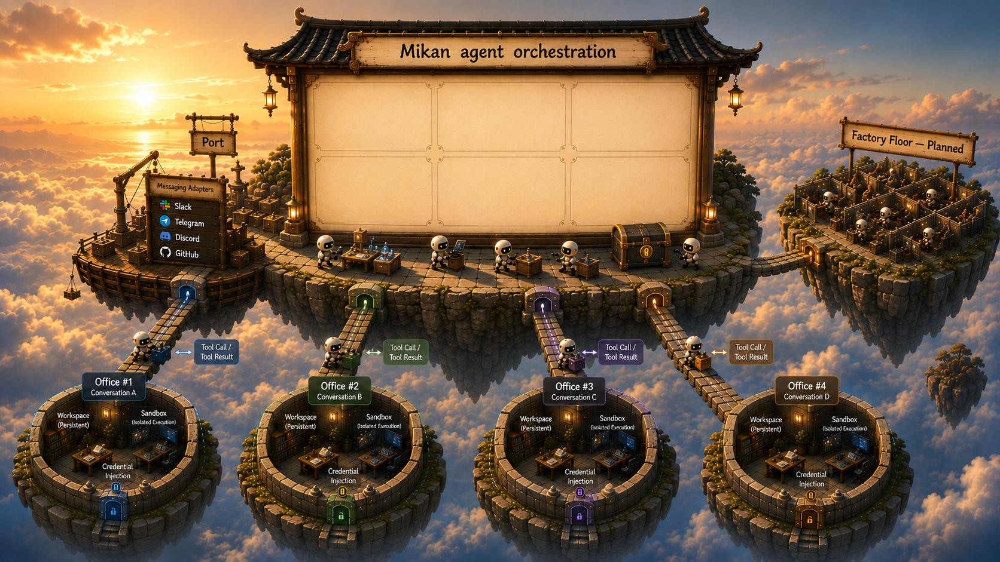

<p align="center">
  
</p>

# @geminixiang/mikan

[](https://www.npmjs.com/package/@geminixiang/mikan)
[](https://opensource.org/licenses/MIT)

A multi-platform AI coding agent for the Web, Slack, Telegram, Discord, and GitHub.

> [!WARNING]
> **Pre-1.0 status** — the overall framework stabilizes at 1.0.0. Until then, releases may change settings and on-disk data formats without migrations: upgrading between pre-1.0 versions can require resetting or manually adjusting existing state and workspace data.

## Architecture

mikan keeps the chat record, agent session, and execution runtime separate:


- **Conversation office** is the unit everything else hangs off: one conversation's working area plus its own sandbox runtime. An office is identified by its platform and raw conversation id, and its directory is named by an office key (`v1-<platform>-<readable-id>-<hash>`), so two platforms can never collide on the same raw id.
- **Chat / conversation data** is the platform-facing record: `log.jsonl`, attachments, and conversation files.
- **Session orchestration** turns platform events into agent runs, handles top-level/thread scopes, and persists structured context under `sessions/*.jsonl`.
- **mikan agent harness** (`src/harness/`, built on pi-agent-core and pi-ai) runs the model loop, session persistence, compaction, and calls mikan tools.
- **Sandbox runtime** is where tool commands execute: host, Docker container/image, local Gondolin microVM, Firecracker, or Cloudflare bridge.
- **Vault** provides runtime credentials as env vars and mounted secret files.

## Features

- **Formal Web app** — authenticated React product at `/` with independent workspaces, durable session history, live runs, follow-up, steering, and cancellation
- **Multi-platform** — Web, Slack, Telegram, Discord, and GitHub adapters
- **Concurrent conversations** — Slack threads, Discord replies/threads, and Telegram reply chains run as independent sessions
- **Conversation offices** — one office directory and one sandbox runtime per conversation, isolated by default; the door policy is configurable per conversation
- **Sandbox execution** — host, shared container, per-conversation managed container, local Gondolin microVM (preview), Firecracker (alpha), or Cloudflare bridge (experimental)
- **Credential vaults** — `/login` stores credentials under `--state-dir` and injects env into sandbox runs
- **Web session viewer** — read-only web view of the current session via `session` / `/session`
- **Persistent memory** — workspace-level and per-office `MEMORY.md`
- **Skills** — drop CLI tools into `skills/`
- **Events** — schedule one-shot or recurring tasks via JSON files
- **Multi-provider** — any provider/model supported by `pi-ai`

## Requirements

- Node.js >= 22.19.0

## Installation

```bash
npm install -g @geminixiang/mikan
```

Or from source:

```bash
npm install && npm run build
```

## Quick Start

Run mikan under [PM2](https://pm2.keymetrics.io/) so it stays up, restarts after failures, and starts on boot:

```bash
npm i -g @geminixiang/mikan pm2

# One-time setup: create the state directory and settings
mikan --onboard --state-dir=~/.mikan

# Secrets live in ~/.mikan/mikan.env (0600), outside any repo tree
curl -o ~/.mikan/mikan.env https://raw.githubusercontent.com/geminixiang/mikan/main/deploy/pm2/mikan.env.example
chmod 600 ~/.mikan/mikan.env   # then fill in your tokens

# Pull the sandbox image the default deployment runs tools in
docker pull ghcr.io/geminixiang/mikan-sandbox:latest

# Grab the maintained ecosystem file (supervision only), edit `args`
curl -O https://raw.githubusercontent.com/geminixiang/mikan/main/deploy/pm2/ecosystem.config.cjs

pm2 start ecosystem.config.cjs
pm2 save
pm2 startup   # run the printed command to enable boot autostart
```

Each file has one job: `settings.json` holds behavior (model, sandbox limits, reply modes — the Admin surface), `~/.mikan/mikan.env` holds secrets and platform tokens, and `ecosystem.config.cjs` holds process supervision only. In `ecosystem.config.cjs`, point `args` at your state dir, sandbox mode, and working directory (`mikan --help` documents the flags):

```js
args: "--state-dir=/srv/mikan/state --sandbox=image:ghcr.io/geminixiang/mikan-sandbox:latest /srv/mikan/workspace",
```

Set the platform tokens you need in `~/.mikan/mikan.env`; you can run multiple platforms at once. `mikan env` prints the full inventory and what is currently set:

```bash
SLACK_APP_TOKEN=xapp-...
SLACK_BOT_TOKEN=xoxb-...
TELEGRAM_BOT_TOKEN=123456:ABC-...
DISCORD_BOT_TOKEN=MTI...
GITHUB_APP_ID=123456
GITHUB_INSTALLATION_ID=12345678
GITHUB_APP_PRIVATE_KEY_PATH=/srv/mikan/github-app.pem
```

Tail logs with `pm2 logs mikan`; upgrade with `npm i -g @geminixiang/mikan && pm2 reload mikan`. See [the deployment guide](src/content/docs/deployment.mdx) for sandbox images, graceful shutdown, and the health endpoint.

For a one-off foreground run, the same CLI works directly:

```bash
mikan [--state-dir=~/.mikan] [--sandbox=<mode>] [<working-directory>]
```

The working directory is optional: it defaults to `<state-dir>/workspace` (so `~/.mikan/workspace` with the default state dir) and is created on first run.

## Platforms

- **Web** — configure a dedicated Google or GitHub account OAuth client to serve the formal React product at `/`. Each owned workspace is an independent office. `/pi-session`, `/pi-login`, and `/admin` remain capability-based support surfaces for messaging adapters.
- **Slack** — create a Socket Mode app using [src/content/docs/slack-bot-minimal-guide.md](src/content/docs/slack-bot-minimal-guide.md). The bot responds when `@mentioned` in channels and to all DMs.
- **Telegram** — create a bot via [@BotFather](https://t.me/BotFather). The bot responds to private messages, `@mention`, and reply chains in groups.
- **Discord** — create an application in the [Discord Developer Portal](https://discord.com/developers/applications), enable **Message Content Intent**, and invite it with message/file permissions.
- **GitHub** — install a GitHub App (polling, no webhooks) and set `GITHUB_APP_ID`, `GITHUB_INSTALLATION_ID`, and a private key. One issue or PR is one conversation. See [src/content/docs/platform-adapters/github.md](src/content/docs/platform-adapters/github.md).

Slack threads, Discord replies/threads, and Telegram reply chains are mapped to independent session scopes. See [src/content/docs/sessions.mdx](src/content/docs/sessions.mdx).

## Sandbox

| Mode                         | Description                                                                   |
| ---------------------------- | ----------------------------------------------------------------------------- |
| `host` (default)             | Run on host; no vault env injection                                           |
| `container:<name>`           | Run in an existing shared container; everyone sharing it shares its one vault |
| `image:<image>`              | Auto-provision one Docker container and one vault per conversation office     |
| `gondolin:default`           | Local Gondolin/QEMU microVM (preview; single-host, in mikan's own process)    |
| `firecracker:<vm-id>:<path>` | Firecracker microVM (alpha; not recommended)                                  |
| `cloudflare:<sandbox-id>`    | Cloudflare Worker bridge (experimental; no auto workspace sync)               |

Each office's data view is set by its **door policy**: `isolated` (the fresh-install default — only this conversation's directory is projected into the sandbox) or `trusted` with a `shared-support` or `full` layout. Change it per conversation from the admin portal or with `/pi-sandbox door <default|isolated|shared|full>`. Door policy governs data access only; execution isolation is unaffected.

Only `image:*` and `gondolin:default` can project an isolated office, so `host` and `container:*` runs need an explicit trusted door policy — otherwise the run fails with `Sandbox '<type>' cannot provide an isolated conversation office`.

For routing, mounts, vault behavior, managed container details, and Gondolin/Firecracker/Cloudflare notes, see [src/content/docs/sandbox.mdx](src/content/docs/sandbox.mdx).

## Chat commands

| Command                                          | Purpose                                                          |
| ------------------------------------------------ | ---------------------------------------------------------------- |
| `/login` / `/pi-login`                           | Store API keys or run built-in OAuth flows                       |
| `session` / `/session`                           | Open a read-only web view of the current session                 |
| `/new` / `/pi-new`                               | Reset the current session                                        |
| `/model` / `/pi-model provider/model[:thinking]` | Switch the LLM for the current conversation                      |
| `/sandbox` / `/pi-sandbox [boost\|door …]`       | Show sandbox status, boost limits, or set the office door policy |
| `/admin` / `/pi-admin`                           | Open the admin portal                                            |
| `/auto-reply` / `/pi-auto-reply on\|off\|status` | Control group/channel auto-reply                                 |
| `stop` / `/stop`                                 | Stop the current run (works on every platform)                   |

`session` is the only command accepted without a leading slash. See [src/content/docs/commands.mdx](src/content/docs/commands.mdx) for the full command reference and web session viewer setup.

## Configuration

mikan reads global settings from `<state-dir>/settings.json`; host-only per-conversation overrides live at `<state-dir>/conversations/<office-key>/settings.json`. Legacy workspace settings are migrated once, then ignored.

```json
{
  "llm": {
    "provider": "anthropic",
    "model": "claude-sonnet-4-6",
    "thinkingLevel": "off"
  },
  "sandbox": {
    "workspace": {
      "doorPolicy": "isolated"
    }
  }
}
```

See [src/content/docs/configuration.md](src/content/docs/configuration.md) for all fields.

## Data layout

```text
<state-dir>/
├── settings.json
├── office-registry.json
├── conversations/
│   └── <office-key>/
│       └── settings.json
└── vaults/

<working-directory>/
├── MEMORY.md
├── skills/
├── events/
├── agents/
└── <office-key>/
    ├── MEMORY.md
    ├── SYSTEM.md
    ├── log.jsonl
    ├── attachments/
    ├── scratch/
    ├── skills/
    └── sessions/
```

Office directories are named by office key (`v1-<platform>-<readable-id>-<hash>`) and are not reversible to a raw platform id, so `office-registry.json` records each office's `(platform, conversationId)`. `mikan office list` prints the registered offices; deployments created before the office layout are migrated on the next boot, and `mikan office claim <conversationId> <platform>` names the owner when boot cannot infer it.

## More docs

- [Events](src/content/docs/events.md)
- [Skills](src/content/docs/skills.md)
- [Deployment](src/content/docs/deployment.mdx)
- [Development](src/content/docs/development.md)
- [Sandbox](src/content/docs/sandbox.mdx)
- [Embedding mikan](deploy/examples/embedder/README.md) — build your own agent on the published package interface

## Slack: Download channel history

```bash
mikan --download C0123456789
```

## Development

```bash
npm run dev       # watch the Node server build
npm run dev:web   # Vite Web UI with /api and /auth proxied to localhost:8181
npm test
npm run lint
npm run fmt:check
npm run build     # emits the server and dist/web-app
```

Run the Node watcher/server and `npm run dev:web` in separate terminals for local Web UI work. The production package serves the built React application from `dist/web-app` only when Web account OAuth is configured.

See [src/content/docs/development.md](src/content/docs/development.md) for E2E tests.

## Contributing

PRs welcome — see [CONTRIBUTING.md](CONTRIBUTING.md) for dev setup, commit style, and the testing checklist. Bug reports and feature requests go through the GitHub issue templates.

## License

MIT — see [LICENSE](LICENSE).
