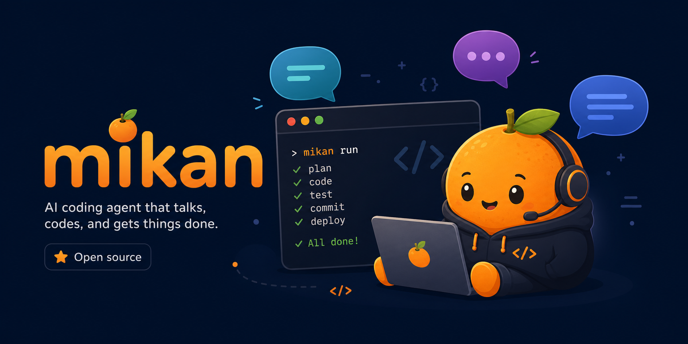

<p align="center">
  
</p>

# @geminixiang/mikan

[](https://www.npmjs.com/package/@geminixiang/mikan)
[](https://opensource.org/licenses/MIT)

A multi-platform AI coding agent for Slack, Telegram, and Discord.

## Architecture

mikan keeps the chat record, agent session, and execution runtime separate:


- **Chat / conversation data** is the platform-facing record: `log.jsonl`, attachments, and conversation files.
- **Session orchestration** turns platform events into agent runs, handles top-level/thread scopes, and persists structured context under `sessions/*.jsonl`.
- **mikan agent harness** (`src/harness/`, built on pi-agent-core and pi-ai) runs the model loop, session persistence, compaction, and calls mikan tools.
- **Sandbox runtime** is where tool commands execute: host, Docker container/image, Firecracker, or Cloudflare bridge.
- **Vault** provides runtime credentials as env vars and mounted secret files.

## Features

- **Multi-platform** — Slack, Telegram, Discord adapters
- **Concurrent conversations** — Slack threads, Discord replies/threads, and Telegram reply chains run as independent sessions
- **Sandbox execution** — host, shared container, per-user managed container, Firecracker (alpha), or Cloudflare bridge (experimental)
- **Credential vaults** — `/login` stores credentials under `--state-dir` and injects env into sandbox runs
- **Web session viewer** — read-only web view of the current session via `session` / `/session`
- **Persistent memory** — workspace-level and channel-level `MEMORY.md`
- **Skills** — drop CLI tools into `skills/`
- **Events** — schedule one-shot or recurring tasks via JSON files
- **Multi-provider** — any provider/model supported by `pi-ai`

## Requirements

- Node.js >= 22.19.0

## Installation

```bash
npm install -g @geminixiang/mikan
```

Or from source:

```bash
npm install && npm run build
```

## Quick Start

Run mikan under [PM2](https://pm2.keymetrics.io/) so it stays up, restarts after failures, and starts on boot:

```bash
npm i -g @geminixiang/mikan pm2

# One-time setup: create the state directory and settings
mikan --onboard --state-dir=~/.mikan

# Grab the maintained ecosystem file, then edit `args` and `env`
curl -O https://raw.githubusercontent.com/geminixiang/mikan/main/deploy/pm2/ecosystem.config.cjs

pm2 start ecosystem.config.cjs
pm2 save
pm2 startup   # run the printed command to enable boot autostart
```

In `ecosystem.config.cjs`, point `args` at your state dir, sandbox mode, and working directory:

```js
args: "--state-dir=/srv/mikan/state --sandbox=host /srv/mikan/workspace",
```

Then set the platform tokens you need in `env`; you can run multiple platforms at once:

```js
env: {
  SLACK_APP_TOKEN: "xapp-...",
  SLACK_BOT_TOKEN: "xoxb-...",
  TELEGRAM_BOT_TOKEN: "123456:ABC-...",
  DISCORD_BOT_TOKEN: "MTI...",
},
```

Tail logs with `pm2 logs mikan`; upgrade with `npm i -g @geminixiang/mikan && pm2 reload mikan`. See [the deployment guide](src/content/docs/deployment.mdx) for sandbox images, graceful shutdown, and the health endpoint.

For a one-off foreground run, the same CLI works directly:

```bash
mikan [--state-dir=~/.mikan] [--sandbox=<mode>] [<working-directory>]
```

The working directory is optional: it defaults to `<state-dir>/workspace` (so `~/.mikan/workspace` with the default state dir) and is created on first run.

## Platforms

- **Slack** — create a Socket Mode app using [src/content/docs/slack-bot-minimal-guide.md](src/content/docs/slack-bot-minimal-guide.md). The bot responds when `@mentioned` in channels and to all DMs.
- **Telegram** — create a bot via [@BotFather](https://t.me/BotFather). The bot responds to private messages, `@mention`, and reply chains in groups.
- **Discord** — create an application in the [Discord Developer Portal](https://discord.com/developers/applications), enable **Message Content Intent**, and invite it with message/file permissions.

Slack threads, Discord replies/threads, and Telegram reply chains are mapped to independent session scopes. See [src/content/docs/sessions.md](src/content/docs/sessions.md).

## Sandbox

| Mode                         | Description                                                            |
| ---------------------------- | ---------------------------------------------------------------------- |
| `host` (default)             | Run on host; no vault env injection                                    |
| `container:<name>`           | Run in an existing shared container; uses vault key `container-<name>` |
| `image:<image>`              | Auto-provision one Docker container per resolved vault/user            |
| `firecracker:<vm-id>:<path>` | Firecracker microVM (alpha; not recommended)                           |
| `cloudflare:<sandbox-id>`    | Cloudflare Worker bridge (experimental; no auto workspace sync)        |

For routing, mounts, vault behavior, managed container details, and Firecracker/Cloudflare notes, see [src/content/docs/sandbox.md](src/content/docs/sandbox.md).

## Chat commands

| Command                                          | Purpose                                          |
| ------------------------------------------------ | ------------------------------------------------ |
| `/login` / `/pi-login`                           | Store API keys or run built-in OAuth flows       |
| `session` / `/session`                           | Open a read-only web view of the current session |
| `/new` / `/pi-new`                               | Reset the current session                        |
| `/model` / `/pi-model provider/model[:thinking]` | Switch the LLM for the current conversation      |
| `/auto-reply` / `/pi-auto-reply on\|off\|status` | Control group/channel auto-reply                 |
| `stop` / `/stop`                                 | Stop the current run (works on every platform)   |

`session` is the only command accepted without a leading slash. See [src/content/docs/commands.mdx](src/content/docs/commands.mdx) for the full command reference and web session viewer setup.

## Configuration

mikan reads global settings from `<state-dir>/settings.json`; per-conversation overrides live at `<working-directory>/<conversationId>/settings.json`.

```json
{
  "llm": {
    "provider": "anthropic",
    "model": "claude-sonnet-4-6",
    "thinkingLevel": "off"
  }
}
```

See [src/content/docs/configuration.md](src/content/docs/configuration.md) for all fields.

## Data layout

```text
<state-dir>/
├── settings.json
└── vaults/

<working-directory>/
├── MEMORY.md
├── SYSTEM.md
├── skills/
├── events/
└── <conversation-id>/
    ├── log.jsonl
    ├── attachments/
    ├── scratch/
    ├── skills/
    └── sessions/
```

## More docs

- [Events](src/content/docs/events.md)
- [Skills](src/content/docs/skills.md)
- [Deployment](src/content/docs/deployment.md)
- [Development](src/content/docs/development.md)
- [Sandbox](src/content/docs/sandbox.md)

## Slack: Download channel history

```bash
mikan --download C0123456789
```

## Development

```bash
npm run dev
npm test
npm run lint
npm run fmt:check
npm run build
```

See [src/content/docs/development.md](src/content/docs/development.md) for E2E tests.

## Contributing

PRs welcome — see [CONTRIBUTING.md](CONTRIBUTING.md) for dev setup, commit style, and the testing checklist. Bug reports and feature requests go through the GitHub issue templates.

## License

MIT — see [LICENSE](LICENSE).
