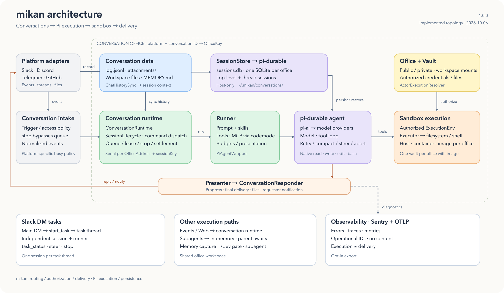

<p align="center">
  
</p>

#  @geminixiang/mikan

[](https://www.npmjs.com/package/@geminixiang/mikan)
[](https://opensource.org/licenses/MIT)

Self-hosted AI coding agent that works in your team's chat.

- **One office per conversation** — every Slack channel and DM gets its own workspace, sandbox, credentials, and memory; each thread runs as its own session.
- **Where your team already talks** — Slack, Telegram, Discord, and GitHub (experimental).
- **Real tools, contained** — in `image:` mode, commands run in a per-office Docker sandbox with credentials from that office's vault.

Upgrading from 0.5.3? Follow [Upgrading from 0.5.3](src/content/docs/deployment.mdx#upgrading-from-053); `mikan migrate` converts the state in place.

## Architecture

mikan keeps the chat record, agent session, and execution runtime separate:

[](docs/architecture.html)

[Download the HTML/SVG source](docs/architecture.html) to view the full architecture diagram locally.

- **Conversation office** is the unit everything else hangs off: one conversation's working area plus its own sandbox runtime. An office is identified by its platform and raw conversation id, and its directory is named by an office key (`v1-<platform>-<readable-id>-<hash>`), so two platforms can never collide on the same raw id.
- **Chat / conversation data** is the platform-facing record: `log.jsonl`, attachments, and conversation files.
- **Session orchestration** turns platform events into agent runs, handles top-level/thread scopes, and persists agent sessions in one host-only SQLite `sessions.db` per office under the State dir.
- **mikan agent harness** (`src/harness/`, built on pi-durable and pi-ai) owns run preparation, authorized prompts/tools, response presentation, and native Pi session integration. Pi handles the model/tool loop, persistence, compaction, retries, and cancellation.
- **Sandbox runtime** is where tool commands execute: host, or a Docker container or image.
- **Vault** provides runtime credentials as env vars and mounted secret files.

## Features

- **Multi-platform** — Slack, Telegram, Discord, and GitHub (experimental) adapters
- **Concurrent conversations** — Slack threads, Discord replies/threads, and Telegram reply chains run as independent sessions
- **Conversation offices** — one office directory and one sandbox runtime per conversation, with public/private visibility derived from the platform conversation type
- **Sandbox execution** — one managed Docker container per conversation office
- **Credential vaults** — `/login` stores credentials under `~/.mikan` and injects env into sandbox runs
- **Web session viewer** — read-only web view of the current session via `session` / `/session`
- **Persistent memory** — workspace-level and per-office `MEMORY.md`
- **Skills** — drop CLI tools into `skills/`
- **Events** — the agent schedules one-shot or recurring runs with its `event` tool
- **Multi-provider** — any provider/model supported by `pi-ai`

## Quick Start

You need Node.js 24.15 or later and Docker.

```bash
npm i -g @geminixiang/mikan pm2
mikan onboard                                  # pick a chat platform, a model, and a sandbox image
docker pull ghcr.io/geminixiang/mikan-sandbox:latest
pm2 start ~/.mikan/ecosystem.config.cjs && pm2 save
```

That's it: `@mention` the bot in a channel or send it a DM. `mikan onboard` prints the exact `docker pull` line for the image you picked; the recommended image is about 900 MB, so the pull takes a few minutes the first time. Run `pm2 startup` once if mikan should start on boot.

Everything lives in `~/.mikan`: `settings.json` for behavior (model, sandbox limits, reply modes), `mikan.env` for secrets and platform tokens, and `ecosystem.config.cjs` for process supervision. To add another platform later, put its tokens in `mikan.env` and run `pm2 reload ~/.mikan/ecosystem.config.cjs` so pm2 rereads the file; `mikan env` lists every variable mikan reads.

Upgrade with `npm i -g @geminixiang/mikan`, check `mikan migrate --sandbox=image:<image> --dry-run` for pending State migrations, then `pm2 reload mikan`. See [the deployment guide](src/content/docs/deployment.mdx) for graceful shutdown and the health endpoint.

## Platforms

- **Slack** — create a Socket Mode app using [src/content/docs/slack-bot-minimal-guide.md](src/content/docs/slack-bot-minimal-guide.md). The bot responds when `@mentioned` in channels and to all DMs.
- **Telegram** — create a bot via [@BotFather](https://t.me/BotFather). The bot responds to private messages, `@mention`, and reply chains in groups.
- **Discord** — create an application in the [Discord Developer Portal](https://discord.com/developers/applications), enable **Message Content Intent**, and invite it with message/file permissions.
- **GitHub (experimental)** — bind a regular GitHub account with a fine-grained PAT, point an organization webhook at `<LINK_URL>/github/webhook`, and list the repositories mikan answers in. People mention, assign, and request reviews from it like a teammate; one issue or PR is one conversation. See [src/content/docs/platform-adapters/github.md](src/content/docs/platform-adapters/github.md).

Slack threads, Discord replies/threads, and Telegram reply chains are mapped to independent session scopes. See [src/content/docs/sessions.mdx](src/content/docs/sessions.mdx).

## Sandbox

Use `image:<image>`: mikan starts one Docker container and one credential vault per conversation office, and enforces office visibility. `mikan onboard` sets it up.

`host` (run directly on the machine) and `container:<name>` (one shared, existing container) still work but are not recommended: they give the agent the whole machine or one shared filesystem, skip `/login` credential injection, and do not enforce office visibility.

Each office is **public** or **private**, following the Slack conversation type: public channels are public — every other office can read them (read-only, under `/workspace/public/`) and they may write the shared `MEMORY.md` and `skills/`. Private channels, DMs, group DMs, and externally shared channels are private — visible only to themselves, reading shared knowledge and public offices without writing back. Unknown conversation kinds are private. The admin portal or `/pi-sandbox visibility private` can narrow a public channel; nothing can widen beyond Slack. Visibility governs data access only; execution isolation is unaffected.

For routing, mounts, vault behavior, and managed container details, see [src/content/docs/sandbox.mdx](src/content/docs/sandbox.mdx).

## Chat commands

| Command                                          | Purpose                                                        |
| ------------------------------------------------ | -------------------------------------------------------------- |
| `/login` / `/pi-login`                           | Store API keys or run built-in OAuth flows                     |
| `session` / `/session`                           | Open a read-only web view of the current session               |
| `/new` / `/pi-new`                               | Reset the current session                                      |
| `/compact` / `/pi-compact`                       | Summarize older messages to free up context                    |
| `/model` / `/pi-model provider/model[:thinking]` | Switch the LLM for the current conversation                    |
| `/sandbox` / `/pi-sandbox [boost\|visibility …]` | Show sandbox status, boost limits, or narrow office visibility |
| `/pi-auto-reply <on\|off\|jev>`                  | Set mention-free replies for the current Slack channel         |
| `/admin` / `/pi-admin`                           | Open the admin portal                                          |
| `stop` / `/stop`                                 | Stop the current run (works on every platform)                 |

`session` is the only command accepted without a leading slash. See [src/content/docs/commands.mdx](src/content/docs/commands.mdx) for the full command reference and web session viewer setup.

## More docs

- [Configuration](src/content/docs/configuration.md)
- [Events](src/content/docs/events.md)
- [Skills](src/content/docs/skills.md)
- [Deployment](src/content/docs/deployment.mdx)
- [Development](src/content/docs/development.md)
- [Sandbox](src/content/docs/sandbox.mdx)
- [Embedding mikan](deploy/examples/embedder/README.md) — build your own agent on the published package interface

## Development

```bash
npm install && npm run build
npm run dev
npm test
npm run lint
npm run fmt:check
npm run build
```

See [src/content/docs/development.md](src/content/docs/development.md) for E2E tests.

## Contributing

PRs welcome — see [CONTRIBUTING.md](CONTRIBUTING.md) for dev setup, commit style, and the testing checklist. Bug reports and feature requests go through the GitHub issue templates.

## License

MIT — see [LICENSE](LICENSE).
