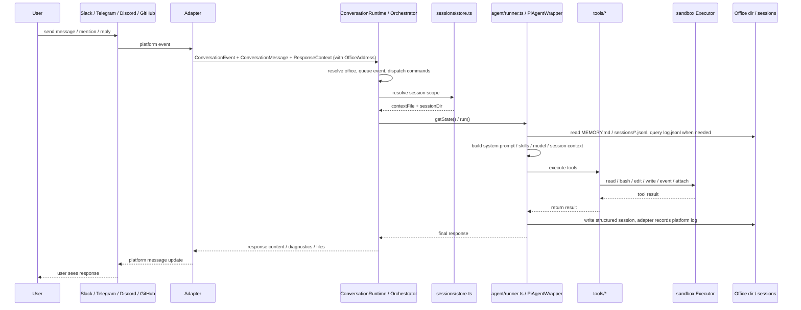
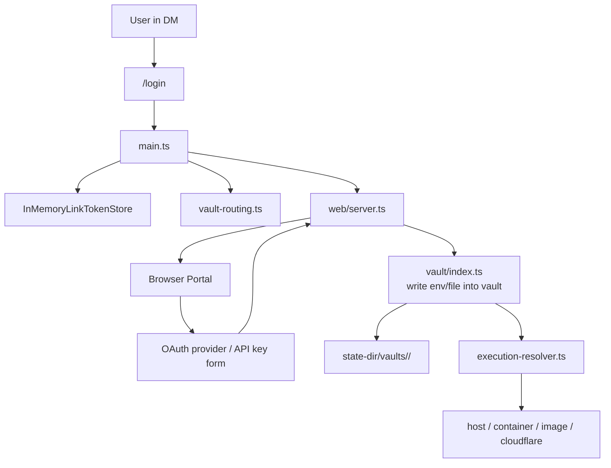

## 1. System overview


## 2. Main layers

### A. Platform adapter layer

For the shared adapter contract, see [Platform adapters](platform-adapters.mdx). Platform details are documented for [Slack](platform-adapters/slack.md), [Discord](platform-adapters/discord.md), [Telegram](platform-adapters/telegram.md), and [GitHub](platform-adapters/github.md).

- `src/adapters/slack/*`
- `src/adapters/telegram/*`
- `src/adapters/discord/*`
- `src/adapters/github/*`
- `src/adapter.ts`

Responsibilities:

- receive native Slack / Telegram / Discord events or poll GitHub issues and pull requests
- convert them to unified `ConversationEvent`, `ConversationMessage`, and `ConversationResponder` values, each carrying the conversation's `OfficeAddress`
- compute `sessionKey` according to platform rules
- wrap platform differences such as replies, typing, working state, and file upload

Raw platform identifiers stay at these external I/O boundaries. Everything inward addresses a conversation by its `OfficeAddress`.

### B. Core orchestration layer

- `src/main.ts`
- `src/cli/boot.ts`
- `src/runtime/conversation-runtime.ts`
- `src/adapters/intake.ts`
- `src/commands/manifest.ts`
- `src/sessions/store.ts`
- `src/sessions/chat-history-sync.ts`

Responsibilities:

- resolve argv into a boot plan (`src/cli/boot.ts`), then execute it: read env / `settings.json`, build the `Workspace`, run the office migration, and start the selected platform bots
- create `ConversationRuntime` as the `MessagingEventHandler` for each platform bot
- recognize the `stop` magic word in conversation intake (`src/adapters/intake.ts`) before trigger policy and queueing
- dispatch control commands such as `/login`, `/session`, and `/new` inside `ConversationRuntime.runSession`; the command inventory that adapters register/route from lives in `src/commands/manifest.ts`
- key per-session state and queues by office address plus session key, so one session runs at a time while other sessions proceed concurrently
- decide which `PiAgentWrapper` corresponds to each session scope

### C. Agent execution layer

- `src/agent/`
- `src/harness/*`
- `src/tools/*`

Responsibilities:

- create `PiAgentWrapper`
- load model, skills, memory, and session context
- send user messages into mikan's own agent harness (`src/harness/`, built on `pi-agent-core` / `pi-ai`), which runs the turn loop with auto-compaction, auto-retry, and extension hooks
- connect tool calls to local `read/bash/edit/write/event/attach`
- write tool results back to the session and return responses through the adapter

### D. Execution environment layer

- `src/sandbox/*`
- `src/provisioner.ts`
- `src/execution-resolver.ts`

Responsibilities:

- provide a unified `Executor` abstraction
- split sandbox runtimes by workspace capability:
  - unmanaged projection: `host` / `container:<name>` / `cloudflare:*`
  - managed projection: `image:<image>`, which can enforce isolated offices and read-only shared memory
- use `ActorExecutionResolver` to decide the actual executor by user/conversation/vault
- in `image` mode, automatically create and recycle Docker containers, resolving `image:<image>` to a concrete `container:<name>` executor

### E. Conversation office layer

- `src/office/*`
- `src/workspace-projection/index.ts`

Every conversation is an **office**: its own persistent working area and data boundary. This module owns that identity and layout.

Responsibilities:

- `createWorkspace({ root, stateDir })` builds the per-process `Workspace` value: the workspace root, its global `MEMORY.md` / `skills/` / `events/` / `agents/`, and the office factory
- `workspace.office(address)` returns a frozen `Office` value with every path precomputed — `dir`, `memoryPath`, `skillsDir`, `sessionsDir`, `attachmentsDir`, `logPath`, and the host-only `stateDir` — plus `ensure()`, the single materialization seam
- derive the `OfficeKey` (`v1-<platform>-<readable-id>-<sha256 prefix>`) that names the office on the host, inside sandbox runtimes, and in the vault
- keep the host-only office registry (`office-registry.json`) as the durable raw-id ↔ office mapping, because office keys are not reversible
- run the boot-time migration from the legacy raw-id layout, journaled with crash recovery
- resolve the workspace projection: which host paths are mounted into the sandbox runtime for the office's door policy

### F. State and persistence layer

- `src/sessions/store.ts`
- `src/sessions/chat-history-sync.ts`
- `src/vault/index.ts`

Responsibilities:

- session file management: `sessions/current` and `*.jsonl`
- dual-track history persistence with `log.jsonl` and structured sessions
- workspace-level and office-level `MEMORY.md`
- per-office vault credentials and mount / env injection

### G. Supporting services layer

- `src/web/login/*`
- `src/web/admin/*`
- `src/web/session-view/*`
- `src/events.ts`

Responsibilities:

- `src/web/server.ts` owns the HTTP server and mounts login/vault, admin, session-view, and agent-event routes
- provide a web login portal that supports API key and OAuth writes into the vault
- provide an admin portal for conversation/settings/workspace/events/skills management and link generation
- provide a session viewer; it can currently display session timelines and, when interactive wiring is enabled, send messages through `/session/message`
- watch `events/*.json` and re-inject scheduled events into the bot flow

## 3. Message processing flow



## 4. Offices, sessions, and file layout

`mikan` separates sandbox-visible working data from host-authoritative settings and credentials:

```text
<workspace>/
├── MEMORY.md                  # workspace-level memory
├── skills/                    # workspace-level skills
├── events/                    # the workspace scheduling bus
├── agents/                    # per-install subagent profile patches
└── <officeKey>/               # one conversation office
    ├── MEMORY.md              # office-level memory
    ├── log.jsonl              # grep-friendly platform message history
    ├── attachments/           # platform attachment downloads
    ├── scratch/               # in-progress working area
    ├── skills/                # office-level skills
    └── sessions/
        ├── current            # top-level session pointer
        ├── <timestamp>_<id>.jsonl
        └── <scope_id>.jsonl   # thread / reply scoped sessions

<state-dir>/
├── settings.json              # required global settings
├── office-registry.json       # office inventory + migration journal
├── conversations/
│   └── <officeKey>/settings.json  # host-only conversation overrides
└── vaults/<vaultId>/          # credentials
```

The default state directory is `~/.mikan`. It must remain outside sandbox-visible workspace paths. `MEMORY.md`, `skills`, `events`, and `agents` are reserved workspace-root names and are never office directories.

Design points:

- `<officeKey>` is `v1-<platform>-<readable-id>-<hash>`, derived by SHA-256 from the platform and the raw conversation id. The readable middle is diagnostic; the digest is the identity. Two platforms sharing a raw conversation id therefore get different directories, settings, and vaults
- the office key names the same directory on the host and inside the sandbox runtime, so a path does not change meaning when it crosses the boundary
- office keys cannot be reversed to a raw platform id, so `office-registry.json` records each office's `(platform, conversationId)` when it is first materialized. Raw-id-facing surfaces — the Admin portal, `mikan office claim` — resolve through it
- `log.jsonl` is the platform conversation log: what actually happened on the source platform
- `sessions/*.jsonl` is the LLM working context/log: what mikan gave the LLM and what the LLM/tool did
- the top-level session uses the `current` pointer, but `current` is not channel history; when missing, recent top-level working context can be rebuilt from `log.jsonl`
- thread / reply sessions use fixed file names so scoped sessions can be tracked separately
- session keys stay raw platform values; runtime state is addressed by office plus session key, so a session key can never select another office's runner or queue
- Slack top-level messages share a channel session; Slack thread replies use `conversationId:threadTs`
- Slack events first create a top-level anchor message, then run with `conversationId:anchorTs`

### Door policy and the workspace projection

What an office's sandbox runtime actually sees is the _workspace projection_, resolved from the office's door policy:

| Door policy | Layout           | Mounted into the runtime                                            |
| ----------- | ---------------- | ------------------------------------------------------------------- |
| `isolated`  | `conversation`   | `<officeKey>/` only                                                 |
| `trusted`   | `shared-support` | `<officeKey>/` plus workspace `MEMORY.md`, `skills/`, and `events/` |
| `trusted`   | `full`           | the entire workspace root                                           |

`isolated` always implies the `conversation` layout. Without an explicit override, recorded Slack public channels derive trusted read-write shared support, private channels derive trusted shared support with read-only global memory, and DMs, external channels, or unknown kinds derive isolated. Door policy is a data-access boundary; it never changes execution or network isolation. Admin and `/pi-sandbox door` may set explicit overrides — see [Configuration](/configuration/).

## 5. Login / Vault / Sandbox relationship



Key points:

- credentials do not go directly into the workspace
- vaults live in `--state-dir`
- at execution time, the office's vault is routed to the corresponding sandbox
- `image` / `cloudflare` modes key the vault by office key — the same string that names the office in the workspace and the registry; `container:<name>` uses a shared container vault; `host` keys by user and does not inject vault env
- sandbox resource names (container names and Cloudflare scopes) are still derived from the raw conversation id. A collision there costs a runtime recreate, never credential access

## 6. Differences between events and normal chats

`events/*.json` is watched by `EventsWatcher`, then converted into `ConversationEvent` and sent through the normal flow again.
In other words, events are not a separate executor; they are another message intake path.

This lets these capabilities share the same mechanism:

- session context
- vault routing
- tool execution
- platform replies
- stop / running state management

## 7. Architecture conclusion

In one sentence, the core of `mikan` is:

> A multi-platform AI agent bot coordinated by `main.ts`, executed by `agent/runner.ts`, and supported by `office/session/vault/sandbox` infrastructure.

You can think of it as 7 core subsystems:

1. Platform adapters
2. Bot runtime orchestration
3. Agent + tools
4. Conversation offices: identity, layout, registry, and workspace projection
5. Session/context persistence
6. Vault + sandbox execution routing
7. Web/event side services

The office is the unit these subsystems agree on: one conversation, one directory, one vault, one sandbox runtime, one data boundary. See [ADR 0003](https://github.com/geminixiang/mikan/blob/main/docs/adr/0003-isolated-conversation-offices.md), [ADR 0004](https://github.com/geminixiang/mikan/blob/main/docs/adr/0004-persistent-offices-and-ephemeral-factory-floors.md), and [ADR 0005](https://github.com/geminixiang/mikan/blob/main/docs/adr/0005-office-address-identity.md).
