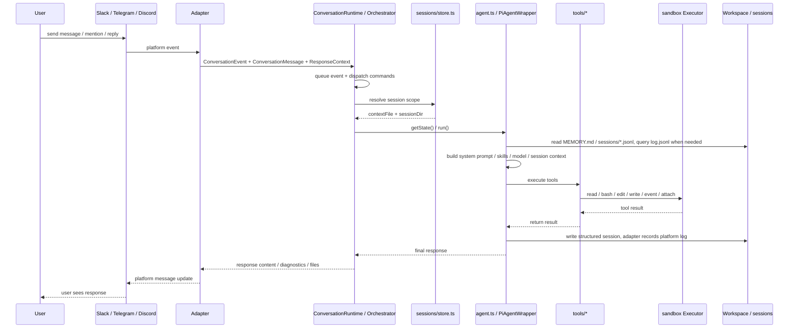
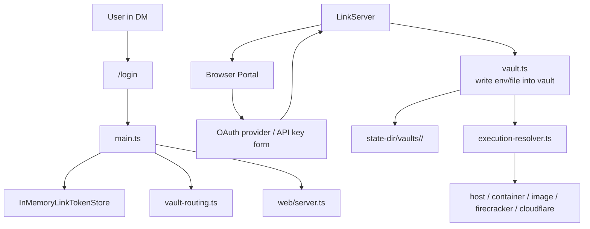

## 1. System overview


## 2. Main layers

### A. Platform adapter layer

For the full platform adapter description, see [Platform adapters](platform-adapters.md). For platform details, see [Slack](platform-adapters/slack.md), [Discord](platform-adapters/discord.md), and [Telegram](platform-adapters/telegram.md).

- `src/adapters/slack/*`
- `src/adapters/telegram/*`
- `src/adapters/discord/*`
- `src/adapter.ts`

Responsibilities:

- receive native Slack / Telegram / Discord events
- convert them to unified `ConversationEvent`, `ConversationMessage`, and `ConversationResponder` values
- compute `sessionKey` according to platform rules
- wrap platform differences such as replies, typing, working state, and file upload

### B. Core orchestration layer

- `src/main.ts`
- `src/runtime/conversation-runtime.ts`
- `src/runtime/agent-run-controller.ts`
- `src/sessions/store.ts`
- `src/sessions/agent-memory-file-manager.ts`

Responsibilities:

- start the CLI and read env / args / `settings.json`
- create `ConversationRuntime` as the `MessagingEventHandler` for each platform bot
- dispatch control commands such as `/login`, `/session`, `stop`, and `new` through `AgentRunController`
- manage `conversationStates` and per-session queues to avoid duplicate runs in the same session
- decide which `PiAgentWrapper` corresponds to each session scope

### C. Agent execution layer

- `src/agent.ts`
- `src/context.ts`
- `src/tools/*`

Responsibilities:

- create `PiAgentWrapper`
- load model, skills, memory, and session context
- send user messages into mikan harness (`pi-agent-core`)
- connect tool calls to local `read/bash/edit/write/event/attach`
- write tool results back to the session and return responses through the adapter

### D. Execution environment layer

- `src/sandbox/*`
- `src/provisioner.ts`
- `src/execution-resolver.ts`

Responsibilities:

- provide a unified `Executor` abstraction
- split sandbox runtimes into two categories:
  - shared: `host` / `container:<name>`, where the same host or named container is shared
  - isolated: `image:<image>` / `firecracker:*` / `cloudflare:*`, routed by actor/conversation/vault to isolated execution environments
- use `ActorExecutionResolver` to decide the actual executor by user/conversation/vault
- in `image` mode, automatically create and recycle Docker containers, resolving `image:<image>` to a concrete `container:<name>` executor

### E. State and persistence layer

- `src/sessions/store.ts`
- `src/sessions/agent-memory-file-manager.ts`
- `src/context.ts`
- `src/vault/index.ts`

Responsibilities:

- session file management: `sessions/current` and `*.jsonl`
- dual-track history persistence with `log.jsonl` and structured sessions
- workspace / conversation-level `MEMORY.md`
- per-conversation vault credentials and mount / env injection

### F. Supporting services layer

- `src/web/login/*`
- `src/web/admin/*`
- `src/web/session-view/*`
- `src/events.ts`

Responsibilities:

- `src/web/server.ts` owns the HTTP server and mounts login/vault, admin, session-view, and agent-event routes
- provide a web login portal that supports API key and OAuth writes into the vault
- provide an admin portal for conversation/settings/workspace/events/skills management and link generation
- provide a session viewer; it can currently display session timelines and, when interactive wiring is enabled, send messages through `/session/message`
- watch `events/*.json` and re-inject scheduled events into the bot flow

## 3. Message processing flow



## 4. Sessions and file layout

`mikan` does not keep context only in memory; it mainly lands in the workspace directory:

```text
<workspace>/
├── MEMORY.md                  # workspace-level memory
├── .mikan/skills/             # workspace custom skills
├── events/                    # scheduled and external events
└── <conversationId>/
    ├── settings.json          # conversation-local overrides
    ├── MEMORY.md              # conversation-level memory
    ├── log.jsonl              # grep-friendly human-readable message history
    ├── attachments/           # platform attachment downloads
    ├── scratch/               # in-progress working area
    ├── .mikan/skills/         # conversation custom skills
    └── sessions/
        ├── current            # top-level session pointer
        ├── <timestamp>_<id>.jsonl
        └── <scope_id>.jsonl   # thread / reply scoped sessions
```

Design points:

- `log.jsonl` is the platform conversation log: what actually happened in Slack/Discord/Telegram
- `sessions/*.jsonl` is the LLM working context/log: what mikan gave the LLM and what the LLM/tool did
- the top-level session uses the `current` pointer, but `current` is not channel history; when missing, recent top-level working context can be rebuilt from `log.jsonl`
- thread / reply sessions use fixed file names so scoped sessions can be tracked separately
- Slack top-level messages share a channel session; Slack thread replies use `conversationId:threadTs`
- Slack events first create a top-level anchor message, then run with `conversationId:anchorTs`

## 5. Login / Vault / Sandbox relationship



Key points:

- credentials do not go directly into the workspace
- vaults live in `--state-dir`
- at execution time, the conversation vault is routed to the corresponding sandbox
- `image` / `firecracker` / `cloudflare` modes use per-actor/per-conversation vault routing; `container:<name>` uses a shared container vault; `host` does not inject vault env

## 6. Differences between events and normal chats

`events/*.json` is watched by `EventsWatcher`, then converted into `ConversationEvent` and sent through the normal flow again.
In other words, events are not a separate executor; they are another message intake path.

This lets these capabilities share the same mechanism:

- session context
- vault routing
- tool execution
- platform replies
- stop / running state management

## 7. Architecture conclusion

In one sentence, the core of `mikan` is:

> A multi-platform AI agent bot coordinated by `main.ts`, executed by `agent.ts`, and supported by `session/vault/sandbox` infrastructure.

You can think of it as 6 core subsystems:

1. Platform adapters
2. Bot runtime orchestration
3. Agent + tools
4. Session/context persistence
5. Vault + sandbox execution routing
6. Web/event side services
