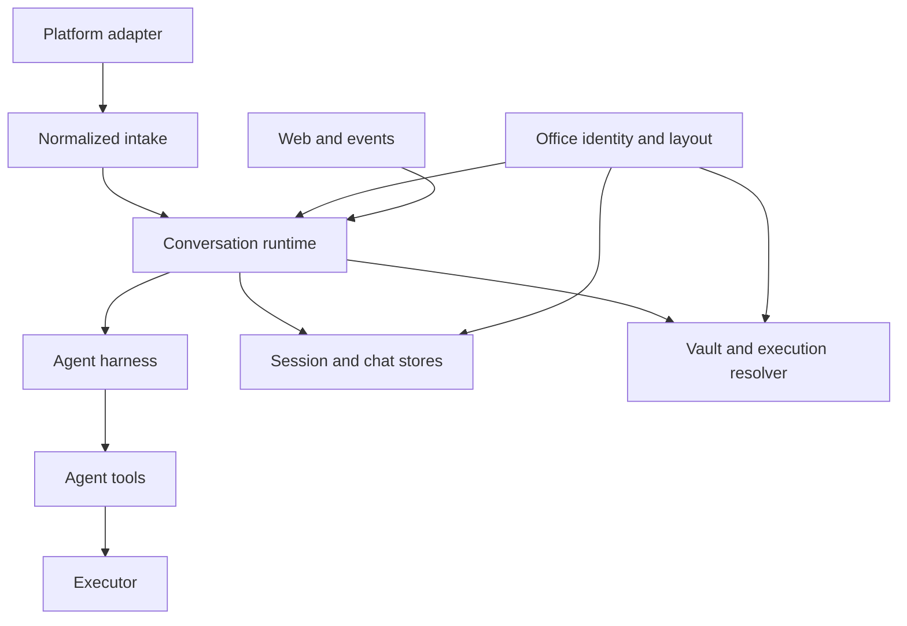

This page documents mikan's **architectural interfaces**: the contracts that cross a subsystem, process, persistence, or package boundary. It is not an inventory of every exported helper. A helper used only inside one subsystem is an implementation detail even when TypeScript currently marks it `export`.

## Stability levels

| Level            | Meaning                                                     | Compatibility expectation                                         |
| ---------------- | ----------------------------------------------------------- | ----------------------------------------------------------------- |
| Public           | Imported by npm consumers                                   | Preserve or version deliberately                                  |
| Host integration | Used to embed the runtime or add a platform/runtime backend | Preserve while the integration exists                             |
| Wire / persisted | Stored on disk or sent across a process/network boundary    | Migrate explicitly; readers should tolerate supported older forms |
| Internal         | Connects modules inside the mikan CLI                       | May change with coordinated call sites and tests                  |

`src/index.ts` is an explicit export list rather than a wildcard re-export, and `src/test/public-api.test.ts` snapshots it so an accidental addition fails CI. It still exposes more of the harness than an ordinary bot integration needs; treat the table below as the intended contract and see [Core simplification](/core-simplification/) for the remaining split.

## Boundary map



The runtime is the coordinator. Platforms must not know harness persistence, the harness must not know platform SDK objects, and tools must not know whether execution is local, containerized, or remote. The office module supplies the identity and paths that the runtime, the stores, and the vault all address a conversation by.

## Maintainer ownership and seam register

The following seven owner scopes are the long-lived division of responsibility. An owner may change its implementation freely behind its ports, but changing a port requires updating both sides and the contract tests named below. These scopes describe code ownership, not process or privilege isolation.

| Owner scope            | Primary modules                                                                           | Owns                                                                                                                                               | Hands off                                                                                          |
| ---------------------- | ----------------------------------------------------------------------------------------- | -------------------------------------------------------------------------------------------------------------------------------------------------- | -------------------------------------------------------------------------------------------------- |
| **Platform entry**     | `src/adapters/`, `src/types.ts`                                                           | SDK normalization, intake ordering, platform response transport, and `MessagingInfo` including `trustModel`                                        | Platform-neutral `ConversationEvent`, `ConversationContext`, and capability ports                  |
| **Office identity**    | `src/office/`                                                                             | `OfficeAddress`/`OfficeKey` derivation, the `Workspace`/`Office` layout values, office materialization, the registry journal, and legacy migration | Frozen `Office` values with precomputed paths; the durable raw-id ↔ office mapping                 |
| **Runtime/session**    | `src/runtime/`, `src/sessions/`                                                           | Session-key grammar, per-session serialization, chat/session synchronization, runner lifecycle, stop/reset, and shutdown                           | Validated events to the runner; office and actor inputs to execution resolution                    |
| **Harness/tools**      | `src/harness/`, `src/tools/`, `src/agent/`                                                | Model turns, session-tree persistence, budgets, tool schemas, skills, subagents, and host capability calls                                         | `ConversationResponder` output and `Executor` operations; it does not receive platform SDK objects |
| **Sandbox/workspace**  | `src/sandbox/`, `src/workspace-projection/`, `src/provisioner.ts`                         | Executor implementations, mount topology, runtime/host path context, resource lifecycle, and file transport                                        | A concrete `Executor` with declared path and credential capabilities                               |
| **Vault/web/security** | `src/vault/`, `src/web/`, `src/execution-resolver.ts`, `src/sandbox/identity.ts`          | Credential identity and injection policy, host-only portal/token surfaces, mount collision checks, and security-sensitive authorization decisions  | Actor/trust inputs to vault policy; credentials only to the selected executor                      |
| **Config/CLI/package** | `src/config.ts`, `src/settings-mutation.ts`, `src/cli/`, `src/commands/`, `src/packages/` | Boot/flag grammar, settings persistence, the command manifest, package materialization and scope resolution                                        | Effective settings, deterministic command inventory, and read-only package skill mounts            |

A conversation harness instance is context-isolated from other instances, but that is not a filesystem or process sandbox. A Sandbox executor changes where tools run and what mounts they receive; `host` mode and a `full` workspace projection are not additional security guarantees. Keep these concerns separate when reviewing a seam.

### Cross-owner seams

The producer/consumer pairs below are the supported bridges. The named producer owns the representation and ordering; the consumer must use the port or canonical parser rather than reconstructing it.

| Seam                      | Producer → consumer                                                                    | Invariants, ordering, and failure behavior                                                                                                                                                                                                                                                                                                                                                                                                                                                                                                  |
| ------------------------- | -------------------------------------------------------------------------------------- | ------------------------------------------------------------------------------------------------------------------------------------------------------------------------------------------------------------------------------------------------------------------------------------------------------------------------------------------------------------------------------------------------------------------------------------------------------------------------------------------------------------------------------------------- |
| Platform intake           | Platform entry → Runtime/session                                                       | Intake order is **magic word → trigger policy → attachments → log → busy policy → queue → dispatch**. `stop` bypasses trigger policy, attachment work, and queueing. Invalid conversation or foreign session identity fails before queueing; attachment failures propagate.                                                                                                                                                                                                                                                                 |
| Office identity           | Platform entry → Office identity → Runtime/session, stores, vault, and settings        | Adapters produce an `OfficeAddress` at intake and validate the compatibility raw id against it. Consumers take `Office`/`Workspace` values, never a directory basename. `Office.ensure()` records the office in the registry **before** creating the directory, so no office directory exists that the registry cannot enumerate.                                                                                                                                                                                                           |
| Session identity          | Platform entry / Runtime/session → Runtime/session, harness, and stores                | `src/sessions/session-key.ts` owns `conversationId[:suffix]`, a raw platform value. A platform override is accepted only when it belongs to the conversation; otherwise derivation throws. Runtime state is keyed by office **plus** session key, so a session key can never select another office's state. No consumer splits session keys directly.                                                                                                                                                                                       |
| Command inventory         | Config/CLI/package → Platform entry, Runtime/session, and web/session view             | `COMMAND_MANIFEST` is the single inventory. Built-ins consume recognized command forms; unmatched slash text remains an agent prompt; `stop` is a magic word, not a handler.                                                                                                                                                                                                                                                                                                                                                                |
| Runtime to harness        | Runtime/session → Harness/tools                                                        | `handleEvent` derives the key and serializes one key while allowing other keys to run concurrently. Thread bootstrap waits for a running parent session to seal. A platform tool pack is created per runner because `bindRun` is mutable.                                                                                                                                                                                                                                                                                                   |
| Run output                | Harness/tools → Platform entry                                                         | The harness emits **response source**: platform-neutral Markdown/GFM, with user mentions written as `<@userName>`. Converting that into native presentation is wholly the adapter's job — Slack resolves `<@userName>` to `<@U…>` on every outgoing path, and no adapter may steer the model toward platform-native markup. Optional responder capabilities are feature-detected. For one run, response operations retain call order; adapters may buffer or stream, but must not expose harness persistence or SDK objects to the harness. |
| Runtime ↔ sandbox path    | Runtime/session → Sandbox/workspace → Harness/tools                                    | Runtime supplies the host workspace and a runtime cwd of `<runtime workspace root>/<officeKey>`; the office key names the same segment on both sides, so the path does not change meaning at the boundary. The executor supplies `getWorkspacePath`/`getPathContext`. Prompts and tool output use runtime paths, while host-side attachment translation uses the declared context. Paths outside the mapped root are not translated. This is a path contract, not a claim of filesystem isolation.                                          |
| Executor file transport   | Sandbox/workspace → Harness/tools                                                      | Tools use `Executor.readFile`/`writeFile`, never shell quoting protocols. Exec-only transports use the shared base64-chunked implementation; writes stage and rename, and transport errors remain errors.                                                                                                                                                                                                                                                                                                                                   |
| Trust and vault           | Platform entry → Runtime/session → Vault/web/security → Sandbox/workspace              | `MessagingInfo.trustModel` is passed into actor resolution; vault policy is keyed to that value, not platform-name strings. Omitted trust defaults to `membership`; `open-trigger` never receives an ambient shared-vault copy, and only `image`/`cloudflare` use that ambient path. Explicit vault provisioning remains a separate administrative decision.                                                                                                                                                                                |
| Settings and live runners | Config/CLI/package (commands and admin are adapters) → config disk and Runtime/session | `applyConversationSettings` clears the cached runner **before** writing an LLM change and refuses both actions while busy. `applyConversationWorkspacePolicy` behaves the same way for a door-policy change, since the mount set is baked into the runner's environment. Global LLM and door-policy settings write first, then clear idle runners and report busy conversations as stale. Sandbox resource limits and Slack reply settings are re-read at use time and do not clear runners.                                                |
| Package resolution        | Config/CLI/package → Harness/tools and Sandbox/workspace                               | Global and conversation package lists are additive; the narrower scope wins for one `sourceIdentity`, before skill discovery. Conversation loads are offline and cannot block on a remote; package repositories stay host-only, while package skills mount read-only outside `/workspace`.                                                                                                                                                                                                                                                  |
| Web capability bridge     | Vault/web/security → Runtime/session and commands                                      | Portal stores are optional runtime services. A portal URL without its backing store fails when that portal is used; absent stores otherwise produce disabled/not-configured behavior. Route payloads are bundled-UI contracts, not a general REST API.                                                                                                                                                                                                                                                                                      |
| Event scheduling bus      | Harness/tools → Runtime/session via `events/*.json`                                    | Writers use `buildEventPayload`; readers use `parseEventPayload`. The bus is workspace-wide and agent-writable by design. Ownership prefixes are cooperative, never authorization; secrets do not belong in event text.                                                                                                                                                                                                                                                                                                                     |
| History persistence       | Platform entry → `log.jsonl`; Runtime/session and Harness/tools → session JSONL        | Platform truth and agent truth remain separate. Session JSONL is a versioned tree, not a flat transcript; malformed session headers throw rather than silently replacing history.                                                                                                                                                                                                                                                                                                                                                           |

These bridges deliberately distinguish context isolation from sandboxing. A new owner must not infer credential authorization from a path, infer platform trust from a platform name, or make a shared event/package directory into an authorization boundary.

## 1. Package interface

The npm entry point is `@geminixiang/mikan`, implemented by `src/index.ts`.

### Supported entry-point groups

| Group                | Main symbols                                                                                               | Consumer                                                               |
| -------------------- | ---------------------------------------------------------------------------------------------------------- | ---------------------------------------------------------------------- |
| Runtime embedding    | `createConversationRuntime`, `ConversationRuntime`, `ConversationRuntimeOptions`                           | A host that supplies platform and execution dependencies               |
| Office and workspace | `createWorkspace`, `createOfficeAddress`, `officeKey`, `Workspace`, `Office`, `OfficeAddress`, `OfficeKey` | Any embedder: `createConversationRuntime` requires a `Workspace` value |
| Platform contract    | `MessagingBot`, `ConversationEvent`, `ConversationContext`, `ConversationResponder`, `MessagingInfo`       | Platform adapters and embedders                                        |
| Commands             | `CommandHandler`, `CommandContext`, `CommandServices`, `dispatchCommand`                                   | Hosts adding deterministic commands                                    |
| Execution            | `Executor`, `SandboxConfig`, `SandboxAdapter`, `createExecutor`, `parseSandboxArg`, `validateSandbox`      | Runtime backends and hosts                                             |
| Harness embedding    | `MikanAgentSession`, `SessionStore`, `MikanModels`, settings and event-format functions                    | Advanced embedders; not ordinary bot integrations                      |

Only paths declared by the package `exports` map are public. Importing any other generated `dist/` path or a source path under `src/` is unsupported.

## 2. Platform intake and response interface

Source: `src/types.ts` (re-exported by `src/adapter.ts`).

### `ConversationEvent`

The platform-neutral trigger delivered to `MessagingEventHandler`.

| Field                 | Contract                                                                                                                  |
| --------------------- | ------------------------------------------------------------------------------------------------------------------------- |
| `address`             | Canonical `OfficeAddress` (`platform` + raw `conversationId`), created by the adapter at intake                           |
| `conversationId`      | Deprecated raw platform identifier, valid only at adapter I/O seams; must not contain `:` because session keys reserve it |
| `conversationKind`    | `direct` or `shared`; affects session and credential policy                                                               |
| `ts`                  | Triggering platform message identifier                                                                                    |
| `thread_ts`           | Optional parent/root platform message identifier                                                                          |
| `user`                | Platform user identifier                                                                                                  |
| `text`                | Text after platform mention removal                                                                                       |
| `attachments`         | Files already downloaded to host paths                                                                                    |
| `sessionKey`          | Optional platform-selected override; otherwise derived by session policy                                                  |
| `vaultConversationId` | Optional alternate identity used only for credential routing                                                              |

Every production adapter and synthetic intake validates the compatibility `conversationId` against `address`. New code reads `address`.

### `ConversationContext`

Carries the office identity, the richer normalized message, the response port, and platform metadata for the same run:

```ts
interface ConversationContext {
  address: OfficeAddress;
  message: ConversationMessage;
  responder: ConversationResponder;
  platform: MessagingInfo;
}
```

`ConversationMessage` and `ConversationEvent` currently duplicate message id, session, conversation kind, user, text, attachments, and thread identity — and both now carry `address`. Adapters must keep both representations consistent. This is an internal compatibility seam, not a desirable model for new integrations.

### `ConversationResponder`

The runtime/harness output port. Required operations cover final text, replacement, diagnostics, tool status, typing/working state, file upload, and response deletion. Streaming (`appendResponseDelta`, `finishResponse`) and reaction (`react`) are optional capabilities.

Capability rule: callers must feature-detect optional methods. An adapter may buffer output or implement streaming natively, but it must preserve call order for a single run.

### `MessagingBot`

The host-facing platform port. It combines:

- lifecycle: `start()`;
- outbound messages: `postMessage`, `updateMessage`, optional upload/reaction/private replies;
- intake scheduling: `enqueueEvent`;
- discovery/policy: `getMessagingInfo()`.

`MessagingInfo.trustModel` is security-sensitive. `membership` permits the ambient shared-vault policy when the sandbox topology is isolated. An open trigger surface such as public GitHub activity must return `open-trigger`.

`MessagingBot` is the single host-facing adapter interface; lifecycle and messaging capabilities are not split across a second shallow interface.

## 3. Runtime orchestration interface

Source: `src/runtime/types.ts` and `src/runtime/conversation-runtime.ts`.

`createConversationRuntime(options)` returns the public `ConversationRuntime` orchestrator. Inside `src/runtime/`, `SessionLifecycle` is the runner resource authority: it owns per-session serialization, materialization, leases, settlement, invalidation, disposal, idle eviction, and shutdown. The orchestrator owns command, stop/reset, rotation, and platform-facing run workflow.

### Input methods

| Method                                                                    | Semantics                                                                          |
| ------------------------------------------------------------------------- | ---------------------------------------------------------------------------------- |
| `handleEvent(event, bot, context)`                                        | Serialize by office plus derived session key, then dispatch a command or agent run |
| `runSession(options)`                                                     | Execute one already-serialized unit; intended for controlled host use              |
| `handleStop(address, sessionKey, bot)` / `forceStop(address, sessionKey)` | Cooperative/user-visible stop versus immediate internal stop                       |
| `handleNewCommand(...)`                                                   | Abort, reset persisted session state, and discard the cached runner                |

### Control and inspection

| Method                                    | Semantics                                                                     |
| ----------------------------------------- | ----------------------------------------------------------------------------- |
| `isRunning(address, sessionKey)`          | Current in-process run state                                                  |
| `getRunningSessions()`                    | Snapshot for admin/observability surfaces; each entry carries its `address`   |
| `switchConversationModel(address, ...)`   | Update a cached runner; returns whether one existed                           |
| `refreshConversationEnvironment(address)` | Re-resolve a cached runner environment                                        |
| `shutdown(timeoutMs?)`                    | Reject new work, stop runners, and wait for in-flight work up to the deadline |

Every session-scoped entry point takes an `OfficeAddress`. There is no raw-conversation-id bridge; platform and Admin surfaces carry the platform-scoped address explicitly.

`ConversationRuntimeOptions` supplies a `workspace` (the `Workspace` value from `createWorkspace`), sandbox/resource services, optional portal token stores, optional commands, model registry, proactive platform operations, and platform tool-pack factories. Missing vault and portal stores degrade to disabled implementations; setting a portal URL without its store is an error when used.

Concurrency invariant: calls for one office and session key are serial; different session keys may run concurrently. Every runner use holds an internal lifecycle lease, so settings invalidation, eviction, and shutdown cannot dispose it mid-operation. A platform tool pack is created per runner, never shared globally, because `bindRun` mutates its run binding.

## 4. Command interface

Sources: `src/commands/manifest.ts`, `src/commands/types.ts`, and `src/commands/registry.ts`.

`COMMAND_MANIFEST` is the platform-facing inventory used to derive slash forms and native registration. `CommandHandler.tryHandle(context)` is the execution contract. Handlers run in order and the first `true` result consumes the message.

Recognized built-in command forms are consumed before runner creation. An unmatched slash-prefixed message is still a normal agent prompt. `stop` is a platform intake magic word, not a `CommandHandler`; `session` is the only accepted bare command.

`CommandContext` contains normalized actor/conversation identity, response and bot ports, command text, privacy state, and `CommandServices`. Command handlers must not reach into a platform SDK event.

## 5. Harness interface

Sources: `src/harness/index.ts`, `runner.ts`, `session-store.ts`, `models.ts`, and `types.ts`.

### `MikanAgentSession`

Owns the model turn loop, message persistence, retries, compaction, budget circuit breakers, skills, bounded subagents, and abort behavior. Its externally meaningful operations are prompt/run, subscribe, abort, session reload, model/thinking selection, and disposal.

### `SessionStore`

Owns the current Pi 0.85.0 v4 append-only session JSONL tree. Persisted headers use `v: 4` and `storageVersion: 1`; mikan-specific metadata is stored as the durable namespaced value `mikan/metadata`. Runtime opening accepts only this current format, so legacy mikan v3 and Pi 0.84-generation v4 files must be converted with `mikan sessions migrate` while the daemon is stopped. `SessionHeader.version` in the compatibility view is currently `4` (`CURRENT_SESSION_VERSION`). Session entries may branch; consumers must use store/context helpers rather than assuming the file is a flat chat transcript.

### `MikanModels`

`MikanModels` resolves built-in and custom `pi-ai` models; provider credentials come from environment variables. Vault credentials are a different boundary: they are injected into tool execution, not used to authenticate the host-side model client.

### Subagent profiles

A subagent is always launched with a named profile — free-form per-run configuration is not a supported surface. `loadSubagentProfiles` resolves them: the built-in profiles in `src/harness/subagent-profiles.ts` are the definition of record (`worker`, `software-engineer`, `devops-engineer`, `data-scientist`, `account-manager`, `business-development`, `creative-producer`, `ad-operations-specialist`, `analysis-only`), and a `<workspace>/agents/<name>.md` file **patches** the built-in of the same name rather than replacing it, so an operator can override `model:` without restating tools and prompt. A file whose name matches no built-in defines a new profile and must supply its own `tools`. A malformed file becomes a diagnostic and is skipped, never thrown.

### Harness events and budgets

Harness listeners observe model/tool lifecycle events. Budget settings cap tokens, cost, duration, and LLM calls. A budget trip aborts the run and emits `budget_exceeded`; it is a terminal outcome, not a retry signal.

## 6. Tool and platform capability interface

Source: `src/tools/types.ts`.

Core tools use the executor and host services supplied by the runner. `EventStore` is the canonical CRUD port for event files. Invalid event JSON remains listable with `payload: null` so an admin can diagnose or delete it.

`PlatformToolPackFactory` creates a private `PlatformToolPack` per runner. `bindRun` selects whether its tools apply to the current platform/conversation. The factory boundary keeps GitHub-specific tools out of the core tool list while preventing cross-conversation mutable binding.

## 7. Sandbox and executor interface

Sources: `src/sandbox/types.ts` and `src/sandbox/index.ts`.

### `SandboxConfig`

The discriminated union currently supports `host`, `container`, `image`, and `cloudflare`. Parsing syntax and maturity are documented under [Sandbox](/sandbox/).

### `Executor`

This is the stable execution boundary and the most important sandbox contract:

| Operation                     | Requirement                                                               |
| ----------------------------- | ------------------------------------------------------------------------- |
| `exec`                        | Return stdout, stderr, and exit code; honor timeout/abort where supported |
| `readFile` / `readFileBase64` | Transport content without adding shell parsing layers                     |
| `writeFile`                   | Stage and replace so an aborted write cannot truncate the target          |
| `getWorkspacePath`            | Map a host workspace root to the runtime-visible root                     |
| `getPathContext`              | Declare host/runtime path semantics and optional reverse mapping          |
| `getSandboxConfig`            | Return the concrete configuration in use                                  |

Remote/exec-only implementations share base64-chunked file transport. Tool implementations must call executor file methods instead of building `cat`, `printf`, or quoting protocols.

### `SandboxAdapter`

An adapter recognizes one CLI value, optionally validates it, and optionally creates an executor. `image` deliberately has no direct executor: actor/vault resolution provisions a concrete container first.

Although the type is exported, adapter registration is currently a closed list inside `src/sandbox/index.ts`; external consumers cannot add an adapter to `parseSandboxArg` or `createExecutor`.

## 8. Vault and execution-resolution interface

Source: `src/vault/types.ts`; the injection and ambient-copy policy live in `src/vault/index.ts`.

`VaultManager` resolves credential env and mount files by canonical actor key, lists and mutates private/shared vaults, and reports whether storage is enabled. Secrets live under the host-only state directory.

Credential flow is:

1. Runtime supplies platform trust, conversation, user, and sandbox topology.
2. The execution resolver resolves the Workspace projection and packages once, then selects the actor/vault identity.
3. `VaultManager` resolves env and mounts; collision and backend-capability checks validate the complete grant.
4. One execution decision returns the projection, packages, runtime path context, and concrete executor configured with only the credentials intended for that run.
5. Prompt memory/skills and filesystem execution consume that same decision rather than recomputing authorization independently.

Host sandbox execution never receives vault injection. Open-trigger platforms never receive an ambient shared vault. These are security invariants, not convenience defaults.

## 9. Office, session, chat, and identity interfaces

Sources: `src/office/*`, `src/sessions/*`, `src/adapters/shared.ts`, and `src/sandbox/identity.ts`.

### `Workspace` and `Office`

A conversation is an **office**: one persistent working area and data boundary. Two values express it, and both are frozen.

```ts
const workspace = createWorkspace({ root, stateDir });
const office = workspace.office(createOfficeAddress("slack", "C0AAAAAA1"));
```

`Workspace` is constructed once per process and owns the workspace-global surfaces (`root`, `memoryPath`, `skillsDir`, `eventsDir`, `agentsDir`, `reservedNames`) plus the office factory. `Office` precomputes one conversation's paths — `key`, `dir`, `memoryPath`, `skillsDir`, `sessionsDir`, `attachmentsDir`, `logPath`, and the host-only `stateDir` — and exposes `ensure()`.

Rules that cross this boundary:

- **Values, not strings.** Consumers accept an `Office`; they do not join paths from a root and an id, and they never infer identity from a directory basename.
- **`ensure()` is the only materialization seam.** It records the office in the registry, then creates the directory. That order means a crash can leave a record without a directory (harmless — recreated on the next message) but never an anonymous directory the registry cannot enumerate. It is idempotent and cheap enough for per-message paths.
- **Office values are memoized per address**, so repeated `workspace.office(address)` calls on hot paths cost a map lookup rather than a SHA-256.

### `OfficeAddress` and `OfficeKey`

`OfficeAddress` is `{ platform, conversationId }` — the platform plus its raw conversation id. `officeKey(address)` derives the storage identity `v1-<platform>-<readable-id>-<16 hex digits>`, where the readable middle is diagnostic and the SHA-256 prefix is the identity component. The same key names the office directory on the host, inside sandbox runtimes, and in the vault, so two platforms sharing a raw conversation id can never reach each other's files or credentials.

Office keys are **not reversible**. `OfficeRegistry` (`office-registry.json`, host-only) is the durable raw-id ↔ office mapping, and also journals the boot-time migration from the legacy raw-id layout. Admin enumeration reads it through `listRegisteredOffices`. Sandbox resource names (container names and Cloudflare scopes) remain raw-conversation-derived until the resource-naming migration; a collision there costs a runtime recreate, never credential access.

### The two records

| Record                      | Purpose                                                             |
| --------------------------- | ------------------------------------------------------------------- |
| `<office>/log.jsonl`        | Platform truth: user/bot messages and attachments                   |
| `<office>/sessions/*.jsonl` | Agent truth: prompts, model/tool messages, branches, and compaction |

Do not merge them. Chat history can rebuild a missing top-level agent session, while agent sessions contain data that never appeared on the platform.

### Session keys

Session keys use `conversationId[:suffix]` and stay **raw platform values** — the grammar never sees an office key. Only `src/sessions/session-key.ts` owns it; callers must use `deriveSessionKey`, `conversationIdOf`, and `threadSuffixOf`, never split strings directly. Runtime state is addressed by office plus session key, which is what makes a raw, non-globally-unique key safe.

`ChatHistorySync` resolves top-level/thread scope, bootstraps new sessions, synchronizes new platform log entries, resets sessions, and coordinates a thread waiting for an active parent run to seal.

### Attachments

`saveIncomingAttachments(office, items)` in `src/adapters/shared.ts` is the one owner of the attachment convention: sanitized `<timestamp>_<name>` filenames under `office.attachmentsDir`, and the workspace-relative `<officeKey>/attachments/<file>` path the agent reads. It materializes the office before its first write and returns failures per item rather than throwing, so each adapter keeps its own failure policy.

## 10. Event-file interface

Source: `src/harness/event-format.ts`.

`events/*.json` is a workspace-level scheduling bus. The canonical union is:

```ts
type EventFilePayload =
  | { type: "immediate"; conversationId: string; text: string /* common optional fields */ }
  | { type: "one-shot"; conversationId: string; text: string; at: string }
  | { type: "periodic"; conversationId: string; text: string; schedule: string; timezone: string };
```

Common optional fields are `platform`, `conversationKind`, and `userId`. `channelId` is accepted only as a legacy read alias. All writers use `buildEventPayload`; all readers use `parseEventPayload`.

The bus is shared and agent-writable by design. Ownership prefixes are cooperative, not an authorization boundary.

## 11. Persisted filesystem interface

| Path                                                  | Owner                 | Visibility / compatibility                     |
| ----------------------------------------------------- | --------------------- | ---------------------------------------------- |
| `<state-dir>/settings.json`                           | config                | Host-only global settings                      |
| `<state-dir>/office-registry.json`                    | office registry       | Host-only office inventory + migration journal |
| `<state-dir>/conversations/<officeKey>/settings.json` | config/admin          | Host-only conversation overrides               |
| `<state-dir>/models.json`                             | harness model catalog | Host-only custom providers/models              |
| `<state-dir>/vaults/**`                               | vault/login           | Host-only secrets and mount files              |
| `<state-dir>/{global,conversations}/**/git`           | packages              | Host-only materialized package repositories    |
| `<workspace>/MEMORY.md`                               | agent/user            | Sandbox-visible durable memory                 |
| `<workspace>/skills/**/SKILL.md`                      | skills                | Sandbox-visible prompt instructions            |
| `<workspace>/events/*.json`                           | event store/watcher   | Shared scheduling wire format                  |
| `<workspace>/agents/*.md`                             | subagent profiles     | Per-install model patches over built-ins       |
| `<workspace>/<officeKey>/log.jsonl`                   | platform adapters     | Append-only platform history                   |
| `<workspace>/<officeKey>/sessions/*.jsonl`            | session store         | Versioned append-only agent history            |

`MEMORY.md`, `skills`, `events`, and `agents` are the reserved workspace-root names (`RESERVED_WORKSPACE_NAMES`); every other workspace-root entry is an office directory. Conversation-scoped vault directories under `<state-dir>/vaults/` are named by office key for conversation-scoped sandboxes; `host` mode keys by user and `container` mode by container name.

The state directory must not be inside the sandbox-visible workspace. Important state files use atomic private writes; append-only logs use append semantics.

## 12. HTTP interface

Source: `src/web/server.ts` and portal modules. These routes support mikan's bundled UI; they are not a general public REST API.

| Surface        | Routes                                                                                 | Authentication model                    |
| -------------- | -------------------------------------------------------------------------------------- | --------------------------------------- |
| Health         | `GET /health`                                                                          | None; returns `{ "ok": true }`          |
| Login          | `GET /link`, `POST /api/link/complete`, `POST /api/oauth/start`, `GET /oauth/callback` | Short-lived link token plus OAuth state |
| Session viewer | `GET /session`, `GET /session/stream`, optional `POST /session/message`                | Session-view token                      |
| Admin          | `GET /admin`, `/admin/api/*`                                                           | Admin token                             |
| Agent events   | `GET /api/agent-events/stream`                                                         | Deployment-controlled event stream      |

Admin endpoints cover conversation inventory/state/usage, global and conversation settings, models, workspace files, skills, events, platform configuration, and login/session links. Route payloads are internal UI contracts and may evolve together with the bundled frontend.

## 13. Host/runtime safety boundaries

### Path, cache, and package safety

- `attach` is fail-closed: paths must stay inside the runtime workspace and are read through the active `Executor`, then staged in a host-private file before the platform uploader receives them. Host paths are never passed through from model input, and remote sandboxes use the same executor transport instead of a host-path fallback.
- Conversation-scoped cached-runner changes clear idle runners before writing and refuse busy writes. Global LLM changes persist first, mark busy conversations for invalidation, and discard their runners only after active run settlements finish.
- Package git checkouts are keyed by repository and ref. Different subpaths may share a checkout only when they use the same ref; ref changes rematerialize before settings persist. Git package subpaths must remain inside their canonical checkout, including through symlinks.
- Every vault key is one safe path segment. Reads fail closed, and writes or shared-vault copies reject invalid keys before filesystem access.

## Contract-test matrix

These suites protect the cross-owner contracts rather than individual helpers. When a seam changes, run every suite in its row together; if a change crosses rows, run the union. A public, persisted, or wire change also requires the full `npm test` run.

| Contract row                                          | Tests to run together                                                                                                                                                                                                      | What the row protects                                                                                                                                                    |
| ----------------------------------------------------- | -------------------------------------------------------------------------------------------------------------------------------------------------------------------------------------------------------------------------- | ------------------------------------------------------------------------------------------------------------------------------------------------------------------------ |
| Platform intake, response, and command inventory      | `src/test/adapters-intake.test.ts`, `src/test/slack-context.test.ts`, `src/test/discord-context.test.ts`, `src/test/telegram-context.test.ts`, `src/test/github-context.test.ts`, `src/test/command-manifest.test.ts`      | Normalized event/context identity, magic-word and busy ordering, attachment handoff, responder capabilities, and one command inventory across platforms                  |
| Office identity, layout, and migration                | `src/test/office-address.test.ts`, `src/test/office-layout.test.ts`, `src/test/office-registry.test.ts`, `src/test/office-migration.test.ts`, `src/test/office-cli.test.ts`, `src/test/workspace-projection.test.ts`       | Key derivation and validation, frozen layout values, record-before-mkdir ordering, journaled crash-safe migration, operator claiming, and door-policy mount composition  |
| Session identity and runtime ordering                 | `src/test/session-key.test.ts`, `src/test/session-lifecycle.test.ts`, `src/test/session-runtime.test.ts`, `src/test/chat-history-sync.test.ts`, `src/test/session-store.test.ts`, `src/test/harness-session-store.test.ts` | Session ownership/path validation, runner leases and settlement, per-key serialization, parent-thread bootstrap, chat/session separation, and session-tree compatibility |
| Harness, tools, skills, and subagents                 | `src/test/harness-runner.test.ts`, `src/test/harness-skills.test.ts`, `src/test/subagent-runner.test.ts`, `src/test/subagent-tool.test.ts`, `src/test/agent-runner.test.ts`                                                | Run lifecycle, persistence, skill discovery, bounded delegated runs, and the runner-to-tool seam                                                                         |
| Runtime, workspace projection, and executor transport | `src/test/execution-resolver.test.ts`, `src/test/sandbox-path-context.test.ts`, `src/test/executor-files.test.ts`, `src/test/agent-prompt.test.ts`, `src/test/agent-attachments.test.ts`                                   | Host/runtime path mapping, mount composition and collision failures, credential-capability errors, and shell-hostile file round trips                                    |
| Trust, vault, and portal security                     | `src/test/vault-policy.test.ts`, `src/test/vault.test.ts`, `src/test/login.test.ts`, `src/test/oauth-link-server.test.ts`, `src/test/token-store.test.ts`                                                                  | `trustModel` policy, identity-key lookup, explicit credential provisioning, login/OAuth token boundaries, and disabled portal behavior                                   |
| Settings and live-runner cache                        | `src/test/settings-mutation.test.ts`, `src/test/config.test.ts`, `src/test/model-command.test.ts`, `src/test/sandbox-command.test.ts`, `src/test/admin-portal.test.ts`                                                     | Writer-seam ordering, leaf-level settings merge, busy/stale outcomes, and command/admin agreement with disk and cached runners                                           |
| Packages and read-only skill mounts                   | `src/test/packages-source.test.ts`, `src/test/packages-resolve.test.ts`, `src/test/packages-mounts.test.ts`, `src/test/packages-admin.test.ts`                                                                             | Source identity, scope precedence, offline loading, materialization-before-persist, and runtime skill mount paths                                                        |
| Event-file scheduling wire format                     | `src/test/event-format.test.ts`, `src/test/event-tool.test.ts`, `src/test/events.test.ts`                                                                                                                                  | Builder/parser compatibility, legacy reads, queue-full behavior, routing, and deletion/retention ordering                                                                |
| Public package boundary                               | `src/test/public-api.test.ts`, `src/test/embedder-example.test.ts`, `src/test/boot.test.ts`                                                                                                                                | Export-map consumers, embedding construction, and CLI boot/flag grammar                                                                                                  |

For a focused run, pass the exact files to Vitest, for example:

```sh
npm test -- src/test/session-key.test.ts src/test/session-runtime.test.ts src/test/chat-history-sync.test.ts src/test/session-store.test.ts src/test/harness-session-store.test.ts
```

## Change protocol

Before changing a seam, classify it as `Public`, `Host integration`, `Wire / persisted`, or `Internal`. Then verify:

1. The producer and consumer still use the same canonical type, parser, builder, or port.
2. Identity, trust, path, concurrency, lifecycle, and ordering semantics are stated in this page and covered by the corresponding contract row.
3. Older supported persisted data still loads, or the change includes an explicit migration and reader compatibility.
4. Optional capabilities remain feature-detected; an absent optional method is not treated as a failed required operation.
5. Errors fail at the owning boundary: invalid identity before queueing, malformed state without silent replacement, busy settings without a disk/cache split, and unsafe credential or mount resolution without a fallback escalation.
6. The implementation can remain behind an existing port instead of expanding a cross-owner contract.

Do not use context isolation as a synonym for sandboxing, and do not turn cooperative ownership conventions (event prefixes, package slugs, or shared directories) into claims of authorization. Update this page when a supported producer, consumer, invariant, or contract-test row changes.
