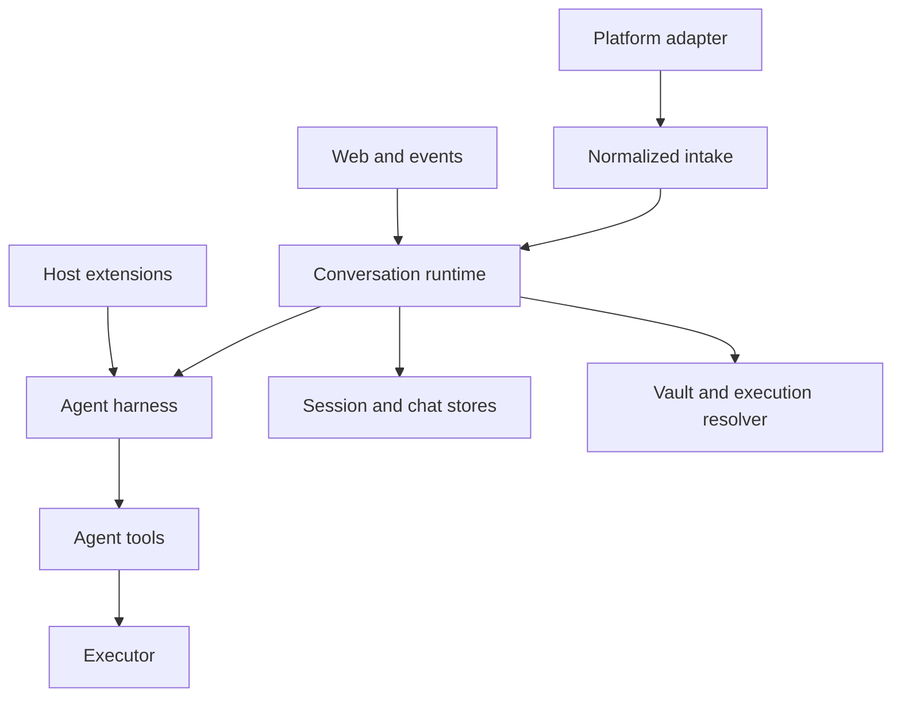

This page documents mikan's **architectural interfaces**: the contracts that cross a subsystem, process, persistence, or package boundary. It is not an inventory of every exported helper. A helper used only inside one subsystem is an implementation detail even when TypeScript currently marks it `export`.

## Stability levels

| Level            | Meaning                                                     | Compatibility expectation                                         |
| ---------------- | ----------------------------------------------------------- | ----------------------------------------------------------------- |
| Public           | Imported by npm consumers or extension authors              | Preserve or version deliberately                                  |
| Host integration | Used to embed the runtime or add a platform/runtime backend | Preserve while the integration exists                             |
| Wire / persisted | Stored on disk or sent across a process/network boundary    | Migrate explicitly; readers should tolerate supported older forms |
| Internal         | Connects modules inside the mikan CLI                       | May change with coordinated call sites and tests                  |

The package currently exposes more symbols than this policy intends because `src/index.ts` re-exports the entire harness. Treat the table below as the intended contract; see [Core simplification](/core-simplification/) for the migration.

## Boundary map



The runtime is the coordinator. Platforms must not know harness persistence, the harness must not know platform SDK objects, and tools must not know whether execution is local, containerized, or remote.

## 1. Package interface

The npm entry point is `@geminixiang/mikan`, implemented by `src/index.ts`.

### Supported entry-point groups

| Group             | Main symbols                                                                                          | Consumer                                                 |
| ----------------- | ----------------------------------------------------------------------------------------------------- | -------------------------------------------------------- |
| Runtime embedding | `createConversationRuntime`, `ConversationRuntime`, `ConversationRuntimeOptions`                      | A host that supplies platform and execution dependencies |
| Platform contract | `MessagingBot`, `ConversationEvent`, `ConversationContext`, `ConversationResponder`, `MessagingInfo`  | Platform adapters and embedders                          |
| Commands          | `CommandHandler`, `CommandContext`, `CommandServices`, `dispatchCommand`                              | Hosts adding deterministic commands                      |
| Execution         | `Executor`, `SandboxConfig`, `SandboxAdapter`, `createExecutor`, `parseSandboxArg`, `validateSandbox` | Runtime backends and hosts                               |
| Extensions        | `MikanExtensionApi`, hook/event types, subagent types                                                 | Trusted extension authors                                |
| Harness embedding | `MikanAgentSession`, `SessionStore`, `MikanModels`, settings and event-format functions               | Advanced embedders; not ordinary bot integrations        |

Importing a source path under `src/` or a generated path under `dist/` is unsupported. Only paths declared by package exports should be considered public. At present the package has no explicit `exports` map, so this is a documentation constraint rather than an enforced one.

## 2. Platform intake and response interface

Source: `src/types.ts` (re-exported by `src/adapter.ts`).

### `ConversationEvent`

The platform-neutral trigger delivered to `MessagingEventHandler`.

| Field                 | Contract                                                                                           |
| --------------------- | -------------------------------------------------------------------------------------------------- |
| `conversationId`      | Raw platform conversation/channel identifier; must not contain `:` because session keys reserve it |
| `conversationKind`    | `direct` or `shared`; affects session and credential policy                                        |
| `ts`                  | Triggering platform message identifier                                                             |
| `thread_ts`           | Optional parent/root platform message identifier                                                   |
| `user`                | Platform user identifier                                                                           |
| `text`                | Text after platform mention removal                                                                |
| `attachments`         | Files already downloaded to host paths                                                             |
| `sessionKey`          | Optional platform-selected override; otherwise derived by session policy                           |
| `vaultConversationId` | Optional alternate identity used only for credential routing                                       |

### `ConversationContext`

Carries the richer normalized message, response port, and platform metadata for the same run:

```ts
interface ConversationContext {
  message: ConversationMessage;
  responder: ConversationResponder;
  platform: MessagingInfo;
}
```

`ConversationMessage` and `ConversationEvent` currently duplicate message id, session, conversation kind, user, text, attachments, and thread identity. Adapters must keep both representations consistent. This is an internal compatibility seam, not a desirable model for new integrations.

### `ConversationResponder`

The runtime/harness output port. Required operations cover final text, replacement, diagnostics, tool status, typing/working state, file upload, and response deletion. Streaming (`appendResponseDelta`, `finishResponse`) and reaction (`react`) are optional capabilities.

Capability rule: callers must feature-detect optional methods. An adapter may buffer output or implement streaming natively, but it must preserve call order for a single run.

### `MessagingBot`

The host-facing platform port. It combines:

- lifecycle: `start()`;
- outbound messages: `postMessage`, `updateMessage`, optional upload/reaction/private replies;
- intake scheduling: `enqueueEvent`;
- discovery/policy: `getMessagingInfo()`.

`MessagingInfo.trustModel` is security-sensitive. `membership` permits the ambient shared-vault policy when the sandbox topology is isolated. An open trigger surface such as public GitHub activity must return `open-trigger`.

`ChatAdapter` is a smaller lifecycle-only interface (`start`, `stop`, `getMessagingInfo`) but the CLI uses `MessagingBot`. Do not implement both unless a caller explicitly requires `ChatAdapter`.

## 3. Runtime orchestration interface

Source: `src/runtime/types.ts` and `src/runtime/conversation-runtime.ts`.

`createConversationRuntime(options)` returns `ConversationRuntime`, the single owner of per-session serialization, command dispatch, runner caching, stop/reset behavior, idle eviction, and graceful shutdown.

### Input methods

| Method                               | Semantics                                                              |
| ------------------------------------ | ---------------------------------------------------------------------- |
| `handleEvent(event, bot, context)`   | Serialize by derived session key, then dispatch a command or agent run |
| `runSession(options)`                | Execute one already-serialized unit; intended for controlled host use  |
| `handleStop(...)` / `forceStop(...)` | Cooperative/user-visible stop versus immediate internal stop           |
| `handleNewCommand(...)`              | Abort, reset persisted session state, and discard the cached runner    |

### Control and inspection

| Method                                | Semantics                                                                     |
| ------------------------------------- | ----------------------------------------------------------------------------- |
| `isRunning(sessionKey)`               | Current in-process run state                                                  |
| `getRunningSessions()`                | Snapshot for admin/observability surfaces                                     |
| `switchConversationModel(...)`        | Update a cached runner; returns whether one existed                           |
| `refreshConversationEnvironment(...)` | Re-resolve a cached runner environment                                        |
| `shutdown(timeoutMs?)`                | Reject new work, stop runners, and wait for in-flight work up to the deadline |

`ConversationRuntimeOptions` supplies workspace/configuration fields, sandbox/resource services, optional portal token stores, optional commands, model registry, proactive platform operations, and platform tool-pack factories. Missing vault and portal stores degrade to disabled implementations; setting a portal URL without its store is an error when used.

Concurrency invariant: calls for one session key are serial; different session keys may run concurrently. A platform tool pack is therefore created per runner, never shared globally, because `bindRun` mutates its run binding.

## 4. Command interface

Sources: `src/commands/manifest.ts`, `src/commands/types.ts`, and `src/commands/registry.ts`.

`COMMAND_MANIFEST` is the platform-facing inventory used to derive slash forms and native registration. `CommandHandler.tryHandle(context)` is the execution contract. Handlers run in order and the first `true` result consumes the message.

Built-in commands run before extension commands. An unmatched slash-prefixed message is still a normal agent prompt. `stop` is a platform intake magic word, not a `CommandHandler`; `session` is the only accepted bare command.

`CommandContext` contains normalized actor/conversation identity, response and bot ports, command text, privacy state, and `CommandServices`. Command handlers must not reach into a platform SDK event.

## 5. Harness interface

Sources: `src/harness/index.ts`, `runner.ts`, `session-store.ts`, `models.ts`, and `types.ts`.

### `MikanAgentSession`

Owns the model turn loop, message persistence, retries, compaction, budget circuit breakers, extension hooks, and abort behavior. Its externally meaningful operations are prompt/run, subscribe, abort, session reload, model/thinking selection, and disposal.

### `SessionStore`

Owns version 3 append-only session JSONL and tree reconstruction. `SessionHeader.version` is currently `3` (`CURRENT_SESSION_VERSION`). Session entries may branch; consumers must use store/context helpers rather than assuming the file is a flat chat transcript.

### `MikanModels` and `FileCredentialStore`

`MikanModels` resolves built-in and custom `pi-ai` models. `FileCredentialStore` persists provider credentials in the state directory. Vault credentials are a different boundary: they are injected into tool execution, not used to authenticate the host-side model client.

### Harness events and budgets

Harness listeners observe model/tool lifecycle events. Budget settings cap tokens, cost, duration, and LLM calls. A budget trip aborts the run and emits `budget_exceeded`; it is a terminal outcome, not a retry signal.

## 6. Extension interface

Source: `src/harness/extensions/types.ts`. Full authoring examples are in [Extension development](/extension-development/).

An extension is trusted host code exporting `activate(api)`. It is activated per conversation harness instance and may return a disposer.

### `MikanExtensionApi`

| Surface                           | Contract                                                                               |
| --------------------------------- | -------------------------------------------------------------------------------------- |
| `on`                              | Register ordered hooks for prompt, tool, message, compaction, error, and budget events |
| `registerTool`                    | Add a `pi-agent-core` tool to this runner                                              |
| `registerCommand`                 | Add deterministic `/name` handling after built-ins                                     |
| `onDispose`                       | Release resources on reset, eviction, or shutdown; LIFO order                          |
| `context`                         | Read-only conversation/workspace/model identity                                        |
| `paths`                           | Conversation-private and explicitly shared host-only data directories                  |
| `secrets`                         | Read-only extension secrets by name                                                    |
| `schedules` / `triggerRun`        | Persist or fire autonomous event-file runs                                             |
| `subagent.run`                    | Fresh isolated run with explicit tools, schema, and budget                             |
| `notify` / `react` / `uploadFile` | Optional host platform capabilities                                                    |

Hook errors are logged and skipped. `before_agent_start` and `tool_result` rewrites chain; `tool_call` uses the first non-undefined result. A blocked pre-start hook prevents the model call and session persistence.

Extension schedules and immediate runs do not inherit conversation history. Their task text must be self-contained and must not contain secrets.

## 7. Tool and platform capability interface

Source: `src/tools/types.ts`.

Core tools use the executor and host services supplied by the runner. `EventStore` is the canonical CRUD port for event files. Invalid event JSON remains listable with `payload: null` so an admin can diagnose or delete it.

`PlatformToolPackFactory` creates a private `PlatformToolPack` per runner. `bindRun` selects whether its tools apply to the current platform/conversation. The factory boundary keeps GitHub-specific tools out of the core tool list while preventing cross-conversation mutable binding.

## 8. Sandbox and executor interface

Sources: `src/sandbox/types.ts` and `src/sandbox/index.ts`.

### `SandboxConfig`

### `Executor`

This is the stable execution boundary and the most important sandbox contract:

| Operation                     | Requirement                                                               |
| ----------------------------- | ------------------------------------------------------------------------- |
| `exec`                        | Return stdout, stderr, and exit code; honor timeout/abort where supported |
| `readFile` / `readFileBase64` | Transport content without adding shell parsing layers                     |
| `writeFile`                   | Stage and replace so an aborted write cannot truncate the target          |
| `getWorkspacePath`            | Map a host workspace root to the runtime-visible root                     |
| `getPathContext`              | Declare host/runtime path semantics and optional reverse mapping          |
| `getSandboxConfig`            | Return the concrete configuration in use                                  |

Remote/exec-only implementations share base64-chunked file transport. Tool implementations must call executor file methods instead of building `cat`, `printf`, or quoting protocols.

### `SandboxAdapter`

An adapter recognizes one CLI value, optionally validates it, and optionally creates an executor. `image` deliberately has no direct executor: actor/vault resolution provisions a concrete container first.

Although the type is exported, adapter registration is currently a closed list inside `src/sandbox/index.ts`; external consumers cannot add an adapter to `parseSandboxArg` or `createExecutor`.

## 9. Vault and execution-resolution interface

Source: `src/vault/types.ts`; policy is in `src/vault/policy.ts`.

`VaultManager` resolves credential env and mount files by canonical actor key, lists and mutates private/shared vaults, and reports whether storage is enabled. Secrets live under the host-only state directory.

Credential flow is:

1. Runtime supplies platform trust, conversation, user, and sandbox topology.
2. The execution resolver selects the actor/vault identity.
3. `VaultManager` resolves env and mounts.
4. The concrete executor receives only the credentials intended for that runtime.

Host sandbox execution never receives vault injection. Open-trigger platforms never receive an ambient shared vault. These are security invariants, not convenience defaults.

## 10. Session, chat, and identity interfaces

Sources: `src/sessions/*`, `src/store.ts`, and `src/sandbox/identity.ts`.

There are two intentional records:

| Record                            | Purpose                                                             |
| --------------------------------- | ------------------------------------------------------------------- |
| `<conversation>/log.jsonl`        | Platform truth: user/bot messages and attachments                   |
| `<conversation>/sessions/*.jsonl` | Agent truth: prompts, model/tool messages, branches, and compaction |

Do not merge them. Chat history can rebuild a missing top-level agent session, while agent sessions contain data that never appeared on the platform.

Session keys use `conversationId[:suffix]`; only `src/sessions/session-key.ts` owns this grammar. Callers must use `deriveSessionKey`, `conversationIdOf`, and `threadSuffixOf`, never split strings directly.

`ChatHistorySync` resolves top-level/thread scope, bootstraps new sessions, synchronizes new platform log entries, resets sessions, and coordinates a thread waiting for an active parent run to seal.

## 11. Event-file interface

Source: `src/harness/event-format.ts`.

`events/*.json` is a workspace-level scheduling bus. The canonical union is:

```ts
type EventFilePayload =
  | { type: "immediate"; conversationId: string; text: string /* common optional fields */ }
  | { type: "one-shot"; conversationId: string; text: string; at: string }
  | { type: "periodic"; conversationId: string; text: string; schedule: string; timezone: string };
```

Common optional fields are `platform`, `conversationKind`, and `userId`. `channelId` is accepted only as a legacy read alias. All writers use `buildEventPayload`; all readers use `parseEventPayload`.

The bus is shared and agent-writable by design. Ownership prefixes are cooperative, not an authorization boundary.

## 12. Persisted filesystem interface

| Path                                               | Owner                    | Visibility / compatibility           |
| -------------------------------------------------- | ------------------------ | ------------------------------------ |
| `<state-dir>/settings.json`                        | config                   | Host-only global settings            |
| `<state-dir>/conversations/<id>/settings.json`     | config/admin             | Host-only conversation overrides     |
| `<state-dir>/auth.json`                            | harness credential store | Host-only model-provider credentials |
| `<state-dir>/models.json`                          | harness model catalog    | Host-only custom providers/models    |
| `<state-dir>/vaults/**`                            | vault/login              | Host-only secrets and mount files    |
| `<state-dir>/{global,conversations}/**/extensions` | extension loader         | Trusted host code                    |
| `<workspace>/MEMORY.md`                            | agent/user               | Sandbox-visible durable memory       |
| `<workspace>/skills/**/SKILL.md`                   | skills                   | Sandbox-visible prompt instructions  |
| `<workspace>/events/*.json`                        | event store/watcher      | Shared scheduling wire format        |
| `<workspace>/<id>/log.jsonl`                       | platform store           | Append-only platform history         |
| `<workspace>/<id>/sessions/*.jsonl`                | session store            | Versioned append-only agent history  |

The state directory must not be inside the sandbox-visible workspace. Important state files use atomic private writes; append-only logs use append semantics.

## 13. HTTP interface

Source: `src/web/server.ts` and portal modules. These routes support mikan's bundled UI; they are not a general public REST API.

| Surface        | Routes                                                                                 | Authentication model                    |
| -------------- | -------------------------------------------------------------------------------------- | --------------------------------------- |
| Health         | `GET /health`                                                                          | None; returns `{ "ok": true }`          |
| Login          | `GET /link`, `POST /api/link/complete`, `POST /api/oauth/start`, `GET /oauth/callback` | Short-lived link token plus OAuth state |
| Session viewer | `GET /session`, `GET /session/stream`, optional `POST /session/message`                | Session-view token                      |
| Admin          | `GET /admin`, `/admin/api/*`                                                           | Admin token                             |
| Agent events   | `GET /api/agent-events/stream`                                                         | Deployment-controlled event stream      |

Admin endpoints cover conversation inventory/state/usage, global and conversation settings, models, workspace files, skills, events, platform configuration, and login/session links. Route payloads are internal UI contracts and may evolve together with the bundled frontend.

The stable concepts are runtime spec and handle identity, worker registration/heartbeat, leased placement, exec sessions, file transport, and runtime lifecycle. Lease watermarks fence stale workers during failover. Wire changes must be versioned or deployed compatibly across controller, gateway, and workers.

## Contract checklist

When changing a boundary, verify:

1. Is it public, host integration, persisted/wire, or internal?
2. Does the change alter identity, trust, path, concurrency, or lifecycle semantics?
3. Do producers and consumers share one canonical parser/builder/type?
4. Does old persisted data still load, or is there an explicit migration?
5. Are optional capabilities feature-detected?
6. Can the implementation be moved behind an existing port instead of expanding the core contract?
