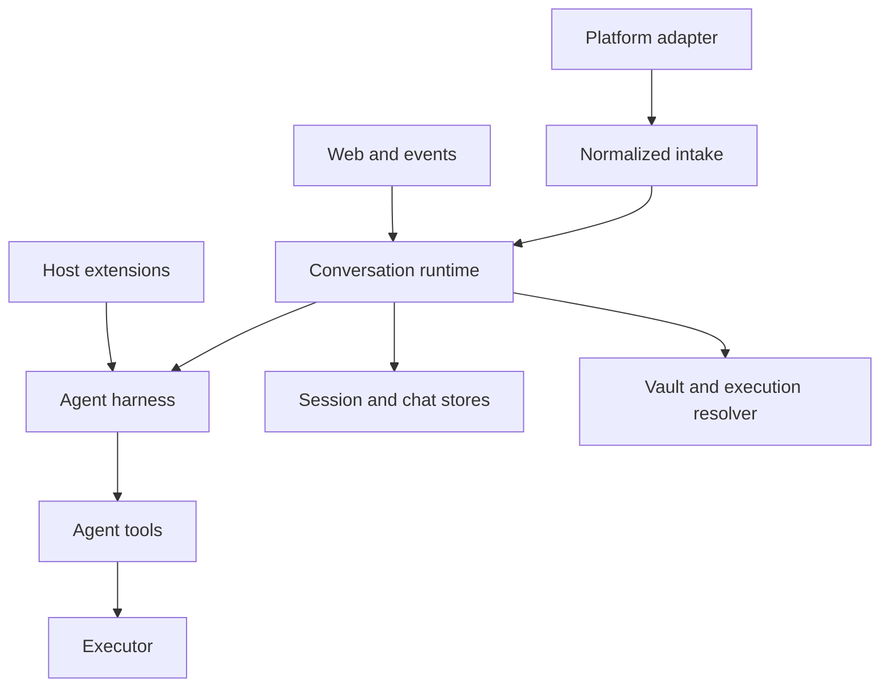

This page documents mikan's **architectural interfaces**: the contracts that cross a subsystem, process, persistence, or package boundary. It is not an inventory of every exported helper. A helper used only inside one subsystem is an implementation detail even when TypeScript currently marks it `export`.

## Stability levels

| Level            | Meaning                                                     | Compatibility expectation                                         |
| ---------------- | ----------------------------------------------------------- | ----------------------------------------------------------------- |
| Public           | Imported by npm consumers or extension authors              | Preserve or version deliberately                                  |
| Host integration | Used to embed the runtime or add a platform/runtime backend | Preserve while the integration exists                             |
| Wire / persisted | Stored on disk or sent across a process/network boundary    | Migrate explicitly; readers should tolerate supported older forms |
| Internal         | Connects modules inside the mikan CLI                       | May change with coordinated call sites and tests                  |

The package currently exposes more symbols than this policy intends because `src/index.ts` re-exports the entire harness. Treat the table below as the intended contract; see [Core simplification](/core-simplification/) for the migration.

## Boundary map



The runtime is the coordinator. Platforms must not know harness persistence, the harness must not know platform SDK objects, and tools must not know whether execution is local, containerized, or remote.

## Maintainer ownership and seam register

The following six owner scopes are the long-lived division of responsibility. An owner may change its implementation freely behind its ports, but changing a port requires updating both sides and the contract tests named below. These scopes describe code ownership, not process or privilege isolation.

| Owner scope            | Primary modules                                                                           | Owns                                                                                                                                              | Hands off                                                                                                |
| ---------------------- | ----------------------------------------------------------------------------------------- | ------------------------------------------------------------------------------------------------------------------------------------------------- | -------------------------------------------------------------------------------------------------------- |
| **Platform entry**     | `src/adapters/`, `src/types.ts`                                                           | SDK normalization, intake ordering, platform response transport, and `MessagingInfo` including `trustModel`                                       | Platform-neutral `ConversationEvent`, `ConversationContext`, and capability ports                        |
| **Runtime/session**    | `src/runtime/`, `src/sessions/`, `src/store.ts`                                           | Session-key grammar, per-session serialization, chat/session synchronization, runner lifecycle, stop/reset, and shutdown                          | Validated events to the runner; workspace and actor inputs to execution resolution                       |
| **Harness/tools**      | `src/harness/`, `src/tools/`, `src/agent.ts`                                              | Model turns, session-tree persistence, extension hooks, budgets, tool schemas, and host capability calls                                          | `ConversationResponder` output and `Executor` operations; it does not receive platform SDK objects       |
| **Sandbox/workspace**  | `src/sandbox/`, `src/workspace-projection/`, `src/provisioner.ts`                         | Executor implementations, mount topology, runtime/host path context, resource lifecycle, and file transport                                       | A concrete `Executor` with declared path and credential capabilities                                     |
| **Vault/web/security** | `src/vault/`, `src/web/`, `src/execution-resolver.ts`, `src/sandbox/identity.ts`          | Credential identity and injection policy, host-only portal/token surfaces, mount collision checks, and security-sensitive authorization decisions | Actor/trust inputs to vault policy; credentials only to the selected executor                            |
| **Config/CLI/package** | `src/config.ts`, `src/settings-mutation.ts`, `src/cli/`, `src/commands/`, `src/packages/` | Boot/flag grammar, settings persistence, the command manifest, package materialization and scope resolution                                       | Effective settings, deterministic command inventory, extension roots, and read-only package skill mounts |

A conversation harness instance is context-isolated from other instances, but that is not a filesystem or process sandbox: extensions run in the mikan host process with host privileges, and `sharedDataDir` is explicitly multi-conversation data that its author must partition. Likewise, a sandbox executor changes where tools run and what mounts they receive; `host` mode and a `full` workspace projection are not additional security guarantees. Keep these concerns separate when reviewing a seam.

### Cross-owner seams

The producer/consumer pairs below are the supported bridges. The named producer owns the representation and ordering; the consumer must use the port or canonical parser rather than reconstructing it.

| Seam                      | Producer → consumer                                                                    | Invariants, ordering, and failure behavior                                                                                                                                                                                                                                                                                                                   |
| ------------------------- | -------------------------------------------------------------------------------------- | ------------------------------------------------------------------------------------------------------------------------------------------------------------------------------------------------------------------------------------------------------------------------------------------------------------------------------------------------------------ |
| Platform intake           | Platform entry → Runtime/session                                                       | Intake order is **magic word → trigger policy → attachments → log → busy policy → queue → dispatch**. `stop` bypasses trigger policy, attachment work, and queueing. Invalid conversation or foreign session identity fails before queueing; attachment failures propagate.                                                                                  |
| Session identity          | Platform entry / Runtime/session → Runtime/session, harness, and stores                | `src/sessions/session-key.ts` owns `conversationId[:suffix]`. A platform override is accepted only when it belongs to the conversation; otherwise derivation throws. No consumer splits session keys directly.                                                                                                                                               |
| Command inventory         | Config/CLI/package → Platform entry, Runtime/session, and web/session view             | `COMMAND_MANIFEST` is the single inventory. Built-ins run before extension commands; unmatched slash text remains an agent prompt; `stop` is a magic word, not a handler.                                                                                                                                                                                    |
| Runtime to harness        | Runtime/session → Harness/tools                                                        | `handleEvent` derives the key and serializes one key while allowing other keys to run concurrently. Thread bootstrap waits for a running parent session to seal. A platform tool pack is created per runner because `bindRun` is mutable.                                                                                                                    |
| Run output                | Harness/tools → Platform entry                                                         | Optional responder capabilities are feature-detected. For one run, response operations retain call order; adapters may buffer or stream, but must not expose harness persistence or SDK objects to the harness.                                                                                                                                              |
| Runtime ↔ sandbox path    | Runtime/session → Sandbox/workspace → Harness/tools                                    | Runtime supplies the host workspace and a runtime cwd; the executor supplies `getWorkspacePath`/`getPathContext`. Prompts and tool output use runtime paths, while host-side attachment translation uses the declared context. Paths outside the mapped root are not translated. This is a path contract, not a claim of filesystem isolation.               |
| Executor file transport   | Sandbox/workspace → Harness/tools                                                      | Tools use `Executor.readFile`/`writeFile`, never shell quoting protocols. Exec-only transports use the shared base64-chunked implementation; writes stage and rename, and transport errors remain errors.                                                                                                                                                    |
| Trust and vault           | Platform entry → Runtime/session → Vault/web/security → Sandbox/workspace              | `MessagingInfo.trustModel` is passed into actor resolution; vault policy is keyed to that value, not platform-name strings. Omitted trust defaults to `membership`; `open-trigger` never receives an ambient shared-vault copy, and only `image`/`cloudflare` use that ambient path. Explicit vault provisioning remains a separate administrative decision. |
| Settings and live runners | Config/CLI/package (commands and admin are adapters) → config disk and Runtime/session | `applyConversationSettings` clears the cached runner **before** writing an LLM change and refuses both actions while busy. Global LLM settings write first, then clear idle runners and report busy conversations as stale. Sandbox limits/mount and Slack reply settings are re-read at use time and do not clear runners.                                  |
| Package resolution        | Config/CLI/package → Harness/tools and Sandbox/workspace                               | Global and conversation package lists are additive; the narrower scope wins for one `sourceIdentity`, and deduplication happens before import. Conversation loads are offline and cannot block on a remote; package code stays host-only, while package skills mount read-only outside `/workspace`.                                                         |
| Web capability bridge     | Vault/web/security → Runtime/session and commands                                      | Portal stores are optional runtime services. A portal URL without its backing store fails when that portal is used; absent stores otherwise produce disabled/not-configured behavior. Route payloads are bundled-UI contracts, not a general REST API.                                                                                                       |
| Event scheduling bus      | Harness/tools → Runtime/session via `events/*.json`                                    | Writers use `buildEventPayload`; readers use `parseEventPayload`. The bus is workspace-wide and agent-writable by design. Ownership prefixes are cooperative, never authorization; secrets do not belong in event text.                                                                                                                                      |
| History persistence       | Platform entry → `log.jsonl`; Runtime/session and Harness/tools → session JSONL        | Platform truth and agent truth remain separate. Session JSONL is a versioned tree, not a flat transcript; malformed session headers throw rather than silently replacing history.                                                                                                                                                                            |

These bridges deliberately distinguish context isolation from sandboxing. A new owner must not infer credential authorization from a path, infer platform trust from a platform name, or make a shared event/package directory into an authorization boundary.

## 1. Package interface

The npm entry point is `@geminixiang/mikan`, implemented by `src/index.ts`.

### Supported entry-point groups

| Group             | Main symbols                                                                                          | Consumer                                                 |
| ----------------- | ----------------------------------------------------------------------------------------------------- | -------------------------------------------------------- |
| Runtime embedding | `createConversationRuntime`, `ConversationRuntime`, `ConversationRuntimeOptions`                      | A host that supplies platform and execution dependencies |
| Platform contract | `MessagingBot`, `ConversationEvent`, `ConversationContext`, `ConversationResponder`, `MessagingInfo`  | Platform adapters and embedders                          |
| Commands          | `CommandHandler`, `CommandContext`, `CommandServices`, `dispatchCommand`                              | Hosts adding deterministic commands                      |
| Execution         | `Executor`, `SandboxConfig`, `SandboxAdapter`, `createExecutor`, `parseSandboxArg`, `validateSandbox` | Runtime backends and hosts                               |
| Extensions        | `MikanExtensionApi`, hook/event types, subagent types                                                 | Trusted extension authors                                |
| Harness embedding | `MikanAgentSession`, `SessionStore`, `MikanModels`, settings and event-format functions               | Advanced embedders; not ordinary bot integrations        |

Only paths declared by the package `exports` map are public. Importing any other generated `dist/` path or a source path under `src/` is unsupported.

## 2. Platform intake and response interface

Source: `src/types.ts` (re-exported by `src/adapter.ts`).

### `ConversationEvent`

The platform-neutral trigger delivered to `MessagingEventHandler`.

| Field                 | Contract                                                                                           |
| --------------------- | -------------------------------------------------------------------------------------------------- |
| `conversationId`      | Raw platform conversation/channel identifier; must not contain `:` because session keys reserve it |
| `conversationKind`    | `direct` or `shared`; affects session and credential policy                                        |
| `ts`                  | Triggering platform message identifier                                                             |
| `thread_ts`           | Optional parent/root platform message identifier                                                   |
| `user`                | Platform user identifier                                                                           |
| `text`                | Text after platform mention removal                                                                |
| `attachments`         | Files already downloaded to host paths                                                             |
| `sessionKey`          | Optional platform-selected override; otherwise derived by session policy                           |
| `vaultConversationId` | Optional alternate identity used only for credential routing                                       |

### `ConversationContext`

Carries the richer normalized message, response port, and platform metadata for the same run:

```ts
interface ConversationContext {
  message: ConversationMessage;
  responder: ConversationResponder;
  platform: MessagingInfo;
}
```

`ConversationMessage` and `ConversationEvent` currently duplicate message id, session, conversation kind, user, text, attachments, and thread identity. Adapters must keep both representations consistent. This is an internal compatibility seam, not a desirable model for new integrations.

### `ConversationResponder`

The runtime/harness output port. Required operations cover final text, replacement, diagnostics, tool status, typing/working state, file upload, and response deletion. Streaming (`appendResponseDelta`, `finishResponse`) and reaction (`react`) are optional capabilities.

Capability rule: callers must feature-detect optional methods. An adapter may buffer output or implement streaming natively, but it must preserve call order for a single run.

### `MessagingBot`

The host-facing platform port. It combines:

- lifecycle: `start()`;
- outbound messages: `postMessage`, `updateMessage`, optional upload/reaction/private replies;
- intake scheduling: `enqueueEvent`;
- discovery/policy: `getMessagingInfo()`.

`MessagingInfo.trustModel` is security-sensitive. `membership` permits the ambient shared-vault policy when the sandbox topology is isolated. An open trigger surface such as public GitHub activity must return `open-trigger`.

`ChatAdapter` is a smaller lifecycle-only interface (`start`, `stop`, `getMessagingInfo`) but the CLI uses `MessagingBot`. Do not implement both unless a caller explicitly requires `ChatAdapter`.

## 3. Runtime orchestration interface

Source: `src/runtime/types.ts` and `src/runtime/conversation-runtime.ts`.

`createConversationRuntime(options)` returns `ConversationRuntime`, the single owner of per-session serialization, command dispatch, runner caching, stop/reset behavior, idle eviction, and graceful shutdown.

### Input methods

| Method                               | Semantics                                                              |
| ------------------------------------ | ---------------------------------------------------------------------- |
| `handleEvent(event, bot, context)`   | Serialize by derived session key, then dispatch a command or agent run |
| `runSession(options)`                | Execute one already-serialized unit; intended for controlled host use  |
| `handleStop(...)` / `forceStop(...)` | Cooperative/user-visible stop versus immediate internal stop           |
| `handleNewCommand(...)`              | Abort, reset persisted session state, and discard the cached runner    |

### Control and inspection

| Method                                | Semantics                                                                     |
| ------------------------------------- | ----------------------------------------------------------------------------- |
| `isRunning(sessionKey)`               | Current in-process run state                                                  |
| `getRunningSessions()`                | Snapshot for admin/observability surfaces                                     |
| `switchConversationModel(...)`        | Update a cached runner; returns whether one existed                           |
| `refreshConversationEnvironment(...)` | Re-resolve a cached runner environment                                        |
| `shutdown(timeoutMs?)`                | Reject new work, stop runners, and wait for in-flight work up to the deadline |

`ConversationRuntimeOptions` supplies workspace/configuration fields, sandbox/resource services, optional portal token stores, optional commands, model registry, proactive platform operations, and platform tool-pack factories. Missing vault and portal stores degrade to disabled implementations; setting a portal URL without its store is an error when used.

Concurrency invariant: calls for one session key are serial; different session keys may run concurrently. A platform tool pack is therefore created per runner, never shared globally, because `bindRun` mutates its run binding.

## 4. Command interface

Sources: `src/commands/manifest.ts`, `src/commands/types.ts`, and `src/commands/registry.ts`.

`COMMAND_MANIFEST` is the platform-facing inventory used to derive slash forms and native registration. `CommandHandler.tryHandle(context)` is the execution contract. Handlers run in order and the first `true` result consumes the message.

Built-in commands run before extension commands. An unmatched slash-prefixed message is still a normal agent prompt. `stop` is a platform intake magic word, not a `CommandHandler`; `session` is the only accepted bare command.

`CommandContext` contains normalized actor/conversation identity, response and bot ports, command text, privacy state, and `CommandServices`. Command handlers must not reach into a platform SDK event.

## 5. Harness interface

Sources: `src/harness/index.ts`, `runner.ts`, `session-store.ts`, `models.ts`, and `types.ts`.

### `MikanAgentSession`

Owns the model turn loop, message persistence, retries, compaction, budget circuit breakers, extension hooks, and abort behavior. Its externally meaningful operations are prompt/run, subscribe, abort, session reload, model/thinking selection, and disposal.

### `SessionStore`

Owns version 3 append-only session JSONL and tree reconstruction. `SessionHeader.version` is currently `3` (`CURRENT_SESSION_VERSION`). Session entries may branch; consumers must use store/context helpers rather than assuming the file is a flat chat transcript.

### `MikanModels` and `FileCredentialStore`

`MikanModels` resolves built-in and custom `pi-ai` models. `FileCredentialStore` persists provider credentials in the state directory. Vault credentials are a different boundary: they are injected into tool execution, not used to authenticate the host-side model client.

### Harness events and budgets

Harness listeners observe model/tool lifecycle events. Budget settings cap tokens, cost, duration, and LLM calls. A budget trip aborts the run and emits `budget_exceeded`; it is a terminal outcome, not a retry signal.

## 6. Extension interface

Source: `src/harness/extensions/types.ts`. Full authoring examples are in [Extension development](/extension-development/).

An extension is trusted host code exporting `activate(api)`. It is activated per conversation harness instance and may return a disposer.

### `MikanExtensionApi`

| Surface                           | Contract                                                                               |
| --------------------------------- | -------------------------------------------------------------------------------------- |
| `on`                              | Register ordered hooks for prompt, tool, message, compaction, error, and budget events |
| `registerTool`                    | Add a `pi-agent-core` tool to this runner                                              |
| `registerCommand`                 | Add deterministic `/name` handling after built-ins                                     |
| `onDispose`                       | Release resources on reset, eviction, or shutdown; LIFO order                          |
| `context`                         | Read-only conversation/workspace/model identity                                        |
| `paths`                           | Conversation-private and explicitly shared host-only data directories                  |
| `secrets`                         | Read-only extension secrets by name                                                    |
| `schedules` / `triggerRun`        | Persist or fire autonomous event-file runs                                             |
| `subagent.run`                    | Fresh isolated run with explicit tools, schema, and budget                             |
| `notify` / `react` / `uploadFile` | Optional host platform capabilities                                                    |

Hook errors are logged and skipped. `before_agent_start` and `tool_result` rewrites chain; `tool_call` uses the first non-undefined result. A blocked pre-start hook prevents the model call and session persistence.

Extension schedules and immediate runs do not inherit conversation history. Their task text must be self-contained and must not contain secrets.

## 7. Tool and platform capability interface

Source: `src/tools/types.ts`.

Core tools use the executor and host services supplied by the runner. `EventStore` is the canonical CRUD port for event files. Invalid event JSON remains listable with `payload: null` so an admin can diagnose or delete it.

`PlatformToolPackFactory` creates a private `PlatformToolPack` per runner. `bindRun` selects whether its tools apply to the current platform/conversation. The factory boundary keeps GitHub-specific tools out of the core tool list while preventing cross-conversation mutable binding.

## 8. Sandbox and executor interface

Sources: `src/sandbox/types.ts` and `src/sandbox/index.ts`.

### `SandboxConfig`

The discriminated union currently supports `host`, `container`, `image`, `gondolin`, `firecracker`, and `cloudflare`. Parsing syntax and maturity are documented under [Sandbox](/sandbox/).

### `Executor`

This is the stable execution boundary and the most important sandbox contract:

| Operation                     | Requirement                                                               |
| ----------------------------- | ------------------------------------------------------------------------- |
| `exec`                        | Return stdout, stderr, and exit code; honor timeout/abort where supported |
| `readFile` / `readFileBase64` | Transport content without adding shell parsing layers                     |
| `writeFile`                   | Stage and replace so an aborted write cannot truncate the target          |
| `getWorkspacePath`            | Map a host workspace root to the runtime-visible root                     |
| `getPathContext`              | Declare host/runtime path semantics and optional reverse mapping          |
| `getSandboxConfig`            | Return the concrete configuration in use                                  |

Remote/exec-only implementations share base64-chunked file transport. Tool implementations must call executor file methods instead of building `cat`, `printf`, or quoting protocols.

### `SandboxAdapter`

An adapter recognizes one CLI value, optionally validates it, and optionally creates an executor. `image` deliberately has no direct executor: actor/vault resolution provisions a concrete container first.

Although the type is exported, adapter registration is currently a closed list inside `src/sandbox/index.ts`; external consumers cannot add an adapter to `parseSandboxArg` or `createExecutor`.

## 9. Vault and execution-resolution interface

Source: `src/vault/types.ts`; policy is in `src/vault/policy.ts`.

`VaultManager` resolves credential env and mount files by canonical actor key, lists and mutates private/shared vaults, and reports whether storage is enabled. Secrets live under the host-only state directory.

Credential flow is:

1. Runtime supplies platform trust, conversation, user, and sandbox topology.
2. The execution resolver selects the actor/vault identity.
3. `VaultManager` resolves env and mounts.
4. The concrete executor receives only the credentials intended for that runtime.

Host sandbox execution never receives vault injection. Open-trigger platforms never receive an ambient shared vault. These are security invariants, not convenience defaults.

## 10. Session, chat, and identity interfaces

Sources: `src/sessions/*`, `src/store.ts`, and `src/sandbox/identity.ts`.

There are two intentional records:

| Record                            | Purpose                                                             |
| --------------------------------- | ------------------------------------------------------------------- |
| `<conversation>/log.jsonl`        | Platform truth: user/bot messages and attachments                   |
| `<conversation>/sessions/*.jsonl` | Agent truth: prompts, model/tool messages, branches, and compaction |

Do not merge them. Chat history can rebuild a missing top-level agent session, while agent sessions contain data that never appeared on the platform.

Session keys use `conversationId[:suffix]`; only `src/sessions/session-key.ts` owns this grammar. Callers must use `deriveSessionKey`, `conversationIdOf`, and `threadSuffixOf`, never split strings directly.

`ChatHistorySync` resolves top-level/thread scope, bootstraps new sessions, synchronizes new platform log entries, resets sessions, and coordinates a thread waiting for an active parent run to seal.

## 11. Event-file interface

Source: `src/harness/event-format.ts`.

`events/*.json` is a workspace-level scheduling bus. The canonical union is:

```ts
type EventFilePayload =
  | { type: "immediate"; conversationId: string; text: string /* common optional fields */ }
  | { type: "one-shot"; conversationId: string; text: string; at: string }
  | { type: "periodic"; conversationId: string; text: string; schedule: string; timezone: string };
```

Common optional fields are `platform`, `conversationKind`, and `userId`. `channelId` is accepted only as a legacy read alias. All writers use `buildEventPayload`; all readers use `parseEventPayload`.

The bus is shared and agent-writable by design. Ownership prefixes are cooperative, not an authorization boundary.

## 12. Persisted filesystem interface

| Path                                               | Owner                    | Visibility / compatibility           |
| -------------------------------------------------- | ------------------------ | ------------------------------------ |
| `<state-dir>/settings.json`                        | config                   | Host-only global settings            |
| `<state-dir>/conversations/<id>/settings.json`     | config/admin             | Host-only conversation overrides     |
| `<state-dir>/auth.json`                            | harness credential store | Host-only model-provider credentials |
| `<state-dir>/models.json`                          | harness model catalog    | Host-only custom providers/models    |
| `<state-dir>/vaults/**`                            | vault/login              | Host-only secrets and mount files    |
| `<state-dir>/{global,conversations}/**/extensions` | extension loader         | Trusted host code                    |
| `<workspace>/MEMORY.md`                            | agent/user               | Sandbox-visible durable memory       |
| `<workspace>/skills/**/SKILL.md`                   | skills                   | Sandbox-visible prompt instructions  |
| `<workspace>/events/*.json`                        | event store/watcher      | Shared scheduling wire format        |
| `<workspace>/<id>/log.jsonl`                       | platform store           | Append-only platform history         |
| `<workspace>/<id>/sessions/*.jsonl`                | session store            | Versioned append-only agent history  |

The state directory must not be inside the sandbox-visible workspace. Important state files use atomic private writes; append-only logs use append semantics.

## 13. HTTP interface

Source: `src/web/server.ts` and portal modules. These routes support mikan's bundled UI; they are not a general public REST API.

| Surface        | Routes                                                                                 | Authentication model                    |
| -------------- | -------------------------------------------------------------------------------------- | --------------------------------------- |
| Health         | `GET /health`                                                                          | None; returns `{ "ok": true }`          |
| Login          | `GET /link`, `POST /api/link/complete`, `POST /api/oauth/start`, `GET /oauth/callback` | Short-lived link token plus OAuth state |
| Session viewer | `GET /session`, `GET /session/stream`, optional `POST /session/message`                | Session-view token                      |
| Admin          | `GET /admin`, `/admin/api/*`                                                           | Admin token                             |
| Agent events   | `GET /api/agent-events/stream`                                                         | Deployment-controlled event stream      |

Admin endpoints cover conversation inventory/state/usage, global and conversation settings, models, workspace files, skills, events, platform configuration, and login/session links. Route payloads are internal UI contracts and may evolve together with the bundled frontend.

## 14. Gondolin process boundary

`gondolin:default` creates and owns one local VM per conversation in the mikan process. Commands use a per-command Gondolin session IPC connection so abort/timeout closes the guest command rather than merely abandoning a host promise. Runtimes are intentionally process-lifetime state: orderly shutdown syncs projected files back and closes the VMs; restart begins cold. There is no network worker protocol or remote placement contract.

## Contract-test matrix

These suites protect the cross-owner contracts rather than individual helpers. When a seam changes, run every suite in its row together; if a change crosses rows, run the union. A public, persisted, or wire change also requires the full `npm test` run.

| Contract row                                          | Tests to run together                                                                                                                                                                         | What the row protects                                                                                                                                   |
| ----------------------------------------------------- | --------------------------------------------------------------------------------------------------------------------------------------------------------------------------------------------- | ------------------------------------------------------------------------------------------------------------------------------------------------------- |
| Platform intake, response, and command inventory      | `test/adapters-intake.test.ts`, `test/slack-context.test.ts`, `test/discord-context.test.ts`, `test/telegram-context.test.ts`, `test/github-context.test.ts`, `test/command-manifest.test.ts` | Normalized event/context identity, magic-word and busy ordering, attachment handoff, responder capabilities, and one command inventory across platforms |
| Session identity and runtime ordering                 | `test/session-key.test.ts`, `test/session-runtime.test.ts`, `test/chat-history-sync.test.ts`, `test/session-store.test.ts`, `test/harness-session-store.test.ts`                              | Session ownership/path validation, per-key serialization, parent-thread bootstrap, chat/session separation, and v3 session-tree compatibility           |
| Harness, tools, and extension capabilities            | `test/harness-runner.test.ts`, `test/harness-extensions.test.ts`, `test/subagent-runner.test.ts`, `test/subagent-tool.test.ts`, `test/agent-runner.test.ts`                                   | Run lifecycle, persistence, hook/error semantics, bounded delegated runs, and the runner-to-tool seam                                                   |
| Runtime, workspace projection, and executor transport | `test/execution-resolver.test.ts`, `test/sandbox-path-context.test.ts`, `test/executor-files.test.ts`, `test/agent-prompt.test.ts`, `test/agent-attachments.test.ts`                          | Host/runtime path mapping, mount composition and collision failures, credential-capability errors, and shell-hostile file round trips                   |
| Trust, vault, and portal security                     | `test/vault-policy.test.ts`, `test/vault.test.ts`, `test/login.test.ts`, `test/oauth-link-server.test.ts`, `test/token-store.test.ts`                                                         | `trustModel` policy, identity-key lookup, explicit credential provisioning, login/OAuth token boundaries, and disabled portal behavior                  |
| Settings and live-runner cache                        | `test/settings-mutation.test.ts`, `test/config.test.ts`, `test/model-command.test.ts`, `test/sandbox-command.test.ts`, `test/admin-portal.test.ts`                                            | Writer-seam ordering, leaf-level settings merge, busy/stale outcomes, and command/admin agreement with disk and cached runners                          |
| Packages, extensions, and read-only skill mounts      | `test/packages-source.test.ts`, `test/packages-resolve.test.ts`, `test/packages-mounts.test.ts`, `test/packages-admin.test.ts`, `test/ext-cli.test.ts`                                        | Source identity, scope precedence, offline loading, materialization-before-persist, host-only extension code, and runtime skill mount paths             |
| Event-file scheduling wire format                     | `test/event-format.test.ts`, `test/event-tool.test.ts`, `test/events.test.ts`                                                                                                                 | Builder/parser compatibility, legacy reads, queue-full behavior, routing, and deletion/retention ordering                                               |
| Public package boundary                               | `test/public-api.test.ts`, `test/embedder-example.test.ts`, `test/boot.test.ts`                                                                                                               | Export-map consumers, embedding construction, and CLI boot/flag grammar                                                                                 |

For a focused run, pass the exact files to Vitest, for example:

```sh
npm test -- test/session-key.test.ts test/session-runtime.test.ts test/chat-history-sync.test.ts test/session-store.test.ts test/harness-session-store.test.ts
```

## Change protocol

Before changing a seam, classify it as `Public`, `Host integration`, `Wire / persisted`, or `Internal`. Then verify:

1. The producer and consumer still use the same canonical type, parser, builder, or port.
2. Identity, trust, path, concurrency, lifecycle, and ordering semantics are stated in this page and covered by the corresponding contract row.
3. Older supported persisted data still loads, or the change includes an explicit migration and reader compatibility.
4. Optional capabilities remain feature-detected; an absent optional method is not treated as a failed required operation.
5. Errors fail at the owning boundary: invalid identity before queueing, malformed state without silent replacement, busy settings without a disk/cache split, and unsafe credential or mount resolution without a fallback escalation.
6. The implementation can remain behind an existing port instead of expanding a cross-owner contract.

Do not use context isolation as a synonym for sandboxing, and do not turn cooperative ownership conventions (event prefixes, package slugs, or shared directories) into claims of authorization. Update this page when a supported producer, consumer, invariant, or contract-test row changes.
