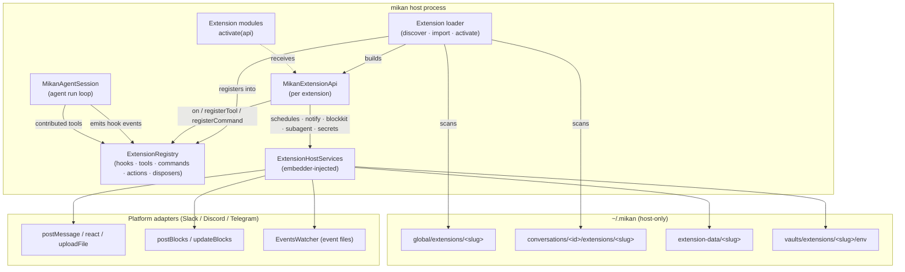
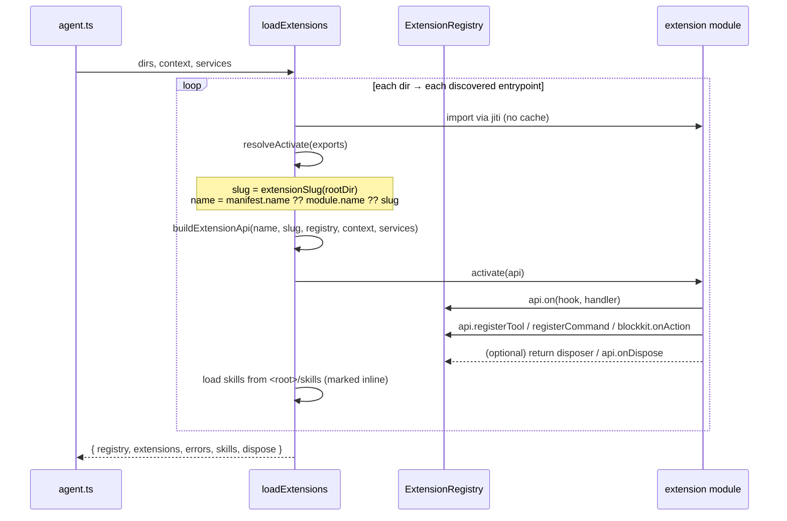
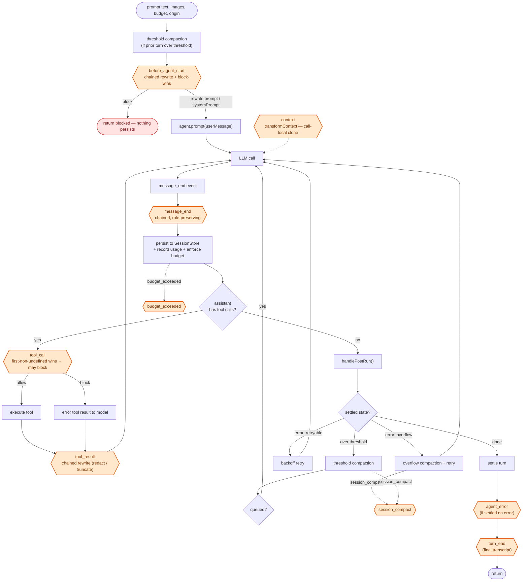
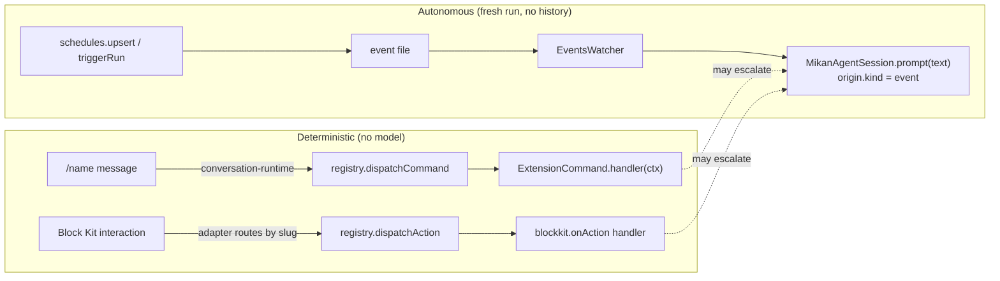

This page maps the extension system onto the agent run loop: how extensions are
discovered and activated, the host services that back the `api` surface, and the
exact points in `MikanAgentSession`'s loop where each hook runs. It complements
the [extension development guide](../extension-development/) (how to write one)
with the runtime picture (how one executes).

Source of truth:

- `src/harness/extensions/` — loader, registry, types, blockkit
- `src/harness/runner.ts` — `MikanAgentSession`, the run loop and hook dispatch
- `src/agent.ts` — `buildExtensionHostServices`, wiring extensions to mikan
- `src/runtime/conversation-runtime.ts` — command and block-action dispatch

## 1. Where extensions sit

Extension modules run **inside the mikan host process** with its full
privileges (platform tokens, vault, host filesystem). They therefore load only
from host-controlled directories under the state dir — never from workspace or
conversation dirs, which are mounted into sandbox containers and are
agent-writable (loading code from there would be a sandbox escape).



`defaultExtensionDirs(conversationId, stateDir)` returns the two scan
directories in load order — `global/extensions` (all conversations) then
`conversations/<id>/extensions` (this conversation only). Both scopes are
isomorphic; see [`LAYOUT.md`](https://github.com/geminixiang/mikan/blob/main/src/harness/extensions/LAYOUT.md).

## 2. Loading & activation

Discovery accepts three layouts per extension: a bare file
(`extensions/<name>.mjs`), a directory with an `index.*`, or a directory with a
`package.json` declaring a `mikan.extensions` entrypoint (which may carry npm
dependencies). Modules are imported through a **fresh jiti instance with caching
disabled**, so an edited extension is picked up the next time a harness instance
is created for the conversation.



Key identity rule: the **slug** derives from the install path (dir or bare-file
name), never from the manifest — so identity is admin-controlled and stable
across manifest edits. The slug keys the data dir, secrets vault, schedule
ownership, and block-action namespace. Installing the same extension globally
and per-conversation shares one slug, hence one `sharedDataDir`.

Activation failures are isolated: a module that throws during import or
`activate` is recorded in `errors[]` and skipped — it never aborts the load of
its siblings.

## 3. The `api` surface over host services

Every `api` method that reaches outside the process is backed by an optional
field on `ExtensionHostServices`. When the running context does not provide the
service, the corresponding `api` call throws an informative error instead of
silently no-op'ing.

| `api` surface          | Backing service             | Effect                                                       |
| ---------------------- | --------------------------- | ------------------------------------------------------------ |
| `on(hook, handler)`    | registry                    | register a lifecycle hook                                    |
| `registerTool(tool)`   | registry                    | contribute an agent tool for this conversation's runs        |
| `registerCommand(cmd)` | registry                    | deterministic `/name` — no model call                        |
| `blockkit.post/update` | `postBlocks / updateBlocks` | interactive Block Kit; action ids namespaced by slug         |
| `blockkit.onAction`    | registry                    | handle interactions on this extension's elements             |
| `schedules.upsert/...` | `scheduleStore`             | event files under the workspace, watched by `EventsWatcher`  |
| `triggerRun(text)`     | `scheduleStore`             | fire an autonomous run ASAP (`extrun.*` event file)          |
| `subagent.run(req)`    | `runSubagent`               | fresh isolated subagent; usage folded into the parent budget |
| `notify(text)`         | `postMessage`               | post to a conversation with **no** agent run                 |
| `react / uploadFile`   | `addReaction / uploadFile`  | proactive reaction / file upload                             |
| `secrets.get/list`     | `resolveSecrets`            | read-only vault secrets for this slug                        |
| `paths.dataDir`        | `stateDir`                  | per-conversation private data (isolation by default)         |
| `paths.sharedDataDir`  | `stateDir`                  | cross-conversation data under `global/`                      |

## 4. Hooks inside the run loop

`MikanAgentSession.prompt()` drives the loop. The diagram shows every hook
firing point and the pi-agent-core seams they attach to (`transformContext`,
`beforeToolCall`, `afterToolCall`, and the `message_end` event).



The amber nodes are the nine extension hook firing points; the rest is the
loop itself. Within **any** of these handlers (and inside `/name` commands and
Block Kit `onAction` handlers) the extension holds the full `api` surface from
§3 — `notify`, `blockkit`, `subagent`, `schedules` / `triggerRun`, `react`,
`uploadFile`, `secrets`, and `paths`.

### Hook semantics

Result handling differs per hook — this is the part most worth getting right:

| Hook                 | When                                | Semantics                                                                  |
| -------------------- | ----------------------------------- | -------------------------------------------------------------------------- |
| `before_agent_start` | before the first LLM call of a turn | **chained** prompt/systemPrompt rewrite; `block` from **any** handler wins |
| `context`            | before **every** LLM call           | **chained** over a call-local transcript clone; never mutates canonical    |
| `tool_call`          | before each tool executes           | **first non-undefined wins**; a `block` returns an error result to model   |
| `tool_result`        | after each tool executes            | **chained** rewrite of content / details / isError / usage                 |
| `message_end`        | as each message finalizes           | **chained**, must preserve role; then persisted                            |
| `turn_end`           | once, after the turn settles        | observe-only (final transcript)                                            |
| `session_compact`    | after a compaction commits          | observe-only (compaction entry + reason)                                   |
| `agent_error`        | turn settled on error after retries | observe-only (error message)                                               |
| `budget_exceeded`    | a run budget cap trips              | observe-only (which cap, tokens, cost, calls, duration)                    |

Every handler runs behind a try/catch in the registry: **a hook error is logged
and swallowed — a broken extension can never crash a run.** Handlers on
observe-only hooks that return a value have that value ignored.

Every hook event also carries `origin: RunOrigin` — interactive runs carry the
triggering platform message (`messageTs`, `userId`, thread, downloaded
attachments) usable with `api.react` and per-user policy; autonomous
(schedule / trigger) runs carry only `kind` and `platform`.

## 5. Paths that bypass the agent loop

Three extension surfaces are dispatched **deterministically** — no model call,
no agent-session entry:



- **Commands** (`/name`): built-in commands always win; among extensions the
  first registration of a name wins. The triggering message still syncs to chat
  history, but no agent session entry is created.
- **Block actions**: the adapter strips the slug namespace and routes to the
  owning extension's `onAction`; interactions are serialized on the session
  queue so rapid votes never interleave.
- **Schedules / `triggerRun`**: write event files the embedder's `EventsWatcher`
  picks up; each fires an **autonomous run that does not inherit conversation
  history** — the `text` must be self-contained.

A deterministic handler can choose to involve the model afterwards by calling
`api.triggerRun(...)`.

## 6. Disposal

When the harness instance owning the extensions is discarded (`/pi-new`, idle
eviction, session rotation, shutdown), `LoadExtensionsResult.dispose()` runs
every registered disposer — from `api.onDispose(...)` or an `activate` return
value — in **reverse registration order (LIFO)**. Disposer errors are logged,
never thrown, and disposal is idempotent.

## 7. Pseudocode

### Loader — discover & activate

```text
function loadExtensions({ dirs, context, services }):
    registry = new ExtensionRegistry()
    for dir in dirs:                       # [global, conversations/<id>]
        for { entrypoint, rootDir } in discover(dir):
            module = import(entrypoint)     # fresh jiti, no cache
            ext    = resolveActivate(module)   # default or named `activate`
            if not ext: record error; continue
            slug = extensionSlug(rootDir)   # from install path, not manifest
            name = manifest.name ?? ext.name ?? slug
            api  = buildExtensionApi(name, slug, registry, context, services)
            try:
                disposer = await ext.activate(api)
                if disposer is function: registry.registerDisposer(name, disposer)
                skills += loadExtensionSkills(rootDir, slug)   # inline
            catch err:
                record error   # isolated: siblings still load
    return { registry, extensions, errors, skills, dispose: registry.dispose }
```

### Registry — dispatch semantics

```text
# first-non-undefined-wins (tool_call, and the generic emit)
emit(hook, event):
    for { handler } in handlers[hook]:
        try: r = await handler(event); if r !== undefined: return r
        catch e: log(e)          # swallow — never crash the run
    return undefined

# chained + block-wins (before_agent_start)
emitBeforeAgentStart(event):
    chained = { ...event }; merged = {}
    for { handler } in handlers.before_agent_start:
        r = safe(handler, chained)
        if r.systemPrompt: merged.systemPrompt = chained.systemPrompt = r.systemPrompt
        if r.prompt:       merged.prompt       = chained.prompt       = r.prompt
        if r.block and not merged.block: merged.block = true; merged.reason = r.reason
    return merged if changed else undefined

# chained over call-local clone (context)
emitContext(event):
    messages = structuredClone(event.messages)
    for { handler } in handlers.context:
        r = safe(handler, { ...event, messages })
        if r?.messages: messages = r.messages
    return messages                # affects THIS llm call only
```

### Run loop — hook firing points

```text
MikanAgentSession.prompt(text, { images, budget, origin }):
    guard not already running
    runSystemPrompt = agent.systemPrompt
    try: return runPrompt(text, runSystemPrompt, ...)
    finally: agent.systemPrompt = runSystemPrompt   # restore per-turn rewrite

runPrompt(text, systemPrompt, opts):
    ensureAuth(); resetTally(); runOrigin = opts.origin
    if prior turn over threshold: checkThresholdCompaction()

    # ── before_agent_start ──────────────────────────────
    r = emitBeforeAgentStart({ prompt: text, images, systemPrompt, origin })
    if r.block: return { blocked: true, reason: r.reason }   # nothing persists
    if r.prompt:       text         = r.prompt
    if r.systemPrompt: systemPrompt = agent.systemPrompt = r.systemPrompt

    agent.prompt([userMessage(text, images)])
    while handlePostRun():           # compaction / retry / overflow continuations
        agent.continue()

    settled = lastAssistantMessage()
    if settled.stopReason == "error": emit("agent_error", { errorMessage, origin })
    emit("turn_end", { messages, origin })
    return

# pi-agent-core seams wired in the Agent constructor:
transformContext(messages) = emitContext({ messages, origin })          # every LLM call
beforeToolCall({ toolCall, args }) = emit("tool_call", {...})           # may block
afterToolCall({ toolCall, args, result, isError }) = emitToolResult({...})  # rewrite

# on each finalized message (agent event):
handleAgentEvent(message_end):
    message = emitMessageEnd({ message, origin }) ?? message   # role-preserving
    sessionStore.append(message)
    if assistant:
        recordUsage(message); enforceBudget(message)   # → budget_exceeded hook

# after a compaction commits:
runCompaction(reason):
    ...commit summary to session tree...
    emit("session_compact", { entry, reason })
```

### Deterministic dispatch — commands & block actions

```text
# conversation-runtime, before any agent run:
onMessage(event):
    if builtinCommand(event.text): handle; return       # built-ins win
    ...materialize state...
    if event.text startsWith "/":
        if registry.dispatchCommand(name, ctx): return  # extension /name, no model

onBlockInteraction(slug, action):
    enqueue(sessionKey):                                # serialized per session
        state = getOrCreateState(...)                   # activates extensions
        registry.dispatchAction(slug, action)           # onAction handler, no model
```
