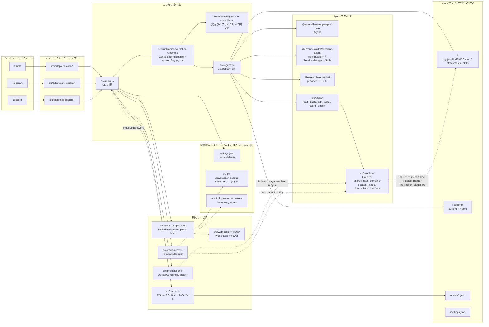
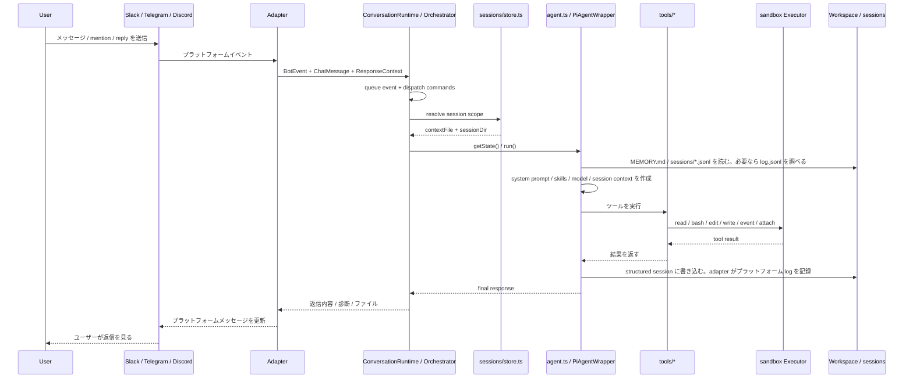
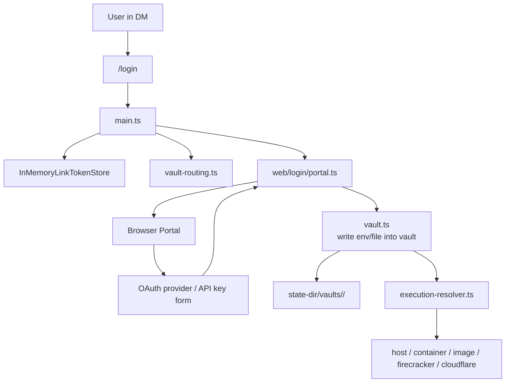

## 1. システム概要



## 2. 主なレイヤー

### A. プラットフォーム接続レイヤー

プラットフォーム接続レイヤーの詳しい説明は [プラットフォーム接続](platform-adapters.md) を参照してください。各プラットフォームの詳細は [Slack](platform-adapters/slack.md)、[Discord](platform-adapters/discord.md)、[Telegram](platform-adapters/telegram.md) を参照してください。

- `src/adapters/slack/*`
- `src/adapters/telegram/*`
- `src/adapters/discord/*`
- `src/adapter.ts`

責務:

- Slack / Telegram / Discord のネイティブイベントを受け取る
- 統一された `BotEvent`、`ChatMessage`、`PlatformResponder` に変換する
- プラットフォームの規則に従って `sessionKey` を計算する
- 返信、typing、working、ファイルアップロードなどのプラットフォーム差分を隠蔽する

### B. コア調整レイヤー

- `src/main.ts`
- `src/runtime/conversation-runtime.ts`
- `src/runtime/agent-run-controller.ts`
- `src/sessions/store.ts`
- `src/sessions/agent-memory-file-manager.ts`

責務:

- CLI を起動し、env / args / `settings.json` を読み込む
- 各プラットフォーム bot の `BotHandler` として `ConversationRuntime` を作成する
- `AgentRunController` を通じて `/login`、`/session`、`stop`、`new` などの制御コマンドを dispatch する
- `conversationStates` と per-session queue を管理し、同じ session の重複実行を防ぐ
- 各 session scope に対応する `PiAgentWrapper` を決定する

### C. Agent 実行レイヤー

- `src/agent.ts`
- `src/context.ts`
- `src/tools/*`

責務:

- `PiAgentWrapper` を作成する
- モデル、skills、memory、session context を読み込む
- ユーザーメッセージを `pi-agent-core` / `pi-coding-agent` に渡す
- tool calls をローカルの `read/bash/edit/write/event/attach` に接続する
- tool の結果を session に書き戻し、adapter 経由でプラットフォームへ返す

### D. 実行環境レイヤー

- `src/sandbox/*`
- `src/provisioner.ts`
- `src/execution-resolver.ts`

責務:

- `Executor` を統一的に抽象化する
- sandbox runtime は 2 種類に分かれる:
  - shared: `host` / `container:<name>`。同じ host または指定 container を共有する
  - isolated: `image:<image>` / `firecracker:*` / `cloudflare:*`。actor/conversation/vault に応じて隔離された実行環境へルーティングする
- `ActorExecutionResolver` により user/conversation/vault から実際の executor を決定する
- `image` モードでは Docker container を自動作成・回収し、`image:<image>` を concrete な `container:<name>` executor に解決する

### E. 状態と永続化レイヤー

- `src/sessions/store.ts`
- `src/sessions/agent-memory-file-manager.ts`
- `src/context.ts`
- `src/vault/index.ts`

責務:

- session ファイルを管理する: `sessions/current` と `*.jsonl`
- `log.jsonl` と structured session の二系統の履歴を保存する
- workspace / conversation レベルの `MEMORY.md` を扱う
- per-conversation vault の認証情報と mount / env 注入を扱う

### F. 補助サービスレイヤー

- `src/web/login/*`
- `src/web/admin/*`
- `src/web/session-view/*`
- `src/events.ts`

責務:

- `src/web/login/portal.ts` は現在 link server host で、login/vault、admin、session-view routes をマウントする
- Web login portal を提供し、API key と OAuth の vault 書き込みをサポートする
- admin portal を提供し、conversation/settings/workspace/events/skills 管理と link generation をサポートする
- session viewer を提供する。現在は session timeline を表示でき、interactive wiring が有効な場合は `/session/message` からメッセージを送れる
- `events/*.json` を監視し、スケジュールイベントを bot フローへ再注入する

## 3. メッセージ処理フロー



## 4. Session とファイル配置

`mikan` のコンテキストはメモリだけに依存せず、主に workspace ディレクトリに置かれます:

```text
<workspace>/
├── MEMORY.md                  # workspace レベルの記憶
├── events/                    # スケジュールと外部イベント
└── <conversationId>/
    ├── settings.json          # conversation-local overrides
    ├── MEMORY.md              # conversation レベルの記憶
    ├── log.jsonl              # grep 可能な人間可読メッセージ履歴
    ├── attachments/           # プラットフォーム添付ファイルのダウンロード
    ├── scratch/               # 実行中の作業領域
    ├── skills/                # conversation カスタム skills
    └── sessions/
        ├── current            # top-level session pointer
        ├── <timestamp>_<id>.jsonl
        └── <scope_id>.jsonl   # thread / reply scoped sessions
```

設計上のポイント:

- `log.jsonl` はプラットフォーム会話ログです。Slack/Discord/Telegram で実際に何が起きたかを記録します
- `sessions/*.jsonl` は LLM の作業コンテキスト/作業記録です。mikan が LLM に何を渡し、LLM/tool が何をしたかを記録します
- top-level session は `current` ポインターを使いますが、`current` は channel history ではありません。欠落時は `log.jsonl` から最近の top-level 作業コンテキストを再構築できます
- thread / reply session は固定ファイル名を使い、scoped session を個別に追跡できるようにします
- Slack top-level メッセージは channel session を共有します。Slack thread replies は `conversationId:threadTs` を使います
- Slack events は先に top-level anchor message を作成し、その後 `conversationId:anchorTs` で実行します

## 5. Login / Vault / Sandbox の関係



ポイント:

- 認証情報は workspace に直接入りません
- vault は `--state-dir` に保存されます
- 実行時にだけ conversation vault から対応する sandbox へルーティングされます
- `image` / `firecracker` / `cloudflare` モードは per-actor/per-conversation vault routing を使います。`container:<name>` は shared container vault を使い、`host` は vault env を注入しません

## 6. Events と通常会話の違い

`events/*.json` は `EventsWatcher` に監視され、その後 `BotEvent` に変換されて通常フローをもう一度通ります。
つまり events は独立した実行器ではなく、「別のメッセージ入口」です。

これにより、次の機能が同じ仕組みを共有します:

- session context
- vault routing
- tool execution
- プラットフォーム返信
- stop / running state 管理

## 7. アーキテクチャまとめ

一言でまとめると、`mikan` の中核は次のものです:

> `main.ts` を調整中心、`agent.ts` を実行中核、`session/vault/sandbox` を基盤とするマルチプラットフォーム AI agent bot。

6 つの中核サブシステムとして捉えられます:

1. プラットフォームアダプター
2. Bot runtime の調整
3. Agent + tools
4. Session/context の永続化
5. Vault + sandbox execution routing
6. Web/event side services
