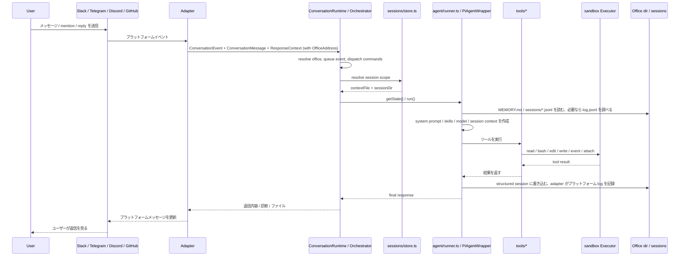
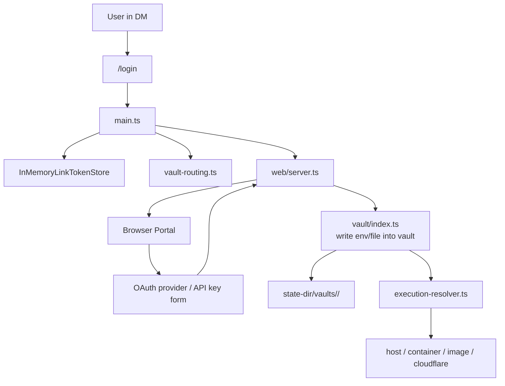

## 1. システム概要


## 2. 主なレイヤー

### A. プラットフォーム接続レイヤー

共通 adapter contract については [プラットフォーム接続](platform-adapters.mdx) を参照してください。各プラットフォームの詳細は [Slack](platform-adapters/slack.md)、[Discord](platform-adapters/discord.md)、[Telegram](platform-adapters/telegram.md)、[GitHub](platform-adapters/github.md) を参照してください。

- `src/adapters/slack/*`
- `src/adapters/telegram/*`
- `src/adapters/discord/*`
- `src/adapters/github/*`
- `src/adapter.ts`

責務:

- Slack / Telegram / Discord のネイティブイベントを受け取るか、GitHub issues と pull requests を poll する
- 統一された `ConversationEvent`、`ConversationMessage`、`ConversationResponder` に変換する。いずれもその conversation の `OfficeAddress` を持つ
- プラットフォームの規則に従って `sessionKey` を計算する
- 返信、typing、working、ファイルアップロードなどのプラットフォーム差分を隠蔽する

生のプラットフォーム識別子は、この外部 I/O 境界の内側には入りません。そこから内側では、conversation は常に `OfficeAddress` で指し示されます。

### B. コア調整レイヤー

- `src/main.ts`
- `src/cli/boot.ts`
- `src/runtime/conversation-runtime.ts`
- `src/adapters/intake.ts`
- `src/commands/manifest.ts`
- `src/sessions/store.ts`
- `src/sessions/chat-history-sync.ts`

責務:

- argv を boot plan に解決し（`src/cli/boot.ts`）、それを実行する: env / `settings.json` の読み込み、`Workspace` の構築、office migration の実行、選択されたプラットフォーム bot の起動
- 各プラットフォーム bot の `MessagingEventHandler` として `ConversationRuntime` を作成する
- `stop` マジックワードは conversation intake（`src/adapters/intake.ts`）が trigger policy とキューイングより先に認識する
- `/login`、`/session`、`/new` などの制御コマンドは `ConversationRuntime.runSession` 内で dispatch する。アダプターが登録・ルーティングに使うコマンド一覧は `src/commands/manifest.ts` にある
- per-session の state と queue を office address と session key の組で管理する。これにより 1 つの session は 1 度に 1 実行に保たれ、他の session は並行して進められる
- 各 session scope に対応する `PiAgentWrapper` を決定する

### C. Agent 実行レイヤー

- `src/agent/`
- `src/harness/*`
- `src/tools/*`

責務:

- `PiAgentWrapper` を作成する
- モデル、skills、memory、session context を読み込む
- ユーザーメッセージを mikan 自前の agent harness（`src/harness/`、`pi-agent-core` / `pi-ai` の上に構築）に渡し、ターンループ・auto-compaction・auto-retry・extension hooks を実行する
- tool calls をローカルの `read/bash/edit/write/event/attach` に接続する
- tool の結果を session に書き戻し、adapter 経由でプラットフォームへ返す

### D. 実行環境レイヤー

- `src/sandbox/*`
- `src/provisioner.ts`
- `src/execution-resolver.ts`

責務:

- `Executor` を統一的に抽象化する
- sandbox runtime は 2 種類に分かれる:
  - shared: `host` / `container:<name>`。同じ host または指定 container を共有する
  - isolated: `image:<image>` / `cloudflare:*`。actor/conversation/vault に応じて隔離された実行環境へルーティングする
- `ActorExecutionResolver` により user/conversation/vault から実際の executor を決定する
- `image` モードでは Docker container を自動作成・回収し、`image:<image>` を concrete な `container:<name>` executor に解決する

### E. Conversation office レイヤー

- `src/office/*`
- `src/workspace-projection/index.ts`

すべての conversation は **office** です。つまり、それぞれが専用の永続作業領域とデータ境界を持ちます。このモジュールがその identity と layout を所有します。

責務:

- `createWorkspace({ root, stateDir })` がプロセスごとの `Workspace` を構築する: workspace root、そのグローバルな `MEMORY.md` / `skills/` / `events/` / `agents/`、そして office factory
- `workspace.office(address)` は、すべての path を事前計算した frozen な `Office` を返す — `dir`、`memoryPath`、`skillsDir`、`sessionsDir`、`attachmentsDir`、`logPath`、host 専用の `stateDir` — さらに唯一の materialization seam である `ensure()` を持つ
- host 上、sandbox runtime 内、vault のいずれでも office を指す `OfficeKey`（`v1-<platform>-<readable-id>-<sha256 prefix>`）を導出する
- office key は逆変換できないため、生 id ↔ office の対応を保持する host 専用の office registry（`office-registry.json`）を管理する
- 旧来の生 id 配置からの boot 時 migration を、クラッシュ復旧付きの journal で実行する
- workspace projection を解決する: その office の door policy に対して、どの host path が sandbox runtime に mount されるか

### F. 状態と永続化レイヤー

- `src/sessions/store.ts`
- `src/sessions/chat-history-sync.ts`
- `src/vault/index.ts`

責務:

- session ファイルを管理する: `sessions/current` と `*.jsonl`
- `log.jsonl` と structured session の二系統の履歴を保存する
- workspace レベルと office レベルの `MEMORY.md` を扱う
- per-office vault の認証情報と mount / env 注入を扱う

### G. 補助サービスレイヤー

- `src/web/login/*`
- `src/web/admin/*`
- `src/web/session-view/*`
- `src/events.ts`

責務:

- `src/web/server.ts` は HTTP server を所有し、login/vault、admin、session-view、agent-event routes をマウントする
- Web login portal を提供し、API key と OAuth の vault 書き込みをサポートする
- admin portal を提供し、conversation/settings/workspace/events/skills 管理と link generation をサポートする
- session viewer を提供する。現在は session timeline を表示でき、interactive wiring が有効な場合は `/session/message` からメッセージを送れる
- `events/*.json` を監視し、スケジュールイベントを bot フローへ再注入する

## 3. メッセージ処理フロー



## 4. Office、session、ファイル配置

`mikan` は sandbox から見える作業データを、host-authoritative な設定および認証情報から分離します：

```text
<workspace>/
├── MEMORY.md                  # workspace レベルの記憶
├── skills/                    # workspace レベルの skills
├── events/                    # workspace のスケジューリングバス
├── agents/                    # インストールごとの subagent profile patch
└── <officeKey>/               # 1 つの conversation office
    ├── MEMORY.md              # office レベルの記憶
    ├── log.jsonl              # grep 可能な人間可読メッセージ履歴
    ├── attachments/           # プラットフォーム添付ファイルのダウンロード
    ├── scratch/               # 実行中の作業領域
    ├── skills/                # office レベルの skills
    └── sessions/
        ├── current            # top-level session pointer
        ├── <timestamp>_<id>.jsonl
        └── <scope_id>.jsonl   # thread / reply scoped sessions

<state-dir>/
├── settings.json              # 必須のグローバル設定
├── office-registry.json       # office 一覧 + migration journal
├── conversations/
│   └── <officeKey>/settings.json  # host-only conversation overrides
└── vaults/<vaultId>/          # credentials
```

state directory の既定値は `~/.mikan` です。sandbox から見える workspace paths の外に置く必要があります。`MEMORY.md`、`skills`、`events`、`agents` は workspace root の予約名であり、office directory になることはありません。

設計上のポイント:

- `<officeKey>` は `v1-<platform>-<readable-id>-<hash>` で、platform と生の conversation id から SHA-256 で導出されます。中央の可読部分は診断用で、identity は digest です。したがって、生の conversation id が偶然一致する 2 つのプラットフォームは、別々の directory・settings・vault を持ちます
- office key は host 上でも sandbox runtime 内でも同じ directory を指すため、境界を越えても path の意味が変わりません
- office key から生のプラットフォーム id へは逆変換できないため、`office-registry.json` が各 office の `(platform, conversationId)` を初回 materialize 時に記録します。生 id を扱う面 — Admin portal や `mikan office claim` — はこれを介して解決します
- `log.jsonl` はプラットフォーム会話ログです。Slack/Discord/Telegram で実際に何が起きたかを記録します
- `sessions/*.jsonl` は LLM の作業コンテキスト/作業記録です。mikan が LLM に何を渡し、LLM/tool が何をしたかを記録します
- top-level session は `current` ポインターを使いますが、`current` は channel history ではありません。欠落時は `log.jsonl` から最近の top-level 作業コンテキストを再構築できます
- thread / reply session は固定ファイル名を使い、scoped session を個別に追跡できるようにします
- session key は生のプラットフォーム値のままです。runtime state は office と session key の組で指し示されるため、ある session key が別の office の runner や queue を選ぶことはありません
- Slack top-level メッセージは channel session を共有します。Slack thread replies は `conversationId:threadTs` を使います
- Slack events は先に top-level anchor message を作成し、その後 `conversationId:anchorTs` で実行します

### Door policy と workspace projection

office の sandbox runtime が実際に見るものは _workspace projection_ であり、これは office の door policy から解決されます:

| Door policy | Layout           | runtime に mount されるもの                                            |
| ----------- | ---------------- | ---------------------------------------------------------------------- |
| `isolated`  | `conversation`   | `<officeKey>/` のみ                                                    |
| `trusted`   | `shared-support` | `<officeKey>/` に加えて workspace の `MEMORY.md`、`skills/`、`events/` |
| `trusted`   | `full`           | workspace root 全体                                                    |

既定は `isolated` で、これは常に `conversation` layout を意味します。Door policy はデータアクセスの境界であり、実行やネットワークの隔離を変えることはありません。office ごとに admin portal または `/pi-sandbox door` で設定し、グローバルな既定値は `sandbox.workspace` にあります — [設定](/ja/configuration/) を参照してください。

## 5. Login / Vault / Sandbox の関係



ポイント:

- 認証情報は workspace に直接入りません
- vault は `--state-dir` に保存されます
- 実行時にだけ office の vault から対応する sandbox へルーティングされます
- `image` / `cloudflare` モードは office key で vault を索きます — workspace と registry で office を指すのと同じ文字列です。`container:<name>` は shared container vault を使い、`host` は user で索き、vault env を注入しません

## 6. Events と通常会話の違い

`events/*.json` は `EventsWatcher` に監視され、その後 `ConversationEvent` に変換されて通常フローをもう一度通ります。
つまり events は独立した実行器ではなく、「別のメッセージ入口」です。

これにより、次の機能が同じ仕組みを共有します:

- session context
- vault routing
- tool execution
- プラットフォーム返信
- stop / running state 管理

## 7. アーキテクチャまとめ

一言でまとめると、`mikan` の中核は次のものです:

> `main.ts` を調整中心、`agent/runner.ts` を実行中核、`office/session/vault/sandbox` を基盤とするマルチプラットフォーム AI agent bot。

7 つの中核サブシステムとして捉えられます:

1. プラットフォームアダプター
2. Bot runtime の調整
3. Agent + tools
4. Conversation office: identity、layout、registry、workspace projection
5. Session/context の永続化
6. Vault + sandbox execution routing
7. Web/event side services

Office はこれらのサブシステムが合意する単位です: 1 つの conversation、1 つの directory、1 つの vault、1 つの sandbox runtime、1 つのデータ境界。[ADR 0003](https://github.com/geminixiang/mikan/blob/main/docs/adr/0003-isolated-conversation-offices.md)、[ADR 0004](https://github.com/geminixiang/mikan/blob/main/docs/adr/0004-persistent-offices-and-ephemeral-factory-floors.md)、[ADR 0005](https://github.com/geminixiang/mikan/blob/main/docs/adr/0005-office-address-identity.md) を参照してください。
