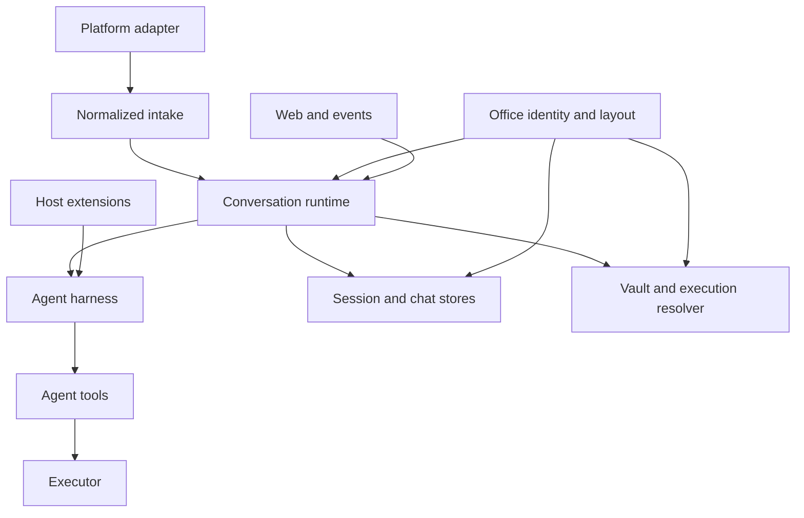

このページでは、mikan の**アーキテクチャ上のインターフェース**、すなわちサブシステム、プロセス、永続化、パッケージのいずれかの境界をまたぐ契約を説明します。エクスポートされたヘルパーをすべて列挙したものではありません。1 つのサブシステム内でのみ使われるヘルパーは、TypeScript が現在 `export` としてマークしていても実装の詳細です。

## 安定性レベル

| レベル           | 意味                                                              | 互換性の期待                                                  |
| ---------------- | ----------------------------------------------------------------- | ------------------------------------------------------------- |
| Public           | npm consumers または extension authors によって import される     | 保持するか、意図的にバージョン管理する                        |
| Host integration | runtime を埋め込む、または platform/runtime backend を追加する    | integration が存在する限り保持する                            |
| Wire / persisted | ディスクに保存されるか、プロセス/ネットワーク境界を越えて送られる | 明示的に移行する。reader はサポート対象の古い形式を許容すべき |
| Internal         | mikan CLI 内部のモジュールを接続する                              | call sites と tests を協調させれば変更してよい                |

`src/index.ts` は wildcard の re-export ではなく明示的な export リストで、`src/test/public-api.test.ts` がそれを snapshot するため、意図しない追加は CI で失敗します。それでも、通常の bot integration に必要な範囲を超えて harness を公開しています。下の表を意図された契約として扱い、残りの分割については [コア簡素化](/core-simplification/) を参照してください。

## 境界マップ



runtime は調整役です。platform は harness の永続化を知ってはならず、harness は platform SDK オブジェクトを知ってはならず、tools は実行がローカル、コンテナ化、リモートのいずれであるかを知ってはなりません。office モジュールは、runtime・stores・vault のいずれもが conversation を指し示すのに使う identity と paths を供給します。

## 1. パッケージインターフェース

npm のエントリポイントは `@geminixiang/mikan` で、`src/index.ts` によって実装されています。

### サポートされるエントリポイントグループ

| グループ            | 主なシンボル                                                                                               | Consumer                                                                     |
| ------------------- | ---------------------------------------------------------------------------------------------------------- | ---------------------------------------------------------------------------- |
| Runtime embedding   | `createConversationRuntime`、`ConversationRuntime`、`ConversationRuntimeOptions`                           | platform と execution の依存を供給する host                                  |
| Office と workspace | `createWorkspace`、`createOfficeAddress`、`officeKey`、`Workspace`、`Office`、`OfficeAddress`、`OfficeKey` | すべての embedder。`createConversationRuntime` は `Workspace` を必要とします |
| Platform contract   | `MessagingBot`、`ConversationEvent`、`ConversationContext`、`ConversationResponder`、`MessagingInfo`       | platform adapters と embedders                                               |
| Commands            | `CommandHandler`、`CommandContext`、`CommandServices`、`dispatchCommand`                                   | 決定的な commands を追加する host                                            |
| Execution           | `Executor`、`SandboxConfig`、`SandboxAdapter`、`createExecutor`、`parseSandboxArg`、`validateSandbox`      | runtime backends と host                                                     |
| Extensions          | `MikanExtensionApi`、hook/event types、subagent types                                                      | 信頼された extension authors                                                 |
| Harness embedding   | `MikanAgentSession`、`SessionStore`、`MikanModels`、settings および event-format functions                 | 上級の embedders。通常の bot integration ではありません                      |

パッケージの `exports` map が宣言するパスだけが public です。それ以外の生成済み `dist/` パスや `src/` ソースパスの import はサポートされません。

## 2. Platform intake と response のインターフェース

ソース: `src/types.ts`（`src/adapter.ts` によって re-export）。

### `ConversationEvent`

`MessagingEventHandler` に配信される platform 中立なトリガーです。

| フィールド            | 契約                                                                                                            |
| --------------------- | --------------------------------------------------------------------------------------------------------------- |
| `address`             | 正規の `OfficeAddress`（`platform` + 生の `conversationId`）。adapter が intake 時に作成する                    |
| `conversationId`      | 非推奨の生の platform 識別子。adapter の I/O seam でのみ有効。session keys が `:` を予約するため `:` を含めない |
| `conversationKind`    | `direct` または `shared`。session と credential のポリシーに影響する                                            |
| `ts`                  | トリガーとなった platform message の識別子                                                                      |
| `thread_ts`           | 任意の parent/root platform message 識別子                                                                      |
| `user`                | Platform user 識別子                                                                                            |
| `text`                | platform mention 除去後のテキスト                                                                               |
| `attachments`         | すでに host paths にダウンロード済みのファイル                                                                  |
| `sessionKey`          | 任意の platform 選択の override。指定がなければ session policy によって導出される                               |
| `vaultConversationId` | credential ルーティングにのみ使われる任意の代替 identity                                                        |

本番の adapter とすべての synthetic intake は、互換用の `conversationId` を `address` と照合して検証します。新しいコードは `address` を読んでください。

### `ConversationContext`

同じ実行に対する、office identity、より豊かな正規化済み message、response port、platform メタデータを保持します:

```ts
interface ConversationContext {
  address: OfficeAddress;
  message: ConversationMessage;
  responder: ConversationResponder;
  platform: MessagingInfo;
}
```

`ConversationMessage` と `ConversationEvent` は現在、message id、session、conversation kind、user、text、attachments、thread identity を重複して持っており、いずれも `address` を保持するようになりました。adapters は両方の表現を一貫させ続ける必要があります。これは内部の互換性のための seam であり、新しい integration にとって望ましいモデルではありません。

### `ConversationResponder`

runtime/harness の出力 port です。必須の操作は、最終テキスト、置換、診断、tool status、typing/working 状態、file upload、response 削除をカバーします。Streaming（`appendResponseDelta`、`finishResponse`）と reaction（`react`）は任意の機能です。

Capability ルール: 呼び出し側は任意メソッドを feature-detect しなければなりません。adapter は出力を buffer してもよく、streaming をネイティブに実装してもよいですが、1 つの実行に対する呼び出し順序を保持しなければなりません。

### `MessagingBot`

host に面した platform port です。次を組み合わせます:

- lifecycle: `start()`；
- outbound messages: `postMessage`、`updateMessage`、任意の upload/reaction/private replies；
- intake scheduling: `enqueueEvent`；
- discovery/policy: `getMessagingInfo()`。

`MessagingInfo.trustModel` はセキュリティに関わります。`membership` は、sandbox topology が isolated である場合に ambient shared-vault policy を許可します。public な GitHub activity のようなオープンなトリガー面は `open-trigger` を返さなければなりません。

`MessagingBot` が host に面した唯一の adapter インターフェースです。lifecycle と messaging capabilities を別の浅いインターフェースには分割しません。

## 3. Runtime オーケストレーションのインターフェース

ソース: `src/runtime/types.ts` と `src/runtime/conversation-runtime.ts`。

`createConversationRuntime(options)` は `ConversationRuntime` を返します。これは per-session の直列化、command dispatch、runner caching、stop/reset の挙動、idle eviction、graceful shutdown を単独で所有します。

### Input メソッド

| メソッド                                                                  | セマンティクス                                                                            |
| ------------------------------------------------------------------------- | ----------------------------------------------------------------------------------------- |
| `handleEvent(event, bot, context)`                                        | office と導出された session key の組で直列化し、command または agent run を dispatch する |
| `runSession(options)`                                                     | すでに直列化済みの 1 単位を実行する。制御された host 用途を想定                           |
| `handleStop(address, sessionKey, bot)` / `forceStop(address, sessionKey)` | 協調的/ユーザーに見える stop か、即時の内部 stop か                                       |
| `handleNewCommand(...)`                                                   | abort し、永続化された session state をリセットし、cached runner を破棄する               |

### Control と inspection

| メソッド                                  | セマンティクス                                                          |
| ----------------------------------------- | ----------------------------------------------------------------------- |
| `isRunning(address, sessionKey)`          | 現在のプロセス内での実行状態                                            |
| `getRunningSessions()`                    | admin/observability 面向けのスナップショット。各要素は `address` を持つ |
| `switchConversationModel(address, ...)`   | cached runner を更新する。存在したかどうかを返す                        |
| `refreshConversationEnvironment(address)` | cached runner の環境を再解決する                                        |
| `shutdown(timeoutMs?)`                    | 新しい作業を拒否し、runners を停止し、期限まで in-flight の作業を待つ   |

session スコープのエントリポイントはすべて `OfficeAddress` を受け取ります。生の conversation id からの bridge はありません。生 id しか持たない呼び出し側は、まず registry 経由で解決します（`resolveOwnedOfficeAddress`）。これは CLI と admin 面向けの cold path です。

`ConversationRuntimeOptions` は、`workspace`（`createWorkspace` が返す `Workspace`）、sandbox/resource サービス、任意の portal token stores、任意の commands、model registry、proactive な platform 操作、platform tool-pack factories を供給します。vault と portal stores が欠けている場合は無効化された実装に degrade します。portal URL を設定しつつその store を設定しない場合、使用時にエラーになります。

並行性の不変条件: 1 つの office と session key の組に対する呼び出しは直列で、異なる session keys は並行して実行され得ます。したがって platform tool pack は runner ごとに作成され、決してグローバルに共有されません。`bindRun` がその run binding を変更するためです。

## 4. Command インターフェース

ソース: `src/commands/manifest.ts`、`src/commands/types.ts`、`src/commands/registry.ts`。

`COMMAND_MANIFEST` は、slash 形式とネイティブ登録を導出するために使われる platform 向けのインベントリです。`CommandHandler.tryHandle(context)` は実行の契約です。handlers は順に実行され、最初に `true` を返したものが message を消費します。

組み込み commands は extension commands より先に実行されます。どのコマンドにも一致しないスラッシュ付き message は、依然として通常の agent prompt です。`stop` は platform intake の magic word であり `CommandHandler` ではありません。`session` は唯一受け付けられる bare command です。

`CommandContext` は、正規化された actor/conversation identity、response と bot の port、command text、プライバシー状態、`CommandServices` を含みます。command handlers は platform SDK event に手を伸ばしてはなりません。

## 5. Harness インターフェース

ソース: `src/harness/index.ts`、`runner.ts`、`session-store.ts`、`models.ts`、`types.ts`。

### `MikanAgentSession`

model turn loop、message 永続化、retries、compaction、budget circuit breakers、extension hooks、abort の挙動を所有します。外部から意味のある操作は、prompt/run、subscribe、abort、session reload、model/thinking 選択、disposal です。

### `SessionStore`

version 3 の append-only な session JSONL と tree 再構築を所有します。`SessionHeader.version` は現在 `3`（`CURRENT_SESSION_VERSION`）です。Session entries は分岐し得るため、consumers はファイルをフラットなチャットトランスクリプトと仮定せず、store/context helpers を使わなければなりません。

### `MikanModels`

`MikanModels` は組み込みおよびカスタムの `pi-ai` models を解決します。provider credentials は環境変数から解決されます。Vault credentials は別の境界です。tool execution に注入されるものであり、host 側の model client を認証するために使われるものではありません。

### Subagent profiles

subagent は必ず名前付きの profile で起動されます。実行ごとの自由形式の設定はサポートされる面ではありません。`loadSubagentProfiles` がそれらを解決します。`src/harness/subagent-profiles.ts` の組み込み profile が正式な定義であり（`worker`、`software-engineer`、`devops-engineer`、`data-scientist`、`account-manager`、`business-development`、`creative-producer`、`ad-operations-specialist`、`analysis-only`）、`<workspace>/agents/<name>.md` ファイルは同名の組み込みを置き換えるのではなく**パッチ**します。そのため operator は tools と prompt を書き直すことなく `model:` だけを上書きできます。どの組み込みとも名前が一致しないファイルは新しい profile を定義し、自前の `tools` を指定する必要があります。不正なファイルは診断として記録されスキップされ、throw されることはありません。

### Harness events と budgets

Harness listeners は model/tool のライフサイクルイベントを観測します。Budget settings は tokens、cost、duration、LLM calls に上限を設けます。budget の超過は run を abort し `budget_exceeded` を emit します。これは終端の結果であり、retry のシグナルではありません。

## 6. Extension インターフェース

ソース: `src/harness/extensions/types.ts`。完全な作成例は [拡張機能開発](/extension-development/) にあります。

extension は `activate(api)` を export する信頼された host code です。会話ごとの harness インスタンスで活性化され、disposer を返せます。

### `MikanExtensionApi`

| 面                                | 契約                                                                                     |
| --------------------------------- | ---------------------------------------------------------------------------------------- |
| `on`                              | prompt、tool、message、compaction、error、budget の各イベントに順序付き hooks を登録する |
| `registerTool`                    | この runner に `pi-agent-core` tool を追加する                                           |
| `registerCommand`                 | 組み込みの後に決定的な `/name` の処理を追加する                                          |
| `onDispose`                       | reset、eviction、shutdown 時にリソースを解放する。LIFO 順                                |
| `context`                         | 読み取り専用の conversation/workspace/model identity                                     |
| `paths`                           | conversation-private および明示的に共有される host-only のデータディレクトリ             |
| `secrets`                         | 名前による読み取り専用の extension secrets                                               |
| `schedules` / `triggerRun`        | 自律的な event-file の実行を永続化または発火する                                         |
| `subagent.run`                    | 明示的な tools、schema、budget を持つ新しい隔離された実行                                |
| `notify` / `react` / `uploadFile` | 任意の host platform 機能                                                                |

Hook のエラーはログに記録されスキップされます。`before_agent_start` と `tool_result` の書き換えは chain します。`tool_call` は最初の undefined でない結果を使います。ブロックされた pre-start hook は、model call と session 永続化を防ぎます。

Extension の schedules と即時の実行は会話履歴を継承しません。その task text は自己完結していなければならず、secrets を含んではなりません。

## 7. Tool と platform capability のインターフェース

ソース: `src/tools/types.ts`。

Core tools は、runner が供給する executor と host services を使います。`EventStore` は event files の正規の CRUD port です。無効な event JSON は `payload: null` として引き続き列挙可能で、admin が診断または削除できます。

`PlatformToolPackFactory` は runner ごとに private な `PlatformToolPack` を作成します。`bindRun` は、その tools が現在の platform/conversation に適用されるかどうかを選択します。この factory 境界は、GitHub 固有の tools を core tool list から締め出しつつ、conversation をまたぐ mutable な binding を防ぎます。

## 8. Sandbox と executor のインターフェース

ソース: `src/sandbox/types.ts` と `src/sandbox/index.ts`。

### `SandboxConfig`

### `Executor`

これは安定した実行境界であり、最も重要な sandbox 契約です:

| 操作                          | 要件                                                                        |
| ----------------------------- | --------------------------------------------------------------------------- |
| `exec`                        | stdout、stderr、exit code を返す。可能な場合は timeout/abort を尊重する     |
| `readFile` / `readFileBase64` | shell parsing レイヤーを追加せずに content を転送する                       |
| `writeFile`                   | stage して置換し、中断された write が target を truncate できないようにする |
| `getWorkspacePath`            | host workspace root を runtime から見える root にマップする                 |
| `getPathContext`              | host/runtime の path セマンティクスと任意の逆マッピングを宣言する           |
| `getSandboxConfig`            | 使用中の具体的な configuration を返す                                       |

Remote/exec のみの実装は base64 chunked な file transport を共有します。Tool 実装は、`cat`、`printf`、quoting プロトコルを構築するのではなく、executor の file メソッドを呼び出さなければなりません。

### `SandboxAdapter`

adapter は 1 つの CLI 値を認識し、任意でそれを検証し、任意で executor を作成します。`image` には意図的に直接の executor がありません。actor/vault 解決が先に具体的な container をプロビジョニングします。

型は export されていますが、adapter 登録は現在 `src/sandbox/index.ts` 内部の閉じたリストです。外部の consumers は `parseSandboxArg` や `createExecutor` に adapter を追加できません。

## 9. Vault と execution-resolution のインターフェース

ソース: `src/vault/types.ts`。ポリシーは `src/vault/index.ts`。

`VaultManager` は、正規の actor key によって credential env と mount files を解決し、private/shared vaults を列挙・変更し、storage が有効かどうかを報告します。Secrets は host-only の state directory 配下に存在します。

Credential フローは次のとおりです:

1. runtime が platform trust、conversation、user、sandbox topology を供給する。
2. execution resolver が actor/vault identity を選択する。
3. `VaultManager` が env と mounts を解決する。
4. 具体的な executor は、その runtime を意図した credentials のみを受け取る。

Host sandbox 実行は決して vault 注入を受け取りません。Open-trigger platforms は決して ambient shared vault を受け取りません。これらはセキュリティの不変条件であり、便宜的な既定値ではありません。

## 10. Office、session、chat、identity のインターフェース

ソース: `src/office/*`、`src/sessions/*`、`src/adapters/shared.ts`、`src/sandbox/identity.ts`。

### `Workspace` と `Office`

conversation は **office** です。すなわち 1 つの永続作業領域と 1 つのデータ境界です。これを表す値は 2 つあり、どちらも frozen です。

```ts
const workspace = createWorkspace({ root, stateDir });
const office = workspace.office(createOfficeAddress("slack", "C0AAAAAA1"));
```

`Workspace` はプロセスごとに 1 度だけ構築され、workspace 全体の面（`root`、`memoryPath`、`skillsDir`、`eventsDir`、`agentsDir`、`reservedNames`）と office factory を所有します。`Office` は 1 つの conversation の paths — `key`、`dir`、`memoryPath`、`skillsDir`、`sessionsDir`、`attachmentsDir`、`logPath`、host 専用の `stateDir` — を事前計算し、`ensure()` を公開します。

この境界をまたぐ規則:

- **文字列ではなく値を渡す。** consumer は `Office` を受け取ります。root と id から path を組み立てることはせず、directory の basename から identity を推測することもありません。
- **`ensure()` が唯一の materialization seam。** これは office を registry に記録してから directory を作成します。この順序により、クラッシュ時に directory のない記録が残ることはあり得ますが（無害で、次のメッセージで再作成されます）、registry が列挙できない匿名の directory が生じることは決してありません。冪等であり、メッセージごとの path 解決に使える程度に軽量です。
- **Office の値は address ごとに memoize される**ため、hot path で `workspace.office(address)` を繰り返し呼んでも、コストは SHA-256 ではなく map の参照です。

### `OfficeAddress` と `OfficeKey`

`OfficeAddress` は `{ platform, conversationId }` — platform とその生の conversation id です。`officeKey(address)` はストレージ上の identity `v1-<platform>-<readable-id>-<16 桁の hex>` を導出します。中央の可読部分は診断用で、identity の構成要素は SHA-256 prefix です。同じ key が host 上、sandbox runtime 内、vault 内の office directory を指すため、生の conversation id が一致する 2 つのプラットフォームが互いの files や認証情報に到達することは決してありません。

### 2 つの記録

| 記録                        | 目的                                                             |
| --------------------------- | ---------------------------------------------------------------- |
| `<office>/log.jsonl`        | Platform の真実: user/bot の messages と attachments             |
| `<office>/sessions/*.jsonl` | Agent の真実: prompts、model/tool messages、branches、compaction |

これらを統合しないでください。Chat history は欠けている top-level agent session を再構築できますが、agent sessions には platform に現れなかったデータが含まれます。

### Session keys

Session keys は `conversationId[:suffix]` を使い、**生の platform 値のまま**です。この文法が office key を目にすることはありません。所有するのは `src/sessions/session-key.ts` だけであり、呼び出し側は文字列を直接分割せず、`deriveSessionKey`、`conversationIdOf`、`threadSuffixOf` を使わなければなりません。runtime state は office と session key の組で指し示され、それこそが、グローバルには一意でない生の key を安全にしているものです。

`ChatHistorySync` は、top-level/thread のスコープを解決し、新しい sessions を bootstrap し、新しい platform log entries を同期し、sessions をリセットし、active な parent run の seal を待つ thread を調整します。

### Attachments

`src/adapters/shared.ts` の `saveIncomingAttachments(office, items)` が attachment の規約を単独で所有します: `office.attachmentsDir` 配下のサニタイズ済み `<timestamp>_<name>` ファイル名と、agent が読む workspace 相対の `<officeKey>/attachments/<file>` path です。最初の書き込みの前に office を materialize し、throw する代わりに item ごとの失敗を返すため、各 adapter は自身の失敗ポリシーを保てます。

## 11. Event-file インターフェース

ソース: `src/harness/event-format.ts`。

`events/*.json` は workspace レベルの scheduling bus です。正規の union は次のとおりです:

```ts
type EventFilePayload =
  | { type: "immediate"; conversationId: string; text: string /* common optional fields */ }
  | { type: "one-shot"; conversationId: string; text: string; at: string }
  | { type: "periodic"; conversationId: string; text: string; schedule: string; timezone: string };
```

共通の任意フィールドは `platform`、`conversationKind`、`userId` です。`channelId` は legacy な読み取り alias としてのみ受け付けられます。すべての writer は `buildEventPayload` を、すべての reader は `parseEventPayload` を使います。

この bus は設計上、共有され agent が書き込み可能です。所有権の prefix は協調的なものであり、認可の境界ではありません。

## 12. 永続化されたファイルシステムのインターフェース

| パス                                                  | 所有者                | 可視性 / 互換性                                |
| ----------------------------------------------------- | --------------------- | ---------------------------------------------- |
| `<state-dir>/settings.json`                           | config                | Host-only のグローバル設定                     |
| `<state-dir>/office-registry.json`                    | office registry       | Host-only の office 一覧 + migration journal   |
| `<state-dir>/conversations/<officeKey>/settings.json` | config/admin          | Host-only の conversation override             |
| `<state-dir>/models.json`                             | harness model catalog | Host-only のカスタム providers/models          |
| `<state-dir>/vaults/**`                               | vault/login           | Host-only の secrets と mount files            |
| `<state-dir>/{global,conversations}/**/extensions`    | extension loader      | 信頼された host code                           |
| `<workspace>/MEMORY.md`                               | agent/user            | Sandbox から見える永続 memory                  |
| `<workspace>/skills/**/SKILL.md`                      | skills                | Sandbox から見える prompt instructions         |
| `<workspace>/events/*.json`                           | event store/watcher   | 共有 scheduling の wire format                 |
| `<workspace>/agents/*.md`                             | subagent profiles     | 組み込みに対するインストールごとの model patch |
| `<workspace>/<officeKey>/log.jsonl`                   | platform adapters     | Append-only な platform history                |
| `<workspace>/<officeKey>/sessions/*.jsonl`            | session store         | Versioned append-only な agent history         |

`MEMORY.md`、`skills`、`events`、`agents` は workspace root の予約名（`RESERVED_WORKSPACE_NAMES`）であり、それ以外の workspace root エントリはすべて office directory です。`<state-dir>/vaults/` 配下の conversation スコープの vault directory は、conversation スコープの sandbox では office key で命名されます。`host` モードは user、`container` モードは container 名で索きます。

state directory は sandbox から見える workspace 内に置いてはなりません。重要な state files は atomic な private write を使い、append-only logs は append セマンティクスを使います。

## 13. HTTP インターフェース

ソース: `src/web/server.ts` と portal modules。これらのルートは mikan の同梱 UI を支えるものであり、汎用の public REST API ではありません。

| 面             | ルート                                                                                 | 認証モデル                       |
| -------------- | -------------------------------------------------------------------------------------- | -------------------------------- |
| Health         | `GET /health`                                                                          | なし。`{ "ok": true }` を返す    |
| Login          | `GET /link`、`POST /api/link/complete`、`POST /api/oauth/start`、`GET /oauth/callback` | 短命の link token と OAuth state |
| Session viewer | `GET /session`、`GET /session/stream`、任意の `POST /session/message`                  | Session-view token               |
| Admin          | `GET /admin`、`/admin/api/*`                                                           | Admin token                      |
| Agent events   | `GET /api/agent-events/stream`                                                         | デプロイ制御の event stream      |

Admin endpoints は、conversation のインベントリ/状態/使用状況、グローバルおよび conversation の settings、models、workspace files、skills、events、platform 設定、login/session links をカバーします。ルートの payload は内部の UI 契約であり、同梱 frontend とともに進化し得ます。

## 契約チェックリスト

境界を変更するときは、次を確認します:

1. それは public、host integration、persisted/wire、internal のどれか？
2. その変更は identity、trust、path、concurrency、lifecycle のセマンティクスを変えるか？
3. producers と consumers は 1 つの正規の parser/builder/type を共有しているか？
4. 古い永続データは依然としてロードできるか、それとも明示的な移行があるか？
5. 任意の機能は feature-detect されているか？
6. core 契約を拡張する代わりに、既存の port の背後に実装を移せるか？
