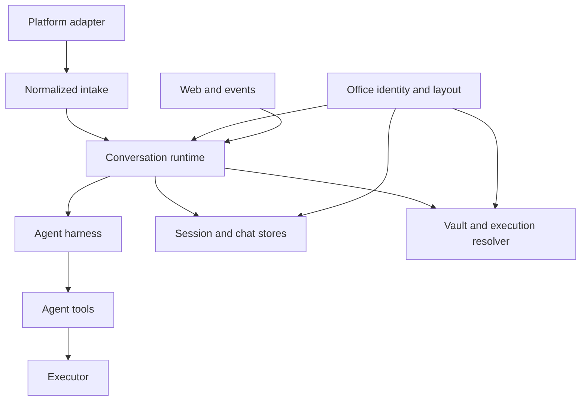

このページでは、mikan の**アーキテクチャ上のインターフェース**、すなわちサブシステム、プロセス、永続化、パッケージのいずれかの境界をまたぐ契約を説明します。エクスポートされたヘルパーをすべて列挙したものではありません。1 つのサブシステム内でのみ使われるヘルパーは、TypeScript が現在 `export` としてマークしていても実装の詳細です。

## 安定性レベル

| レベル           | 意味                                                              | 互換性の期待                                                  |
| ---------------- | ----------------------------------------------------------------- | ------------------------------------------------------------- |
| Public           | npm consumers によって import される                              | 保持するか、意図的にバージョン管理する                        |
| Host integration | runtime を埋め込む、または platform/runtime backend を追加する    | integration が存在する限り保持する                            |
| Wire / persisted | ディスクに保存されるか、プロセス/ネットワーク境界を越えて送られる | 明示的に移行する。reader はサポート対象の古い形式を許容すべき |
| Internal         | mikan CLI 内部のモジュールを接続する                              | call sites と tests を協調させれば変更してよい                |

`src/index.ts` は wildcard の re-export ではなく明示的な export リストで、`src/test/public-api.test.ts` がそれを snapshot するため、意図しない追加は CI で失敗します。それでも、通常の bot integration に必要な範囲を超えて harness を公開しています。下の表を意図された契約として扱い、残りの分割については [コア簡素化](/core-simplification/) を参照してください。

## 境界マップ


```mermaid
flowchart TD
  P["Platform adapter"] --> I["Normalized intake"]
  I --> R["Conversation runtime"]
  R --> H["Agent harness"]
  H --> T["Agent tools"]
  T --> E["Executor"]
  R --> S["Session and chat stores"]
  R --> V["Vault and execution resolver"]
  O["Office identity and layout"] --> R
  O --> S
  O --> V
  W["Web and events"] --> R
```

runtime は調整役です。platform は harness の永続化を知ってはならず、harness は platform SDK オブジェクトを知ってはならず、tools は実行がローカル、コンテナ化、リモートのいずれであるかを知ってはなりません。office モジュールは、runtime・stores・vault のいずれもが conversation を指し示すのに使う identity と paths を供給します。

## メンテナーの責任範囲と seam 一覧

次の 8 つの責任範囲が長期的な役割分担です。owner は自分の port の背後で実装を自由に変えられますが、port を変えるときは両側と、下に挙げる契約テストを更新する必要があります。これらの範囲はコードの所有を表すもので、プロセスや権限の隔離ではありません。

| 責任範囲               | 主なモジュール                                                           | 所有するもの                                                                                                                                 | 引き渡すもの                                                                                                         |
| ---------------------- | ------------------------------------------------------------------------ | -------------------------------------------------------------------------------------------------------------------------------------------- | -------------------------------------------------------------------------------------------------------------------- |
| **Platform entry**     | `src/adapters/`、`src/types.ts`                                          | SDK の正規化、intake の順序、platform への応答の転送、`trustModel` を含む `MessagingInfo`                                                    | platform 中立の `ConversationEvent`、`ConversationContext`、capability port                                          |
| **Office identity**    | `src/office/`                                                            | `OfficeAddress`/`OfficeKey` の導出、`Workspace`/`Office` のレイアウト値、office の materialization と workspace projection、registry journal | path を事前計算した凍結済みの `Office` 値と、現在の policy に基づく projection 解決。永続的な raw-id ↔ office の対応 |
| **Runtime/session**    | `src/runtime/`、`src/sessions/`                                          | session key の文法、session ごとの直列化、chat/session 同期、runner lifecycle、stop/reset、shutdown                                          | runner への検証済み event。execution resolution への office と actor の入力                                          |
| **Harness/tools**      | `src/harness/`、`src/harness/tools/`                                     | model turn、execution resolution、budgets、tool schema、skills、subagents、host capability 呼び出し                                          | `ConversationResponder` への出力と `Executor` 操作。platform SDK オブジェクトは受け取らない                          |
| **Scheduled events**   | `src/events/`                                                            | event の wire protocol、parser/builder、1 つの office に限定された host store、ファイル名の検証、scheduler lifecycle                         | harness/Web への `EventStore`。platform messaging への正規化済み event                                               |
| **Sandbox/workspace**  | `src/sandbox/`                                                           | executor の実装、mount topology、runtime/host の path context、管理 container の lifecycle、ファイル転送                                     | path と credential の能力を宣言した具体的な `Executor`                                                               |
| **Vault/web/security** | `src/vault/`、`src/adapters/web/`、`src/sandbox/identity.ts`             | credential identity と注入 policy、host 専用の portal/token 面、mount 衝突チェック、セキュリティ上重要な認可判断                             | vault policy への actor/trust 入力。credentials は選ばれた executor にだけ渡す                                       |
| **Config/CLI**         | `src/settings/`、`src/cli/`、`src/migrations/`、`src/adapters/commands/` | 起動/flag の文法、settings の永続化、state migration、command manifest                                                                       | 有効な settings と決定的な command 一覧                                                                              |

ある conversation の harness instance は他の instance から context が隔離されていますが、それはファイルシステムやプロセスの sandbox ではありません。Sandbox executor が変えるのは tools がどこで実行され、どの mount を受け取るかです。`host` モードと、管理されない `container:*`・`cloudflare:*` モードは office visibility を強制しません。seam をレビューするときはこれらを分けて考えてください。

### owner をまたぐ seam

以下の producer/consumer の組が、サポートされる橋渡しです。記載された producer が表現と順序を所有し、consumer は自分で組み立て直さずに port や正規の parser を使う必要があります。

| Seam                      | Producer → consumer                                                                      | 不変条件、順序、失敗時の動作                                                                                                                                                                                                                                                                                                                                                                                                                                                                                                                                   |
| ------------------------- | ---------------------------------------------------------------------------------------- | -------------------------------------------------------------------------------------------------------------------------------------------------------------------------------------------------------------------------------------------------------------------------------------------------------------------------------------------------------------------------------------------------------------------------------------------------------------------------------------------------------------------------------------------------------------- |
| Platform intake           | Platform entry → Runtime/session                                                         | intake の順序は **magic word → trigger policy → attachments → log → busy policy → queue → dispatch** です。`stop` は trigger policy、attachment 処理、queue を通りません。無効な conversation や他の conversation の session identity は queue に入る前に失敗し、attachment の失敗は呼び出し元へ伝わります。                                                                                                                                                                                                                                                   |
| Office identity           | Platform entry → Office identity → Runtime/session、stores、vault、settings              | adapter は intake で `OfficeAddress` を作ります。consumer は `Office`/`Workspace` の値を受け取り、directory 名は使いません。`Office.ensure()` は directory を作る**前に** office を registry に記録するため、registry が列挙できない office directory は存在しません。                                                                                                                                                                                                                                                                                         |
| Session identity          | Platform entry / Runtime/session → Runtime/session、harness、stores                      | `src/sessions/session-key.ts` が生の platform 値である `conversationId[:suffix]` を所有します。platform による上書きはその conversation に属する場合だけ受け付け、そうでなければ導出は例外を投げます。runtime の状態は office **と** session key の組で引くため、session key が別の office の状態を選ぶことはありません。session key を直接分割する consumer はありません。                                                                                                                                                                                    |
| Command inventory         | Config/CLI → Platform entry、Runtime/session、web/session view                           | `COMMAND_MANIFEST` が唯一の一覧です。組み込み command は認識した形式を消費し、一致しない slash テキストは agent への prompt のままです。`stop` は magic word であり handler ではありません。                                                                                                                                                                                                                                                                                                                                                                   |
| Runtime to harness        | Runtime/session → Harness/tools                                                          | `handleEvent` は key を導出し、同じ key は直列に、別の key は並行に実行します。thread の bootstrap は実行中の親 session の確定を待ちます。`bindRun` が可変なので、platform tool pack は runner ごとに作られます。                                                                                                                                                                                                                                                                                                                                              |
| Run output                | Harness/tools → Platform entry                                                           | harness が出すのは**応答ソース**、つまり platform 中立の Markdown/GFM で、ユーザーへの mention は `<@userName>` と書きます。それをネイティブな表示に変えるのは完全に adapter の仕事です。Slack はすべての送信経路で `<@userName>` を `<@U…>` に解決し、どの adapter も model を platform 固有のマークアップへ誘導してはなりません。任意の responder 機能は feature-detect します。1 回の実行内では応答操作が呼び出し順を保ちます。adapter はバッファしてもストリームしてもかまいませんが、harness の永続化や SDK オブジェクトを harness に見せてはなりません。 |
| Runtime ↔ sandbox path    | Runtime/session → Sandbox/workspace → Harness/tools                                      | runtime は host workspace と、`<runtime workspace root>/<officeKey>` という runtime cwd を渡します。office key は両側で同じ path 要素を指すので、境界をまたいでも path の意味は変わりません。executor は `getWorkspacePath`/`getPathContext` を提供します。prompt と tool の出力は runtime path を使い、host 側の attachment 変換は宣言された context を使います。対応付けた root の外の path は変換しません。これは path の契約であり、ファイルシステム隔離の保証ではありません。                                                                             |
| Executor file transport   | Sandbox/workspace → Harness/tools                                                        | tools は `Executor.readFile`/`writeFile` を使い、shell のクォート処理には頼りません。exec しかできない転送は共通の base64 分割実装を使い、書き込みは stage してから rename し、転送エラーはエラーのまま扱います。                                                                                                                                                                                                                                                                                                                                              |
| Trust and vault           | Platform entry → Runtime/session → Vault/web/security → Sandbox/workspace                | `MessagingInfo.trustModel` は actor 解決に渡され、vault policy は platform 名の文字列ではなくこの値で決まります。省略時は `membership` です。`open-trigger` には ambient な shared vault のコピーが渡ることはなく、その ambient 経路を使うのは `image`/`cloudflare` だけです。明示的な vault のプロビジョニングは別の管理判断です。                                                                                                                                                                                                                            |
| Settings and live runners | Config/CLI（commands と admin は adapter）→ 設定ファイルと Runtime/session               | `applyConversationSettings` は LLM の変更を書き込む**前に** cached runner を破棄し、実行中はどちらの操作も拒否します。mount の組み合わせは runner の環境に焼き込まれるため、`applyOfficeVisibility` も visibility の変更に対して同じ動作をします。グローバルな LLM 設定は先に書き込み、待機中の runner を破棄し、実行中のものは実行完了後に破棄して stale として報告します。sandbox のリソース上限と Slack の返信設定は使用時に読み直すため、runner は破棄しません。                                                                                           |
| Web capability bridge     | Vault/web/security → Runtime/session と commands                                         | portal store は任意の runtime サービスです。portal URL があるのに対応する store がない場合、その portal を使った時点で失敗します。それ以外で store がなければ、無効/未設定の動作になります。route の payload は同梱 UI の契約であり、汎用の REST API ではありません。                                                                                                                                                                                                                                                                                          |
| Scheduled events          | Harness/tools と Admin → `OfficeEventStore` 経由で Runtime/session                       | 記録は office の host 専用 State dir に置かれ、どの sandbox にも mount されません。`event` tool と Admin は、その office に結び付いた store を通してのみ event にアクセスし、payload もその store 自身の office を指す必要があります。writer は `buildEventPayload`、reader は `parseEventPayload` を使います。secret を event のテキストに入れてはなりません。                                                                                                                                                                                                |
| History persistence       | Platform entry → `log.jsonl`。Runtime/session と Harness/tools → office の `sessions.db` | platform の真実と agent の真実は分けたままにします。chat sync は platform のメッセージを発言者付きの user entry として session にコピーし、メッセージ ID で重複を除き、assistant メッセージは決して書きません。                                                                                                                                                                                                                                                                                                                                                |

これらの橋渡しは、context の隔離と sandbox を意図的に区別しています。新しい owner は、path から credential の認可を推測したり、platform 名から platform の trust を推測したりしてはなりません。

## 1. パッケージインターフェース

npm のエントリポイントは `@geminixiang/mikan` で、`src/index.ts` によって実装されています。

### サポートされるエントリポイントグループ

| グループ            | 主なシンボル                                                                                               | Consumer                                                                     |
| ------------------- | ---------------------------------------------------------------------------------------------------------- | ---------------------------------------------------------------------------- |
| Runtime embedding   | `createConversationRuntime`、`ConversationRuntime`、`ConversationRuntimeOptions`                           | platform と execution の依存を供給する host                                  |
| Office と workspace | `createWorkspace`、`createOfficeAddress`、`officeKey`、`Workspace`、`Office`、`OfficeAddress`、`OfficeKey` | すべての embedder。`createConversationRuntime` は `Workspace` を必要とします |
| Platform contract   | `MessagingBot`、`ConversationEvent`、`ConversationContext`、`ConversationResponder`、`MessagingInfo`       | platform adapters と embedders                                               |
| Commands            | `CommandHandler`、`CommandContext`、`CommandServices`、`dispatchCommand`                                   | 決定的な commands を追加する host                                            |
| Execution           | `Executor`、`SandboxConfig`、`SandboxAdapter`、`createExecutor`、`parseSandboxArg`、`validateSandbox`      | runtime backends と host                                                     |
| Harness embedding   | `MikanAgentSession`、`SessionStore`、`MikanModels`、settings および event-format functions                 | 上級の embedders。通常の bot integration ではありません                      |

パッケージの `exports` map が宣言するパスだけが public です。それ以外の生成済み `dist/` パスや `src/` ソースパスの import はサポートされません。

## 2. Platform intake と response のインターフェース

ソース: `src/types.ts`（`src/index.ts` によって re-export）。

### `ConversationEvent`

`MessagingEventHandler` に配信される platform 中立なトリガーです。

| フィールド            | 契約                                                                                         |
| --------------------- | -------------------------------------------------------------------------------------------- |
| `address`             | 正規の `OfficeAddress`（`platform` + 生の `conversationId`）。adapter が intake 時に作成する |
| `conversationKind`    | `direct` または `shared`。session と credential のポリシーに影響する                         |
| `ts`                  | トリガーとなった platform message の識別子                                                   |
| `thread_ts`           | 任意の parent/root platform message 識別子                                                   |
| `user`                | Platform user 識別子                                                                         |
| `text`                | platform mention 除去後のテキスト                                                            |
| `attachments`         | すでに host paths にダウンロード済みのファイル                                               |
| `sessionKey`          | 任意の platform 選択の override。指定がなければ session policy によって導出される            |
| `vaultConversationId` | credential ルーティングにのみ使われる任意の代替 identity                                     |

### `ConversationContext`

同じ実行に対する、office identity、より豊かな正規化済み message、response port、platform メタデータを保持します:

```ts
interface ConversationContext {
  address: OfficeAddress;
  message: ConversationMessage;
  responder: ConversationResponder;
  platform: MessagingInfo;
}
```

`ConversationMessage` と `ConversationEvent` は現在、message id、session、conversation kind、user、text、attachments、thread identity を重複して持っており、いずれも `address` を保持するようになりました。adapters は両方の表現を一貫させ続ける必要があります。これは内部の互換性のための seam であり、新しい integration にとって望ましいモデルではありません。

### `ConversationResponder`

runtime/harness の出力 port です。必須の操作は、最終テキスト、置換、診断、tool status、typing/working 状態、file upload、response 削除をカバーします。Streaming（`appendResponseDelta`、`finishResponse`）と reaction（`react`）は任意の機能です。

Capability ルール: 呼び出し側は任意メソッドを feature-detect しなければなりません。adapter は出力を buffer してもよく、streaming をネイティブに実装してもよいですが、1 つの実行に対する呼び出し順序を保持しなければなりません。

### `MessagingBot`

host に面した platform port です。次を組み合わせます:

- lifecycle: `start()` と `stop()`；
- outbound messages: `postMessage`、`updateMessage`、任意の upload/reaction/private replies；
- intake scheduling: `enqueueEvent`；
- discovery/policy: `getMessagingInfo()`。

`MessagingInfo.trustModel` はセキュリティに関わります。`membership` は、sandbox type が `image` または `cloudflare` の場合に ambient shared vault を許可します。誰でも agent をトリガーできる面は `open-trigger` を返さなければなりません。

`MessagingBot` が host に面した唯一の adapter インターフェースです。lifecycle と messaging capabilities を別の浅いインターフェースには分割しません。

## 3. Runtime オーケストレーションのインターフェース

ソース: `src/runtime/types.ts` と `src/runtime/conversation-runtime.ts`。

`createConversationRuntime(options)` は公開の `ConversationRuntime` オーケストレーターを返します。`src/runtime/` 内では `SessionLifecycle` が runner resource の単一 authority であり、per-session の直列化、materialization、lease、settlement、invalidation、disposal、idle eviction、shutdown を所有します。runtime オーケストレーターは command、stop/reset、platform-facing workflow を所有します。

### Input メソッド

| メソッド                                                                  | セマンティクス                                                                            |
| ------------------------------------------------------------------------- | ----------------------------------------------------------------------------------------- |
| `handleEvent(event, bot, context)`                                        | office と導出された session key の組で直列化し、command または agent run を dispatch する |
| `runSession(options)`                                                     | すでに直列化済みの 1 単位を実行する。制御された host 用途を想定                           |
| `handleStop(address, sessionKey, bot)` / `forceStop(address, sessionKey)` | 協調的/ユーザーに見える stop か、即時の内部 stop か                                       |
| `handleNewCommand(...)`                                                   | abort し、永続化された session state をリセットし、cached runner を破棄する               |

### Control と inspection

| メソッド                         | セマンティクス                                                                                      |
| -------------------------------- | --------------------------------------------------------------------------------------------------- |
| `isRunning(address, sessionKey)` | 現在のプロセス内での実行状態                                                                        |
| `getRunningSessions()`           | admin/observability 面向けのスナップショット。各要素は `address` を持つ                             |
| `refreshConversation(address)`   | 会話の cached runner を破棄し、次の実行で設定から再構築する。実行中なら `false` を返す              |
| `refreshAllConversations()`      | 待機中のすべての会話の runner を破棄し、実行中のものは実行完了後に破棄して、実行中の address を返す |
| `shutdown(timeoutMs?)`           | 新しい作業を拒否し、runners を停止し、期限まで in-flight の作業を待つ                               |

session スコープのエントリポイントはすべて `OfficeAddress` を受け取ります。raw conversation id の bridge はなく、platform と Admin surface が platform-scoped address を明示的に運びます。

`ConversationRuntimeOptions` は、`workspace`（`createWorkspace` が返す `Workspace`）、sandbox/resource サービス、任意の portal token stores、任意の commands、model registry、proactive な platform 操作、platform tool-pack factories を供給します。vault と portal stores が欠けている場合は無効化された実装に degrade します。portal URL を設定しつつその store を設定しない場合、使用時にエラーになります。

並行性の不変条件: 1 つの office と session key の組に対する呼び出しは直列で、異なる session keys は並行して実行され得ます。runner を使う各操作は内部 lifecycle lease を保持するため、settings invalidation、eviction、shutdown が操作途中で runner を dispose することはありません。platform tool pack は runner ごとに作成され、グローバルに共有されることはありません。`bindRun` がその run binding を書き換えるためです。

## 4. Command インターフェース

ソース: `src/adapters/commands/manifest.ts`、`src/adapters/commands/types.ts`、`src/adapters/commands/registry.ts`。

`COMMAND_MANIFEST` は、slash 形式とネイティブ登録を導出するために使われる platform 向けのインベントリです。`CommandHandler.tryHandle(context)` は実行の契約です。handlers は順に実行され、最初に `true` を返したものが message を消費します。

認識された組み込み commands は runner 作成前に処理されます。どのコマンドにも一致しないスラッシュ付き message は、依然として通常の agent prompt です。`stop` は platform intake の magic word であり `CommandHandler` ではありません。`session` は唯一受け付けられる bare command です。

`CommandContext` は、正規化された actor/conversation identity、response と bot の port、command text、プライバシー状態、`CommandServices` を含みます。command handlers は platform SDK event に手を伸ばしてはなりません。

## 5. Harness インターフェース

ソース: `src/harness/index.ts`、`src/harness/runner.ts`、`src/sessions/session-store.ts`、`src/harness/models.ts`、`src/harness/types.ts`。

### `MikanAgentSession`

model turn loop、message 永続化、retries、compaction、budget circuit breakers、abort の挙動を所有します。外部から意味のある操作は、prompt/run、subscribe、abort、model/thinking 選択、disposal です。

### `SessionStore`

1 つの office のすべての session を所有します。office の State dir にある 1 つの pi-durable SQLite storage、`sessions.db` です（ADR 0018）。top-level session は storage の root conversation で、それ以外の各 session は session key で見つかる conversation です。session 名と直近の run 記録は durable document に保存されます。`SessionHeader`（id、createdAt、parentSessionId）は session と、それがどの親から fork したかを示します。live な storage を所有できるのは 1 つのプロセスだけです。`mikan migrate` は 0.5.3 の session file を取り込みます。entries は message、custom、compaction からなる一本の線形トランスクリプトです。モデルが見る内容は `buildSessionContext()`、context に残っている entries は `getContextEntries()` で読み、storage を直接読まないでください。

### `MikanModels`

`MikanModels` は組み込みの `pi-ai` models と `<state-dir>/models.json` のカスタム provider を解決します。provider credentials はそのファイルか環境変数から解決されます。Vault credentials は別の境界です。tool execution に注入されるものであり、host 側の model client を認証するために使われるものではありません。

### Subagent profiles

subagent は必ず名前付きの profile で起動されます。実行ごとの自由形式の設定はサポートされる面ではありません。`loadSubagentProfiles` がそれらを解決します。`src/harness/subagent-profiles.ts` の組み込み profile が正式な定義であり（`worker`、`software-engineer`、`devops-engineer`、`data-scientist`、`account-manager`、`business-development`、`creative-producer`、`ad-operations-specialist`、`summarizer`）、`<workspace>/agents/<name>.md` ファイルは同名の組み込みを置き換えるのではなく**パッチ**します。そのため operator は tools と prompt を書き直すことなく `model:` だけを上書きできます。どの組み込みとも名前が一致しないファイルは新しい profile を定義し、自前の `tools` を指定する必要があります。不正なファイルは診断として記録されスキップされ、throw されることはありません。

### Harness events と budgets

Harness listeners は model/tool のライフサイクルイベントを観測します。Budget settings は tokens、cost、duration、LLM calls に上限を設けます。budget の超過は run を abort し `budget_exceeded` を emit します。これは終端の結果であり、retry のシグナルではありません。

## 6. Tool と platform capability のインターフェース

ソース: `src/harness/tools/types.ts`。

Core tools は、runner が供給する executor と host services を使います。`src/events/index.ts` の `EventStore` は 1 つの office のスケジュールされた event に対する正規の CRUD port です。無効な event JSON は `payload: null` として引き続き列挙可能で、admin が診断または削除できます。

`PlatformToolPackFactory` は runner ごとに private な `PlatformToolPack` を作成します。`bindRun` は、その tools が現在の platform/conversation に適用されるかどうかを選択します。この factory 境界は、GitHub 固有の tools を core tool list から締め出しつつ、conversation をまたぐ mutable な binding を防ぎます。

## 7. Sandbox と executor のインターフェース

ソース: `src/sandbox/types.ts` と `src/sandbox/index.ts`。

### `SandboxConfig`

この discriminated union は現在 `host`、`container`、`image`、`cloudflare` をサポートします。解析構文と成熟度は [Sandbox](/ja/sandbox/) にあります。

### `Executor`

これは安定した実行境界であり、最も重要な sandbox 契約です:

| 操作                          | 要件                                                                        |
| ----------------------------- | --------------------------------------------------------------------------- |
| `exec`                        | stdout、stderr、exit code を返す。可能な場合は timeout/abort を尊重する     |
| `readFile` / `readFileBase64` | shell parsing レイヤーを追加せずに content を転送する                       |
| `writeFile`                   | stage して置換し、中断された write が target を truncate できないようにする |
| `getWorkspacePath`            | host workspace root を runtime から見える root にマップする                 |
| `getPathContext`              | host/runtime の path セマンティクスと任意の逆マッピングを宣言する           |
| `getSandboxConfig`            | 使用中の具体的な configuration を返す                                       |

Remote/exec のみの実装は base64 chunked な file transport を共有します。Tool 実装は、`cat`、`printf`、quoting プロトコルを構築するのではなく、executor の file メソッドを呼び出さなければなりません。

### `SandboxAdapter`

adapter は 1 つの CLI 値を認識し、任意でそれを検証し、任意で executor を作成します。`image` には意図的に直接の executor がありません。actor/vault 解決が先に具体的な container をプロビジョニングします。

型は export されていますが、adapter 登録は現在 `src/sandbox/index.ts` 内部の閉じたリストです。外部の consumers は `parseSandboxArg` や `createExecutor` に adapter を追加できません。

## 8. Vault と execution-resolution のインターフェース

ソース: `src/vault/types.ts`。注入と ambient コピーの policy は `src/vault/index.ts`。

`VaultManager` は、正規の actor key によって credential env と mount files を解決し、private/shared vaults を列挙・変更し、storage が有効かどうかを報告します。Secrets は host-only の state directory 配下に存在します。

Credential フローは次のとおりです:

1. runtime が platform trust、conversation、user、sandbox topology を供給する。
2. execution resolver が Workspace projection を解決し、actor/vault identity を選択する。
3. `VaultManager` が env と mounts を解決し、collision と backend capability checks が grant 全体を検証する。
4. 1 つの execution decision が projection、runtime path context、およびその run 用 credentials だけを持つ concrete executor を返す。
5. Prompt memory/skills と filesystem execution は同じ decision を使い、authorization を別々に再計算しない。

Host sandbox 実行は決して vault 注入を受け取りません。Open-trigger platforms は決して ambient shared vault を受け取りません。これらはセキュリティの不変条件であり、便宜的な既定値ではありません。

## 9. Office、session、chat、identity のインターフェース

ソース: `src/office/*`、`src/sessions/*`、`src/adapters/shared.ts`、`src/sandbox/identity.ts`。

### `Workspace` と `Office`

conversation は **office** です。すなわち 1 つの永続作業領域と 1 つのデータ境界です。これを表す値は 2 つあり、どちらも frozen です。

```ts
const workspace = createWorkspace({ root, stateDir });
const office = workspace.office(createOfficeAddress("slack", "C0AAAAAA1"));
```

`Workspace` はプロセスごとに 1 度だけ構築され、デプロイ全体で共有する面（`root`、`stateDir`、`memoryPath`、`skillsDir`、`agentsDir`、`reservedNames`）と office factory を所有します。`Office` は 1 つの conversation の paths — `key`、`dir`、`memoryPath`、`skillsDir`、`attachmentsDir`、`logPath`、host 専用の `stateDir` と `sessionsPath` — を事前計算し、`ensure()` を公開します。

この境界をまたぐ規則:

- **文字列ではなく値を渡す。** consumer は `Office` を受け取ります。root と id から path を組み立てることはせず、directory の basename から identity を推測することもありません。
- **`ensure()` が唯一の materialization seam。** これは office を registry に記録してから directory を作成します。この順序により、クラッシュ時に directory のない記録が残ることはあり得ますが（無害で、次のメッセージで再作成されます）、registry が列挙できない匿名の directory が生じることは決してありません。冪等であり、メッセージごとの path 解決に使える程度に軽量です。
- **Office の値は address ごとに memoize される**ため、hot path で `workspace.office(address)` を繰り返し呼んでも、コストは SHA-256 ではなく map の参照です。

### `OfficeAddress` と `OfficeKey`

`OfficeAddress` は `{ platform, conversationId }` — platform とその生の conversation id です。`officeKey(address)` はストレージ上の identity `v1-<platform>-<readable-id>-<16 桁の hex>` を導出します。中央の可読部分は診断用で、identity の構成要素は SHA-256 prefix です。同じ key が host 上、sandbox runtime 内、vault 内の office directory を指すため、生の conversation id が一致する 2 つのプラットフォームが互いの files や認証情報に到達することは決してありません。

Office key は**元に戻せません**。`OfficeRegistry`（`office-registry.json`、host 専用）が永続的な raw-id ↔ office の対応です。Admin の一覧と `mikan office list` は `listRegisteredOffices` を通してこれを読みます。

### 2 つの記録

| 記録                                             | 目的                                                          |
| ------------------------------------------------ | ------------------------------------------------------------- |
| `<office>/log.jsonl`                             | Platform の真実: user/bot の messages と attachments          |
| `<state-dir>/conversations/<office>/sessions.db` | Agent の真実: prompts、model/tool messages、forks、compaction |

これらを統合しないでください。Chat history は欠けている top-level agent session を再構築できますが、agent sessions には platform に現れなかったデータが含まれます。

### Session keys

Session keys は `conversationId[:suffix]` を使い、**生の platform 値のまま**です。この文法が office key を目にすることはありません。所有するのは `src/sessions/session-key.ts` だけであり、呼び出し側は文字列を直接分割せず、`deriveSessionKey`、`conversationIdOf`、`threadSuffixOf` を使わなければなりません。runtime state は office と session key の組で指し示され、それこそが、グローバルには一意でない生の key を安全にしているものです。

`ChatHistorySync` は、top-level/thread のスコープを解決し、新しい sessions を bootstrap し、新しい platform log entries を同期し、sessions をリセットし、active な parent run の seal を待つ thread を調整します。

### Attachments

`src/adapters/shared.ts` の `saveIncomingAttachments(office, items)` が attachment の規約を単独で所有します: `office.attachmentsDir` 配下のサニタイズ済み `<timestamp>_<name>` ファイル名と、agent が読む workspace 相対の `<officeKey>/attachments/<file>` path です。最初の書き込みの前に office を materialize し、throw する代わりに item ごとの失敗を返すため、各 adapter は自身の失敗ポリシーを保てます。

## 10. Event-file インターフェース

ソース: `src/events/index.ts`。

各 office のスケジュールされた event は JSON ファイルで、その office の host 専用 State dir、`<state-dir>/conversations/<officeKey>/events/` に置かれます。正規の union は次のとおりです:

```ts
type EventFilePayload =
  | { type: "immediate"; conversationId: string; text: string /* common optional fields */ }
  | { type: "one-shot"; conversationId: string; text: string; at: string }
  | { type: "periodic"; conversationId: string; text: string; schedule: string; timezone: string };
```

共通の任意フィールドは `platform`、`conversationKind`、`userId` です。`channelId` は legacy な読み取り alias としてのみ受け付けられます。すべての writer は `buildEventPayload` を、すべての reader は `parseEventPayload` を使います。

`OfficeEventStore` は 1 つの office に結び付いています。別の office のファイル名は「見つからない」扱いになり、`create` は決して上書きせず、payload は store 自身の office を指す必要があります。agent は `event` tool を通してのみ自分の event にアクセスし、どの sandbox もこの directory を mount しません。

## 11. 永続化されたファイルシステムのインターフェース

| パス                                                  | 所有者                | 可視性 / 互換性                                |
| ----------------------------------------------------- | --------------------- | ---------------------------------------------- |
| `<state-dir>/settings.json`                           | config                | Host-only のグローバル設定                     |
| `<state-dir>/office-registry.json`                    | office registry       | Host-only の office 一覧                       |
| `<state-dir>/conversations/<officeKey>/settings.json` | config/admin          | Host-only の conversation override             |
| `<state-dir>/models.json`                             | harness model catalog | Host-only のカスタム providers/models          |
| `<state-dir>/vaults/**`                               | vault/login           | Host-only の secrets と mount files            |
| `<workspace>/MEMORY.md`                               | agent/user            | Sandbox から見える永続 memory                  |
| `<workspace>/skills/**/SKILL.md`                      | skills                | Sandbox から見える prompt instructions         |
| `<workspace>/agents/*.md`                             | subagent profiles     | 組み込みに対するインストールごとの model patch |
| `<workspace>/<officeKey>/log.jsonl`                   | platform adapters     | Append-only な platform history                |
| `<state-dir>/conversations/<officeKey>/sessions.db`   | session store         | host 専用の agent history（pi-durable SQLite） |
| `<state-dir>/conversations/<officeKey>/events/*.json` | event store           | host 専用のスケジュール event                  |

`MEMORY.md`、`skills`、`events`、`agents` は workspace root の予約名（`RESERVED_WORKSPACE_NAMES`）であり、それ以外の workspace root エントリはすべて office directory です。`<state-dir>/vaults/` 配下の conversation スコープの vault directory は、conversation スコープの sandbox では office key で命名されます。`host` モードは user、`container` モードは container 名で索きます。

state directory は sandbox から見える workspace 内に置いてはなりません。重要な state files は atomic な private write を使い、append-only logs は append セマンティクスを使います。

## 12. HTTP インターフェース

ソース: `src/adapters/web/server.ts` と portal modules。これらのルートは mikan の同梱 UI を支えるものであり、汎用の public REST API ではありません。

| 面             | ルート                                                                                 | 認証モデル                                |
| -------------- | -------------------------------------------------------------------------------------- | ----------------------------------------- |
| Health         | `GET /health`                                                                          | なし。`{ "ok": true }` を返す             |
| GitHub webhook | `POST /github/webhook`                                                                 | Webhook の署名（`GITHUB_WEBHOOK_SECRET`） |
| Login          | `GET /link`、`POST /api/link/complete`、`POST /api/oauth/start`、`GET /oauth/callback` | 短命の link token と OAuth state          |
| Session viewer | `GET /session`、`GET /session/stream`、任意の `POST /session/message`                  | Session-view token                        |
| Admin          | `GET /admin`、`/admin/api/*`                                                           | Admin token                               |

Admin endpoints は、conversation のインベントリ/状態/使用状況、グローバルおよび conversation の settings、models、workspace files、skills、events、platform 設定、login/session links をカバーします。ルートの payload は内部の UI 契約であり、同梱 frontend とともに進化し得ます。

## 13. Host/runtime の安全境界

### Path とキャッシュの安全性

- `attach` は fail-closed です。path は runtime workspace の内側に留まる必要があり、現在の `Executor` を通して読み、host 専用のファイルに stage してから platform のアップローダーに渡します。model の入力から host path がそのまま渡ることはなく、リモート sandbox も host path にフォールバックせず同じ executor 転送を使います。
- conversation 単位の cached runner の変更は、書き込みの前に待機中の runner を破棄し、実行中なら書き込みを拒否します。グローバルな LLM の変更は先に永続化し、実行中の conversation を無効化待ちとして記録し、実行の完了後にその runner を破棄します。
- vault key はどれも安全な 1 つの path 要素です。読み取りは fail-closed で、書き込みや shared vault のコピーはファイルシステムに触れる前に無効な key を拒否します。

## 契約テスト対応表

これらのテストスイートが守るのは個々の helper ではなく、owner をまたぐ契約です。ある seam を変えるときは、その行のスイートをすべて一緒に実行してください。複数の行にまたがる変更では、それらの和集合を実行します。public、永続化、wire の変更では、さらに `npm test` 全体の実行が必要です。

| 契約の行                                     | 一緒に実行するテスト                                                                                                                                                                                                  | その行が守るもの                                                                                                                              |
| -------------------------------------------- | --------------------------------------------------------------------------------------------------------------------------------------------------------------------------------------------------------------------- | --------------------------------------------------------------------------------------------------------------------------------------------- |
| Platform intake、応答、command 一覧          | `src/test/adapters-intake.test.ts`、`src/test/slack-context.test.ts`、`src/test/discord-context.test.ts`、`src/test/telegram-context.test.ts`、`src/test/github-context.test.ts`、`src/test/command-manifest.test.ts` | 正規化された event/context identity、magic word と busy の順序、attachment の受け渡し、responder の機能、platform をまたぐ唯一の command 一覧 |
| Office identity とレイアウト                 | `src/test/office-address.test.ts`、`src/test/office-layout.test.ts`、`src/test/office-registry.test.ts`、`src/test/workspace-projection.test.ts`                                                                      | key の導出と検証、凍結されたレイアウト値、記録してから mkdir する順序、projection の mount 構成                                               |
| State migration                              | `src/test/migrations.test.ts`、`src/test/migrate-sessions-sqlite.test.ts`、`src/test/cli-commands.test.ts`                                                                                                            | 0.5.3 からの一連のアップグレード、冪等性、dry run、所有権、適用済み migration の記録                                                          |
| Session identity と runtime の順序           | `src/test/session-key.test.ts`、`src/test/session-lifecycle.test.ts`、`src/test/session-runtime.test.ts`、`src/test/chat-history-sync.test.ts`、`src/test/session-store.test.ts`                                      | session の所有権/path 検証、runner の lease と settlement、key ごとの直列化、親 thread の bootstrap、chat/session の分離、session storage     |
| Harness、tools、skills、subagents            | `src/test/harness-runner.test.ts`、`src/test/harness-skills.test.ts`、`src/test/subagent-runner.test.ts`、`src/test/subagent-tool.test.ts`、`src/test/agent-runner.test.ts`                                           | 実行の lifecycle、永続化、skill の検出、上限付きの委譲実行、runner と tool の seam                                                            |
| Runtime、workspace projection、executor 転送 | `src/test/execution-resolver.test.ts`、`src/test/sandbox-path-context.test.ts`、`src/test/executor-files.test.ts`、`src/test/agent-prompt.test.ts`、`src/test/agent-attachments.test.ts`                              | host/runtime の path 対応、mount の構成と衝突時の失敗、credential 能力のエラー、shell に厳しいファイルの往復                                  |
| Trust、vault、portal のセキュリティ          | `src/test/vault-policy.test.ts`、`src/test/vault.test.ts`、`src/test/login.test.ts`、`src/test/oauth-link-server.test.ts`、`src/test/token-store.test.ts`                                                             | `trustModel` の policy、identity key の検索、明示的な credential のプロビジョニング、login/OAuth token の境界、無効時の portal の動作         |
| Settings と live runner のキャッシュ         | `src/test/settings-apply.test.ts`、`src/test/settings.test.ts`、`src/test/model-command.test.ts`、`src/test/sandbox-command.test.ts`、`src/test/admin-portal.test.ts`                                                 | 書き込み seam の順序、葉単位の settings マージ、busy/stale の結果、command/admin とディスク・cached runner の一致                             |
| Event-file のスケジュール wire format        | `src/test/event-format.test.ts`、`src/test/event-tool.test.ts`、`src/test/events.test.ts`                                                                                                                             | builder/parser の互換性、legacy の読み取り、queue が満杯のときの動作、routing、削除/保持の順序                                                |
| 公開パッケージの境界                         | `src/test/public-api.test.ts`、`src/test/embedder-example.test.ts`、`src/test/boot.test.ts`                                                                                                                           | export map の利用者、embedding の構築、CLI の起動/flag の文法                                                                                 |

絞り込んで実行するときは、対象ファイルをそのまま Vitest に渡します。例:

```sh
npm test -- src/test/session-key.test.ts src/test/session-runtime.test.ts src/test/chat-history-sync.test.ts src/test/session-store.test.ts
```

## 変更の手順

seam を変える前に、それを `Public`、`Host integration`、`Wire / persisted`、`Internal` のどれかに分類し、次を確認します:

1. producer と consumer が引き続き同じ正規の type、parser、builder、port を使っている。
2. identity、trust、path、並行性、lifecycle、順序の意味がこのページに書かれ、対応する契約の行でカバーされている。
3. サポート対象の古い永続データが引き続き読み込める。そうでなければ、変更に明示的な migration と読み取りの互換性が含まれている。
4. 任意の機能は引き続き feature-detect されている。任意メソッドがないことを、必須操作の失敗として扱わない。
5. エラーは所有する境界で失敗する。無効な identity は queue の前に失敗し、壊れた状態は黙って置き換えられず、実行中の settings 変更でディスクとキャッシュが食い違わず、安全でない credential や mount の解決がより強い権限へフォールバックしない。
6. 実装は owner をまたぐ契約を広げずに、既存の port の背後に留められる。

context の隔離を sandbox の同義語として使わないでください。サポートされる producer、consumer、不変条件、契約テストの行が変わったら、このページを更新してください。
