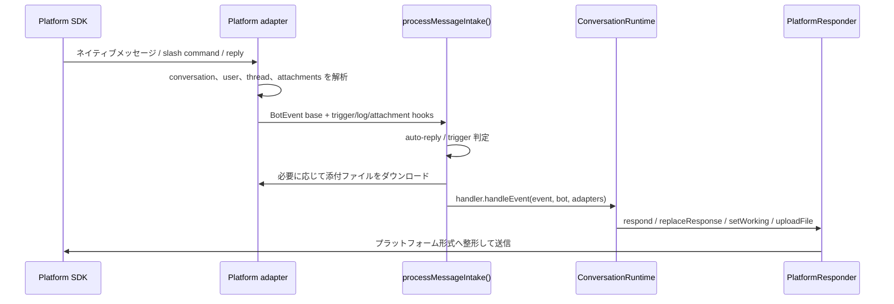

import { Aside, Card, CardGrid, LinkCard, Steps } from "@astrojs/starlight/components";

目的は、`src/runtime/*` と `src/agent.ts` が各プラットフォームの SDK、thread ルール、メッセージ更新 API、ファイルダウンロード方式を知らなくてよい状態にすることです。

<CardGrid>
  <Card title="イベント正規化" icon="setting">
    プラットフォーム固有の message、mention、slash command、reply を共通の `BotEvent` に変換します。
  </Card>
  <Card title="Session routing" icon="open-book">
    channel、thread、reply chain から `sessionKey` を算出し、会話を正しいセッションへ送ります。
  </Card>
  <Card title="返信機能" icon="rocket">
    `PlatformResponder` が返信、更新、typing/working 状態、ファイルアップロードをカプセル化します。
  </Card>
</CardGrid>

## 接続層の役割

<Steps>

1. メッセージ、mention、slash command、reply などのプラットフォームイベントを受け取る。
2. そのメッセージが mikan を起動すべきか判定する：DM、mention、thread reply、auto-reply policy。
3. 共通の `BotEvent` と `ChatMessage` に変換する。
4. `sessionKey` を計算し、異なる channel、thread、reply を正しい session に対応させる。
5. 添付ファイルをダウンロードし、workspace の `attachments/` に書き込む。
6. `PlatformResponder` を作成し、返信、更新、typing/working 状態、ファイルアップロードをカプセル化する。
7. イベントを `BotHandler`、つまり `ConversationRuntime` に渡す。

</Steps>

共通型は `src/adapter.ts` から export され、実装側の型は `src/types.ts` と `src/adapters/types.ts` にあります。

## 共通フロー

## 共通ユーティリティ

| ファイル                    | 用途                                                                                           |
| --------------------------- | ---------------------------------------------------------------------------------------------- |
| `src/adapter.ts`            | `Bot`、`BotEvent`、`ChatMessage`、`PlatformResponder` などの共通 interface を外部公開。        |
| `src/adapters/intake.ts`    | 共通メッセージ入口フロー：trigger、log、attachment、queue、handler 呼び出し順。                |
| `src/adapters/shared.ts`    | 共通の retry、queue、長文メッセージ分割、log、stop target resolution。                         |
| `src/adapters/streaming.ts` | streaming response を buffer してから flush し、プラットフォームメッセージの更新頻度を抑える。 |

## プラットフォーム差分

<LinkCard
  title="Slack"
  description="Socket Mode、channel/thread session、Block Kit、assistant status、Slack mrkdwn。"
  href="platform-adapters/slack/"
/>
<LinkCard
  title="Discord"
  description="Gateway events、guild/DM/thread channel、slash command、Discord Markdown、typing indicator。"
  href="platform-adapters/discord/"
/>
<LinkCard
  title="Telegram"
  description="Long polling、private/group chat、reply-based session、Telegram HTML mode、photo/document download。"
  href="platform-adapters/telegram/"
/>

## コア runtime との境界

<Aside type="note" title="依存方向">
  プラットフォーム adapter はプラットフォーム SDK とメッセージ形式を知っていて構いませんが、agent
  がタスクをどう実行するかは知るべきではありません。
</Aside>

コア runtime は次の共通抽象だけに依存します。

- `BotEvent`：1 回のユーザーまたはプラットフォームイベント。
- `Bot`：post message、upload file などのプラットフォーム bot 能力。
- `BotAdapters`：1 回のイベントに付随する `message`、`responseCtx`、`platform` metadata。
- `PlatformResponder`：agent が返信するときに使うチャネル。

新しいプラットフォームを追加する場合は、まずこれらの抽象を実装し、プラットフォーム SDK の詳細を `src/runtime/*` や `src/agent.ts` に持ち込まないでください。
