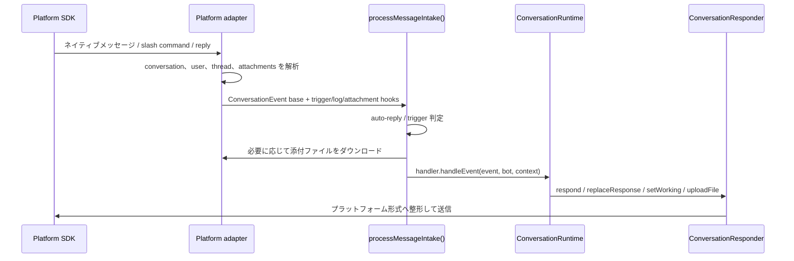

import { Aside, Card, CardGrid, LinkCard, Steps } from "@astrojs/starlight/components";

目的は、`src/runtime/*` と `src/agent.ts` が各プラットフォームの SDK、thread ルール、メッセージ更新 API、ファイルダウンロード方式を知らなくてよい状態にすることです。

<CardGrid>
  <Card title="イベント正規化" icon="setting">
    プラットフォーム固有の message、mention、slash command、reply を共通の `ConversationEvent`
    に変換します。
  </Card>
  <Card title="Session routing" icon="open-book">
    channel、thread、reply chain から `sessionKey` を算出し、会話を正しいセッションへ送ります。
  </Card>
  <Card title="返信機能" icon="rocket">
    `ConversationResponder` が返信、更新、typing/working
    状態、ファイルアップロードをカプセル化します。
  </Card>
</CardGrid>

## 接続層の役割

<Steps>

1. メッセージ、mention、slash command、reply などのプラットフォームイベントを受け取る。
2. そのメッセージが mikan を起動すべきか判定する：DM、mention、thread reply、auto-reply policy。
3. 共通の `ConversationEvent` と `ConversationMessage` に変換する。
4. `sessionKey` を計算し、異なる channel、thread、reply を正しい session に対応させる。
5. 添付ファイルを conversation office の `attachments/` ディレクトリにダウンロードする。
6. `ConversationResponder` を作成し、返信、更新、typing/working 状態、ファイルアップロードをカプセル化する。
7. イベントを `MessagingEventHandler`、つまり `ConversationRuntime` に渡す。

</Steps>

共通型は `src/adapter.ts` から export され、実装側の型は `src/types.ts` と `src/adapters/types.ts` にあります。

## Conversation identity

adapter は、そのプラットフォームの生の conversation id を外部 I/O 境界に留めます。SDK から受け取り、
SDK へ返すのがその値だからです。ストレージはそうではありません。`platform` と生 id が `OfficeAddress`
を構成し、`src/office/` モジュールがそれを hash して office key にします。この key が、その conversation
の directory、host 側の state、vault を命名します。adapter がこれらの path を自分で組み立てることは
なく、address を渡して `Office` を受け取ります。ディスクを見るときに知っておくと役立つ帰結が 1 つ
あります。Slack channel `C0123456789` は `<workspace>/C0123456789/` ではなく
`<workspace>/v1-slack-c0123456789-<digest>/` に存在します。

Slash command の登録とルーティングは、adapter ごとのインベントリではなく `src/commands/manifest.ts`
から導出されます。そのため、新しいコマンドは 1 か所のエントリから、対応するすべてのプラットフォームに
届きます。

## 共通フロー

## 共通ユーティリティ

| ファイル                               | 用途                                                                                                                                 |
| -------------------------------------- | ------------------------------------------------------------------------------------------------------------------------------------ |
| `src/adapter.ts`                       | `MessagingBot`、`ConversationEvent`、`ConversationMessage`、`ConversationResponder` などの共通 interface を外部公開。                |
| `src/adapters/intake.ts`               | 共通メッセージ入口フロー：magic word、trigger policy、attachments、log、busy policy、queue、そして dispatch。                        |
| `src/adapters/shared.ts`               | 共通の retry、queue、長文メッセージ分割、stop target resolution、および office への 2 つの書き込み経路（`log.jsonl`、attachments）。 |
| `src/adapters/progressive-renderer.ts` | progressive response の buffering、tool progress、finalization、platform write の直列化を担う。                                      |

`saveIncomingAttachments()` が attachment の規約全体を所有します — office の `attachments/`
ディレクトリ配下のサニタイズ済み `<timestamp>_<name>` と、runtime に渡される office 相対の path —
そのため、conversation の path を自分で組み立てる adapter はありません。

## プラットフォーム差分

<LinkCard
  title="Slack"
  description="Socket Mode、channel/thread session、Block Kit、assistant status、Slack mrkdwn。"
  href="/ja/platform-adapters/slack/"
/>
<LinkCard
  title="Discord"
  description="Gateway events、guild/DM/thread channel、slash command、Discord Markdown、typing indicator。"
  href="/ja/platform-adapters/discord/"
/>
<LinkCard
  title="Telegram"
  description="Long polling、private/group chat、reply-based session、Telegram HTML mode、photo/document download。"
  href="/ja/platform-adapters/telegram/"
/>
<LinkCard
  title="GitHub"
  description="GitHub App polling、issue/PR 会話、watermark 重複排除、コメントベースの応答。"
  href="/ja/platform-adapters/github/"
/>

## コア runtime との境界

<Aside type="note" title="依存方向">
  プラットフォーム adapter はプラットフォーム SDK とメッセージ形式を知っていて構いませんが、agent
  がタスクをどう実行するかは知るべきではありません。
</Aside>

コア runtime は次の共通抽象だけに依存します。

- `ConversationEvent`：1 回のユーザーまたはプラットフォームイベント。
- `MessagingBot`：post message、upload file などのプラットフォーム messaging bot 能力。
- `ConversationContext`：1 回のイベントに付随する `message`、`responder`、`platform` metadata。
- `ConversationResponder`：agent が返信するときに使うチャネル。

新しいプラットフォームを追加する場合は、まずこれらの抽象を実装し、プラットフォーム SDK の詳細を `src/runtime/*` や `src/agent.ts` に持ち込まないでください。
