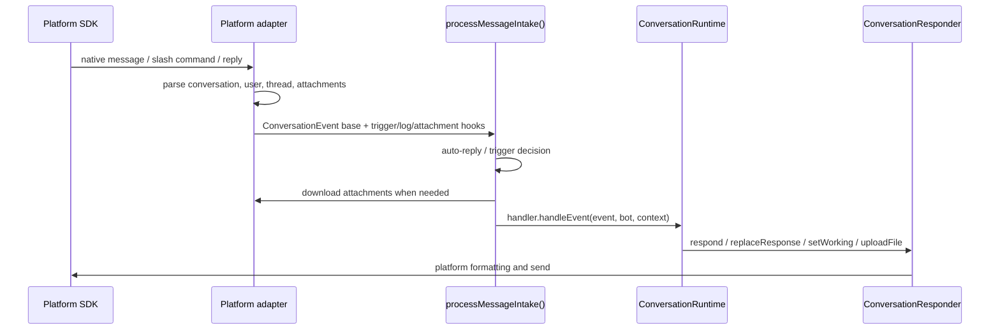

import { Aside, Card, CardGrid, LinkCard, Steps } from "@astrojs/starlight/components";

Their goal is to keep `src/runtime/*` and `src/agent/` from knowing each platform's SDK, thread rules, message update API, or file download behavior.

<CardGrid>
  <Card title="Event normalization" icon="setting">
    Convert native platform messages, mentions, slash commands, or replies into a shared
    `ConversationEvent`.
  </Card>
  <Card title="Session routing" icon="open-book">
    Compute `sessionKey` from channels, threads, and reply chains so conversations enter the right
    session.
  </Card>
  <Card title="Response capability" icon="rocket">
    `ConversationResponder` wraps replies, updates, typing/working state, and file uploads.
  </Card>
</CardGrid>

## What adapters do

<Steps>

1. Receive platform events such as messages, mentions, slash commands, or replies.
2. Decide whether the message should trigger mikan: DM, mention, thread reply, or auto-reply policy.
3. Convert it to shared `ConversationEvent` and `ConversationMessage` values.
4. Compute `sessionKey` so different channels, threads, and replies map to the right session.
5. Download attachments into the conversation office's `attachments/` directory.
6. Create a `ConversationResponder` that wraps replies, updates, typing/working state, and file uploads.
7. Hand the event to `MessagingEventHandler`, which is `ConversationRuntime`.

</Steps>

Shared types are exported from `src/adapter.ts`; implementation types live in `src/types.ts` and `src/adapters/types.ts`.

## Conversation identity

Adapters keep their platform's raw conversation id at the external I/O boundary — that is what they
receive from the SDK and what they send back. Storage does not: `platform` plus the raw id form an
`OfficeAddress`, which the `src/office/` module hashes into the office key naming the conversation's
directory, its host-side state, and its vault. Adapters do not construct those paths themselves;
they pass the address and receive an `Office` value. One consequence worth knowing when reading
disk: a Slack channel `C0123456789` lives at `<workspace>/v1-slack-c0123456789-<digest>/`, not at
`<workspace>/C0123456789/`.

Slash-command registration and routing derive from `src/commands/manifest.ts` rather than per-adapter
inventories, so a new command reaches every platform that opts in from one entry.

## Shared flow

## Shared utilities

| File                                   | Purpose                                                                                                                         |
| -------------------------------------- | ------------------------------------------------------------------------------------------------------------------------------- |
| `src/adapter.ts`                       | Exports shared interfaces such as `MessagingBot`, `ConversationEvent`, `ConversationMessage`, and `ConversationResponder`.      |
| `src/adapters/intake.ts`               | Shared message intake flow: magic word, trigger policy, attachments, log, busy policy, queue, then dispatch.                    |
| `src/adapters/shared.ts`               | Shared retry, queue, long message splitting, stop target resolution, and the two office write paths (`log.jsonl`, attachments). |
| `src/adapters/progressive-renderer.ts` | Owns progressive response buffering, tool progress, finalization, platform write serialization, and response-error reporting.   |

`saveIncomingAttachments()` owns the whole attachment convention — a sanitized
`<timestamp>_<name>` under the office's `attachments/` directory and an office-relative path handed
to the runtime — so no adapter composes conversation paths itself.

## Platform differences

<LinkCard
  title="Slack"
  description="Socket Mode, channel/thread sessions, Block Kit, assistant status, and Slack mrkdwn."
  href="/platform-adapters/slack/"
/>
<LinkCard
  title="Discord"
  description="Gateway events, guild/DM/thread channels, slash commands, Discord Markdown, and typing indicators."
  href="/platform-adapters/discord/"
/>
<LinkCard
  title="Telegram"
  description="Long polling, private/group chat, reply-based sessions, Telegram HTML mode, and photo/document downloads."
  href="/platform-adapters/telegram/"
/>
<LinkCard
  title="GitHub"
  description="GitHub App polling, issue/PR conversations, watermark dedup, and comment-based responses."
  href="/platform-adapters/github/"
/>

## Boundary with the core runtime

<Aside type="note" title="Dependency direction">
  Platform adapters may know platform SDKs and message formats, but should not know how the agent
  executes tasks.
</Aside>

The core runtime depends only on these shared abstractions:

- `ConversationEvent`: one user or platform event.
- `MessagingBot`: platform messaging bot capabilities, such as post message and upload file.
- `ConversationContext`: `message`, `responder`, and `platform` metadata attached to an event.
- `ConversationResponder`: the channel used by the agent to reply.

When adding a platform, implement these abstractions first. Do not bring platform SDK details into `src/runtime/*` or `src/agent/`.
