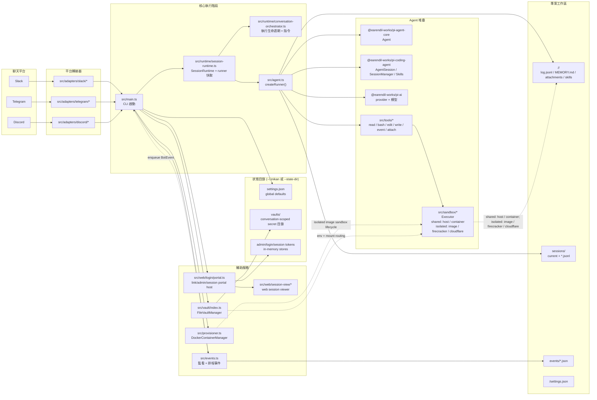
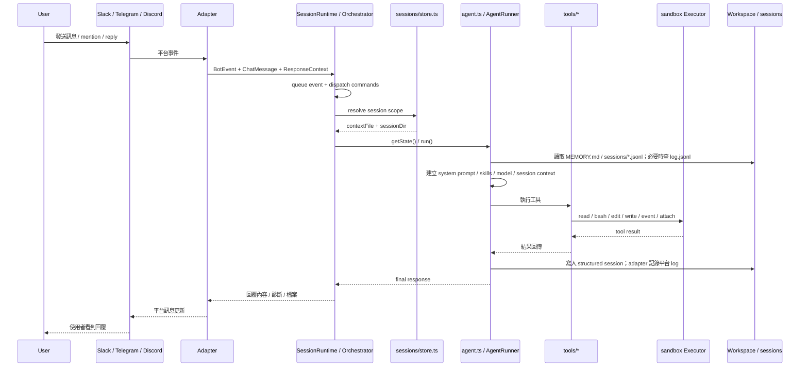
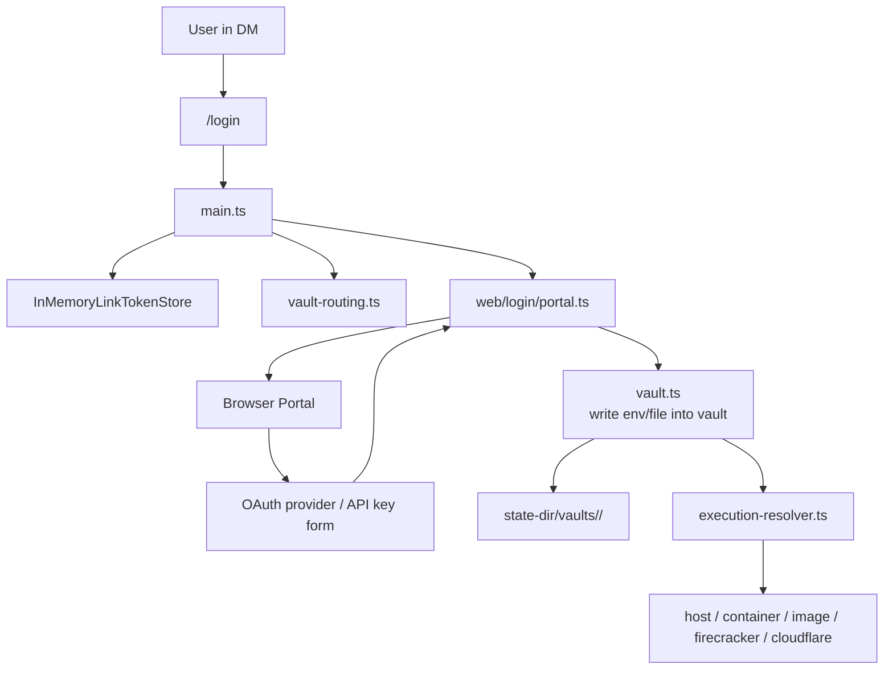

## 1. 系统总览



## 2. 主要分层

### A. 平台接入层

平台接入层的完整说明请见 [平台接入层](platform-adapters.md)，各平台细节请见 [Slack](platform-adapters/slack.md)、[Discord](platform-adapters/discord.md)、[Telegram](platform-adapters/telegram.md)。

- `src/adapters/slack/*`
- `src/adapters/telegram/*`
- `src/adapters/discord/*`
- `src/adapter.ts`

职责：

- 接收 Slack / Telegram / Discord 原生事件
- 转成统一的 `BotEvent`、`ChatMessage`、`ChatResponseContext`
- 依平台规则计算 `sessionKey`
- 封装回覆、typing、working、档案上传等平台差异

### B. 核心协调层

- `src/main.ts`
- `src/runtime/session-runtime.ts`
- `src/runtime/conversation-orchestrator.ts`
- `src/sessions/store.ts`
- `src/sessions/chat-session-manager.ts`

职责：

- 启动 CLI、读取 env / args / `settings.json`
- 建立 `SessionRuntime` 作为各平台 bot 的 `BotHandler`
- 透过 `ConversationOrchestrator` dispatch `/login`、`/session`、`stop`、`new` 等控制命令
- 管理 `conversationStates` 与 per-session queue，避免同一 session 重复执行
- 决定每个 session scope 对应哪个 `AgentRunner`

### C. Agent 执行层

- `src/agent.ts`
- `src/context.ts`
- `src/tools/*`

职责：

- 建立 `AgentRunner`
- 载入模型、skills、memory、session context
- 将使用者讯息送入 `pi-agent-core` / `pi-coding-agent`
- 把 tool calls 接到本地 `read/bash/edit/write/event/attach`
- 把 tool 结果回写 session，并透过 adapter 回传给平台

### D. 执行环境层

- `src/sandbox/*`
- `src/provisioner.ts`
- `src/execution-resolver.ts`

职责：

- 统一抽象 `Executor`
- sandbox runtime 分成两类：
  - shared: `host` / `container:<name>`，同一个 host 或指定 container 共用
  - isolated: `image:<image>` / `firecracker:*` / `cloudflare:*`，依 actor/conversation/vault 路由到隔离的执行环境
- 透过 `ActorExecutionResolver` 依 user/conversation/vault 决定实际 executor
- 在 `image` 模式下自动建立与回收 Docker container，并把 `image:<image>` 解析成 concrete `container:<name>` executor

### E. 状态与持久化层

- `src/sessions/store.ts`
- `src/sessions/chat-session-manager.ts`
- `src/context.ts`
- `src/vault/index.ts`

职责：

- session 档案管理： `sessions/current` 与 `*.jsonl`
- `log.jsonl` 与 structured session 的双轨历史保存
- workspace / conversation 级别 `MEMORY.md`
- per-conversation vault 凭证与 mount / env 注入

### F. 辅助服务层

- `src/web/login/*`
- `src/web/admin/*`
- `src/web/session-view/*`
- `src/events.ts`

职责：

- `src/web/login/portal.ts` 目前是 link server host，会挂接 login/vault、admin、session-view routes
- 提供 Web login portal，支援 API key 与 OAuth 写入 vault
- 提供 admin portal，支援 conversation/settings/workspace/events/skills 管理与 link generation
- 提供 session viewer；目前可显示 session timeline，且在 interactive wiring 启用时可透过 `/session/message` 送讯息
- 监看 `events/*.json`，把排程事件重新注入 bot 流程

## 3. 讯息处理流程



## 4. Session 与档案布局

`mikan` 的上下文不是只靠记忆体，而是主要落在 workspace 目录:

```text
<workspace>/
├── MEMORY.md                  # workspace 級記憶
├── events/                    # 排程與外部事件
└── <conversationId>/
    ├── settings.json          # conversation-local overrides
    ├── MEMORY.md              # conversation 級記憶
    ├── log.jsonl              # 可 grep 的人類可讀訊息歷史
    ├── attachments/           # 平台附件下載
    ├── scratch/               # 執行中的工作區
    ├── skills/                # conversation 自訂 skills
    └── sessions/
        ├── current            # top-level session pointer
        ├── <timestamp>_<id>.jsonl
        └── <scope_id>.jsonl   # thread / reply scoped sessions
```

设计重点：

- `log.jsonl` 是平台对话纪录：Slack/Discord/Telegram 实际发生过什么
- `sessions/*.jsonl` 是 LLM 工作上下文/工作纪录：mikan 拿什么给 LLM 看，以及 LLM/tool 做了什么
- top-level session 用 `current` 指标，但 `current` 不是 channel history；缺失时可从 `log.jsonl` 重建最近 top-level 工作上下文
- thread / reply session 用固定档名，让 scoped session 可被单独追踪
- Slack top-level 讯息共用 channel session；Slack thread replies 使用 `conversationId:threadTs`
- Slack events 会先建立 top-level anchor message，再用 `conversationId:anchorTs` 执行

## 5. Login / Vault / Sandbox 关系



重点：

- 凭证不直接进 workspace
- vault 存在 `--state-dir`
- 执行时才由 conversation vault 路由到对应 sandbox
- `image` / `firecracker` / `cloudflare` 模式使用 per-actor/per-conversation vault routing；`container:<name>` 使用 shared container vault；`host` 不注入 vault env

## 6. Events 与一般对话的差异

`events/*.json` 会被 `EventsWatcher` 监看，之后转成 `BotEvent` 再走一次正常流程。
也就是说 events 不是独立执行器，而是「另一个讯息入口」。

这让下列能力共用同一套机制:

- session context
- vault routing
- tool execution
- 平台回覆
- stop / running state 管理

## 7. 架构结论

如果用一句话总结，`mikan` 的核心其实是：

> 一个以 `main.ts` 为协调中心、以 `agent.ts` 为执行核心、以 `session/vault/sandbox` 为基础设施的多平台 AI agent bot。

可以把它理解成 6 个核心子系统:

1. 平台转接器
2. Bot runtime 协调
3. Agent + tools
4. Session/context 持久化
5. Vault + sandbox execution routing
6. Web/event side services
