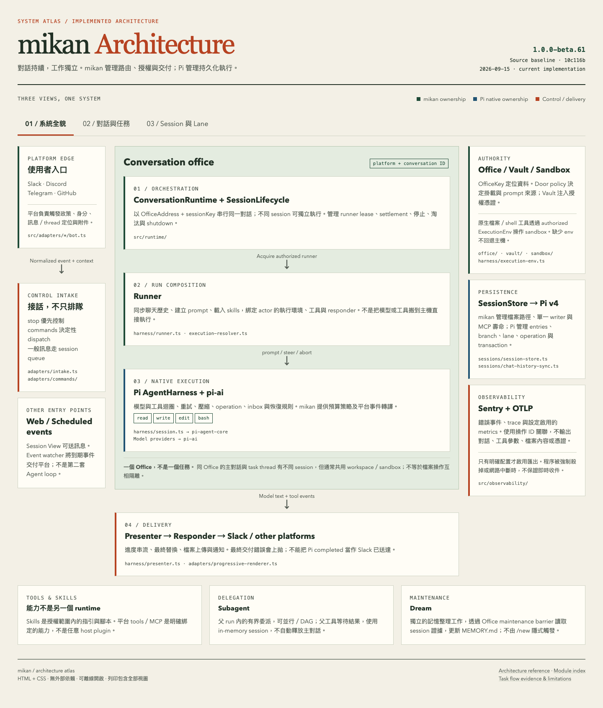
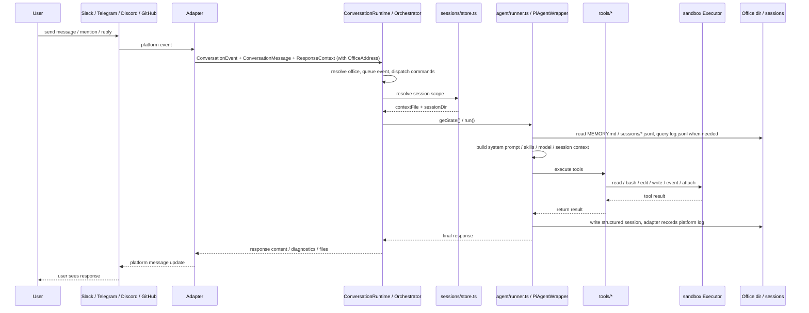
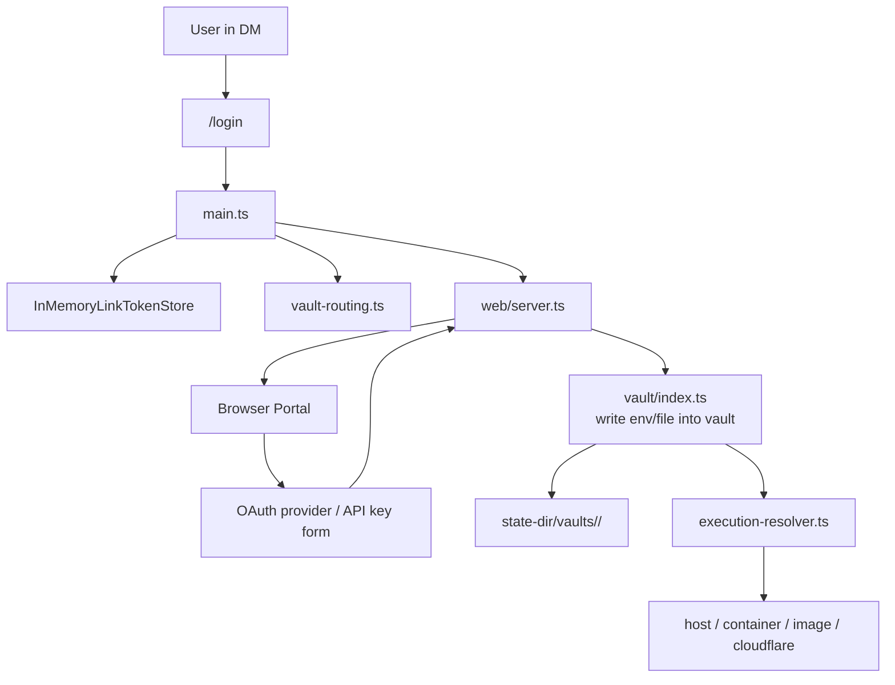

## 1. 系统概览



## 2. 主要分层

### A. 平台适配器层

共享适配器契约请参阅[平台适配器](platform-adapters.mdx)，各平台详情请参阅 [Slack](platform-adapters/slack.md)、[Discord](platform-adapters/discord.md)、[Telegram](platform-adapters/telegram.md) 和 [GitHub](platform-adapters/github.md)。

- `src/adapters/slack/*`
- `src/adapters/telegram/*`
- `src/adapters/discord/*`
- `src/adapters/github/*`
- `src/adapter.ts`

职责：

- 接收原生 Slack / Telegram / Discord 事件，或轮询 GitHub issue 和 pull request
- 转换为统一的 `ConversationEvent`、`ConversationMessage` 和 `ConversationResponder` 值，每个值都携带该对话的 `OfficeAddress`
- 按平台规则计算 `sessionKey`
- 封装回复、输入状态、工作状态和文件上传等平台差异

原始平台标识符只停留在这些外部 I/O 边界上。再往内，一切都以 `OfficeAddress` 来寻址对话。

### B. 核心协调层

- `src/main.ts`
- `src/cli/boot.ts`
- `src/runtime/conversation-runtime.ts`
- `src/adapters/intake.ts`
- `src/commands/manifest.ts`
- `src/sessions/store.ts`
- `src/sessions/chat-history-sync.ts`

职责：

- 将 argv 解析为启动计划（`src/cli/boot.ts`），然后执行它：读取 env / `settings.json`、构建 `Workspace`、运行办公室迁移，并启动所选的平台 bot
- 为每个平台 bot 创建 `ConversationRuntime`，作为 `MessagingEventHandler`
- `stop` 魔法词由 conversation intake（`src/adapters/intake.ts`）在 trigger policy 和排队之前识别
- `/login`、`/session`、`/new` 等控制命令在 `ConversationRuntime.runSession` 内分发；适配器注册与路由所依据的命令清单位于 `src/commands/manifest.ts`
- 按办公室地址加会话密钥来标识每个会话的状态和队列，因此同一时间只有一个会话在运行，而其他会话可以并发进行
- 确定每个会话范围对应哪个 `PiAgentWrapper`

### C. 代理执行层

- `src/agent/`
- `src/harness/*`
- `src/tools/*`

职责：

- 创建 `PiAgentWrapper`
- 加载模型、技能、记忆和会话上下文
- 将用户消息发送到 mikan 自有的代理框架（`src/harness/`，构建于 `pi-agent-core` / `pi-ai` 之上），由它运行轮次循环及自动压缩、自动重试、预算和有界 subagent
- 将工具调用连接到本地 `read/bash/edit/write/event/attach`
- 将工具结果写回会话，并通过适配器返回回复

### D. 执行环境层

- `src/sandbox/*`
- `src/provisioner.ts`
- `src/execution-resolver.ts`

职责：

- 提供统一的 `Executor` 抽象
- 将沙箱运行时分为两类：
  - 共享：`host` / `container:<name>`，共享同一主机或命名容器
  - 隔离：`image:<image>` / `cloudflare:*`，按参与者/对话/vault 路由到隔离执行环境
- 使用 `ActorExecutionResolver` 按用户/对话/vault 确定实际 executor
- 在 `image` 模式下自动创建和回收 Docker 容器，将 `image:<image>` 解析为具体的 `container:<name>` executor

### E. 对话办公室层

- `src/office/*`
- `src/workspace-projection/index.ts`

每个对话都是一间**办公室**：拥有自己的持久工作区域和数据边界。此模块负责这一身份与布局。

职责：

- `createWorkspace({ root, stateDir })` 构建每进程的 `Workspace` 值：工作区根目录、其全局 `MEMORY.md` / `skills/` / `events/` / `agents/`，以及办公室工厂
- `workspace.office(address)` 返回一个冻结的 `Office` 值，其中所有路径均已预先计算——`dir`、`memoryPath`、`skillsDir`、`sessionsDir`、`attachmentsDir`、`logPath` 以及仅主机的 `stateDir`——外加 `ensure()`，即唯一的物化缝隙
- 派生 `OfficeKey`（`v1-<platform>-<readable-id>-<sha256 前缀>`），它在主机上、沙箱运行时内部以及 vault 中都用于命名该办公室
- 维护仅主机的办公室注册表（`office-registry.json`），作为原始 id ↔ 办公室的持久映射，因为 office key 不可逆
- 运行启动时从旧版原始 id 布局的迁移，带日志记录并支持崩溃恢复
- 解析工作区投影：按办公室的门禁策略，将哪些主机路径挂载进沙箱运行时

### F. 状态和持久化层

- `src/sessions/store.ts`
- `src/sessions/chat-history-sync.ts`
- `src/vault/index.ts`

职责：

- 会话文件管理：`sessions/current` 和 `*.jsonl`
- 使用 `log.jsonl` 和结构化会话双轨保存历史记录
- 工作区级和办公室级 `MEMORY.md`
- 按办公室的 vault 凭证及挂载/环境变量注入

### G. 辅助服务层

- `src/web/login/*`
- `src/web/admin/*`
- `src/web/session-view/*`
- `src/events.ts`

职责：

- `src/web/server.ts` 管理 HTTP 服务器并挂载 login/vault、admin、session-view 和 agent-event 路由
- 提供 Web 登录 portal，支持将 API key 和 OAuth 写入 vault
- 提供管理 portal，用于管理对话/设置/工作区/事件/技能并生成链接
- 提供会话查看器；目前可以显示会话时间线，并在启用交互 wiring 时通过 `/session/message` 发送消息
- 监视 `events/*.json`，将计划事件重新注入 bot 流程

## 3. 消息处理流程



## 4. 办公室、会话和文件布局

`mikan` 将沙箱可见的工作数据与以主机为准的设置和凭证分离：

```text
<workspace>/
├── MEMORY.md                  # workspace-level memory
├── skills/                    # workspace-level skills
├── events/                    # the workspace scheduling bus
├── agents/                    # per-install subagent profile patches
└── <officeKey>/               # one conversation office
    ├── MEMORY.md              # office-level memory
    ├── log.jsonl              # grep-friendly platform message history
    ├── attachments/           # platform attachment downloads
    ├── scratch/               # in-progress working area
    ├── skills/                # office-level skills
    └── sessions/
        ├── current            # top-level session pointer
        ├── <timestamp>_<id>.jsonl
        └── <scope_id>.jsonl   # thread / reply scoped sessions

<state-dir>/
├── settings.json              # required global settings
├── office-registry.json       # office inventory + migration journal
├── conversations/
│   └── <officeKey>/settings.json  # host-only conversation overrides
└── vaults/<vaultId>/          # credentials
```

默认 state directory 为 `~/.mikan`。它必须位于沙箱可见的工作区路径之外。`MEMORY.md`、`skills`、`events` 和 `agents` 是工作区根目录的保留名称，永远不会是办公室目录。

设计要点：

- `<officeKey>` 形如 `v1-<platform>-<readable-id>-<hash>`，由平台和原始对话 id 经 SHA-256 派生。中间可读部分仅供诊断；摘要才是身份。因此两个平台即使共用同一个原始对话 id，也会得到不同的目录、设置和 vault
- office key 在主机上和沙箱运行时内部命名同一个目录，因此路径跨越边界时含义不会改变
- office key 无法反推回原始平台 id，所以 `office-registry.json` 会在办公室首次物化时记录其 `(platform, conversationId)`。面向原始 id 的接口——Admin portal、`mikan office claim`——都通过它解析
- `log.jsonl` 是平台对话日志：源平台上实际发生的内容
- `sessions/*.jsonl` 是 LLM 工作上下文/日志：mikan 提供给 LLM 的内容，以及 LLM/工具执行的操作
- 顶层会话使用 `current` 指针，但 `current` 不是频道历史记录；缺失时，可以从 `log.jsonl` 重建近期顶层工作上下文
- 话题/回复会话使用固定文件名，以便分别跟踪限定范围的会话
- 会话密钥保持为原始平台值；运行时状态按办公室加会话密钥寻址，因此一个会话密钥永远不可能选中另一间办公室的 runner 或队列
- Slack 顶层消息共享频道会话；Slack 话题回复使用 `conversationId:threadTs`
- Slack 事件先创建顶层锚点消息，然后使用 `conversationId:anchorTs` 运行

### 门禁策略与工作区投影

一间办公室的沙箱运行时实际能看到什么，取决于**工作区投影**，它由该办公室的门禁策略解析得出：

| 门禁策略   | 布局             | 挂载进运行时的内容                                              |
| ---------- | ---------------- | --------------------------------------------------------------- |
| `isolated` | `conversation`   | 仅 `<officeKey>/`                                               |
| `trusted`  | `shared-support` | `<officeKey>/` 外加工作区的 `MEMORY.md`、`skills/` 和 `events/` |
| `trusted`  | `full`           | 整个工作区根目录                                                |

`isolated` 是默认值，并且始终意味着 `conversation` 布局。门禁策略是数据访问边界；它绝不改变执行或网络隔离。可以在 admin portal 中或用 `/pi-sandbox door` 按办公室设置，其全局默认值位于 `sandbox.workspace`——参阅[配置](/zh-cn/configuration/)。

## 5. Login / Vault / Sandbox 关系



要点：

- 凭证不会直接进入工作区
- vault 位于 `--state-dir`
- 执行时，办公室的 vault 会路由到相应沙箱
- `image` / `cloudflare` 模式按 office key 标识 vault——也就是在工作区和注册表中命名该办公室的同一个字符串；`container:<name>` 使用共享容器 vault；`host` 按用户标识，且不注入 vault 环境变量

## 6. 事件与普通聊天的区别

`EventsWatcher` 监视 `events/*.json`，然后将其转换为 `ConversationEvent` 并再次送入正常流程。
换言之，事件不是独立 executor，而是另一条消息输入路径。

因此，以下能力可以共享同一机制：

- 会话上下文
- vault 路由
- 工具执行
- 平台回复
- 停止/运行状态管理

## 7. 架构总结

一句话概括，`mikan` 的核心是：

> 一个由 `main.ts` 协调、由 `agent/runner.ts` 执行，并由 `office/session/vault/sandbox` 基础设施支持的多平台 AI 代理 bot。

可以将其视为 7 个核心子系统：

1. 平台适配器
2. Bot 运行时协调
3. 代理 + 工具
4. 对话办公室：身份、布局、注册表和工作区投影
5. 会话/上下文持久化
6. Vault + 沙箱执行路由
7. Web/事件辅助服务

办公室是这些子系统共同认可的单位：一个对话、一个目录、一个 vault、一个沙箱运行时、一条数据边界。参阅 [ADR 0003](https://github.com/geminixiang/mikan/blob/main/docs/adr/0003-isolated-conversation-offices.md)、[ADR 0004](https://github.com/geminixiang/mikan/blob/main/docs/adr/0004-persistent-offices-and-ephemeral-factory-floors.md) 和 [ADR 0005](https://github.com/geminixiang/mikan/blob/main/docs/adr/0005-office-address-identity.md)。
