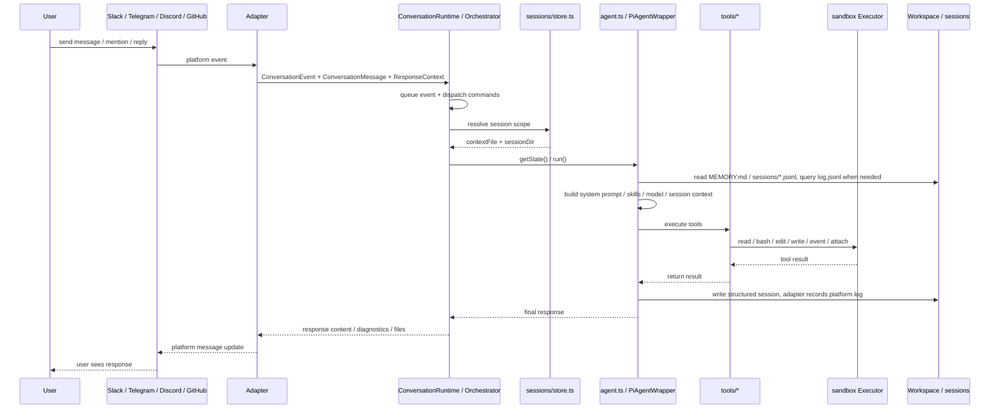
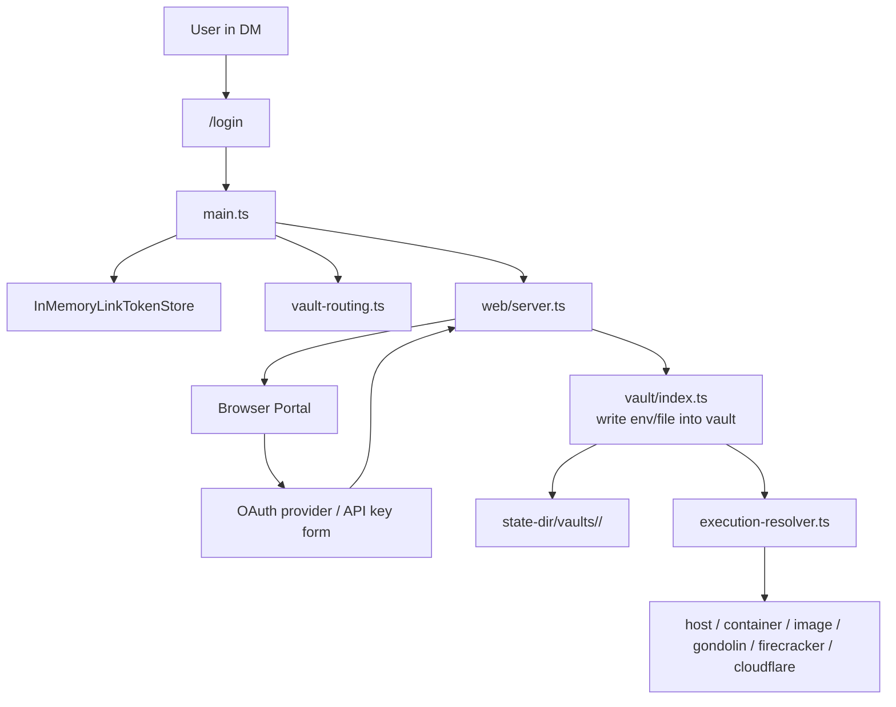

## 1. 系统概览


## 2. 主要分层

### A. 平台适配器层

共享适配器契约请参阅[平台适配器](platform-adapters.mdx)，各平台详情请参阅 [Slack](platform-adapters/slack.md)、[Discord](platform-adapters/discord.md)、[Telegram](platform-adapters/telegram.md) 和 [GitHub](platform-adapters/github.md)。

- `src/adapters/slack/*`
- `src/adapters/telegram/*`
- `src/adapters/discord/*`
- `src/adapters/github/*`
- `src/adapter.ts`

职责：

- 接收原生 Slack / Telegram / Discord 事件，或轮询 GitHub issue 和 pull request
- 转换为统一的 `ConversationEvent`、`ConversationMessage` 和 `ConversationResponder` 值
- 按平台规则计算 `sessionKey`
- 封装回复、输入状态、工作状态和文件上传等平台差异

### B. 核心协调层

- `src/main.ts`
- `src/runtime/conversation-runtime.ts`
- `src/adapters/intake.ts`
- `src/commands/manifest.ts`
- `src/sessions/store.ts`
- `src/sessions/chat-history-sync.ts`

职责：

- 启动 CLI 并读取 env / args / `settings.json`
- 为每个平台 bot 创建 `ConversationRuntime`，作为 `MessagingEventHandler`
- `stop` 魔法词由 conversation intake（`src/adapters/intake.ts`）在 trigger policy 和排队之前识别
- `/login`、`/session`、`/new` 等控制命令在 `ConversationRuntime.runSession` 内分发；适配器注册与路由所依据的命令清单位于 `src/commands/manifest.ts`
- 管理 `conversationStates` 和按会话队列，避免同一会话重复运行
- 确定每个会话范围对应哪个 `PiAgentWrapper`

### C. 代理执行层

- `src/agent.ts`
- `src/harness/*`
- `src/tools/*`

职责：

- 创建 `PiAgentWrapper`
- 加载模型、技能、记忆和会话上下文
- 将用户消息发送到 mikan 自有的代理框架（`src/harness/`，构建于 `pi-agent-core` / `pi-ai` 之上），由它运行轮次循环及自动压缩、自动重试和扩展 hook
- 将工具调用连接到本地 `read/bash/edit/write/event/attach`
- 将工具结果写回会话，并通过适配器返回回复

### D. 执行环境层

- `src/sandbox/*`
- `src/provisioner.ts`
- `src/execution-resolver.ts`

职责：

- 提供统一的 `Executor` 抽象
- 将沙箱运行时分为两类：
  - 共享：`host` / `container:<name>`，共享同一主机或命名容器
  - 隔离：`image:<image>` / `gondolin:default` / `firecracker:*` / `cloudflare:*`，按参与者/对话/vault 路由到隔离执行环境
- 使用 `ActorExecutionResolver` 按用户/对话/vault 确定实际 executor
- 在 `image` 模式下自动创建和回收 Docker 容器，将 `image:<image>` 解析为具体的 `container:<name>` executor

### E. 状态和持久化层

- `src/sessions/store.ts`
- `src/sessions/chat-history-sync.ts`
- `src/vault/index.ts`

职责：

- 会话文件管理：`sessions/current` 和 `*.jsonl`
- 使用 `log.jsonl` 和结构化会话双轨保存历史记录
- 工作区/对话级 `MEMORY.md`
- 按对话的 vault 凭证及挂载/环境变量注入

### F. 辅助服务层

- `src/web/login/*`
- `src/web/admin/*`
- `src/web/session-view/*`
- `src/events.ts`

职责：

- `src/web/server.ts` 管理 HTTP 服务器并挂载 login/vault、admin、session-view 和 agent-event 路由
- 提供 Web 登录 portal，支持将 API key 和 OAuth 写入 vault
- 提供管理 portal，用于管理对话/设置/工作区/事件/技能并生成链接
- 提供会话查看器；目前可以显示会话时间线，并在启用交互 wiring 时通过 `/session/message` 发送消息
- 监视 `events/*.json`，将计划事件重新注入 bot 流程

## 3. 消息处理流程



## 4. 会话和文件布局

`mikan` 将沙箱可见的工作数据与以主机为准的设置和凭证分离：

```text
<workspace>/
├── MEMORY.md                  # workspace-level memory
├── skills/                    # workspace-level skills
├── events/                    # scheduled and external events
└── <conversationId>/
    ├── MEMORY.md              # conversation-level memory
    ├── log.jsonl              # grep-friendly platform message history
    ├── attachments/           # platform attachment downloads
    ├── scratch/               # in-progress working area
    ├── skills/                # conversation-level skills
    └── sessions/
        ├── current            # top-level session pointer
        ├── <timestamp>_<id>.jsonl
        └── <scope_id>.jsonl   # thread / reply scoped sessions

<state-dir>/
├── settings.json              # required global settings
├── conversations/
│   └── <conversationId>/settings.json  # host-only conversation overrides
└── vaults/<vaultId>/          # credentials
```

默认 state directory 为 `~/.mikan`。它必须位于沙箱可见的工作区路径之外。

设计要点：

- `log.jsonl` 是平台对话日志：源平台上实际发生的内容
- `sessions/*.jsonl` 是 LLM 工作上下文/日志：mikan 提供给 LLM 的内容，以及 LLM/工具执行的操作
- 顶层会话使用 `current` 指针，但 `current` 不是频道历史记录；缺失时，可以从 `log.jsonl` 重建近期顶层工作上下文
- 话题/回复会话使用固定文件名，以便分别跟踪限定范围的会话
- Slack 顶层消息共享频道会话；Slack 话题回复使用 `conversationId:threadTs`
- Slack 事件先创建顶层锚点消息，然后使用 `conversationId:anchorTs` 运行

## 5. Login / Vault / Sandbox 关系



要点：

- 凭证不会直接进入工作区
- vault 位于 `--state-dir`
- 执行时，对话 vault 会路由到相应沙箱
- `image` / `gondolin` / `firecracker` / `cloudflare` 模式使用按参与者/对话的 vault 路由；`container:<name>` 使用共享容器 vault；`host` 不注入 vault 环境变量

## 6. 事件与普通聊天的区别

`EventsWatcher` 监视 `events/*.json`，然后将其转换为 `ConversationEvent` 并再次送入正常流程。
换言之，事件不是独立 executor，而是另一条消息输入路径。

因此，以下能力可以共享同一机制：

- 会话上下文
- vault 路由
- 工具执行
- 平台回复
- 停止/运行状态管理

## 7. 架构总结

一句话概括，`mikan` 的核心是：

> 一个由 `main.ts` 协调、由 `agent.ts` 执行，并由 `session/vault/sandbox` 基础设施支持的多平台 AI 代理 bot。

可以将其视为 6 个核心子系统：

1. 平台适配器
2. Bot 运行时协调
3. 代理 + 工具
4. 会话/上下文持久化
5. Vault + 沙箱执行路由
6. Web/事件辅助服务
