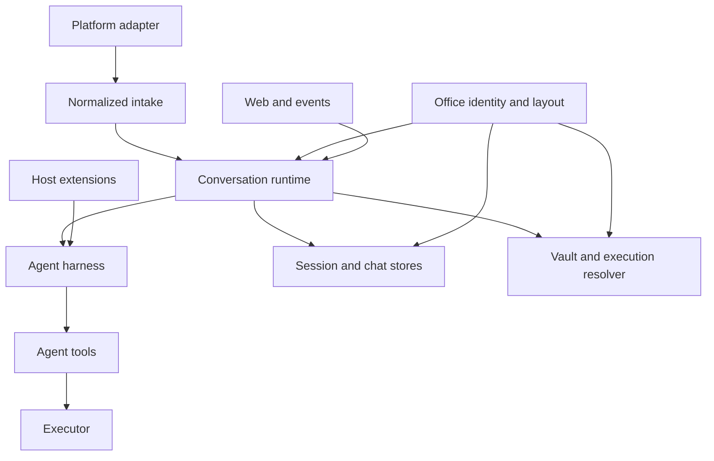

本页记录 mikan 的**架构接口**：跨越子系统、进程、持久化或包边界的契约。它不是每个导出辅助函数的清单。仅在单个子系统内部使用的辅助函数属于实现细节，即使 TypeScript 当前将其标记为 `export`。

## 稳定性级别

| 级别             | 含义                                | 兼容性预期                           |
| ---------------- | ----------------------------------- | ------------------------------------ |
| Public           | 被 npm 使用方或扩展作者导入         | 保持不变或有意进行版本管理           |
| Host integration | 用于嵌入运行时或添加平台/运行时后端 | 只要该集成存在就保持不变             |
| Wire / persisted | 存储在磁盘上或跨进程/网络边界发送   | 显式迁移；读取方应容忍受支持的旧格式 |
| Internal         | 连接 mikan CLI 内部的模块           | 在协调好调用点和测试的情况下可以更改 |

`src/index.ts` 是一份显式的导出清单，而非通配符重新导出，并且 `src/test/public-api.test.ts` 会对其做快照，因此意外新增会导致 CI 失败。它暴露的框架内容仍然多于普通 bot 集成所需；请将下表视为预期的契约，剩余的拆分参见[核心简化](/zh-cn/core-simplification/)。

## 边界地图



运行时是协调者。平台不得知晓框架的持久化，框架不得知晓平台 SDK 对象，工具不得知晓执行是本地、容器化还是远程的。办公室模块提供身份和路径，运行时、各 store 与 vault 都以此来寻址一个对话。

## 维护者归属与缝隙登记

以下七个归属范围是长期的职责划分。所有者可以在其端口背后自由更改实现，但更改端口需要同时更新两侧以及下文列出的契约测试。这些范围描述的是代码归属，而非进程或权限隔离。

| 归属范围               | 主要模块                                                                                  | 拥有                                                                                                | 交付                                                                   |
| ---------------------- | ----------------------------------------------------------------------------------------- | --------------------------------------------------------------------------------------------------- | ---------------------------------------------------------------------- |
| **Platform entry**     | `src/adapters/`、`src/types.ts`                                                           | SDK 规范化、接收顺序、平台响应传输，以及包含 `trustModel` 的 `MessagingInfo`                        | 平台中立的 `ConversationEvent`、`ConversationContext` 和能力端口       |
| **Office identity**    | `src/office/`                                                                             | `OfficeAddress`/`OfficeKey` 派生、`Workspace`/`Office` 布局值、办公室物化、注册表日志，以及旧版迁移 | 路径已预先计算的冻结 `Office` 值；持久的原始 id ↔ 办公室映射           |
| **Runtime/session**    | `src/runtime/`、`src/sessions/`                                                           | 会话密钥语法、per-session 串行化、聊天/会话同步、runner 生命周期、stop/reset 和关闭                 | 交给 runner 的已验证事件；交给执行解析的办公室与 actor 输入            |
| **Harness/tools**      | `src/harness/`、`src/tools/`、`src/agent/`                                                | 模型轮次、会话树持久化、扩展 hook、预算、工具 schema 和主机能力调用                                 | `ConversationResponder` 输出与 `Executor` 操作；它不接收平台 SDK 对象  |
| **Sandbox/workspace**  | `src/sandbox/`、`src/workspace-projection/`、`src/provisioner.ts`                         | Executor 实现、mount 拓扑、runtime/主机路径上下文、资源生命周期和文件传输                           | 一个声明了路径与凭证能力的具体 `Executor`                              |
| **Vault/web/security** | `src/vault/`、`src/web/`、`src/execution-resolver.ts`、`src/sandbox/identity.ts`          | 凭证身份与注入策略、仅主机的 portal/token 界面、mount 冲突检查，以及安全敏感的授权决策              | 交给 vault 策略的 actor/信任输入；凭证只交给选定的 executor            |
| **Config/CLI/package** | `src/config.ts`、`src/settings-mutation.ts`、`src/cli/`、`src/commands/`、`src/packages/` | 启动/flag 语法、设置持久化、命令清单、package 物化与范围解析                                        | 生效设置、确定性的命令清单、扩展根目录，以及只读的 package skill mount |

一个对话的框架实例与其他实例是上下文隔离的，但那不是文件系统或进程沙箱：扩展以主机权限运行在 mikan 主机进程中，而 `sharedDataDir` 明确是多对话数据，其作者必须自行分区。同样地，沙箱 executor 改变的是工具在哪里运行以及它们接收哪些 mount；`host` 模式和 `full` 工作区投影并不是额外的安全保证。审查缝隙时请把这些关注点分开。

### 跨归属缝隙

下列生产者/消费者对是受支持的桥梁。指定的生产者拥有其表示和顺序；消费者必须使用该端口或规范解析器，而不能自行重建。

| 缝隙                      | 生产者 → 消费者                                                             | 不变式、顺序与失败行为                                                                                                                                                                                                                                                                                                                                            |
| ------------------------- | --------------------------------------------------------------------------- | ----------------------------------------------------------------------------------------------------------------------------------------------------------------------------------------------------------------------------------------------------------------------------------------------------------------------------------------------------------------- |
| Platform intake           | Platform entry → Runtime/session                                            | 接收顺序为**魔法词 → trigger policy → 附件 → 日志 → busy policy → 排队 → 分发**。`stop` 会绕过 trigger policy、附件处理和排队。无效对话或外来会话身份会在排队前失败；附件失败会向上传播。                                                                                                                                                                         |
| Office identity           | Platform entry → Office identity → Runtime/session、store、vault 与设置     | 适配器在接收时产生一个 `OfficeAddress`，并据此校验兼容用的原始 id。消费者接受 `Office`/`Workspace` 值，绝不接受目录名。`Office.ensure()` 会**先**把办公室记入注册表，再创建目录，因此不存在注册表无法枚举的办公室目录。                                                                                                                                           |
| Session identity          | Platform entry / Runtime/session → Runtime/session、框架与 store            | `src/sessions/session-key.ts` 拥有 `conversationId[:suffix]`，它是一个原始平台值。平台覆盖值只有在属于该对话时才被接受；否则派生会抛出异常。运行时状态按办公室**加**会话密钥标识，因此一个会话密钥永远无法选中另一间办公室的状态。任何消费者都不得直接切分会话密钥。                                                                                              |
| Command inventory         | Config/CLI/package → Platform entry、Runtime/session 与 web/会话查看器      | `COMMAND_MANIFEST` 是唯一的清单。内置命令在扩展命令之前运行；未匹配的斜杠文本仍是代理提示词；`stop` 是魔法词，而非处理器。                                                                                                                                                                                                                                        |
| Runtime to harness        | Runtime/session → Harness/tools                                             | `handleEvent` 派生密钥并对一个密钥串行化，同时允许其他密钥并发运行。话题引导会等待正在运行的父会话封存。平台工具包是 per-runner 创建的，因为 `bindRun` 是可变的。                                                                                                                                                                                                 |
| Run output                | Harness/tools → Platform entry                                              | 框架发出的是**响应源**：平台中立的 Markdown/GFM，用户 mention 写作 `<@userName>`。把它转换成原生呈现完全是适配器的职责——Slack 在每条出站路径上把 `<@userName>` 解析为 `<@U…>`，且任何适配器都不得引导模型产出平台原生标记。可选的 responder 能力需特性检测。对于单次运行，响应操作保持调用顺序；适配器可以缓冲或流式输出，但不得向框架暴露框架持久化或 SDK 对象。 |
| Runtime ↔ sandbox path    | Runtime/session → Sandbox/workspace → Harness/tools                         | 运行时提供主机工作区和一个 `<runtime workspace root>/<officeKey>` 形式的 runtime cwd；office key 在两侧命名同一个路径段，因此路径在边界处不会改变含义。Executor 提供 `getWorkspacePath`/`getPathContext`。提示词和工具输出使用 runtime 路径，而主机侧附件转换使用已声明的上下文。映射根之外的路径不会被转换。这是路径契约，而非文件系统隔离的声明。               |
| Executor file transport   | Sandbox/workspace → Harness/tools                                           | 工具使用 `Executor.readFile`/`writeFile`，绝不使用 shell 引用协议。仅 exec 的传输使用共享的 base64 分块实现；写入采用暂存并重命名，传输错误仍然是错误。                                                                                                                                                                                                           |
| Trust and vault           | Platform entry → Runtime/session → Vault/web/security → Sandbox/workspace   | `MessagingInfo.trustModel` 被传入 actor 解析；vault 策略按该值标识，而非按平台名称字符串。省略信任时默认为 `membership`；`open-trigger` 绝不接收环境共享 vault 副本，且只有 `image`/`cloudflare` 使用该环境路径。显式 vault 配置仍是独立的管理决策。                                                                                                              |
| Settings and live runners | Config/CLI/package（命令和 admin 是适配器）→ 配置磁盘与 Runtime/session     | `applyConversationSettings` 在写入 LLM 更改**之前**清除缓存的 runner，并在忙碌时拒绝这两项操作。`applyConversationWorkspacePolicy` 对门禁策略更改采取同样做法，因为 mount 集合被固化在 runner 的环境中。全局 LLM 和门禁策略设置先写入，然后清除空闲 runner，并把忙碌的对话报告为过期。沙箱资源限制和 Slack 回复设置在使用时重新读取，不会清除 runner。            |
| Package resolution        | Config/CLI/package → Harness/tools 与 Sandbox/workspace                     | 全局与对话 package 列表是叠加的；对同一个 `sourceIdentity`，更窄的范围胜出，去重发生在 import 之前。对话加载是离线的，不会阻塞在远端；package 代码保持仅主机，而 package skill 以只读方式挂载在 `/workspace` 之外。                                                                                                                                               |
| Web capability bridge     | Vault/web/security → Runtime/session 与命令                                 | Portal store 是可选的运行时服务。设置了 portal URL 但缺少其后备 store 时，使用该 portal 会失败；其他情况下缺失的 store 产生禁用/未配置行为。路由 payload 是捆绑 UI 的契约，而非通用 REST API。                                                                                                                                                                    |
| Event scheduling bus      | Harness/tools → 经 `events/*.json` 到 Runtime/session                       | 写入方使用 `buildEventPayload`；读取方使用 `parseEventPayload`。该总线按设计是工作区级且代理可写的。所有权前缀是协作性的，绝非授权；secret 不属于事件文本。                                                                                                                                                                                                       |
| History persistence       | Platform entry → `log.jsonl`；Runtime/session 与 Harness/tools → 会话 JSONL | 平台真相与代理真相保持分离。会话 JSONL 是带版本的树，而非扁平记录；格式错误的会话 header 会抛出异常，而不是静默替换历史记录。                                                                                                                                                                                                                                     |

这些桥梁有意区分上下文隔离与沙箱化。新的所有者不得从路径推断凭证授权，不得从平台名称推断平台信任，也不得把共享的事件/package 目录变成授权边界。

## 1. 包接口

npm 入口点是 `@geminixiang/mikan`，由 `src/index.ts` 实现。

### 受支持的入口点分组

| 分组                 | 主要符号                                                                                                   | 使用方                                                          |
| -------------------- | ---------------------------------------------------------------------------------------------------------- | --------------------------------------------------------------- |
| Runtime embedding    | `createConversationRuntime`、`ConversationRuntime`、`ConversationRuntimeOptions`                           | 提供平台与执行依赖的主机                                        |
| Office and workspace | `createWorkspace`、`createOfficeAddress`、`officeKey`、`Workspace`、`Office`、`OfficeAddress`、`OfficeKey` | 任何嵌入者：`createConversationRuntime` 需要一个 `Workspace` 值 |
| Platform contract    | `MessagingBot`、`ConversationEvent`、`ConversationContext`、`ConversationResponder`、`MessagingInfo`       | 平台适配器与嵌入者                                              |
| Commands             | `CommandHandler`、`CommandContext`、`CommandServices`、`dispatchCommand`                                   | 添加确定性命令的主机                                            |
| Execution            | `Executor`、`SandboxConfig`、`SandboxAdapter`、`createExecutor`、`parseSandboxArg`、`validateSandbox`      | 运行时后端与主机                                                |
| Extensions           | `MikanExtensionApi`、hook/event 类型、subagent 类型                                                        | 受信任的扩展作者                                                |
| Harness embedding    | `MikanAgentSession`、`SessionStore`、`MikanModels`、设置与 event-format 函数                               | 高级嵌入者；不适用于普通 bot 集成                               |

只有包 `exports` 映射声明的路径是公开路径。导入其他 `dist/` 生成路径或 `src/` 源码路径均不受支持。

## 2. 平台接收与响应接口

来源：`src/types.ts`（由 `src/adapter.ts` 重新导出）。

### `ConversationEvent`

传递给 `MessagingEventHandler` 的平台中立触发器。

| 字段                  | 契约                                                                                      |
| --------------------- | ----------------------------------------------------------------------------------------- |
| `address`             | 规范的 `OfficeAddress`（`platform` + 原始 `conversationId`），由适配器在接收时创建        |
| `conversationId`      | 已弃用的原始平台标识符，仅在适配器 I/O 缝隙处有效；不得包含 `:`，因为会话密钥保留了该字符 |
| `conversationKind`    | `direct` 或 `shared`；影响会话与凭证策略                                                  |
| `ts`                  | 触发的平台消息标识符                                                                      |
| `thread_ts`           | 可选的父/根平台消息标识符                                                                 |
| `user`                | 平台用户标识符                                                                            |
| `text`                | 移除平台 mention 后的文本                                                                 |
| `attachments`         | 已下载到主机路径的文件                                                                    |
| `sessionKey`          | 可选的平台选定覆盖值；否则由会话策略派生                                                  |
| `vaultConversationId` | 仅用于凭证路由的可选备用身份                                                              |

每个生产环境适配器和合成接收路径都会根据 `address` 校验兼容用的 `conversationId`。新代码读取 `address`。

### `ConversationContext`

为同一次运行携带办公室身份、更丰富的规范化消息、响应端口和平台元数据：

```ts
interface ConversationContext {
  address: OfficeAddress;
  message: ConversationMessage;
  responder: ConversationResponder;
  platform: MessagingInfo;
}
```

`ConversationMessage` 和 `ConversationEvent` 当前在消息 id、会话、对话类型、用户、文本、附件和话题身份上有重复——并且两者现在都携带 `address`。适配器必须保持两种表示一致。这是一个内部兼容缝隙，而非新集成所应采用的模型。

### `ConversationResponder`

运行时/框架的输出端口。必需操作涵盖最终文本、替换、诊断、工具状态、typing/working 状态、文件上传和响应删除。流式（`appendResponseDelta`、`finishResponse`）和 reaction（`react`）是可选能力。

能力规则：调用方必须对可选方法进行特性检测。适配器可以缓冲输出或原生实现流式，但对于单次运行必须保持调用顺序。

### `MessagingBot`

面向主机的平台端口。它组合了：

- 生命周期：`start()`；
- 出站消息：`postMessage`、`updateMessage`、可选的上传/reaction/私密回复；
- 接收调度：`enqueueEvent`；
- 发现/策略：`getMessagingInfo()`。

`MessagingInfo.trustModel` 是安全敏感的。当沙箱拓扑是隔离的时，`membership` 允许环境共享 vault 策略。诸如公开 GitHub 活动这类开放触发面必须返回 `open-trigger`。

`MessagingBot` 是唯一面向 host 的 adapter 接口；生命周期与 messaging capability 不再拆分到另一个浅接口。

## 3. 运行时编排接口

来源：`src/runtime/types.ts` 与 `src/runtime/conversation-runtime.ts`。

`createConversationRuntime(options)` 返回 `ConversationRuntime`，它是 per-session 串行化、命令分发、runner 缓存、stop/reset 行为、闲置回收和优雅关闭的唯一所有者。

### 输入方法

| 方法                                                                      | 语义                                                       |
| ------------------------------------------------------------------------- | ---------------------------------------------------------- |
| `handleEvent(event, bot, context)`                                        | 按办公室加派生的会话密钥串行化，然后分发一个命令或代理运行 |
| `runSession(options)`                                                     | 执行一个已串行化的单元；用于受控的主机场景                 |
| `handleStop(address, sessionKey, bot)` / `forceStop(address, sessionKey)` | 协作式/用户可见的 stop 与立即的内部 stop                   |
| `handleNewCommand(...)`                                                   | 中止、重置持久化的会话状态并丢弃缓存的 runner              |

### 控制与检查

| 方法                                      | 语义                                                    |
| ----------------------------------------- | ------------------------------------------------------- |
| `isRunning(address, sessionKey)`          | 当前进程内运行状态                                      |
| `getRunningSessions()`                    | 用于管理/可观测性界面的快照；每个条目携带其 `address`   |
| `switchConversationModel(address, ...)`   | 更新缓存的 runner；返回是否存在一个                     |
| `refreshConversationEnvironment(address)` | 重新解析缓存的 runner 环境                              |
| `shutdown(timeoutMs?)`                    | 拒绝新工作、停止 runner，并在截止期限内等待进行中的工作 |

每个会话范围的入口点都接受一个 `OfficeAddress`。不存在原始对话 id 的桥接：只持有原始 id 的调用方必须先通过注册表解析（`resolveOwnedOfficeAddress`），这对 CLI 和管理界面来说是冷路径。

`ConversationRuntimeOptions` 提供一个 `workspace`（来自 `createWorkspace` 的 `Workspace` 值）、沙箱/资源服务、可选的 portal token store、可选的命令、模型注册表、主动式平台操作以及平台工具包工厂。缺失的 vault 与 portal store 会降级为禁用实现；在设置了 portal URL 但没有其 store 的情况下使用时会报错。

并发不变式：对于一个办公室加一个会话密钥的调用是串行的；不同的会话密钥可以并发运行。因此平台工具包是 per-runner 创建的，绝不全局共享，因为 `bindRun` 会修改其运行绑定。

## 4. 命令接口

来源：`src/commands/manifest.ts`、`src/commands/types.ts` 与 `src/commands/registry.ts`。

`COMMAND_MANIFEST` 是面向平台的清单，用于派生斜杠形式和原生注册。`CommandHandler.tryHandle(context)` 是执行契约。处理器按顺序运行，第一个返回 `true` 的结果会消费该消息。

内置命令在扩展命令之前运行。未匹配的斜杠前缀消息仍然是一个普通的代理提示词。`stop` 是一个平台接收魔法词，而非 `CommandHandler`；`session` 是唯一被接受的裸命令。

`CommandContext` 包含规范化的执行者/对话身份、响应与 bot 端口、命令文本、隐私状态以及 `CommandServices`。命令处理器不得深入平台 SDK 事件。

## 5. 框架接口

来源：`src/harness/index.ts`、`runner.ts`、`session-store.ts`、`models.ts` 与 `types.ts`。

### `MikanAgentSession`

拥有模型轮次循环、消息持久化、重试、compaction、预算断路器、扩展 hook 和中止行为。其外部有意义的操作是 prompt/run、subscribe、abort、会话重载、模型/thinking 选择和 disposal。

### `SessionStore`

拥有版本 3 的仅追加会话 JSONL 和树重建。`SessionHeader.version` 当前为 `3`（`CURRENT_SESSION_VERSION`）。会话条目可能分支；使用方必须使用 store/context 辅助函数，而不能假定文件是一份扁平的聊天记录。

### `MikanModels`

`MikanModels` 解析内置和自定义的 `pi-ai` 模型；provider 凭证来自环境变量。Vault 凭证是不同的边界：它们被注入到工具执行中，而非用于对主机侧模型客户端进行认证。

### Subagent profile

subagent 始终以一个具名 profile 启动——按运行自由配置不是受支持的界面。`loadSubagentProfiles` 负责解析：`src/harness/subagent-profiles.ts` 中的内置 profile 是权威定义（`worker`、`software-engineer`、`devops-engineer`、`data-scientist`、`account-manager`、`business-development`、`creative-producer`、`ad-operations-specialist`、`analysis-only`），而 `<workspace>/agents/<name>.md` 文件是对同名内置 profile 的**补丁**而非替换，因此运维人员可以只覆盖 `model:`，无需重述 tools 和提示词。名称与任何内置都不匹配的文件定义一个新 profile，且必须自带 `tools`。格式错误的文件会变成诊断信息并被跳过，绝不抛出异常。

### 框架事件与预算

框架监听器观察模型/工具生命周期事件。预算设置为 token、成本、耗时和 LLM 调用设置上限。预算触发会中止运行并发出 `budget_exceeded`；它是一个终态结果，而非重试信号。

## 6. 扩展接口

来源：`src/harness/extensions/types.ts`。完整的编写示例见[扩展开发](/zh-cn/extension-development/)。

扩展是导出 `activate(api)` 的受信任主机代码。它按每个对话框架实例激活，并可返回一个 disposer。

### `MikanExtensionApi`

| 界面                              | 契约                                                                    |
| --------------------------------- | ----------------------------------------------------------------------- |
| `on`                              | 为 prompt、tool、message、compaction、error 和 budget 事件注册有序 hook |
| `registerTool`                    | 向该 runner 添加一个 `pi-agent-core` 工具                               |
| `registerCommand`                 | 在内置命令之后添加确定性的 `/name` 处理                                 |
| `onDispose`                       | 在重置、回收或关闭时释放资源；LIFO 顺序                                 |
| `context`                         | 只读的对话/工作区/模型身份                                              |
| `paths`                           | 对话私有以及显式共享的仅主机数据目录                                    |
| `secrets`                         | 按名称读取的只读扩展 secret                                             |
| `schedules` / `triggerRun`        | 持久化或触发自主的事件文件运行                                          |
| `subagent.run`                    | 带显式工具、schema 和预算的全新隔离运行                                 |
| `notify` / `react` / `uploadFile` | 可选的主机平台能力                                                      |

Hook 错误会被记录并跳过。`before_agent_start` 和 `tool_result` 的重写会链式进行；`tool_call` 使用第一个非 undefined 的结果。被阻止的 pre-start hook 会阻止模型调用和会话持久化。

扩展的调度和立即运行不继承对话历史记录。它们的任务文本必须是自包含的，并且不得包含 secret。

## 7. 工具与平台能力接口

来源：`src/tools/types.ts`。

核心工具使用由 runner 提供的 executor 和主机服务。`EventStore` 是事件文件的规范 CRUD 端口。无效的事件 JSON 仍以 `payload: null` 保持可列出，以便管理员诊断或删除它。

`PlatformToolPackFactory` 为每个 runner 创建一个私有的 `PlatformToolPack`。`bindRun` 选择其工具是否适用于当前平台/对话。工厂边界将 GitHub 专用工具排除在核心工具列表之外，同时防止跨对话的可变绑定。

## 8. 沙箱与 executor 接口

来源：`src/sandbox/types.ts` 与 `src/sandbox/index.ts`。

### `SandboxConfig`

该可辨识联合当前支持 `host`、`container`、`image`、`gondolin`、`firecracker` 和 `cloudflare`。解析语法和成熟度记录在 [Sandbox](/zh-cn/sandbox/) 下。

### `Executor`

这是稳定的执行边界，也是最重要的沙箱契约：

| 操作                          | 要求                                                     |
| ----------------------------- | -------------------------------------------------------- |
| `exec`                        | 返回 stdout、stderr 和退出码；在支持处遵守 timeout/abort |
| `readFile` / `readFileBase64` | 传输内容而不添加 shell 解析层                            |
| `writeFile`                   | 暂存并替换，使被中止的写入无法截断目标                   |
| `getWorkspacePath`            | 将主机工作区根映射到运行时可见的根                       |
| `getPathContext`              | 声明主机/运行时路径语义及可选的反向映射                  |
| `getSandboxConfig`            | 返回正在使用的具体配置                                   |

远程/仅 exec 的实现共享 base64 分块文件传输。工具实现必须调用 executor 文件方法，而不是构建 `cat`、`printf` 或引用协议。

### `SandboxAdapter`

适配器识别一个 CLI 值，可选地验证它，并可选地创建一个 executor。`image` 有意没有直接的 executor：actor/vault 解析会先 provision 一个具体的容器。

尽管该类型已导出，适配器注册目前是 `src/sandbox/index.ts` 内部的一个封闭列表；外部使用方无法向 `parseSandboxArg` 或 `createExecutor` 添加适配器。

## 9. Vault 与执行解析接口

来源：`src/vault/types.ts`；策略在 `src/vault/index.ts` 中。

`VaultManager` 按规范的 actor key 解析凭证 env 和 mount 文件，列出并修改私有/共享 vault，并报告存储是否启用。Secret 存放在仅主机的 state directory 下。

凭证流程为：

1. 运行时提供平台信任、对话、用户和沙箱拓扑。
2. 执行解析器选择 actor/vault 身份。
3. `VaultManager` 解析 env 和 mount。
4. 具体的 executor 只接收为该运行时准备的凭证。

Host 沙箱执行绝不接收 vault 注入。开放触发平台绝不接收环境共享 vault。这些是安全不变式，而非便利默认值。

## 10. 办公室、会话、聊天与身份接口

来源：`src/office/*`、`src/sessions/*`、`src/adapters/shared.ts` 与 `src/sandbox/identity.ts`。

### `Workspace` 与 `Office`

一个对话就是一间**办公室**：一块持久的工作区域和数据边界。有两个值来表达它，且两者都是冻结的。

```ts
const workspace = createWorkspace({ root, stateDir });
const office = workspace.office(createOfficeAddress("slack", "C0AAAAAA1"));
```

`Workspace` 每进程构造一次，拥有工作区级的全局界面（`root`、`memoryPath`、`skillsDir`、`eventsDir`、`agentsDir`、`reservedNames`）以及办公室工厂。`Office` 预先计算一个对话的所有路径——`key`、`dir`、`memoryPath`、`skillsDir`、`sessionsDir`、`attachmentsDir`、`logPath` 以及仅主机的 `stateDir`——并暴露 `ensure()`。

跨越此边界的规则：

- **传值，而非传字符串。** 消费者接受一个 `Office`；它们不会用根目录和 id 拼接路径，也绝不从目录名推断身份。
- **`ensure()` 是唯一的物化缝隙。** 它先把办公室记入注册表，再创建目录。这个顺序意味着崩溃可能留下一条没有目录的记录（无害——下一条消息会重建），但绝不会留下注册表无法枚举的匿名目录。它是幂等的，开销也足够小，可用于每条消息的路径。
- **办公室值按 address 记忆化**，因此热路径上重复调用 `workspace.office(address)` 的代价是一次 map 查找，而非一次 SHA-256。

### `OfficeAddress` 与 `OfficeKey`

`OfficeAddress` 是 `{ platform, conversationId }`——平台加上它的原始对话 id。`officeKey(address)` 派生出存储身份 `v1-<platform>-<readable-id>-<16 位十六进制>`，其中可读的中间部分仅供诊断，SHA-256 前缀才是身份成分。同一个 key 在主机上、沙箱运行时内部以及 vault 中命名该办公室目录，因此两个共用同一原始对话 id 的平台永远无法触及彼此的文件或凭证。

office key **不可逆**。`OfficeRegistry`（`office-registry.json`，仅主机）是持久的原始 id ↔ 办公室映射，同时也为启动时从旧版原始 id 布局的迁移记录日志。面向原始 id 的界面通过它解析：CLI 运维人员用 `resolveOwnedOfficeAddress`，管理端枚举用 `listRegisteredOffices`。沙箱资源名称（容器名、Gondolin 实例、Cloudflare 作用域）在资源命名迁移完成前仍由原始对话 id 派生；那里发生冲突的代价是重建一次容器，绝不会导致凭证访问。

### 两条记录

| 记录                        | 用途                                               |
| --------------------------- | -------------------------------------------------- |
| `<office>/log.jsonl`        | 平台真相：用户/bot 消息和附件                      |
| `<office>/sessions/*.jsonl` | 代理真相：提示词、模型/工具消息、分支和 compaction |

不要合并它们。聊天历史记录可以重建缺失的顶层代理会话，而代理会话包含从未在平台上出现过的数据。

### 会话密钥

会话密钥使用 `conversationId[:suffix]`，并保持为**原始平台值**——该语法从不接触 office key。只有 `src/sessions/session-key.ts` 拥有它；调用方必须使用 `deriveSessionKey`、`conversationIdOf` 和 `threadSuffixOf`，绝不能直接切分字符串。运行时状态按办公室加会话密钥寻址，这正是原始的、非全局唯一的密钥得以安全的原因。

`ChatHistorySync` 解析顶层/话题范围，引导新会话，同步新的平台日志条目，重置会话，并协调一个等待活动父运行封存的话题。

### 附件

`src/adapters/shared.ts` 中的 `saveIncomingAttachments(office, items)` 是附件约定的唯一所有者：`office.attachmentsDir` 下经过清洗的 `<timestamp>_<name>` 文件名，以及代理读取的工作区相对路径 `<officeKey>/attachments/<file>`。它在首次写入前物化办公室，并按条目返回失败而不是抛出异常，因此各适配器保留自己的失败策略。

## 11. 事件文件接口

来源：`src/harness/event-format.ts`。

`events/*.json` 是一个工作区级的调度总线。规范联合为：

```ts
type EventFilePayload =
  | { type: "immediate"; conversationId: string; text: string /* common optional fields */ }
  | { type: "one-shot"; conversationId: string; text: string; at: string }
  | { type: "periodic"; conversationId: string; text: string; schedule: string; timezone: string };
```

常见的可选字段是 `platform`、`conversationKind` 和 `userId`。`channelId` 仅作为旧版读取别名被接受。所有写入方都使用 `buildEventPayload`；所有读取方都使用 `parseEventPayload`。

该总线按设计是共享且代理可写的。所有权前缀是协作性的，而非授权边界。

## 12. 持久化文件系统接口

| 路径                                                  | 所有者                | 可见性 / 兼容性                   |
| ----------------------------------------------------- | --------------------- | --------------------------------- |
| `<state-dir>/settings.json`                           | config                | 仅主机的全局设置                  |
| `<state-dir>/office-registry.json`                    | office registry       | 仅主机的办公室清单 + 迁移日志     |
| `<state-dir>/conversations/<officeKey>/settings.json` | config/admin          | 仅主机的对话覆盖                  |
| `<state-dir>/models.json`                             | harness model catalog | 仅主机的自定义 provider/模型      |
| `<state-dir>/vaults/**`                               | vault/login           | 仅主机的 secret 与 mount 文件     |
| `<state-dir>/{global,conversations}/**/extensions`    | extension loader      | 受信任的主机代码                  |
| `<workspace>/MEMORY.md`                               | agent/user            | 沙箱可见的持久记忆                |
| `<workspace>/skills/**/SKILL.md`                      | skills                | 沙箱可见的提示词指令              |
| `<workspace>/events/*.json`                           | event store/watcher   | 共享的调度 wire 格式              |
| `<workspace>/agents/*.md`                             | subagent profiles     | 覆盖内置 profile 的按安装模型补丁 |
| `<workspace>/<officeKey>/log.jsonl`                   | platform adapters     | 仅追加的平台历史记录              |
| `<workspace>/<officeKey>/sessions/*.jsonl`            | session store         | 带版本的仅追加代理历史记录        |

`MEMORY.md`、`skills`、`events` 和 `agents` 是工作区根目录的保留名称（`RESERVED_WORKSPACE_NAMES`）；工作区根目录下的其他每一项都是办公室目录。对于对话范围的沙箱，`<state-dir>/vaults/` 下的对话范围 vault 目录按 office key 命名；`host` 模式按用户标识，`container` 模式按容器名标识。

state directory 不得位于沙箱可见的工作区内部。重要的状态文件使用原子私密写入；仅追加日志使用追加语义。

## 13. HTTP 接口

来源：`src/web/server.ts` 与 portal 模块。这些路由支撑 mikan 捆绑的 UI；它们不是通用的公开 REST API。

| 界面           | 路由                                                                                   | 认证模型                       |
| -------------- | -------------------------------------------------------------------------------------- | ------------------------------ |
| Health         | `GET /health`                                                                          | 无；返回 `{ "ok": true }`      |
| Login          | `GET /link`、`POST /api/link/complete`、`POST /api/oauth/start`、`GET /oauth/callback` | 短期 link token 加 OAuth state |
| Session viewer | `GET /session`、`GET /session/stream`、可选的 `POST /session/message`                  | Session-view token             |
| Admin          | `GET /admin`、`/admin/api/*`                                                           | Admin token                    |
| Agent events   | `GET /api/agent-events/stream`                                                         | 由部署控制的事件流             |

Admin 端点涵盖对话清单/状态/用量、全局与对话设置、模型、工作区文件、skill、事件、平台配置以及 login/session 链接。路由 payload 是内部 UI 契约，可能与捆绑的前端一同演进。

## 14. Gondolin 进程边界

`gondolin:default` 由 mikan 进程为每个 conversation 创建并管理一台本地 VM。每个 command 使用独立的 Gondolin session IPC connection，因此 abort/timeout 会关闭 guest command。runtime 仅存活于进程生命周期；正常 shutdown 会同步 projection 并关闭 VM，restart 后 cold start。不存在网络 worker protocol 或远程 placement contract。

## 契约检查清单

在更改边界时，请核实：

1. 它是 public、host integration、persisted/wire 还是 internal？
2. 该更改是否改变了身份、信任、路径、并发或生命周期语义？
3. 生产者和消费者是否共享同一个规范的解析器/构建器/类型？
4. 旧的持久化数据是否仍能加载，还是有显式迁移？
5. 可选能力是否经过特性检测？
6. 该实现能否被移到现有端口之后，而不是扩展核心契约？
