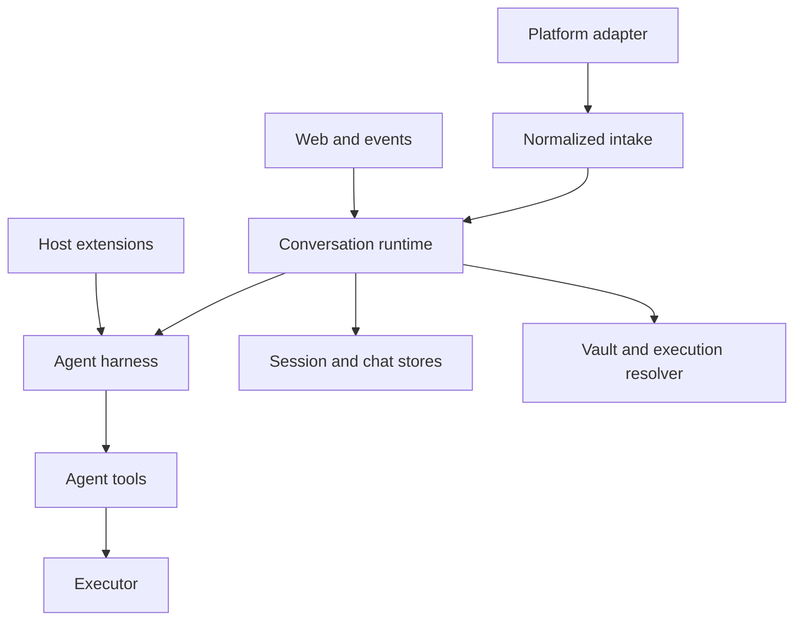

本页记录 mikan 的**架构接口**：跨越子系统、进程、持久化或包边界的契约。它不是每个导出辅助函数的清单。仅在单个子系统内部使用的辅助函数属于实现细节，即使 TypeScript 当前将其标记为 `export`。

## 稳定性级别

| 级别             | 含义                                | 兼容性预期                           |
| ---------------- | ----------------------------------- | ------------------------------------ |
| Public           | 被 npm 使用方或扩展作者导入         | 保持不变或有意进行版本管理           |
| Host integration | 用于嵌入运行时或添加平台/运行时后端 | 只要该集成存在就保持不变             |
| Wire / persisted | 存储在磁盘上或跨进程/网络边界发送   | 显式迁移；读取方应容忍受支持的旧格式 |
| Internal         | 连接 mikan CLI 内部的模块           | 在协调好调用点和测试的情况下可以更改 |

由于 `src/index.ts` 重新导出了整个框架，该包当前暴露的符号比本策略所期望的要多。请将下表视为预期的契约；迁移方案参见[核心简化](/zh-cn/core-simplification/)。

## 边界地图



运行时是协调者。平台不得知晓框架的持久化，框架不得知晓平台 SDK 对象，工具不得知晓执行是本地、容器化还是远程的。

## 1. 包接口

npm 入口点是 `@geminixiang/mikan`，由 `src/index.ts` 实现。

### 受支持的入口点分组

| 分组              | 主要符号                                                                                              | 使用方                            |
| ----------------- | ----------------------------------------------------------------------------------------------------- | --------------------------------- |
| Runtime embedding | `createConversationRuntime`、`ConversationRuntime`、`ConversationRuntimeOptions`                      | 提供平台与执行依赖的主机          |
| Platform contract | `MessagingBot`、`ConversationEvent`、`ConversationContext`、`ConversationResponder`、`MessagingInfo`  | 平台适配器与嵌入者                |
| Commands          | `CommandHandler`、`CommandContext`、`CommandServices`、`dispatchCommand`                              | 添加确定性命令的主机              |
| Execution         | `Executor`、`SandboxConfig`、`SandboxAdapter`、`createExecutor`、`parseSandboxArg`、`validateSandbox` | 运行时后端与主机                  |
| Extensions        | `MikanExtensionApi`、hook/event 类型、subagent 类型                                                   | 受信任的扩展作者                  |
| Harness embedding | `MikanAgentSession`、`SessionStore`、`MikanModels`、设置与 event-format 函数                          | 高级嵌入者；不适用于普通 bot 集成 |

导入 `src/` 下的源码路径或 `dist/` 下的生成路径不受支持。只有包 exports 声明的路径才应被视为公开。目前该包没有显式的 `exports` 映射，因此这是一个文档约束，而非强制约束。

## 2. 平台接收与响应接口

来源：`src/types.ts`（由 `src/adapter.ts` 重新导出）。

### `ConversationEvent`

传递给 `MessagingEventHandler` 的平台中立触发器。

| 字段                  | 契约                                                            |
| --------------------- | --------------------------------------------------------------- |
| `conversationId`      | 原始平台对话/频道标识符；不得包含 `:`，因为会话密钥保留了该字符 |
| `conversationKind`    | `direct` 或 `shared`；影响会话与凭证策略                        |
| `ts`                  | 触发的平台消息标识符                                            |
| `thread_ts`           | 可选的父/根平台消息标识符                                       |
| `user`                | 平台用户标识符                                                  |
| `text`                | 移除平台 mention 后的文本                                       |
| `attachments`         | 已下载到主机路径的文件                                          |
| `sessionKey`          | 可选的平台选定覆盖值；否则由会话策略派生                        |
| `vaultConversationId` | 仅用于凭证路由的可选备用身份                                    |

### `ConversationContext`

为同一次运行携带更丰富的规范化消息、响应端口和平台元数据：

```ts
interface ConversationContext {
  message: ConversationMessage;
  responder: ConversationResponder;
  platform: MessagingInfo;
}
```

`ConversationMessage` 和 `ConversationEvent` 当前在消息 id、会话、对话类型、用户、文本、附件和话题身份上有重复。适配器必须保持两种表示一致。这是一个内部兼容缝隙，而非新集成所应采用的模型。

### `ConversationResponder`

运行时/框架的输出端口。必需操作涵盖最终文本、替换、诊断、工具状态、typing/working 状态、文件上传和响应删除。流式（`appendResponseDelta`、`finishResponse`）和 reaction（`react`）是可选能力。

能力规则：调用方必须对可选方法进行特性检测。适配器可以缓冲输出或原生实现流式，但对于单次运行必须保持调用顺序。

### `MessagingBot`

面向主机的平台端口。它组合了：

- 生命周期：`start()`；
- 出站消息：`postMessage`、`updateMessage`、可选的上传/reaction/私密回复；
- 接收调度：`enqueueEvent`；
- 发现/策略：`getMessagingInfo()`。

`MessagingInfo.trustModel` 是安全敏感的。当沙箱拓扑是隔离的时，`membership` 允许环境共享 vault 策略。诸如公开 GitHub 活动这类开放触发面必须返回 `open-trigger`。

`ChatAdapter` 是一个更小的、仅含生命周期的接口（`start`、`stop`、`getMessagingInfo`），但 CLI 使用 `MessagingBot`。除非调用方明确要求 `ChatAdapter`，否则不要同时实现两者。

## 3. 运行时编排接口

来源：`src/runtime/types.ts` 与 `src/runtime/conversation-runtime.ts`。

`createConversationRuntime(options)` 返回 `ConversationRuntime`，它是 per-session 串行化、命令分发、runner 缓存、stop/reset 行为、闲置回收和优雅关闭的唯一所有者。

### 输入方法

| 方法                                 | 语义                                               |
| ------------------------------------ | -------------------------------------------------- |
| `handleEvent(event, bot, context)`   | 按派生的会话密钥串行化，然后分发一个命令或代理运行 |
| `runSession(options)`                | 执行一个已串行化的单元；用于受控的主机场景         |
| `handleStop(...)` / `forceStop(...)` | 协作式/用户可见的 stop 与立即的内部 stop           |
| `handleNewCommand(...)`              | 中止、重置持久化的会话状态并丢弃缓存的 runner      |

### 控制与检查

| 方法                                  | 语义                                                    |
| ------------------------------------- | ------------------------------------------------------- |
| `isRunning(sessionKey)`               | 当前进程内运行状态                                      |
| `getRunningSessions()`                | 用于管理/可观测性界面的快照                             |
| `switchConversationModel(...)`        | 更新缓存的 runner；返回是否存在一个                     |
| `refreshConversationEnvironment(...)` | 重新解析缓存的 runner 环境                              |
| `shutdown(timeoutMs?)`                | 拒绝新工作、停止 runner，并在截止期限内等待进行中的工作 |

`ConversationRuntimeOptions` 提供工作区/配置字段、沙箱/资源服务、可选的 portal token store、可选的命令、模型注册表、主动式平台操作以及平台工具包工厂。缺失的 vault 与 portal store 会降级为禁用实现；在设置了 portal URL 但没有其 store 的情况下使用时会报错。

并发不变式：对于一个会话密钥的调用是串行的；不同的会话密钥可以并发运行。因此平台工具包是 per-runner 创建的，绝不全局共享，因为 `bindRun` 会修改其运行绑定。

## 4. 命令接口

来源：`src/commands/manifest.ts`、`src/commands/types.ts` 与 `src/commands/registry.ts`。

`COMMAND_MANIFEST` 是面向平台的清单，用于派生斜杠形式和原生注册。`CommandHandler.tryHandle(context)` 是执行契约。处理器按顺序运行，第一个返回 `true` 的结果会消费该消息。

内置命令在扩展命令之前运行。未匹配的斜杠前缀消息仍然是一个普通的代理提示词。`stop` 是一个平台接收魔法词，而非 `CommandHandler`；`session` 是唯一被接受的裸命令。

`CommandContext` 包含规范化的执行者/对话身份、响应与 bot 端口、命令文本、隐私状态以及 `CommandServices`。命令处理器不得深入平台 SDK 事件。

## 5. 框架接口

来源：`src/harness/index.ts`、`runner.ts`、`session-store.ts`、`models.ts` 与 `types.ts`。

### `MikanAgentSession`

拥有模型轮次循环、消息持久化、重试、compaction、预算断路器、扩展 hook 和中止行为。其外部有意义的操作是 prompt/run、subscribe、abort、会话重载、模型/thinking 选择和 disposal。

### `SessionStore`

拥有版本 3 的仅追加会话 JSONL 和树重建。`SessionHeader.version` 当前为 `3`（`CURRENT_SESSION_VERSION`）。会话条目可能分支；使用方必须使用 store/context 辅助函数，而不能假定文件是一份扁平的聊天记录。

### `MikanModels` 与 `FileCredentialStore`

`MikanModels` 解析内置和自定义的 `pi-ai` 模型。`FileCredentialStore` 在 state directory 中持久化 provider 凭证。Vault 凭证是不同的边界：它们被注入到工具执行中，而非用于对主机侧模型客户端进行认证。

### 框架事件与预算

框架监听器观察模型/工具生命周期事件。预算设置为 token、成本、耗时和 LLM 调用设置上限。预算触发会中止运行并发出 `budget_exceeded`；它是一个终态结果，而非重试信号。

## 6. 扩展接口

来源：`src/harness/extensions/types.ts`。完整的编写示例见[扩展开发](/zh-cn/extension-development/)。

扩展是导出 `activate(api)` 的受信任主机代码。它按每个对话框架实例激活，并可返回一个 disposer。

### `MikanExtensionApi`

| 界面                              | 契约                                                                    |
| --------------------------------- | ----------------------------------------------------------------------- |
| `on`                              | 为 prompt、tool、message、compaction、error 和 budget 事件注册有序 hook |
| `registerTool`                    | 向该 runner 添加一个 `pi-agent-core` 工具                               |
| `registerCommand`                 | 在内置命令之后添加确定性的 `/name` 处理                                 |
| `onDispose`                       | 在重置、回收或关闭时释放资源；LIFO 顺序                                 |
| `context`                         | 只读的对话/工作区/模型身份                                              |
| `paths`                           | 对话私有以及显式共享的仅主机数据目录                                    |
| `secrets`                         | 按名称读取的只读扩展 secret                                             |
| `schedules` / `triggerRun`        | 持久化或触发自主的事件文件运行                                          |
| `subagent.run`                    | 带显式工具、schema 和预算的全新隔离运行                                 |
| `notify` / `react` / `uploadFile` | 可选的主机平台能力                                                      |

Hook 错误会被记录并跳过。`before_agent_start` 和 `tool_result` 的重写会链式进行；`tool_call` 使用第一个非 undefined 的结果。被阻止的 pre-start hook 会阻止模型调用和会话持久化。

扩展的调度和立即运行不继承对话历史记录。它们的任务文本必须是自包含的，并且不得包含 secret。

## 7. 工具与平台能力接口

来源：`src/tools/types.ts`。

核心工具使用由 runner 提供的 executor 和主机服务。`EventStore` 是事件文件的规范 CRUD 端口。无效的事件 JSON 仍以 `payload: null` 保持可列出，以便管理员诊断或删除它。

`PlatformToolPackFactory` 为每个 runner 创建一个私有的 `PlatformToolPack`。`bindRun` 选择其工具是否适用于当前平台/对话。工厂边界将 GitHub 专用工具排除在核心工具列表之外，同时防止跨对话的可变绑定。

## 8. 沙箱与 executor 接口

来源：`src/sandbox/types.ts` 与 `src/sandbox/index.ts`。

### `SandboxConfig`

该可辨识联合当前支持 `host`、`container`、`image`、`gondolin`、`firecracker` 和 `cloudflare`。解析语法和成熟度记录在 [Sandbox](/zh-cn/sandbox/) 下。

### `Executor`

这是稳定的执行边界，也是最重要的沙箱契约：

| 操作                          | 要求                                                     |
| ----------------------------- | -------------------------------------------------------- |
| `exec`                        | 返回 stdout、stderr 和退出码；在支持处遵守 timeout/abort |
| `readFile` / `readFileBase64` | 传输内容而不添加 shell 解析层                            |
| `writeFile`                   | 暂存并替换，使被中止的写入无法截断目标                   |
| `getWorkspacePath`            | 将主机工作区根映射到运行时可见的根                       |
| `getPathContext`              | 声明主机/运行时路径语义及可选的反向映射                  |
| `getSandboxConfig`            | 返回正在使用的具体配置                                   |

远程/仅 exec 的实现共享 base64 分块文件传输。工具实现必须调用 executor 文件方法，而不是构建 `cat`、`printf` 或引用协议。

### `SandboxAdapter`

适配器识别一个 CLI 值，可选地验证它，并可选地创建一个 executor。`image` 有意没有直接的 executor：actor/vault 解析会先 provision 一个具体的容器。

尽管该类型已导出，适配器注册目前是 `src/sandbox/index.ts` 内部的一个封闭列表；外部使用方无法向 `parseSandboxArg` 或 `createExecutor` 添加适配器。

## 9. Vault 与执行解析接口

来源：`src/vault/types.ts`；策略在 `src/vault/policy.ts` 中。

`VaultManager` 按规范的 actor key 解析凭证 env 和 mount 文件，列出并修改私有/共享 vault，并报告存储是否启用。Secret 存放在仅主机的 state directory 下。

凭证流程为：

1. 运行时提供平台信任、对话、用户和沙箱拓扑。
2. 执行解析器选择 actor/vault 身份。
3. `VaultManager` 解析 env 和 mount。
4. 具体的 executor 只接收为该运行时准备的凭证。

Host 沙箱执行绝不接收 vault 注入。开放触发平台绝不接收环境共享 vault。这些是安全不变式，而非便利默认值。

## 10. 会话、聊天与身份接口

来源：`src/sessions/*`、`src/store.ts` 与 `src/sandbox/identity.ts`。

存在两条有意保留的记录：

| 记录                              | 用途                                               |
| --------------------------------- | -------------------------------------------------- |
| `<conversation>/log.jsonl`        | 平台真相：用户/bot 消息和附件                      |
| `<conversation>/sessions/*.jsonl` | 代理真相：提示词、模型/工具消息、分支和 compaction |

不要合并它们。聊天历史记录可以重建缺失的顶层代理会话，而代理会话包含从未在平台上出现过的数据。

会话密钥使用 `conversationId[:suffix]`；只有 `src/sessions/session-key.ts` 拥有此语法。调用方必须使用 `deriveSessionKey`、`conversationIdOf` 和 `threadSuffixOf`，绝不能直接切分字符串。

`ChatHistorySync` 解析顶层/话题范围，引导新会话，同步新的平台日志条目，重置会话，并协调一个等待活动父运行封存的话题。

## 11. 事件文件接口

来源：`src/harness/event-format.ts`。

`events/*.json` 是一个工作区级的调度总线。规范联合为：

```ts
type EventFilePayload =
  | { type: "immediate"; conversationId: string; text: string /* common optional fields */ }
  | { type: "one-shot"; conversationId: string; text: string; at: string }
  | { type: "periodic"; conversationId: string; text: string; schedule: string; timezone: string };
```

常见的可选字段是 `platform`、`conversationKind` 和 `userId`。`channelId` 仅作为旧版读取别名被接受。所有写入方都使用 `buildEventPayload`；所有读取方都使用 `parseEventPayload`。

该总线按设计是共享且代理可写的。所有权前缀是协作性的，而非授权边界。

## 12. 持久化文件系统接口

| 路径                                               | 所有者                   | 可见性 / 兼容性               |
| -------------------------------------------------- | ------------------------ | ----------------------------- |
| `<state-dir>/settings.json`                        | config                   | 仅主机的全局设置              |
| `<state-dir>/conversations/<id>/settings.json`     | config/admin             | 仅主机的对话覆盖              |
| `<state-dir>/auth.json`                            | harness credential store | 仅主机的模型 provider 凭证    |
| `<state-dir>/models.json`                          | harness model catalog    | 仅主机的自定义 provider/模型  |
| `<state-dir>/vaults/**`                            | vault/login              | 仅主机的 secret 与 mount 文件 |
| `<state-dir>/{global,conversations}/**/extensions` | extension loader         | 受信任的主机代码              |
| `<workspace>/MEMORY.md`                            | agent/user               | 沙箱可见的持久记忆            |
| `<workspace>/skills/**/SKILL.md`                   | skills                   | 沙箱可见的提示词指令          |
| `<workspace>/events/*.json`                        | event store/watcher      | 共享的调度 wire 格式          |
| `<workspace>/<id>/log.jsonl`                       | platform store           | 仅追加的平台历史记录          |
| `<workspace>/<id>/sessions/*.jsonl`                | session store            | 带版本的仅追加代理历史记录    |

state directory 不得位于沙箱可见的工作区内部。重要的状态文件使用原子私密写入；仅追加日志使用追加语义。

## 13. HTTP 接口

来源：`src/web/server.ts` 与 portal 模块。这些路由支撑 mikan 捆绑的 UI；它们不是通用的公开 REST API。

| 界面           | 路由                                                                                   | 认证模型                       |
| -------------- | -------------------------------------------------------------------------------------- | ------------------------------ |
| Health         | `GET /health`                                                                          | 无；返回 `{ "ok": true }`      |
| Login          | `GET /link`、`POST /api/link/complete`、`POST /api/oauth/start`、`GET /oauth/callback` | 短期 link token 加 OAuth state |
| Session viewer | `GET /session`、`GET /session/stream`、可选的 `POST /session/message`                  | Session-view token             |
| Admin          | `GET /admin`、`/admin/api/*`                                                           | Admin token                    |
| Agent events   | `GET /api/agent-events/stream`                                                         | 由部署控制的事件流             |

Admin 端点涵盖对话清单/状态/用量、全局与对话设置、模型、工作区文件、skill、事件、平台配置以及 login/session 链接。路由 payload 是内部 UI 契约，可能与捆绑的前端一同演进。

## 14. Gondolin 进程边界

`gondolin:default` 使用同一主机上的 detached Node worker。worker process 与持久化 runtime inventory 是用于重启恢复的内部 lifecycle 边界；不存在网络 worker protocol 或远程 placement contract。

## 契约检查清单

在更改边界时，请核实：

1. 它是 public、host integration、persisted/wire 还是 internal？
2. 该更改是否改变了身份、信任、路径、并发或生命周期语义？
3. 生产者和消费者是否共享同一个规范的解析器/构建器/类型？
4. 旧的持久化数据是否仍能加载，还是有显式迁移？
5. 可选能力是否经过特性检测？
6. 该实现能否被移到现有端口之后，而不是扩展核心契约？
