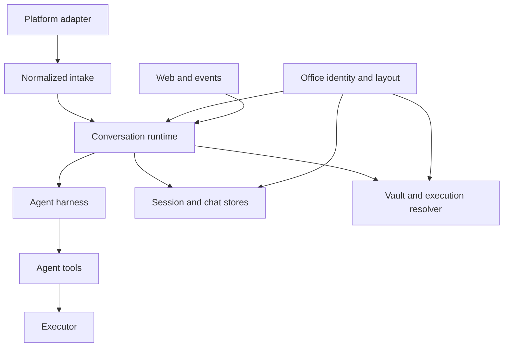

本页记录 mikan 的**架构接口**：跨越子系统、进程、持久化或包边界的契约。它不是每个导出辅助函数的清单。仅在单个子系统内部使用的辅助函数属于实现细节，即使 TypeScript 当前将其标记为 `export`。

## 稳定性级别

| 级别             | 含义                                | 兼容性预期                           |
| ---------------- | ----------------------------------- | ------------------------------------ |
| Public           | 被 npm 使用方导入                   | 保持不变或有意进行版本管理           |
| Host integration | 用于嵌入运行时或添加平台/运行时后端 | 只要该集成存在就保持不变             |
| Wire / persisted | 存储在磁盘上或跨进程/网络边界发送   | 显式迁移；读取方应容忍受支持的旧格式 |
| Internal         | 连接 mikan CLI 内部的模块           | 在协调好调用点和测试的情况下可以更改 |

`src/index.ts` 是一份显式的导出清单，而非通配符重新导出，并且 `src/test/public-api.test.ts` 会对其做快照，因此意外新增会导致 CI 失败。它暴露的框架内容仍然多于普通 bot 集成所需；请将下表视为预期的契约。

## 边界地图


```mermaid
flowchart TD
  P["Platform adapter"] --> I["Normalized intake"]
  I --> R["Conversation runtime"]
  R --> H["Agent harness"]
  H --> T["Agent tools"]
  T --> E["Executor"]
  R --> S["Session and chat stores"]
  R --> V["Vault and execution resolver"]
  O["Office identity and layout"] --> R
  O --> S
  O --> V
  W["Web and events"] --> R
```

运行时是协调者。平台不得知晓框架的持久化，框架不得知晓平台 SDK 对象，工具不得知晓执行是本地、容器化还是远程的。办公室模块提供身份和路径，运行时、各 store 与 vault 都以此来寻址一个对话。

## 维护者归属与缝隙登记

以下八个归属范围是长期的职责划分。所有者可以在其端口背后自由更改实现，但更改端口需要同时更新两侧以及下文列出的契约测试。这些范围描述的是代码归属，而非进程或权限隔离。

| 归属范围               | 主要模块                                                                 | 拥有                                                                                                  | 交付                                                                                       |
| ---------------------- | ------------------------------------------------------------------------ | ----------------------------------------------------------------------------------------------------- | ------------------------------------------------------------------------------------------ |
| **Platform entry**     | `src/adapters/`、`src/types.ts`                                          | SDK 规范化、接收顺序、平台响应传输，以及包含 `trustModel` 的 `MessagingInfo`                          | 平台中立的 `ConversationEvent`、`ConversationContext` 和能力端口                           |
| **Office identity**    | `src/office/`                                                            | `OfficeAddress`/`OfficeKey` 派生、`Workspace`/`Office` 布局值、办公室物化与工作区投影，以及注册表日志 | 路径已预先计算的冻结 `Office` 值，以及按当前策略解析投影的入口；持久的原始 id ↔ 办公室映射 |
| **Runtime/session**    | `src/runtime/`、`src/sessions/`                                          | 会话密钥语法、per-session 串行化、聊天/会话同步、runner 生命周期、stop/reset 和关闭                   | 交给 runner 的已验证事件；交给执行解析的办公室与 actor 输入                                |
| **Harness/tools**      | `src/harness/`、`src/harness/tools/`                                     | 模型轮次、执行解析、预算、工具 schema、skill、subagent 和主机能力调用                                 | `ConversationResponder` 输出与 `Executor` 操作；它不接收平台 SDK 对象                      |
| **Scheduled events**   | `src/events/`                                                            | 事件 wire protocol、解析/构建、限定于单个办公室的 host store、文件名校验和调度器生命周期              | 向 harness/Web 提供 `EventStore`；向平台消息接口提供规范化事件                             |
| **Sandbox/workspace**  | `src/sandbox/`                                                           | Executor 实现、mount 拓扑、runtime/主机路径上下文、托管容器生命周期和文件传输                         | 一个声明了路径与凭证能力的具体 `Executor`                                                  |
| **Vault/web/security** | `src/vault/`、`src/adapters/web/`、`src/sandbox/identity.ts`             | 凭证身份与注入策略、仅主机的 portal/token 界面、mount 冲突检查，以及安全敏感的授权决策                | 交给 vault 策略的 actor/信任输入；凭证只交给选定的 executor                                |
| **Config/CLI**         | `src/settings/`、`src/cli/`、`src/migrations/`、`src/adapters/commands/` | 启动/flag 语法、设置持久化、状态迁移和命令清单                                                        | 生效设置和确定性的命令清单                                                                 |

一个对话的框架实例与其他实例是上下文隔离的，但那不是文件系统或进程沙箱。同样地，沙箱 executor 改变的是工具在哪里运行以及它们接收哪些 mount；`host` 模式以及非受管的 `container:*` 模式都不会强制执行办公室 visibility。审查缝隙时请把这些关注点分开。

### 跨归属缝隙

下列生产者/消费者对是受支持的桥梁。指定的生产者拥有其表示和顺序；消费者必须使用该端口或规范解析器，而不能自行重建。

| 缝隙                      | 生产者 → 消费者                                                                         | 不变式、顺序与失败行为                                                                                                                                                                                                                                                                                                                                            |
| ------------------------- | --------------------------------------------------------------------------------------- | ----------------------------------------------------------------------------------------------------------------------------------------------------------------------------------------------------------------------------------------------------------------------------------------------------------------------------------------------------------------- |
| Platform intake           | Platform entry → Runtime/session                                                        | 接收顺序为**魔法词 → trigger policy → 附件 → 日志 → busy policy → 排队 → 分发**。`stop` 会绕过 trigger policy、附件处理和排队。无效对话或外来会话身份会在排队前失败；附件失败会向上传播。                                                                                                                                                                         |
| Office identity           | Platform entry → Office identity → Runtime/session、store、vault 与设置                 | 适配器在接收时产生一个 `OfficeAddress`。消费者接受 `Office`/`Workspace` 值，绝不接受目录名。`Office.ensure()` 会**先**把办公室记入注册表，再创建目录，因此不存在注册表无法枚举的办公室目录。                                                                                                                                                                      |
| Session identity          | Platform entry / Runtime/session → Runtime/session、框架与 store                        | `src/sessions/session-key.ts` 拥有 `conversationId[:suffix]`，它是一个原始平台值。平台覆盖值只有在属于该对话时才被接受；否则派生会抛出异常。运行时状态按办公室**加**会话密钥标识，因此一个会话密钥永远无法选中另一间办公室的状态。任何消费者都不得直接切分会话密钥。                                                                                              |
| Command inventory         | Config/CLI → Platform entry、Runtime/session 与 web/会话查看器                          | `COMMAND_MANIFEST` 是唯一的清单。已识别的内置命令会被优先处理；未匹配的斜杠文本仍是代理提示词；`stop` 是魔法词，而非处理器。                                                                                                                                                                                                                                      |
| Runtime to harness        | Runtime/session → Harness/tools                                                         | `handleEvent` 派生密钥并对一个密钥串行化，同时允许其他密钥并发运行。话题引导会等待正在运行的父会话封存。平台工具包是 per-runner 创建的，因为 `bindRun` 是可变的。                                                                                                                                                                                                 |
| Run output                | Harness/tools → Platform entry                                                          | 框架发出的是**响应源**：平台中立的 Markdown/GFM，用户 mention 写作 `<@userName>`。把它转换成原生呈现完全是适配器的职责——Slack 在每条出站路径上把 `<@userName>` 解析为 `<@U…>`，且任何适配器都不得引导模型产出平台原生标记。可选的 responder 能力需特性检测。对于单次运行，响应操作保持调用顺序；适配器可以缓冲或流式输出，但不得向框架暴露框架持久化或 SDK 对象。 |
| Runtime ↔ sandbox path    | Runtime/session → Sandbox/workspace → Harness/tools                                     | 运行时提供主机工作区和一个 `<runtime workspace root>/<officeKey>` 形式的 runtime cwd；office key 在两侧命名同一个路径段，因此路径在边界处不会改变含义。Executor 提供 `getWorkspacePath`/`getPathContext`。提示词和工具输出使用 runtime 路径，而主机侧附件转换使用已声明的上下文。映射根之外的路径不会被转换。这是路径契约，而非文件系统隔离的声明。               |
| Executor file transport   | Sandbox/workspace → Harness/tools                                                       | 工具使用 `Executor.readFile`/`writeFile`，绝不使用 shell 引用协议。仅 exec 的传输使用共享的 base64 分块实现；写入采用暂存并重命名，传输错误仍然是错误。                                                                                                                                                                                                           |
| Trust and vault           | Platform entry → Runtime/session → Vault/web/security → Sandbox/workspace               | `MessagingInfo.trustModel` 被传入 actor 解析；vault 策略按该值标识，而非按平台名称字符串。省略信任时默认为 `membership`；`open-trigger` 绝不接收环境共享 vault 副本，且只有 `image` 使用该环境路径。显式 vault 配置仍是独立的管理决策。                                                                                                                           |
| Settings and live runners | Config/CLI（命令和 admin 是适配器）→ 配置磁盘与 Runtime/session                         | `applyConversationSettings` 在写入 LLM 更改**之前**清除缓存的 runner，并在忙碌时拒绝这两项操作。`applyOfficeVisibility` 对 visibility 更改采取同样做法，因为 mount 集合被固化在 runner 的环境中。全局 LLM 设置先写入，然后清除空闲 runner，忙碌的 runner 在其运行结束后清除，并报告为过期。沙箱资源限制和 Slack 回复设置在使用时重新读取，不会清除 runner。       |
| Web capability bridge     | Vault/web/security → Runtime/session 与命令                                             | Portal store 是可选的运行时服务。设置了 portal URL 但缺少其后备 store 时，使用该 portal 会失败；其他情况下缺失的 store 产生禁用/未配置行为。路由 payload 是捆绑 UI 的契约，而非通用 REST API。                                                                                                                                                                    |
| Scheduled events          | Harness/tools 与 Admin → 经 `OfficeEventStore` 到 Runtime/session                       | 记录存放在办公室仅主机可见的 State dir；任何沙箱都不会 mount 它。`event` 工具和 Admin 只能通过绑定该办公室的 store 访问其事件，payload 也必须指向 store 自己的办公室。写入方使用 `buildEventPayload`；读取方使用 `parseEventPayload`。secret 不属于事件文本。                                                                                                     |
| History persistence       | Platform entry → `log.jsonl`；Runtime/session 与 Harness/tools → 办公室的 `sessions.db` | 平台真相与代理真相保持分离。聊天同步把平台消息作为标明发言者的用户条目复制进会话，按消息 ID 去重，且绝不写入 assistant 消息。                                                                                                                                                                                                                                     |

这些桥梁有意区分上下文隔离与沙箱化。新的所有者不得从路径推断凭证授权，也不得从平台名称推断平台信任。

## 1. 包接口

npm 入口点是 `@geminixiang/mikan`，由 `src/index.ts` 实现。

### 受支持的入口点分组

| 分组                 | 主要符号                                                                                                   | 使用方                                                          |
| -------------------- | ---------------------------------------------------------------------------------------------------------- | --------------------------------------------------------------- |
| Runtime embedding    | `createConversationRuntime`、`ConversationRuntime`、`ConversationRuntimeOptions`                           | 提供平台与执行依赖的主机                                        |
| Office and workspace | `createWorkspace`、`createOfficeAddress`、`officeKey`、`Workspace`、`Office`、`OfficeAddress`、`OfficeKey` | 任何嵌入者：`createConversationRuntime` 需要一个 `Workspace` 值 |
| Platform contract    | `MessagingBot`、`ConversationEvent`、`ConversationContext`、`ConversationResponder`、`MessagingInfo`       | 平台适配器与嵌入者                                              |
| Commands             | `CommandHandler`、`CommandContext`、`CommandServices`、`dispatchCommand`                                   | 添加确定性命令的主机                                            |
| Execution            | `Executor`、`SandboxConfig`、`SandboxAdapter`、`createExecutor`、`parseSandboxArg`、`validateSandbox`      | 运行时后端与主机                                                |
| Harness embedding    | `MikanAgentSession`、`SessionStore`、`MikanModels`、设置与 event-format 函数                               | 高级嵌入者；不适用于普通 bot 集成                               |

只有包 `exports` 映射声明的路径是公开路径。导入其他 `dist/` 生成路径或 `src/` 源码路径均不受支持。

## 2. 平台接收与响应接口

来源：`src/types.ts`（由 `src/index.ts` 重新导出）。

### `ConversationEvent`

传递给 `MessagingEventHandler` 的平台中立触发器。

| 字段                  | 契约                                                                               |
| --------------------- | ---------------------------------------------------------------------------------- |
| `address`             | 规范的 `OfficeAddress`（`platform` + 原始 `conversationId`），由适配器在接收时创建 |
| `conversationKind`    | `direct` 或 `shared`；影响会话与凭证策略                                           |
| `ts`                  | 触发的平台消息标识符                                                               |
| `thread_ts`           | 可选的父/根平台消息标识符                                                          |
| `user`                | 平台用户标识符                                                                     |
| `text`                | 移除平台 mention 后的文本                                                          |
| `attachments`         | 已下载到主机路径的文件                                                             |
| `sessionKey`          | 可选的平台选定覆盖值；否则由会话策略派生                                           |
| `vaultConversationId` | 仅用于凭证路由的可选备用身份                                                       |

### `ConversationContext`

为同一次运行携带办公室身份、更丰富的规范化消息、响应端口和平台元数据：

```ts
interface ConversationContext {
  address: OfficeAddress;
  message: ConversationMessage;
  responder: ConversationResponder;
  platform: MessagingInfo;
}
```

`ConversationMessage` 和 `ConversationEvent` 当前在消息 id、会话、对话类型、用户、文本、附件和话题身份上有重复——并且两者现在都携带 `address`。适配器必须保持两种表示一致。这是一个内部兼容缝隙，而非新集成所应采用的模型。

### `ConversationResponder`

运行时/框架的输出端口。必需操作涵盖最终文本、替换、诊断、工具状态、typing/working 状态、文件上传和响应删除。流式（`appendResponseDelta`、`finishResponse`）和 reaction（`react`）是可选能力。

能力规则：调用方必须对可选方法进行特性检测。适配器可以缓冲输出或原生实现流式，但对于单次运行必须保持调用顺序。

### `MessagingBot`

面向主机的平台端口。它组合了：

- 生命周期：`start()` 和 `stop()`；
- 出站消息：`postMessage`、`updateMessage`，以及可选的 thread 回复、私密回复和 bot 回复记录；
- 接收调度：`enqueueEvent`；
- 发现/策略：`getMessagingInfo()`。

`MessagingInfo.trustModel` 是安全敏感的。当沙箱类型是 `image` 时，`membership` 允许环境共享 vault。任何人都能触发 agent 的触发面必须返回 `open-trigger`。

`MessagingBot` 是唯一面向 host 的 adapter 接口；生命周期与 messaging capability 不再拆分到另一个浅接口。

## 3. 运行时编排接口

来源：`src/runtime/types.ts` 与 `src/runtime/conversation-runtime.ts`。

`createConversationRuntime(options)` 返回公开的 `ConversationRuntime` 编排接口。在 `src/runtime/` 内，`SessionLifecycle` 是 runner 资源的单一 authority：它拥有 per-session 串行化、materialization、lease、settlement、invalidation、disposal、闲置回收和关闭；runtime 编排器负责命令、stop/reset 与平台工作流。

### 输入方法

| 方法                                                                      | 语义                                                       |
| ------------------------------------------------------------------------- | ---------------------------------------------------------- |
| `handleEvent(event, bot, context)`                                        | 按办公室加派生的会话密钥串行化，然后分发一个命令或代理运行 |
| `runSession(options)`                                                     | 执行一个已串行化的单元；用于受控的主机场景                 |
| `handleStop(address, sessionKey, bot)` / `forceStop(address, sessionKey)` | 协作式/用户可见的 stop 与立即的内部 stop                   |
| `handleNewCommand(...)`                                                   | 中止、重置持久化的会话状态并丢弃缓存的 runner              |

### 控制与检查

| 方法                             | 语义                                                                    |
| -------------------------------- | ----------------------------------------------------------------------- |
| `isRunning(address, sessionKey)` | 当前进程内运行状态                                                      |
| `getRunningSessions()`           | 用于管理/可观测性界面的快照；每个条目携带其 `address`                   |
| `refreshConversation(address)`   | 清除对话缓存的 runner，下次运行按设置重建；有运行中的任务时返回 `false` |
| `refreshAllConversations()`      | 清除每个空闲对话的 runner，忙碌的在运行结束后清除，并返回忙碌的地址     |
| `shutdown(timeoutMs?)`           | 拒绝新工作、停止 runner，并在截止期限内等待进行中的工作                 |

每个会话范围的入口点都接受一个 `OfficeAddress`。不存在原始对话 id 的桥接；平台与 Admin 介面会明确携带带平台范围的地址。

`ConversationRuntimeOptions` 提供一个 `workspace`（来自 `createWorkspace` 的 `Workspace` 值）、沙箱/资源服务、可选的 portal token store、可选的命令、模型注册表、主动式平台操作以及平台工具包工厂。缺失的 vault 与 portal store 会降级为禁用实现；在设置了 portal URL 但没有其 store 的情况下使用时会报错。

并发不变式：对于一个办公室加一个会话密钥的调用是串行的；不同的会话密钥可以并发运行。每次使用 runner 都持有内部 lifecycle lease，因此设置失效、回收与关闭不会在操作途中 dispose 它。平台工具包按 runner 创建，绝不全局共享，因为 `bindRun` 会改写它的运行绑定。

## 4. 命令接口

来源：`src/adapters/commands/manifest.ts`、`src/adapters/commands/types.ts` 与 `src/adapters/commands/registry.ts`。

`COMMAND_MANIFEST` 是面向平台的清单，用于派生斜杠形式和原生注册。`CommandHandler.tryHandle(context)` 是执行契约。处理器按顺序运行，第一个返回 `true` 的结果会消费该消息。

已识别的内置命令会在 runner 创建前处理。未匹配的斜杠前缀消息仍然是一个普通的代理提示词。`stop` 是一个平台接收魔法词，而非 `CommandHandler`；`session` 是唯一被接受的裸命令。

`CommandContext` 包含规范化的执行者/对话身份、响应与 bot 端口、命令文本、隐私状态以及 `CommandServices`。命令处理器不得深入平台 SDK 事件。

## 5. 框架接口

来源：`src/harness/index.ts`、`src/harness/runner.ts`、`src/sessions/session-store.ts`、`src/harness/models.ts` 与 `src/harness/types.ts`。

### `MikanAgentSession`

拥有模型轮次循环、消息持久化、重试、compaction、预算断路器、skill、有界 subagent 和中止行为。其外部有意义的操作是 prompt/run、subscribe、abort、模型/thinking 选择和 disposal。

### `SessionStore`

负责一间办公室的所有会话：一个 pi-durable SQLite 存储，即办公室 State dir 中的 `sessions.db`（ADR 0018）。顶层会话是存储的 root conversation，其他每个会话都是按会话密钥找到的 conversation；会话名称和最近一次 run 记录放在 durable 文档里。`SessionHeader`（id、createdAt、parentSessionId）标识一个会话及其 fork 自哪个父会话。一个 live 存储只能由一个进程拥有。`mikan migrate` 会导入 0.5.3 的会话文件。条目是一条线性的记录，包含 message、custom 和 compaction；请用 `buildSessionContext()` 读取模型看到的内容，用 `getContextEntries()` 读取仍在 context 中的条目，不要直接读存储。

### `MikanModels`

`MikanModels` 解析内置的 `pi-ai` 模型和 `~/.mikan/models.json` 中的自定义 provider；provider 凭证来自该文件或环境变量。Vault 凭证是不同的边界：它们被注入到工具执行中，而非用于对主机侧模型客户端进行认证。

### Subagent profile

subagent 始终以一个具名 profile 启动——按运行自由配置不是受支持的界面。`loadSubagentProfiles` 负责解析：`src/harness/subagent-profiles.ts` 中的内置 profile 是权威定义（`worker`、`software-engineer`、`devops-engineer`、`data-scientist`、`account-manager`、`business-development`、`creative-producer`、`ad-operations-specialist`、`summarizer`），而 `<workspace>/agents/<name>.md` 文件是对同名内置 profile 的**补丁**而非替换，因此运维人员可以只覆盖 `model:`，无需重述 tools 和提示词。名称与任何内置都不匹配的文件定义一个新 profile，且必须自带 `tools`。格式错误的文件会变成诊断信息并被跳过，绝不抛出异常。

### 框架事件与预算

框架监听器观察模型/工具生命周期事件。预算设置为 token、成本、耗时和 LLM 调用设置上限。预算触发会中止运行并发出 `budget_exceeded`；它是一个终态结果，而非重试信号。

## 6. 工具与平台能力接口

来源：`src/harness/tools/types.ts`。

核心工具使用由 runner 提供的 executor 和主机服务。`src/events/index.ts` 的 `EventStore` 是单间办公室计划事件的规范 CRUD 端口。无效的事件 JSON 仍以 `payload: null` 保持可列出，以便管理员诊断或删除它。

`PlatformToolPackFactory` 为每个 runner 创建一个私有的 `PlatformToolPack`。`bindRun` 选择其工具是否适用于当前平台/对话。工厂边界将 GitHub 专用工具排除在核心工具列表之外，同时防止跨对话的可变绑定。

## 7. 沙箱与 executor 接口

来源：`src/sandbox/types.ts` 与 `src/sandbox/index.ts`。

### `SandboxConfig`

该可辨识联合目前支持 `host`、`container` 和 `image`。解析语法与成熟度记录在 [沙箱](/zh-cn/sandbox/)。

### `Executor`

这是稳定的执行边界，也是最重要的沙箱契约：

| 操作                          | 要求                                                     |
| ----------------------------- | -------------------------------------------------------- |
| `exec`                        | 返回 stdout、stderr 和退出码；在支持处遵守 timeout/abort |
| `readFile` / `readFileBase64` | 传输内容而不添加 shell 解析层                            |
| `writeFile`                   | 暂存并替换，使被中止的写入无法截断目标                   |
| `getWorkspacePath`            | 将主机工作区根映射到运行时可见的根                       |
| `getPathContext`              | 声明主机/运行时路径语义及可选的反向映射                  |
| `getSandboxConfig`            | 返回正在使用的具体配置                                   |

远程/仅 exec 的实现共享 base64 分块文件传输。工具实现必须调用 executor 文件方法，而不是构建 `cat`、`printf` 或引用协议。

### `SandboxAdapter`

适配器识别一个 CLI 值，可选地验证它，并可选地创建一个 executor。`image` 有意没有直接的 executor：actor/vault 解析会先 provision 一个具体的容器。

尽管该类型已导出，适配器注册目前是 `src/sandbox/index.ts` 内部的一个封闭列表；外部使用方无法向 `parseSandboxArg` 或 `createExecutor` 添加适配器。

## 8. Vault 与执行解析接口

来源：`src/vault/types.ts`；注入与环境复制策略在 `src/vault/index.ts` 中。

`VaultManager` 按规范的 actor key 解析凭证 env 和 mount 文件，列出并修改私有/共享 vault，并报告存储是否启用。Secret 存放在仅主机的 state directory 下。

凭证流程为：

1. 运行时提供平台信任、对话、用户和沙箱拓扑。
2. 执行解析器解析 Workspace projection，然后选择 actor/vault 身份。
3. `VaultManager` 解析 env 和 mount；collision 与 backend capability checks 验证完整 grant。
4. 单个 execution decision 返回 projection、runtime path context，以及只带本次 run 所需凭证的 concrete executor。
5. 提示词 memory/skills 与文件系统执行使用同一份 decision，不再分别重算 authorization。

Host 沙箱执行绝不接收 vault 注入。开放触发平台绝不接收环境共享 vault。这些是安全不变式，而非便利默认值。

## 9. 办公室、会话、聊天与身份接口

来源：`src/office/*`、`src/sessions/*`、`src/adapters/shared.ts` 与 `src/sandbox/identity.ts`。

### `Workspace` 与 `Office`

一个对话就是一间**办公室**：一块持久的工作区域和数据边界。有两个值来表达它，且两者都是冻结的。

```ts
const workspace = createWorkspace({ root, stateDir });
const office = workspace.office(createOfficeAddress("slack", "C0AAAAAA1"));
```

`Workspace` 每进程构造一次，拥有整个部署共用的界面（`root`、`stateDir`、`memoryPath`、`skillsDir`、`agentsDir`、`reservedNames`）以及办公室工厂。`Office` 预先计算一个对话的所有路径——`key`、`dir`、`memoryPath`、`skillsDir`、`attachmentsDir`、`logPath` 以及仅主机的 `stateDir` 与 `sessionsPath`——并暴露 `ensure()`。

跨越此边界的规则：

- **传值，而非传字符串。** 消费者接受一个 `Office`；它们不会用根目录和 id 拼接路径，也绝不从目录名推断身份。
- **`ensure()` 是唯一的物化缝隙。** 它先把办公室记入注册表，再创建目录。这个顺序意味着崩溃可能留下一条没有目录的记录（无害——下一条消息会重建），但绝不会留下注册表无法枚举的匿名目录。它是幂等的，开销也足够小，可用于每条消息的路径。
- **办公室值按 address 记忆化**，因此热路径上重复调用 `workspace.office(address)` 的代价是一次 map 查找，而非一次 SHA-256。

### `OfficeAddress` 与 `OfficeKey`

`OfficeAddress` 是 `{ platform, conversationId }`——平台加上它的原始对话 id。`officeKey(address)` 派生出存储身份 `v1-<platform>-<readable-id>-<16 位十六进制>`，其中可读的中间部分仅供诊断，SHA-256 前缀才是身份成分。同一个 key 在主机上、沙箱运行时内部以及 vault 中命名该办公室目录，因此两个共用同一原始对话 id 的平台永远无法触及彼此的文件或凭证。

办公室密钥**不可逆**。`OfficeRegistry`（`office-registry.json`，仅主机）是持久的原始 id ↔ 办公室映射。Admin 枚举和 `mikan office list` 通过 `listRegisteredOffices` 读取它。

### 两条记录

| 记录                                          | 用途                                                |
| --------------------------------------------- | --------------------------------------------------- |
| `<office>/log.jsonl`                          | 平台真相：用户/bot 消息和附件                       |
| `~/.mikan/conversations/<office>/sessions.db` | 代理真相：提示词、模型/工具消息、fork 和 compaction |

不要合并它们。聊天历史记录可以重建缺失的顶层代理会话，而代理会话包含从未在平台上出现过的数据。

### 会话密钥

会话密钥使用 `conversationId[:suffix]`，并保持为**原始平台值**——该语法从不接触 office key。只有 `src/sessions/session-key.ts` 拥有它；调用方必须使用 `deriveSessionKey`、`conversationIdOf` 和 `threadSuffixOf`，绝不能直接切分字符串。运行时状态按办公室加会话密钥寻址，这正是原始的、非全局唯一的密钥得以安全的原因。

`ChatHistorySync` 解析顶层/话题范围，引导新会话，同步新的平台日志条目，重置会话，并协调一个等待活动父运行封存的话题。

### 附件

`src/adapters/shared.ts` 中的 `saveIncomingAttachments(office, items)` 是附件约定的唯一所有者：`office.attachmentsDir` 下经过清洗的 `<timestamp>_<name>` 文件名，以及代理读取的工作区相对路径 `<officeKey>/attachments/<file>`。它在首次写入前物化办公室，并按条目返回失败而不是抛出异常，因此各适配器保留自己的失败策略。

## 10. 事件文件接口

来源：`src/events/index.ts`。

每间办公室的计划事件是 JSON 文件，存放在它仅主机可见的 State dir：`~/.mikan/conversations/<officeKey>/events/`。规范联合为：

```ts
type EventFilePayload =
  | { type: "immediate"; conversationId: string; text: string /* common optional fields */ }
  | { type: "one-shot"; conversationId: string; text: string; at: string }
  | { type: "periodic"; conversationId: string; text: string; schedule: string; timezone: string };
```

常见的可选字段是 `platform`、`conversationKind` 和 `userId`。`channelId` 仅作为旧版读取别名被接受。所有写入方都使用 `buildEventPayload`；所有读取方都使用 `parseEventPayload`。

`OfficeEventStore` 绑定单间办公室：另一间办公室的文件名会是“找不到”，`create` 绝不覆盖，payload 也必须指向 store 自己的办公室。代理只能通过 `event` 工具访问自己的事件；任何沙箱都不会 mount 这个目录。

## 11. 持久化文件系统接口

| 路径                                               | 所有者                | 可见性 / 兼容性                       |
| -------------------------------------------------- | --------------------- | ------------------------------------- |
| `~/.mikan/settings.json`                           | config                | 仅主机的全局设置                      |
| `~/.mikan/office-registry.json`                    | office registry       | 仅主机的办公室清单                    |
| `~/.mikan/conversations/<officeKey>/settings.json` | config/admin          | 仅主机的对话覆盖                      |
| `~/.mikan/models.json`                             | harness model catalog | 仅主机的自定义 provider/模型          |
| `~/.mikan/vaults/**`                               | vault/login           | 仅主机的 secret 与 mount 文件         |
| `<workspace>/MEMORY.md`                            | agent/user            | 沙箱可见的持久记忆                    |
| `<workspace>/skills/**/SKILL.md`                   | skills                | 沙箱可见的提示词指令                  |
| `<workspace>/agents/*.md`                          | subagent profiles     | 覆盖内置 profile 的按安装模型补丁     |
| `<workspace>/<officeKey>/log.jsonl`                | platform adapters     | 仅追加的平台历史记录                  |
| `~/.mikan/conversations/<officeKey>/sessions.db`   | session store         | 仅主机的代理历史（pi-durable SQLite） |
| `~/.mikan/conversations/<officeKey>/events/*.json` | event store           | 仅主机的计划事件                      |

`MEMORY.md`、`skills`、`events` 和 `agents` 是工作区根目录的保留名称（`RESERVED_WORKSPACE_NAMES`）；工作区根目录下的其他每一项都是办公室目录。对于对话范围的沙箱，`~/.mikan/vaults/` 下的对话范围 vault 目录按 office key 命名；`host` 模式按用户标识，`container` 模式按容器名标识。

state directory 不得位于沙箱可见的工作区内部。重要的状态文件使用原子私密写入；仅追加日志使用追加语义。

## 12. HTTP 接口

来源：`src/adapters/web/server.ts` 与 portal 模块。这些路由支撑 mikan 捆绑的 UI；它们不是通用的公开 REST API。

| 界面           | 路由                                                                                   | 认证模型                                |
| -------------- | -------------------------------------------------------------------------------------- | --------------------------------------- |
| Health         | `GET /health`                                                                          | 无；返回 `{ "ok": true }`               |
| GitHub webhook | `POST /github/webhook`                                                                 | Webhook 签名（`GITHUB_WEBHOOK_SECRET`） |
| Login          | `GET /link`、`POST /api/link/complete`、`POST /api/oauth/start`、`GET /oauth/callback` | 短期 link token 加 OAuth state          |
| Session viewer | `GET /session`、`GET /session/stream`、可选的 `POST /session/message`                  | Session-view token                      |
| Admin          | `GET /admin`、`/admin/api/*`                                                           | Admin token                             |

Admin 端点涵盖对话清单/状态/用量、全局与对话设置、模型、工作区文件、skill、事件、平台配置以及 login/session 链接。路由 payload 是内部 UI 契约，可能与捆绑的前端一同演进。

## 13. 主机/运行时安全边界

### 路径与缓存安全

- `attach` 采用 fail-closed：路径必须留在运行时工作区内，通过当前的 `Executor` 读取，再暂存到主机私有文件后才交给平台上传器。主机路径绝不会从模型输入直接透传，远程沙箱也使用同一套 executor 传输，不会回退到主机路径。
- 对话范围的缓存 runner 更改会在写入前清除空闲 runner，并在忙碌时拒绝写入。全局 LLM 更改先持久化，把忙碌的对话标记为待失效，等进行中的运行结束后才丢弃它们的 runner。
- 每个 vault key 都是一个安全的路径段。读取采用 fail-closed；写入或共享 vault 复制会在访问文件系统前拒绝无效的 key。

## 契约测试矩阵

这些测试套件保护的是跨归属契约，而不是单个 helper。更改某个缝隙时，请一起运行它所在行的所有套件；如果更改跨越多行，就运行它们的并集。Public、持久化或 wire 更改还需要运行完整的 `npm test`。

| 契约行                             | 一起运行的测试                                                                                                                                                                                                        | 该行保护的内容                                                                                         |
| ---------------------------------- | --------------------------------------------------------------------------------------------------------------------------------------------------------------------------------------------------------------------- | ------------------------------------------------------------------------------------------------------ |
| 平台接收、响应与命令清单           | `src/test/adapters-intake.test.ts`、`src/test/slack-context.test.ts`、`src/test/discord-context.test.ts`、`src/test/telegram-context.test.ts`、`src/test/github-context.test.ts`、`src/test/command-manifest.test.ts` | 规范化的事件/上下文身份、魔法词与 busy 的顺序、附件交接、responder 能力，以及跨平台唯一的命令清单      |
| 办公室身份与布局                   | `src/test/office-address.test.ts`、`src/test/office-layout.test.ts`、`src/test/office-registry.test.ts`、`src/test/workspace-projection.test.ts`                                                                      | 密钥派生与校验、冻结的布局值、先记录后 mkdir 的顺序，以及投影的 mount 组合                             |
| 状态迁移                           | `src/test/migrations.test.ts`、`src/test/migrate-sessions-sqlite.test.ts`、`src/test/cli-commands.test.ts`                                                                                                            | 0.5.3 的完整升级、幂等、dry run、所有权，以及已应用迁移的记录                                          |
| 会话身份与运行时顺序               | `src/test/session-key.test.ts`、`src/test/session-lifecycle.test.ts`、`src/test/session-runtime.test.ts`、`src/test/chat-history-sync.test.ts`、`src/test/session-store.test.ts`                                      | 会话所有权/路径校验、runner lease 与 settlement、按密钥串行化、父话题引导、聊天/会话分离，以及会话存储 |
| 框架、工具、skill 与 subagent      | `src/test/harness-runner.test.ts`、`src/test/harness-skills.test.ts`、`src/test/subagent-runner.test.ts`、`src/test/subagent-tool.test.ts`、`src/test/agent-runner.test.ts`                                           | 运行生命周期、持久化、skill 发现、有界的委派运行，以及 runner 到工具的缝隙                             |
| 运行时、工作区投影与 executor 传输 | `src/test/execution-resolver.test.ts`、`src/test/sandbox-path-context.test.ts`、`src/test/executor-files.test.ts`、`src/test/agent-prompt.test.ts`、`src/test/agent-attachments.test.ts`                              | 主机/运行时路径映射、mount 组合与冲突失败、凭证能力错误，以及对 shell 不友好的文件往返                 |
| 信任、vault 与 portal 安全         | `src/test/vault-policy.test.ts`、`src/test/vault.test.ts`、`src/test/login.test.ts`、`src/test/oauth-link-server.test.ts`、`src/test/token-store.test.ts`                                                             | `trustModel` 策略、身份密钥查找、显式的凭证配置、login/OAuth token 边界，以及禁用时的 portal 行为      |
| 设置与 live runner 缓存            | `src/test/settings-apply.test.ts`、`src/test/settings.test.ts`、`src/test/model-command.test.ts`、`src/test/sandbox-command.test.ts`、`src/test/admin-portal.test.ts`                                                 | 写入缝隙的顺序、叶级设置合并、busy/stale 结果，以及命令/admin 与磁盘、缓存 runner 的一致               |
| 事件文件调度 wire 格式             | `src/test/event-format.test.ts`、`src/test/event-tool.test.ts`、`src/test/events.test.ts`                                                                                                                             | 构建器/解析器兼容性、旧版读取、队列满时的行为、路由，以及删除/保留的顺序                               |
| 公开包边界                         | `src/test/public-api.test.ts`、`src/test/embedder-example.test.ts`、`src/test/boot.test.ts`                                                                                                                           | Export map 的使用方、嵌入构建，以及 CLI 启动/flag 语法                                                 |

做聚焦运行时，把确切的文件传给 Vitest，例如：

```sh
npm test -- src/test/session-key.test.ts src/test/session-runtime.test.ts src/test/chat-history-sync.test.ts src/test/session-store.test.ts
```

## 变更流程

更改缝隙之前，先把它归类为 `Public`、`Host integration`、`Wire / persisted` 或 `Internal`，然后核实：

1. 生产者和消费者仍使用同一个规范的类型、解析器、构建器或端口。
2. 身份、信任、路径、并发、生命周期与顺序语义都写在本页，并由对应的契约行覆盖。
3. 受支持的旧持久化数据仍能加载，或该更改包含显式迁移与读取兼容。
4. 可选能力仍经过特性检测；缺少可选方法不会被当作必需操作失败。
5. 错误在拥有它的边界失败：无效身份在排队前失败、格式错误的状态不会被静默替换、忙碌时的设置不会造成磁盘与缓存不一致，不安全的凭证或 mount 解析也不会回退到更高权限。
6. 实现可以留在现有端口之后，而不是扩展跨归属契约。

不要把上下文隔离当作沙箱的同义词。受支持的生产者、消费者、不变式或契约测试行发生变化时，请更新本页。
