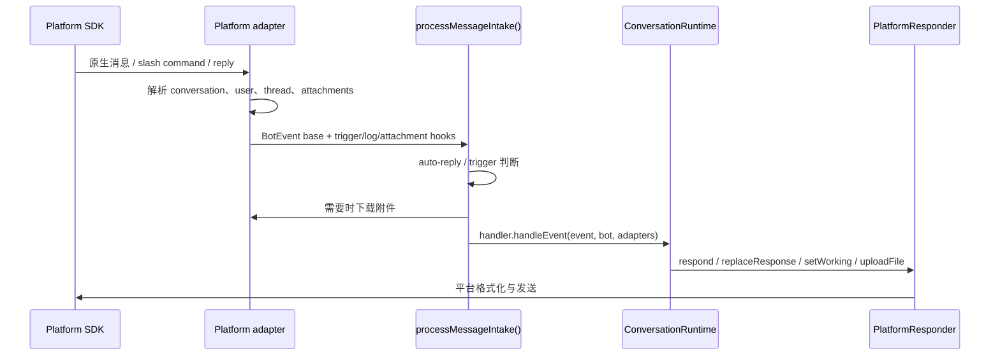

import { Aside, Card, CardGrid, LinkCard, Steps } from "@astrojs/starlight/components";

它的目标是让 `src/runtime/*` 和 `src/agent.ts` 不需要知道每个平台的 SDK、thread 规则、消息更新 API 或文件下载方式。

<CardGrid>
  <Card title="事件标准化" icon="setting">
    将平台原生 message、mention、slash command 或 reply 转为通用 `BotEvent`。
  </Card>
  <Card title="Session routing" icon="open-book">
    根据 channel、thread、reply chain 算出 `sessionKey`，让对话进入正确会话。
  </Card>
  <Card title="回复能力" icon="rocket">
    `PlatformResponder` 封装回复、更新、typing/working 状态与文件上传。
  </Card>
</CardGrid>

## 接入层做什么

<Steps>

1. 接收平台事件，例如消息、mention、slash command 或 reply。
2. 判断消息是否应该触发 mikan：DM、mention、thread reply、auto-reply policy。
3. 转为通用的 `BotEvent` 与 `ChatMessage`。
4. 计算 `sessionKey`，让不同 channel、thread、reply 可以对应到正确 session。
5. 下载附件并写入 workspace 的 `attachments/`。
6. 创建 `PlatformResponder`，封装回复、更新、typing/working 状态与文件上传。
7. 把事件交给 `BotHandler`，也就是 `ConversationRuntime`。

</Steps>

通用类型由 `src/adapter.ts` 导出，实现类型放在 `src/types.ts` 与 `src/adapters/types.ts`。

## 通用流程

## 通用工具

| 文件                        | 用途                                                                        |
| --------------------------- | --------------------------------------------------------------------------- |
| `src/adapter.ts`            | 对外导出 `Bot`、`BotEvent`、`ChatMessage`、`PlatformResponder` 等通用接口。 |
| `src/adapters/intake.ts`    | 共享消息入口流程：trigger、log、attachment、queue、handler 调用顺序。       |
| `src/adapters/shared.ts`    | 共享 retry、queue、长消息切分、log、stop target resolution。                |
| `src/adapters/streaming.ts` | 将 streaming response buffer 后再 flush，避免过于频繁更新平台消息。         |

## 平台差异

<LinkCard
  title="Slack"
  description="Socket Mode、channel/thread session、Block Kit、assistant status、Slack mrkdwn。"
  href="platform-adapters/slack/"
/>
<LinkCard
  title="Discord"
  description="Gateway events、guild/DM/thread channel、slash command、Discord Markdown、typing indicator。"
  href="platform-adapters/discord/"
/>
<LinkCard
  title="Telegram"
  description="Long polling、private/group chat、reply-based session、Telegram HTML mode、photo/document download。"
  href="platform-adapters/telegram/"
/>

## 与核心运行时的边界

<Aside type="note" title="依赖方向">
  平台 adapter 可以知道平台 SDK 与消息格式，但不应该知道 agent 如何执行任务。
</Aside>

核心执行阶段只依赖这些通用抽象：

- `BotEvent`：一次使用者或平台事件。
- `Bot`：平台 bot 能力，例如 post message、upload file。
- `BotAdapters`：一次事件附帶的 `message`、`responseCtx`、`platform` metadata。
- `PlatformResponder`：agent 回复时使用的通道。

如果新增平台，优先实现这些抽象，不要把平台 SDK 细节带进 `src/runtime/*` 或 `src/agent.ts`。
