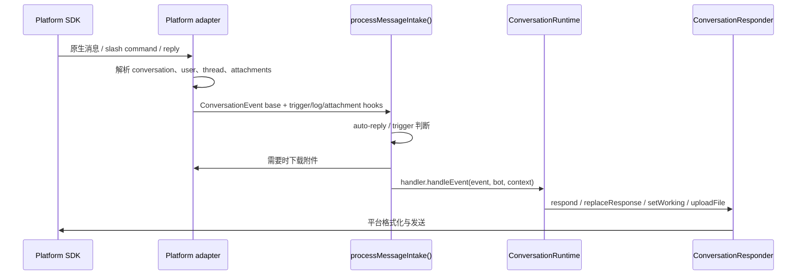

import { Aside, Card, CardGrid, LinkCard, Steps } from "@astrojs/starlight/components";

它的目标是让 `src/runtime/*` 和 `src/agent.ts` 不需要知道每个平台的 SDK、thread 规则、消息更新 API 或文件下载方式。

<CardGrid>
  <Card title="事件标准化" icon="setting">
    将平台原生 message、mention、slash command 或 reply 转为通用 `ConversationEvent`。
  </Card>
  <Card title="Session routing" icon="open-book">
    根据 channel、thread、reply chain 算出 `sessionKey`，让对话进入正确会话。
  </Card>
  <Card title="回复能力" icon="rocket">
    `ConversationResponder` 封装回复、更新、typing/working 状态与文件上传。
  </Card>
</CardGrid>

## 接入层做什么

<Steps>

1. 接收平台事件，例如消息、mention、slash command 或 reply。
2. 判断消息是否应该触发 mikan：DM、mention、thread reply、auto-reply policy。
3. 转为通用的 `ConversationEvent` 与 `ConversationMessage`。
4. 计算 `sessionKey`，让不同 channel、thread、reply 可以对应到正确 session。
5. 把附件下载到该对话办公室的 `attachments/` 目录。
6. 创建 `ConversationResponder`，封装回复、更新、typing/working 状态与文件上传。
7. 把事件交给 `MessagingEventHandler`，也就是 `ConversationRuntime`。

</Steps>

通用类型由 `src/adapter.ts` 导出，实现类型放在 `src/types.ts` 与 `src/adapters/types.ts`。

## 对话身份

适配器把各自平台的原始对话 id 留在外部 I/O 边界上——那是它们从 SDK 收到、也是发回去的东西。存储则不然：`platform`
加上原始 id 构成一个 `OfficeAddress`，`src/office/` 模块把它哈希成 office key，用来命名该对话的目录、它的主机侧
state 以及它的 vault。适配器不会自己构造这些路径；它们传入 address 并接收一个 `Office` 值。读取磁盘时有一点值得知道：
Slack 频道 `C0123456789` 位于 `<workspace>/v1-slack-c0123456789-<digest>/`，而不是 `<workspace>/C0123456789/`。

Slash command 的注册与路由都派生自 `src/commands/manifest.ts`，而非各适配器各自的清单，因此一条新命令只需一处条目，
就能到达每个选择加入的平台。

## 通用流程

## 通用工具

| 文件                                   | 用途                                                                                                      |
| -------------------------------------- | --------------------------------------------------------------------------------------------------------- |
| `src/adapter.ts`                       | 对外导出 `MessagingBot`、`ConversationEvent`、`ConversationMessage`、`ConversationResponder` 等通用接口。 |
| `src/adapters/intake.ts`               | 共享消息入口流程：魔法词、trigger policy、附件、log、busy policy、queue，然后分发。                       |
| `src/adapters/shared.ts`               | 共享 retry、queue、长消息切分、stop target resolution，以及两条办公室写入路径（`log.jsonl`、附件）。      |
| `src/adapters/progressive-renderer.ts` | 统一负责渐进式响应缓冲、工具进度、最终输出与平台写入串行化。                                              |

`saveIncomingAttachments()` 拥有整套附件约定——办公室 `attachments/` 目录下经过清洗的 `<timestamp>_<name>`，
以及交给运行时的办公室相对路径——因此没有任何适配器自己拼接对话路径。

## 平台差异

<LinkCard
  title="Slack"
  description="Socket Mode、channel/thread session、Block Kit、assistant status、Slack mrkdwn。"
  href="/zh-cn/platform-adapters/slack/"
/>
<LinkCard
  title="Discord"
  description="Gateway events、guild/DM/thread channel、slash command、Discord Markdown、typing indicator。"
  href="/zh-cn/platform-adapters/discord/"
/>
<LinkCard
  title="Telegram"
  description="Long polling、private/group chat、reply-based session、Telegram HTML mode、photo/document download。"
  href="/zh-cn/platform-adapters/telegram/"
/>
<LinkCard
  title="GitHub"
  description="GitHub App 轮询、issue/PR 对话、watermark 去重与基于评论的响应。"
  href="/zh-cn/platform-adapters/github/"
/>

## 与核心运行时的边界

<Aside type="note" title="依赖方向">
  平台 adapter 可以知道平台 SDK 与消息格式，但不应该知道 agent 如何执行任务。
</Aside>

核心执行阶段只依赖这些通用抽象：

- `ConversationEvent`：一次使用者或平台事件。
- `MessagingBot`：平台 messaging bot 能力，例如 post message、upload file。
- `ConversationContext`：一次事件附帶的 `message`、`responder`、`platform` metadata。
- `ConversationResponder`：agent 回复时使用的通道。

如果新增平台，优先实现这些抽象，不要把平台 SDK 细节带进 `src/runtime/*` 或 `src/agent.ts`。
