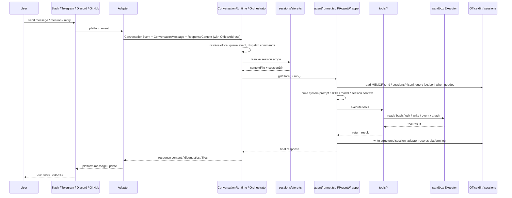
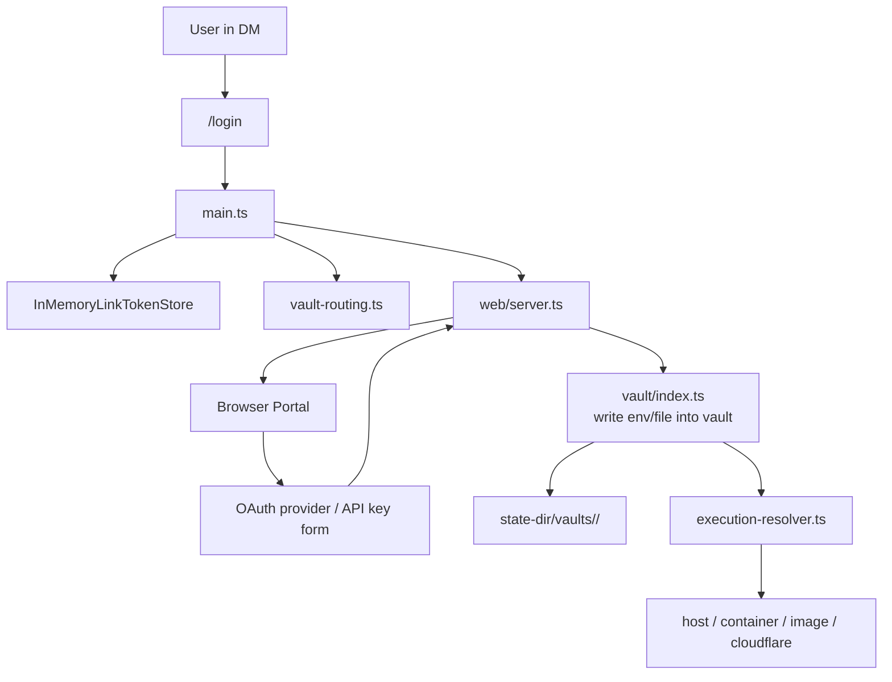

## 1. 系統總覽


## 2. 主要分層

### A. 平台接入層

共用 adapter contract 請見[平台接入](platform-adapters.mdx)。各平台細節請見 [Slack](platform-adapters/slack.md)、[Discord](platform-adapters/discord.md)、[Telegram](platform-adapters/telegram.md) 與 [GitHub](platform-adapters/github.md)。

- `src/adapters/slack/*`
- `src/adapters/telegram/*`
- `src/adapters/discord/*`
- `src/adapters/github/*`
- `src/adapter.ts`

職責：

- 接收 Slack / Telegram / Discord 原生事件，或輪詢 GitHub issues 與 pull requests
- 轉成統一的 `ConversationEvent`、`ConversationMessage`、`ConversationResponder`，每一個都帶著該對話的 `OfficeAddress`
- 依平台規則計算 `sessionKey`
- 封裝回覆、typing、working、檔案上傳等平台差異

原始平台識別碼只停留在這些對外 I/O 邊界上。再往內的一切，都以 `OfficeAddress` 來定址一個對話。

### B. 核心協調層

- `src/main.ts`
- `src/cli/boot.ts`
- `src/runtime/conversation-runtime.ts`
- `src/adapters/intake.ts`
- `src/commands/manifest.ts`
- `src/sessions/store.ts`
- `src/sessions/chat-history-sync.ts`

職責：

- 把 argv 解析成一份 boot plan（`src/cli/boot.ts`），再執行它：讀取 env / `settings.json`、建立 `Workspace`、執行 office 遷移，並啟動選定的平台 bot
- 建立 `ConversationRuntime` 作為各平台 bot 的 `MessagingEventHandler`
- `stop` 魔法詞由 conversation intake（`src/adapters/intake.ts`）在 trigger policy 與排隊之前辨識
- `/login`、`/session`、`/new` 等控制命令在 `ConversationRuntime.runSession` 內 dispatch；adapter 註冊與路由所依據的命令清單位於 `src/commands/manifest.ts`
- 以 office address 加上 session key 作為 per-session 狀態與 queue 的 key，因此同一時間只有一個 session 在執行，其他 session 則可並行進行
- 決定每個 session scope 對應哪個 `PiAgentWrapper`

### C. Agent 執行層

- `src/agent/`
- `src/harness/*`
- `src/tools/*`

職責：

- 建立 `PiAgentWrapper`
- 載入模型、skills、memory、session context
- 將使用者訊息送入 mikan 自有的 agent harness（`src/harness/`，建構於 `pi-agent-core` / `pi-ai` 之上），由它執行回合迴圈、auto-compaction、auto-retry 與 budgets and bounded subagents
- 把 tool calls 接到本地 `read/bash/edit/write/event/attach`
- 把 tool 結果回寫 session，並透過 adapter 回傳給平台

### D. 執行環境層

- `src/sandbox/*`
- `src/provisioner.ts`
- `src/execution-resolver.ts`

職責：

- 統一抽象 `Executor`
- sandbox runtime 分成兩類：
  - shared: `host` / `container:<name>`，同一個 host 或指定 container 共用
  - isolated: `image:<image>` / `cloudflare:*`，依 actor/conversation/vault 路由到隔離的執行環境
- 透過 `ActorExecutionResolver` 依 user/conversation/vault 決定實際 executor
- 在 `image` 模式下自動建立與回收 Docker container，並把 `image:<image>` 解析成 concrete `container:<name>` executor

### E. Conversation office 層

- `src/office/*`
- `src/workspace-projection/index.ts`

每個對話都是一個 **office**：它自己的持久工作區域與資料邊界。這個模組擁有該身分與佈局。

職責：

- `createWorkspace({ root, stateDir })` 建立每個 process 的 `Workspace` 值：workspace root、它的全域 `MEMORY.md` / `skills/` / `events/` / `agents/`，以及 office factory
- `workspace.office(address)` 回傳一個所有路徑都已預先算好的凍結 `Office` 值——`dir`、`memoryPath`、`skillsDir`、`sessionsDir`、`attachmentsDir`、`logPath`，以及僅限 host 的 `stateDir`——再加上 `ensure()`，也就是唯一的實體化接縫
- 推導出 `OfficeKey`（`v1-<platform>-<readable-id>-<sha256 prefix>`），用來在 host 上、sandbox runtime 內以及 vault 中命名該 office
- 維護僅限 host 的 office registry（`office-registry.json`），作為 raw id ↔ office 的持久對照，因為 office key 無法反推
- 執行開機時從 legacy raw-id 佈局而來的遷移，並以 journal 支援當機復原
- 解析 workspace projection：依該 office 的 door policy，決定哪些 host 路徑會掛進 sandbox runtime

### F. 狀態與持久化層

- `src/sessions/store.ts`
- `src/sessions/chat-history-sync.ts`
- `src/vault/index.ts`

職責：

- session 檔案管理： `sessions/current` 與 `*.jsonl`
- `log.jsonl` 與 structured session 的雙軌歷史保存
- workspace 級別與 office 級別的 `MEMORY.md`
- per-office vault 憑證與 mount / env 注入

### G. 輔助服務層

- `src/web/login/*`
- `src/web/admin/*`
- `src/web/session-view/*`
- `src/events.ts`

職責：

- `src/web/server.ts` 負責 HTTP server，並掛接 login/vault、admin、session-view、agent-event routes
- 提供 Web login portal，支援 API key 與 OAuth 寫入 vault
- 提供 admin portal，支援 conversation/settings/workspace/events/skills 管理與 link generation
- 提供 session viewer；目前可顯示 session timeline，且在 interactive wiring 啟用時可透過 `/session/message` 送訊息
- 監看 `events/*.json`，把排程事件重新注入 bot 流程

## 3. 訊息處理流程



## 4. Office、session 與檔案佈局

`mikan` 會分開 sandbox 可見的工作資料，以及以 host 為準的設定與憑證：

```text
<workspace>/
├── MEMORY.md                  # workspace-level memory
├── skills/                    # workspace-level skills
├── events/                    # the workspace scheduling bus
├── agents/                    # per-install subagent profile patches
└── <officeKey>/               # one conversation office
    ├── MEMORY.md              # office-level memory
    ├── log.jsonl              # grep-friendly platform message history
    ├── attachments/           # platform attachment downloads
    ├── scratch/               # in-progress working area
    ├── skills/                # office-level skills
    └── sessions/
        ├── current            # top-level session pointer
        ├── <timestamp>_<id>.jsonl
        └── <scope_id>.jsonl   # thread / reply scoped sessions

<state-dir>/
├── settings.json              # required global settings
├── office-registry.json       # office inventory + migration journal
├── conversations/
│   └── <officeKey>/settings.json  # host-only conversation overrides
└── vaults/<vaultId>/          # credentials
```

預設 state directory 是 `~/.mikan`。它必須位於 sandbox 可見的 workspace 路徑之外。`MEMORY.md`、`skills`、`events` 與 `agents` 是 workspace root 的保留名稱，永遠不會是 office 目錄。

設計重點：

- `<officeKey>` 是 `v1-<platform>-<readable-id>-<hash>`，由平台與原始 conversation id 經 SHA-256 推導而來。中間那段可讀內容只是為了診斷；digest 才是身分。因此兩個共用同一個 raw conversation id 的平台，會得到不同的目錄、設定與 vault
- office key 在 host 上與 sandbox runtime 內命名的是同一個目錄，因此一個路徑跨越邊界時不會改變意義
- office key 無法反推回原始平台 id，所以 `office-registry.json` 會在每個 office 第一次實體化時記下它的 `(platform, conversationId)`。面向 raw id 的介面——Admin portal、`mikan office claim`——都透過它來解析
- `log.jsonl` 是平台對話紀錄：來源平台上實際發生過什麼
- `sessions/*.jsonl` 是 LLM 工作上下文/工作紀錄：mikan 拿什麼給 LLM 看，以及 LLM/tool 做了什麼
- top-level session 用 `current` 指標，但 `current` 不是 channel history；缺失時可從 `log.jsonl` 重建最近 top-level 工作上下文
- thread / reply session 用固定檔名，讓 scoped session 可被單獨追蹤
- session key 維持原始平台值；runtime 狀態是以 office 加上 session key 來定址，因此一個 session key 絕不可能選到另一個 office 的 runner 或 queue
- Slack top-level 訊息共用 channel session；Slack thread replies 使用 `conversationId:threadTs`
- Slack events 會先建立 top-level anchor message，再用 `conversationId:anchorTs` 執行

### Door policy 與 workspace projection

一個 office 的 sandbox runtime 實際看到什麼，取決於 _workspace projection_，而它是由該 office 的 door policy 解析出來的：

| Door policy | Layout           | 掛進 runtime 的內容                                                  |
| ----------- | ---------------- | -------------------------------------------------------------------- |
| `isolated`  | `conversation`   | 只有 `<officeKey>/`                                                  |
| `trusted`   | `shared-support` | `<officeKey>/` 再加上 workspace 的 `MEMORY.md`、`skills/`、`events/` |
| `trusted`   | `full`           | 整個 workspace root                                                  |

`isolated` 是預設值，而且一律隱含 `conversation` layout。Door policy 是資料存取邊界，它絕不會改變執行環境或網路隔離。它可從 admin portal 或用 `/pi-sandbox door` 依 office 設定，全域預設值則位於 `sandbox.workspace`——見[設定](/zh-tw/configuration/)。

## 5. Login / Vault / Sandbox 關係



重點：

- 憑證不直接進 workspace
- vault 存在 `--state-dir`
- 執行時才由該 office 的 vault 路由到對應 sandbox
- `image` / `cloudflare` 模式以 office key 作為 vault 的 key——也就是在 workspace 與 registry 中命名該 office 的同一個字串；`container:<name>` 使用 shared container vault；`host` 以使用者為 key，且不注入 vault env

## 6. Events 與一般對話的差異

`events/*.json` 會被 `EventsWatcher` 監看，之後轉成 `ConversationEvent` 再走一次正常流程。
也就是說 events 不是獨立執行器，而是「另一個訊息入口」。

這讓下列能力共用同一套機制:

- session context
- vault routing
- tool execution
- 平台回覆
- stop / running state 管理

## 7. 架構結論

如果用一句話總結，`mikan` 的核心其實是：

> 一個以 `main.ts` 為協調中心、以 `agent.ts` 為執行核心、以 `office/session/vault/sandbox` 為基礎設施的多平台 AI agent bot。

可以把它理解成 7 個核心子系統:

1. 平台轉接器
2. Bot runtime 協調
3. Agent + tools
4. Conversation office：身分、佈局、registry 與 workspace projection
5. Session/context 持久化
6. Vault + sandbox execution routing
7. Web/event side services

Office 就是這些子系統共同認定的單位：一個對話、一個目錄、一個 vault、一個 sandbox runtime、一條資料邊界。見 [ADR 0003](https://github.com/geminixiang/mikan/blob/main/docs/adr/0003-isolated-conversation-offices.md)、[ADR 0004](https://github.com/geminixiang/mikan/blob/main/docs/adr/0004-persistent-offices-and-ephemeral-factory-floors.md) 與 [ADR 0005](https://github.com/geminixiang/mikan/blob/main/docs/adr/0005-office-address-identity.md)。
