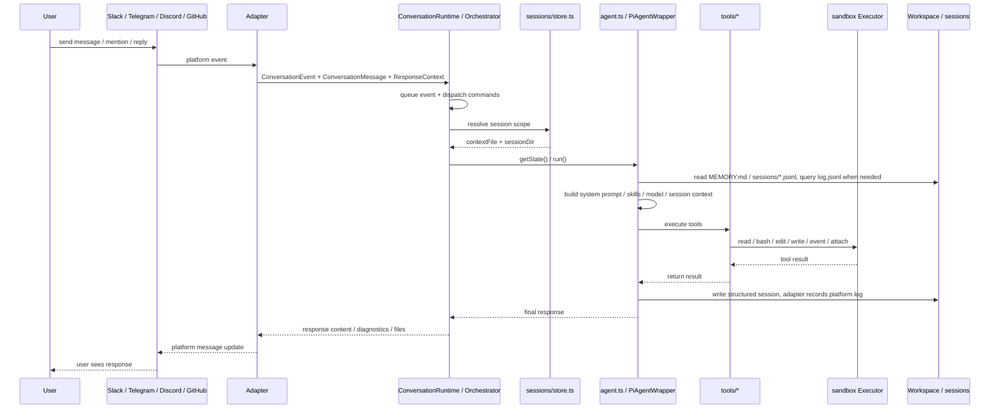
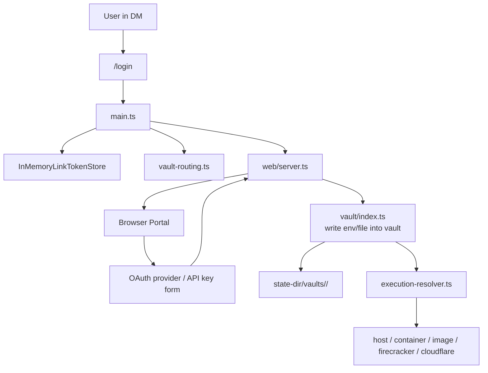

## 1. 系統總覽


## 2. 主要分層

### A. 平台接入層

共用 adapter contract 請見[平台接入](../platform-adapters/)。各平台細節請見 [Slack](../platform-adapters/slack/)、[Discord](../platform-adapters/discord/)、[Telegram](../platform-adapters/telegram/) 與 [GitHub](../platform-adapters/github/)。

- `src/adapters/slack/*`
- `src/adapters/telegram/*`
- `src/adapters/discord/*`
- `src/adapters/github/*`
- `src/adapter.ts`

職責：

- 接收 Slack / Telegram / Discord 原生事件，或輪詢 GitHub issues 與 pull requests
- 轉成統一的 `ConversationEvent`、`ConversationMessage`、`ConversationResponder`
- 依平台規則計算 `sessionKey`
- 封裝回覆、typing、working、檔案上傳等平台差異

### B. 核心協調層

- `src/main.ts`
- `src/runtime/conversation-runtime.ts`
- `src/adapters/intake.ts`
- `src/commands/manifest.ts`
- `src/sessions/store.ts`
- `src/sessions/chat-history-sync.ts`

職責：

- 啟動 CLI、讀取 env / args / `settings.json`
- 建立 `ConversationRuntime` 作為各平台 bot 的 `MessagingEventHandler`
- `stop` 魔法詞由 conversation intake（`src/adapters/intake.ts`）在 trigger policy 與排隊之前辨識
- `/login`、`/session`、`/new` 等控制命令在 `ConversationRuntime.runSession` 內 dispatch；adapter 註冊與路由所依據的命令清單位於 `src/commands/manifest.ts`
- 管理 `conversationStates` 與 per-session queue，避免同一 session 重複執行
- 決定每個 session scope 對應哪個 `PiAgentWrapper`

### C. Agent 執行層

- `src/agent.ts`
- `src/harness/*`
- `src/tools/*`

職責：

- 建立 `PiAgentWrapper`
- 載入模型、skills、memory、session context
- 將使用者訊息送入 mikan 自有的 agent harness（`src/harness/`，建構於 `pi-agent-core` / `pi-ai` 之上），由它執行回合迴圈、auto-compaction、auto-retry 與 extension hooks
- 把 tool calls 接到本地 `read/bash/edit/write/event/attach`
- 把 tool 結果回寫 session，並透過 adapter 回傳給平台

### D. 執行環境層

- `src/sandbox/*`
- `src/provisioner.ts`
- `src/execution-resolver.ts`

職責：

- 統一抽象 `Executor`
- sandbox runtime 分成兩類：
  - shared: `host` / `container:<name>`，同一個 host 或指定 container 共用
  - isolated: `image:<image>` / `firecracker:*` / `cloudflare:*`，依 actor/conversation/vault 路由到隔離的執行環境
- 透過 `ActorExecutionResolver` 依 user/conversation/vault 決定實際 executor
- 在 `image` 模式下自動建立與回收 Docker container，並把 `image:<image>` 解析成 concrete `container:<name>` executor

### E. 狀態與持久化層

- `src/sessions/store.ts`
- `src/sessions/chat-history-sync.ts`
- `src/vault/index.ts`

職責：

- session 檔案管理： `sessions/current` 與 `*.jsonl`
- `log.jsonl` 與 structured session 的雙軌歷史保存
- workspace / conversation 級別 `MEMORY.md`
- per-conversation vault 憑證與 mount / env 注入

### F. 輔助服務層

- `src/web/login/*`
- `src/web/admin/*`
- `src/web/session-view/*`
- `src/events.ts`

職責：

- `src/web/server.ts` 負責 HTTP server，並掛接 login/vault、admin、session-view、agent-event routes
- 提供 Web login portal，支援 API key 與 OAuth 寫入 vault
- 提供 admin portal，支援 conversation/settings/workspace/events/skills 管理與 link generation
- 提供 session viewer；目前可顯示 session timeline，且在 interactive wiring 啟用時可透過 `/session/message` 送訊息
- 監看 `events/*.json`，把排程事件重新注入 bot 流程

## 3. 訊息處理流程



## 4. Session 與檔案佈局

`mikan` 會分開 sandbox 可見的工作資料，以及以 host 為準的設定與憑證：

```text
<workspace>/
├── MEMORY.md                  # workspace-level memory
├── skills/                    # workspace-level skills
├── events/                    # scheduled and external events
└── <conversationId>/
    ├── MEMORY.md              # conversation-level memory
    ├── log.jsonl              # grep-friendly platform message history
    ├── attachments/           # platform attachment downloads
    ├── scratch/               # in-progress working area
    ├── skills/                # conversation-level skills
    └── sessions/
        ├── current            # top-level session pointer
        ├── <timestamp>_<id>.jsonl
        └── <scope_id>.jsonl   # thread / reply scoped sessions

<state-dir>/
├── settings.json              # required global settings
├── conversations/
│   └── <conversationId>/settings.json  # host-only conversation overrides
└── vaults/<vaultId>/          # credentials
```

預設 state directory 是 `~/.mikan`。它必須位於 sandbox 可見的 workspace 路徑之外。

設計重點：

- `log.jsonl` 是平台對話紀錄：來源平台上實際發生過什麼
- `sessions/*.jsonl` 是 LLM 工作上下文/工作紀錄：mikan 拿什麼給 LLM 看，以及 LLM/tool 做了什麼
- top-level session 用 `current` 指標，但 `current` 不是 channel history；缺失時可從 `log.jsonl` 重建最近 top-level 工作上下文
- thread / reply session 用固定檔名，讓 scoped session 可被單獨追蹤
- Slack top-level 訊息共用 channel session；Slack thread replies 使用 `conversationId:threadTs`
- Slack events 會先建立 top-level anchor message，再用 `conversationId:anchorTs` 執行

## 5. Login / Vault / Sandbox 關係



重點：

- 憑證不直接進 workspace
- vault 存在 `--state-dir`
- 執行時才由 conversation vault 路由到對應 sandbox
- `image` / `firecracker` / `cloudflare` 模式使用 per-actor/per-conversation vault routing；`container:<name>` 使用 shared container vault；`host` 不注入 vault env

## 6. Events 與一般對話的差異

`events/*.json` 會被 `EventsWatcher` 監看，之後轉成 `ConversationEvent` 再走一次正常流程。
也就是說 events 不是獨立執行器，而是「另一個訊息入口」。

這讓下列能力共用同一套機制:

- session context
- vault routing
- tool execution
- 平台回覆
- stop / running state 管理

## 7. 架構結論

如果用一句話總結，`mikan` 的核心其實是：

> 一個以 `main.ts` 為協調中心、以 `agent.ts` 為執行核心、以 `session/vault/sandbox` 為基礎設施的多平台 AI agent bot。

可以把它理解成 6 個核心子系統:

1. 平台轉接器
2. Bot runtime 協調
3. Agent + tools
4. Session/context 持久化
5. Vault + sandbox execution routing
6. Web/event side services
