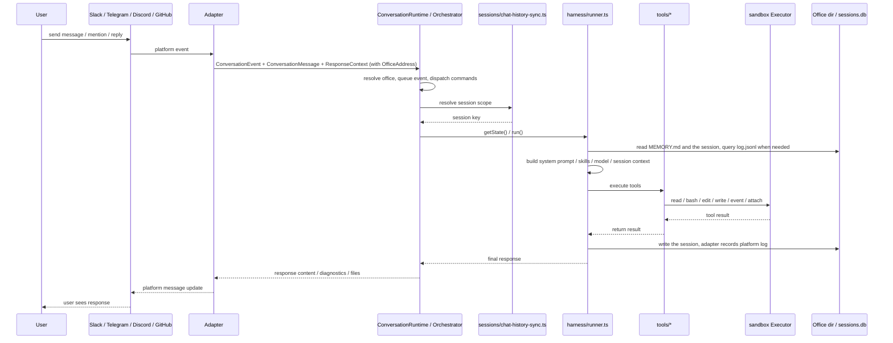
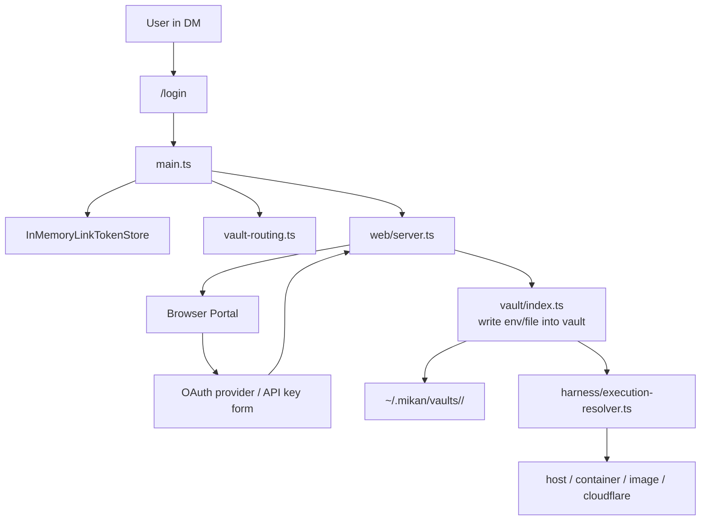

## 1. 系統總覽


## 2. 主要分層

### A. 平台接入層

共用 adapter contract 請見[平台接入](platform-adapters.mdx)。各平台細節請見 [Slack](platform-adapters/slack.md)、[Discord](platform-adapters/discord.md)、[Telegram](platform-adapters/telegram.md) 與 [GitHub](platform-adapters/github.md)。

- `src/adapters/slack/*`
- `src/adapters/telegram/*`
- `src/adapters/discord/*`
- `src/adapters/github/*`

職責：

- 接收 Slack / Telegram / Discord 原生事件，或輪詢 GitHub issues 與 pull requests
- 轉成統一的 `ConversationEvent`、`ConversationMessage`、`ConversationResponder`，每一個都帶著該對話的 `OfficeAddress`
- 依平台規則計算 `sessionKey`
- 封裝回覆、typing、working、檔案上傳等平台差異

原始平台識別碼只停留在這些對外 I/O 邊界上。再往內的一切，都以 `OfficeAddress` 來定址一個對話。

### B. 核心協調層

- `src/main.ts`
- `src/cli/boot.ts`
- `src/runtime/conversation-runtime.ts`
- `src/adapters/intake.ts`
- `src/adapters/commands/manifest.ts`
- `src/sessions/session-store.ts`
- `src/sessions/chat-history-sync.ts`

職責：

- 把 argv 解析成一份 boot plan（`src/cli/boot.ts`），再執行它：讀取 env / `settings.json`、還有待套用的 State 遷移時拒絕啟動、建立 `Workspace`，並啟動選定的平台 bot
- 建立 `ConversationRuntime` 作為各平台 bot 的 `MessagingEventHandler`
- `stop` 魔法詞由 conversation intake（`src/adapters/intake.ts`）在 trigger policy 與排隊之前辨識
- `/login`、`/session`、`/new` 等控制命令在 `ConversationRuntime.runSession` 內 dispatch；adapter 註冊與路由所依據的命令清單位於 `src/adapters/commands/manifest.ts`
- 以 office address 加上 session key 作為 per-session 狀態與 queue 的 key，因此同一時間只有一個 session 在執行，其他 session 則可並行進行
- 決定每個 session scope 對應哪個 `PiAgentWrapper`

### C. Agent 執行層

- `src/harness/*`
- `src/harness/execution-resolver.ts`
- `src/harness/tools/*`

職責：

- 建立 `PiAgentWrapper`
- 載入模型、skills、memory、session context
- 將使用者訊息送入 mikan 自有的 agent harness（`src/harness/`，建構於 `pi-durable` / `pi-ai` 之上），由它執行回合迴圈、auto-compaction、auto-retry 與 budgets and bounded subagents
- 把 tool calls 接到本地 `read/bash/edit/write/event/attach`
- 把 tool 結果回寫 session，並透過 adapter 回傳給平台
- 透過 `ActorExecutionResolver` 依 user/conversation/vault 決定實際 executor

### D. 執行環境層

- `src/sandbox/*`
- `src/sandbox/provisioner.ts`

職責：

- 統一抽象 `Executor`
- 依 workspace 能力把 sandbox runtime 分成兩類：
  - 非受管 projection：`host` / `container:<name>` / `cloudflare:*`
  - 受管 projection：`image:<image>`，會強制 private office visibility：無法觸及其他 private office，共用知識為唯讀
- 在 `image` 模式下自動建立與回收 Docker container，並把 `image:<image>` 解析成 concrete `container:<name>` executor

### E. Conversation office 層

- `src/office/*`
- `src/office/projection.ts`

每個對話都是一個 **office**：它自己的持久工作區域與資料邊界。這個模組擁有該身分與佈局。

職責：

- `createWorkspace({ root, stateDir })` 建立每個 process 的 `Workspace` 值：workspace root、它的全域 `MEMORY.md` / `skills/` / `agents/`，以及 office factory
- `workspace.office(address)` 回傳一個所有路徑都已預先算好的凍結 `Office` 值——`dir`、`memoryPath`、`skillsDir`、`sessionsPath`、`attachmentsDir`、`logPath`，以及僅限 host 的 `stateDir`——再加上 `ensure()`，也就是唯一的實體化接縫
- 推導出 `OfficeKey`（`v1-<platform>-<readable-id>-<sha256 prefix>`），用來在 host 上、sandbox runtime 內以及 vault 中命名該 office
- 維護僅限 host 的 office registry（`office-registry.json`），作為 raw id ↔ office 的持久對照，因為 office key 無法反推
- 解析該 office 的 visibility 與 workspace projection：哪些 host 路徑會掛進 sandbox runtime，以及 system prompt 可以提及哪些對話

### F. 狀態與持久化層

- `src/sessions/session-store.ts`
- `src/sessions/chat-history-sync.ts`
- `src/vault/index.ts`

職責：

- session 儲存：每個 office 一個 `sessions.db`
- `log.jsonl` 與 structured session 的雙軌歷史保存
- workspace 級別與 office 級別的 `MEMORY.md`
- per-office vault 憑證與 mount / env 注入

### G. 輔助服務層

- `src/adapters/web/login/*`
- `src/adapters/web/admin/*`
- `src/adapters/web/session-view/*`
- `src/events/`

職責：

- `src/adapters/web/server.ts` 負責 HTTP server，並掛接 GitHub webhook 與 login/vault、admin、session-view routes
- 提供 Web login portal，支援 API key 與 OAuth 寫入 vault
- 提供 admin portal，支援 conversation/settings/workspace/events/skills 管理與 link generation
- 提供 session viewer；目前可顯示 session timeline，且在 interactive wiring 啟用時可透過 `/session/message` 送訊息
- 為每個 office 的 event 排程，觸發時重新注入 bot 流程

## 3. 訊息處理流程


```mermaid
sequenceDiagram
  participant U as User
  participant P as Slack / Telegram / Discord / GitHub
  participant A as Adapter
  participant M as ConversationRuntime / Orchestrator
  participant S as sessions/chat-history-sync.ts
  participant R as harness/runner.ts
  participant T as tools/*
  participant X as sandbox Executor
  participant W as Office dir / sessions.db

  U->>P: send message / mention / reply
  P->>A: platform event
  A->>M: ConversationEvent + ConversationMessage + ResponseContext (with OfficeAddress)
  M->>M: resolve office, queue event, dispatch commands
  M->>S: resolve session scope
  S-->>M: session key
  M->>R: getState() / run()
  R->>W: read MEMORY.md and the session, query log.jsonl when needed
  R->>R: build system prompt / skills / model / session context
  R->>T: execute tools
  T->>X: read / bash / edit / write / event / attach
  X-->>T: tool result
  T-->>R: return result
  R->>W: write the session, adapter records platform log
  R-->>M: final response
  M-->>A: response content / diagnostics / files
  A-->>P: platform message update
  P-->>U: user sees response
```

## 4. Office、session 與檔案佈局

`mikan` 會分開 sandbox 可見的工作資料，以及以 host 為準的設定與憑證：

```text
<workspace>/
├── MEMORY.md                  # workspace-level memory
├── skills/                    # workspace-level skills
├── agents/                    # per-install subagent profile patches
└── <officeKey>/               # one conversation office
    ├── MEMORY.md              # office-level memory
    ├── log.jsonl              # grep-friendly platform message history
    ├── attachments/           # platform attachment downloads
    ├── scratch/               # in-progress working area
    └── skills/                # office-level skills

~/.mikan/
├── settings.json              # global settings
├── models.json                # custom providers and models
├── office-registry.json       # office inventory
├── migrations.json            # applied state migrations
├── conversations/
│   └── <officeKey>/
│       ├── settings.json      # host-only conversation overrides
│       ├── sessions.db        # host-only agent history (pi-durable SQLite)
│       └── events/            # host-only scheduled events
└── vaults/<vaultId>/          # credentials
```

state directory 是 `~/.mikan`。它必須位於 sandbox 可見的 workspace 路徑之外。`MEMORY.md`、`skills`、`events` 與 `agents` 是 workspace root 的保留名稱，永遠不會是 office 目錄。

設計重點：

- `<officeKey>` 是 `v1-<platform>-<readable-id>-<hash>`，由平台與原始 conversation id 經 SHA-256 推導而來。中間那段可讀內容只是為了診斷；digest 才是身分。因此兩個共用同一個 raw conversation id 的平台，會得到不同的目錄、設定與 vault
- office key 在 host 上與 sandbox runtime 內命名的是同一個目錄，因此一個路徑跨越邊界時不會改變意義
- office key 無法反推回原始平台 id，所以 `office-registry.json` 會在每個 office 第一次實體化時記下它的 `(platform, conversationId)`。面向 raw id 的介面——Admin portal、`mikan office claim`——都透過它來解析
- `log.jsonl` 是平台對話紀錄：來源平台上實際發生過什麼
- `sessions.db` 只存在 host 上，是 LLM 工作上下文/工作紀錄：mikan 拿什麼給 LLM 看，以及 LLM/tool 做了什麼。top-level session 是儲存的 root conversation，每個 thread / reply session 是依 session key 找到的 conversation
- top-level session 不是 channel history；新的 top-level session 會從 `log.jsonl` 裡最近的 top-level 訊息開始
- 排程 event 放在 office 的 State dir，agent 只能透過 `event` 工具存取
- session key 維持原始平台值；runtime 狀態是以 office 加上 session key 來定址，因此一個 session key 絕不可能選到另一個 office 的 runner 或 queue
- Slack top-level 訊息共用 channel session；Slack thread replies 使用 `conversationId:threadTs`
- Slack events 會先建立 top-level anchor message，再用 `conversationId:anchorTs` 執行

### Office visibility 與 workspace projection

一個 office 的 sandbox runtime 實際看到什麼，取決於 _workspace projection_，而它是由該 office 的 visibility 解析出來的（ADR 0008）。Slack 公開頻道是 public office；私人頻道、DM、群組 DM、外部共享頻道、未知類型，以及所有 Telegram、Discord、GitHub 對話都是 private office。每個 office 的掛載形狀相同，只有唯讀旗標不同：

| 掛在 `/workspace` 底下                        | Public office | Private office |
| --------------------------------------------- | ------------- | -------------- |
| `<officeKey>/`——這個 office                   | 讀寫          | 讀寫           |
| `MEMORY.md`、`skills/`——共用知識              | 讀寫          | 唯讀           |
| `public/<officeKey>/`——其他每個 public office | 唯讀          | 唯讀           |

沒有任何佈局會掛載 workspace root，也沒有任何 office 能觸及另一個 private office。System prompt 的頻道表只會列出該 office 自己以及它所掛載的 public office。Visibility 是資料存取邊界，它絕不會改變執行環境或網路隔離。Admin 與 `/pi-sandbox visibility private` 可以把公開頻道縮為 private；沒有任何方式能放寬超過平台的設定——見[設定](/zh-tw/configuration/)。

## 5. Login / Vault / Sandbox 關係


```mermaid
flowchart TD
  User["User in DM"] --> LoginCmd["/login"]
  LoginCmd --> Main["main.ts"]
  Main --> LinkToken["InMemoryLinkTokenStore"]
  Main --> VaultRouting["vault-routing.ts"]
  Main --> WebServer["web/server.ts"]
  WebServer --> Browser["Browser Portal"]
  Browser --> OAuth["OAuth provider / API key form"]
  OAuth --> WebServer
  WebServer --> VaultManager["vault/index.ts\nwrite env/file into vault"]
  VaultManager --> VaultDir["~/.mikan/vaults/<vaultId>/"]
  VaultManager --> Resolver["harness/execution-resolver.ts"]
  Resolver --> Sandbox["host / container / image / cloudflare"]
```

重點：

- 憑證不直接進 workspace
- vault 存在 `~/.mikan`
- 執行時才由該 office 的 vault 路由到對應 sandbox
- `image` / `cloudflare` 模式以 office key 作為 vault 的 key——也就是在 workspace 與 registry 中命名該 office 的同一個字串；`container:<name>` 使用 shared container vault；`host` 以使用者為 key，且不注入 vault env

## 6. Events 與一般對話的差異

scheduler 在啟動時載入每個 office 的 event 紀錄，之後跟著 event store 的變更更新；紀錄觸發時會轉成 `ConversationEvent`，再走一次正常流程。
也就是說 events 不是獨立執行器，而是「另一個訊息入口」。

這讓下列能力共用同一套機制:

- session context
- vault routing
- tool execution
- 平台回覆
- stop / running state 管理

## 7. 架構結論

如果用一句話總結，`mikan` 的核心其實是：

> 一個以 `main.ts` 為協調中心、以 `agent.ts` 為執行核心、以 `office/session/vault/sandbox` 為基礎設施的多平台 AI agent bot。

可以把它理解成 7 個核心子系統:

1. 平台轉接器
2. Bot runtime 協調
3. Agent + tools
4. Conversation office：身分、佈局、registry 與 workspace projection
5. Session/context 持久化
6. Vault + sandbox execution routing
7. Web/event side services

Office 就是這些子系統共同認定的單位：一個對話、一個目錄、一個 vault、一個 sandbox runtime、一條資料邊界。見 [ADR 0003](https://github.com/geminixiang/mikan/blob/main/docs/adr/0003-isolated-conversation-offices.md)、[ADR 0004](https://github.com/geminixiang/mikan/blob/main/docs/adr/0004-persistent-offices-and-ephemeral-factory-floors.md) 與 [ADR 0005](https://github.com/geminixiang/mikan/blob/main/docs/adr/0005-office-address-identity.md)。
