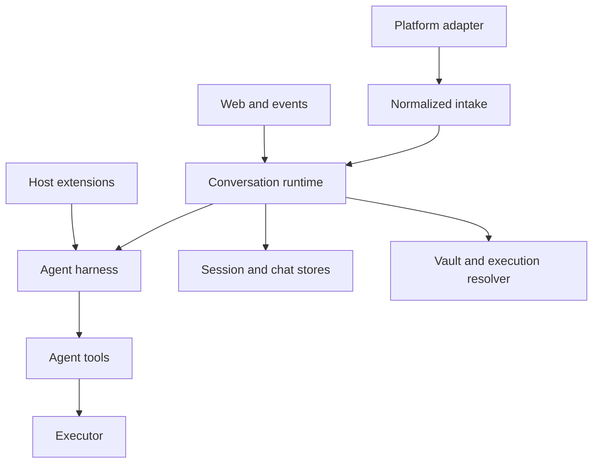

本頁記錄 mikan 的**架構介面**：跨越子系統、行程、持久化或套件邊界的契約。它並非每個已匯出 helper 的清單。只在單一子系統內部使用的 helper 屬於實作細節，即使 TypeScript 目前把它標為 `export` 也一樣。

## 穩定度層級

| 層級             | 意義                                             | 相容性期望                                 |
| ---------------- | ------------------------------------------------ | ------------------------------------------ |
| Public           | 由 npm 消費者或擴充功能作者匯入                  | 保留，或有意識地做版本管理                 |
| Host integration | 用來內嵌 runtime 或新增 platform/runtime backend | 只要該整合存在就保留                       |
| Wire / persisted | 存於磁碟，或跨行程/網路邊界傳送                  | 明確 migrate；讀取端應容忍受支援的較舊格式 |
| Internal         | 連接 mikan CLI 內部的各模組                      | 可在協調好呼叫端與測試的情況下變更         |

由於 `src/index.ts` 會 re-export 整個 harness，這個套件目前暴露的符號比此政策所預期的還多。請把下表視為預期中的契約；migration 請參閱[核心簡化](/zh-tw/core-simplification/)。

## 邊界圖



runtime 是協調者。平台不得知道 harness 的持久化細節，harness 不得知道平台 SDK 物件，而工具也不得知道執行是在本機、容器內或遠端。

## 1. 套件介面

npm 進入點是 `@geminixiang/mikan`，由 `src/index.ts` 實作。

### 受支援的進入點群組

| 群組              | 主要符號                                                                                              | 消費者                                 |
| ----------------- | ----------------------------------------------------------------------------------------------------- | -------------------------------------- |
| Runtime embedding | `createConversationRuntime`、`ConversationRuntime`、`ConversationRuntimeOptions`                      | 提供 platform 與 execution 相依的 host |
| Platform contract | `MessagingBot`、`ConversationEvent`、`ConversationContext`、`ConversationResponder`、`MessagingInfo`  | Platform adapter 與 embedder           |
| Commands          | `CommandHandler`、`CommandContext`、`CommandServices`、`dispatchCommand`                              | 新增確定性指令的 host                  |
| Execution         | `Executor`、`SandboxConfig`、`SandboxAdapter`、`createExecutor`、`parseSandboxArg`、`validateSandbox` | Runtime backend 與 host                |
| Extensions        | `MikanExtensionApi`、hook/event 型別、subagent 型別                                                   | 受信任的擴充功能作者                   |
| Harness embedding | `MikanAgentSession`、`SessionStore`、`MikanModels`、settings 與 event-format 函式                     | 進階 embedder；不適用於一般 bot 整合   |

匯入 `src/` 下的原始碼路徑或 `dist/` 下的產生路徑並不受支援。只有套件 exports 宣告的路徑才應視為 public。目前套件沒有明確的 `exports` map，因此這是一項文件層級的約束，而非強制執行的約束。

## 2. 平台 intake 與 response 介面

來源：`src/types.ts`（由 `src/adapter.ts` re-export）。

### `ConversationEvent`

交付給 `MessagingEventHandler` 的平台中立觸發器。

| 欄位                  | 契約                                                                          |
| --------------------- | ----------------------------------------------------------------------------- |
| `conversationId`      | 原始平台 conversation/channel 識別碼；不得包含 `:`，因為 session key 保留了它 |
| `conversationKind`    | `direct` 或 `shared`；影響 session 與憑證政策                                 |
| `ts`                  | 觸發用的平台訊息識別碼                                                        |
| `thread_ts`           | 選用的 parent/root 平台訊息識別碼                                             |
| `user`                | 平台使用者識別碼                                                              |
| `text`                | 移除平台 mention 後的文字                                                     |
| `attachments`         | 已下載到 host 路徑的檔案                                                      |
| `sessionKey`          | 選用的平台指定覆寫；否則由 session policy 推導                                |
| `vaultConversationId` | 選用的替代身分，僅用於憑證 routing                                            |

### `ConversationContext`

為同一次執行攜帶更豐富的正規化訊息、response port 與平台 metadata：

```ts
interface ConversationContext {
  message: ConversationMessage;
  responder: ConversationResponder;
  platform: MessagingInfo;
}
```

`ConversationMessage` 與 `ConversationEvent` 目前重複了訊息 id、session、conversation kind、user、text、attachments 與 thread identity。Adapter 必須讓兩種表示保持一致。這是一個內部相容 seam，不是新整合值得採用的模型。

### `ConversationResponder`

runtime/harness 的輸出 port。必要操作涵蓋最終文字、取代、診斷、tool status、typing/working 狀態、檔案上傳與回應刪除。串流（`appendResponseDelta`、`finishResponse`）與反應（`react`）是選用能力。

能力規則：呼叫端必須對選用方法做 feature-detect。Adapter 可以緩衝輸出或原生實作串流，但單一次執行內必須保留呼叫順序。

### `MessagingBot`

面向 host 的平台 port。它結合：

- lifecycle：`start()`；
- 對外訊息：`postMessage`、`updateMessage`，以及選用的 upload/reaction/private reply；
- intake scheduling：`enqueueEvent`；
- discovery/policy：`getMessagingInfo()`。

`MessagingInfo.trustModel` 具安全敏感性。當 sandbox 拓撲為隔離時，`membership` 允許環境式的 shared-vault 政策。像公開 GitHub 活動這類開放觸發面必須回傳 `open-trigger`。

`ChatAdapter` 是一個較小的、僅含 lifecycle 的介面（`start`、`stop`、`getMessagingInfo`），但 CLI 使用 `MessagingBot`。除非有呼叫端明確要求 `ChatAdapter`，否則不要兩者都實作。

## 3. Runtime orchestration 介面

來源：`src/runtime/types.ts` 與 `src/runtime/conversation-runtime.ts`。

`createConversationRuntime(options)` 回傳 `ConversationRuntime`，也就是 per-session serialization、command dispatch、runner caching、stop/reset 行為、idle eviction 與 graceful shutdown 的唯一擁有者。

### 輸入方法

| 方法                                 | 語意                                                     |
| ------------------------------------ | -------------------------------------------------------- |
| `handleEvent(event, bot, context)`   | 依推導出的 session key 序列化，接著分派指令或 agent 執行 |
| `runSession(options)`                | 執行一個已序列化的單元；供受控制的 host 使用             |
| `handleStop(...)` / `forceStop(...)` | 協作式/使用者可見的停止，相對於立即的內部停止            |
| `handleNewCommand(...)`              | 中止、重設持久化的 session 狀態，並丟棄已快取的 runner   |

### 控制與檢查

| 方法                                  | 語意                                                |
| ------------------------------------- | --------------------------------------------------- |
| `isRunning(sessionKey)`               | 目前的 in-process 執行狀態                          |
| `getRunningSessions()`                | 供 admin/observability 面的快照                     |
| `switchConversationModel(...)`        | 更新已快取的 runner；回傳先前是否存在               |
| `refreshConversationEnvironment(...)` | 重新解析已快取的 runner 環境                        |
| `shutdown(timeoutMs?)`                | 拒絕新工作、停止 runner，並在期限內等待進行中的工作 |

`ConversationRuntimeOptions` 提供 workspace/設定欄位、sandbox/資源服務、選用的 portal token store、選用的指令、model registry、主動式平台操作，以及平台 tool-pack factory。缺少 vault 與 portal store 會退化為停用的實作；設定了 portal URL 卻沒有對應 store，在使用時會是錯誤。

並行不變式：同一 session key 的呼叫為序列；不同 session key 可並行執行。因此平台 tool pack 是 per-runner 建立的，絕不全域共享，因為 `bindRun` 會變更其 run binding。

## 4. Command 介面

來源：`src/commands/manifest.ts`、`src/commands/types.ts` 與 `src/commands/registry.ts`。

`COMMAND_MANIFEST` 是面向平台的清單，用來推導 slash 形式與原生註冊。`CommandHandler.tryHandle(context)` 是執行契約。Handler 依序執行，第一個回傳 `true` 的結果會消耗掉該訊息。

內建指令會在擴充功能指令之前執行。未匹配的 slash 前綴訊息仍是一般 agent prompt。`stop` 是平台 intake 的 magic word，不是 `CommandHandler`；`session` 是唯一被接受的裸指令。

`CommandContext` 包含正規化的 actor/conversation identity、response 與 bot port、指令文字、privacy 狀態，以及 `CommandServices`。指令 handler 不得深入平台 SDK event。

## 5. Harness 介面

來源：`src/harness/index.ts`、`runner.ts`、`session-store.ts`、`models.ts` 與 `types.ts`。

### `MikanAgentSession`

擁有 model turn loop、訊息持久化、重試、compaction、預算 circuit breaker、擴充功能 hook 與 abort 行為。其對外有意義的操作是 prompt/run、subscribe、abort、session reload、model/thinking 選擇與 disposal。

### `SessionStore`

擁有 version 3 的 append-only session JSONL 與 tree reconstruction。`SessionHeader.version` 目前為 `3`（`CURRENT_SESSION_VERSION`）。Session 項目可能分支；消費者必須使用 store/context helper，不得假設該檔案是扁平的聊天逐字稿。

### `MikanModels` 與 `FileCredentialStore`

`MikanModels` 會解析內建與自訂的 `pi-ai` model。`FileCredentialStore` 會把 provider 憑證持久化在 state directory。Vault 憑證屬於不同邊界：它們被注入到工具執行中，並非用來驗證 host 端的 model client。

### Harness event 與預算

Harness listener 會觀察 model/tool lifecycle event。預算設定會限制 token、成本、耗時與 LLM 呼叫。預算觸發會中止該次執行並發出 `budget_exceeded`；這是終止結果，不是重試訊號。

## 6. Extension 介面

來源：`src/harness/extensions/types.ts`。完整的撰寫範例在[擴充功能開發](/zh-tw/extension-development/)。

擴充功能是受信任的 host 程式碼，會匯出 `activate(api)`。它會在每個 conversation harness 實例中被啟用，且可回傳 disposer。

### `MikanExtensionApi`

| 面向                              | 契約                                                                      |
| --------------------------------- | ------------------------------------------------------------------------- |
| `on`                              | 為 prompt、tool、message、compaction、error 與 budget event 註冊有序 hook |
| `registerTool`                    | 為此 runner 新增一個 `pi-agent-core` 工具                                 |
| `registerCommand`                 | 在內建指令之後新增確定性的 `/name` 處理                                   |
| `onDispose`                       | 在 reset、eviction 或 shutdown 時釋放資源；LIFO 順序                      |
| `context`                         | 唯讀的 conversation/workspace/model identity                              |
| `paths`                           | 對話私有與明確共享的僅限 host 資料目錄                                    |
| `secrets`                         | 依名稱唯讀取用擴充功能 secret                                             |
| `schedules` / `triggerRun`        | 持久化或觸發自主的 event-file 執行                                        |
| `subagent.run`                    | 帶有明確工具、schema 與預算的全新隔離執行                                 |
| `notify` / `react` / `uploadFile` | 選用的 host 平台能力                                                      |

Hook 錯誤會被記錄並略過。`before_agent_start` 與 `tool_result` 的改寫採串接；`tool_call` 以第一個非 undefined 的結果為準。被擋下的 pre-start hook 會阻止 model 呼叫與 session 持久化。

擴充功能的排程與立即執行不會繼承對話歷史。其任務文字必須內容完備，且不得包含 secret。

## 7. Tool 與平台能力介面

來源：`src/tools/types.ts`。

核心工具使用 runner 提供的 executor 與 host 服務。`EventStore` 是 event file 的正規 CRUD port。無效的 event JSON 仍會以 `payload: null` 保持可列出，讓 admin 能診斷或刪除它。

`PlatformToolPackFactory` 會為每個 runner 建立一個私有的 `PlatformToolPack`。`bindRun` 會選擇其工具是否套用於目前的 platform/conversation。這個 factory 邊界讓 GitHub 專屬工具不進入核心工具清單，同時避免跨對話的可變 binding。

## 8. Sandbox 與 executor 介面

來源：`src/sandbox/types.ts` 與 `src/sandbox/index.ts`。

### `SandboxConfig`

這個 discriminated union 目前支援 `host`、`container`、`image`、`gondolin`、`firecracker` 與 `cloudflare`。解析語法與成熟度記錄在 [Sandbox](/zh-tw/sandbox/)。

### `Executor`

這是穩定的執行邊界，也是最重要的 sandbox 契約：

| 操作                          | 需求                                                               |
| ----------------------------- | ------------------------------------------------------------------ |
| `exec`                        | 回傳 stdout、stderr 與 exit code；在支援的情況下遵守 timeout/abort |
| `readFile` / `readFileBase64` | 傳輸內容時不新增 shell 解析層                                      |
| `writeFile`                   | 先 stage 再取代，讓被中止的寫入不會截斷目標                        |
| `getWorkspacePath`            | 把 host workspace root 映射到 runtime 可見的 root                  |
| `getPathContext`              | 宣告 host/runtime 路徑語意與選用的反向映射                         |
| `getSandboxConfig`            | 回傳目前使用中的具體設定                                           |

Remote/exec-only 的實作共用 base64 分塊的檔案傳輸。工具實作必須呼叫 executor 的檔案方法，而非自建 `cat`、`printf` 或 quoting 協定。

### `SandboxAdapter`

Adapter 會辨識一個 CLI 值，選擇性地驗證它，並選擇性地建立 executor。`image` 刻意沒有直接的 executor：actor/vault 解析會先佈建一個具體的 container。

雖然此型別已匯出，adapter 註冊目前是 `src/sandbox/index.ts` 內部的封閉清單；外部消費者無法為 `parseSandboxArg` 或 `createExecutor` 新增 adapter。

## 9. Vault 與 execution-resolution 介面

來源：`src/vault/types.ts`；policy 在 `src/vault/policy.ts`。

`VaultManager` 依 canonical actor key 解析憑證 env 與 mount file、列出並變更 private/shared vault，並回報儲存是否啟用。Secret 位於僅限 host 的 state directory 下。

憑證流程為：

1. Runtime 提供平台信任、conversation、user 與 sandbox 拓撲。
2. execution resolver 選出 actor/vault identity。
3. `VaultManager` 解析 env 與 mount。
4. 具體的 executor 只收到該 runtime 所需的憑證。

Host sandbox 執行絕不會收到 vault injection。Open-trigger 平台絕不會收到環境式的 shared vault。這些是安全不變式，不是為了方便的預設值。

## 10. Session、chat 與 identity 介面

來源：`src/sessions/*`、`src/store.ts` 與 `src/sandbox/identity.ts`。

有兩份刻意保留的紀錄：

| 紀錄                              | 用途                                                       |
| --------------------------------- | ---------------------------------------------------------- |
| `<conversation>/log.jsonl`        | 平台真實紀錄：user/bot 訊息與 attachment                   |
| `<conversation>/sessions/*.jsonl` | agent 真實紀錄：prompt、model/tool 訊息、分支與 compaction |

不要合併它們。聊天歷史可以重建遺失的 top-level agent session，而 agent session 則包含從未出現在平台上的資料。

Session key 使用 `conversationId[:suffix]`；只有 `src/sessions/session-key.ts` 擁有此文法。呼叫端必須使用 `deriveSessionKey`、`conversationIdOf` 與 `threadSuffixOf`，絕不直接切割字串。

`ChatHistorySync` 會解析 top-level/thread scope、bootstrap 新 session、同步新的平台 log 項目、重設 session，並協調 thread 等待進行中的 parent run 封存。

## 11. Event-file 介面

來源：`src/harness/event-format.ts`。

`events/*.json` 是 workspace 層級的排程 bus。正規 union 為：

```ts
type EventFilePayload =
  | { type: "immediate"; conversationId: string; text: string /* common optional fields */ }
  | { type: "one-shot"; conversationId: string; text: string; at: string }
  | { type: "periodic"; conversationId: string; text: string; schedule: string; timezone: string };
```

常見選用欄位是 `platform`、`conversationKind` 與 `userId`。`channelId` 僅作為 legacy 的讀取別名被接受。所有 writer 都使用 `buildEventPayload`；所有 reader 都使用 `parseEventPayload`。

這個 bus 依設計是共享且 agent 可寫的。Ownership 前綴是協作性的，不是授權邊界。

## 12. 持久化檔案系統介面

| 路徑                                               | 擁有者                   | 可見性 / 相容性                   |
| -------------------------------------------------- | ------------------------ | --------------------------------- |
| `<state-dir>/settings.json`                        | config                   | 僅限 host 的全域設定              |
| `<state-dir>/conversations/<id>/settings.json`     | config/admin             | 僅限 host 的對話覆寫              |
| `<state-dir>/auth.json`                            | harness credential store | 僅限 host 的 model-provider 憑證  |
| `<state-dir>/models.json`                          | harness model catalog    | 僅限 host 的自訂 provider/model   |
| `<state-dir>/vaults/**`                            | vault/login              | 僅限 host 的 secret 與 mount file |
| `<state-dir>/{global,conversations}/**/extensions` | extension loader         | 受信任的 host 程式碼              |
| `<workspace>/MEMORY.md`                            | agent/user               | Sandbox 可見的持久記憶            |
| `<workspace>/skills/**/SKILL.md`                   | skills                   | Sandbox 可見的 prompt 指示        |
| `<workspace>/events/*.json`                        | event store/watcher      | 共享的排程 wire format            |
| `<workspace>/<id>/log.jsonl`                       | platform store           | Append-only 的平台歷史            |
| `<workspace>/<id>/sessions/*.jsonl`                | session store            | 有版本的 append-only agent 歷史   |

state directory 不得位於 sandbox 可見的 workspace 內。重要的狀態檔使用 atomic 私有寫入；append-only log 使用 append 語意。

## 13. HTTP 介面

來源：`src/web/server.ts` 與 portal 模組。這些路由支援 mikan 隨附的 UI；它們不是一般公用的 REST API。

| 面向           | 路由                                                                                   | 驗證模型                         |
| -------------- | -------------------------------------------------------------------------------------- | -------------------------------- |
| Health         | `GET /health`                                                                          | 無；回傳 `{ "ok": true }`        |
| Login          | `GET /link`、`POST /api/link/complete`、`POST /api/oauth/start`、`GET /oauth/callback` | 短期 link token 加上 OAuth state |
| Session viewer | `GET /session`、`GET /session/stream`、選用的 `POST /session/message`                  | Session-view token               |
| Admin          | `GET /admin`、`/admin/api/*`                                                           | Admin token                      |
| Agent events   | `GET /api/agent-events/stream`                                                         | 由部署控管的 event stream        |

Admin endpoint 涵蓋 conversation 清單/狀態/使用量、全域與對話設定、model、workspace 檔案、skill、event、平台設定，以及 login/session link。路由 payload 是內部 UI 契約，可能與隨附前端一起演進。

## 14. Gondolin 行程邊界

`gondolin:default` 使用同一台 host 上的 detached Node worker。worker process 與持久化 runtime inventory 是用於重新啟動復原的內部 lifecycle 邊界；不存在 network worker protocol 或遠端 placement contract。

## 契約檢查清單

變更一個邊界時，請確認：

1. 它是 public、host integration、persisted/wire，還是 internal？
2. 這項變更是否改動了 identity、trust、path、concurrency 或 lifecycle 語意？
3. 生產者與消費者是否共用同一個正規的 parser/builder/type？
4. 舊的持久化資料是否仍能載入，或有明確的 migration？
5. 選用能力是否有 feature-detect？
6. 實作能否移到既有 port 之後，而非擴張核心契約？
