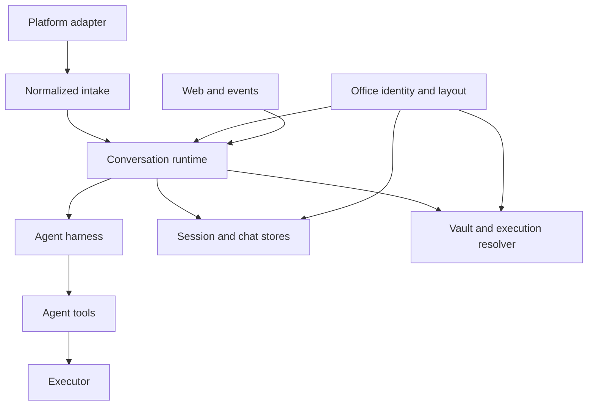

本頁記錄 mikan 的**架構介面**：跨越子系統、行程、持久化或套件邊界的契約。它並非每個已匯出 helper 的清單。只在單一子系統內部使用的 helper 屬於實作細節，即使 TypeScript 目前把它標為 `export` 也一樣。

## 穩定度層級

| 層級             | 意義                                             | 相容性期望                                 |
| ---------------- | ------------------------------------------------ | ------------------------------------------ |
| Public           | 由 npm 消費者匯入                                | 保留，或有意識地做版本管理                 |
| Host integration | 用來內嵌 runtime 或新增 platform/runtime backend | 只要該整合存在就保留                       |
| Wire / persisted | 存於磁碟，或跨行程/網路邊界傳送                  | 明確 migrate；讀取端應容忍受支援的較舊格式 |
| Internal         | 連接 mikan CLI 內部的各模組                      | 可在協調好呼叫端與測試的情況下變更         |

`src/index.ts` 是一份明確的匯出清單，而不是 wildcard re-export，而且 `src/test/public-api.test.ts` 會對它做 snapshot，因此不小心加入的匯出會讓 CI 失敗。它暴露的 harness 內容仍然多於一般 bot 整合所需；請把下表視為預期中的契約。

## 邊界圖


```mermaid
flowchart TD
  P["Platform adapter"] --> I["Normalized intake"]
  I --> R["Conversation runtime"]
  R --> H["Agent harness"]
  H --> T["Agent tools"]
  T --> E["Executor"]
  R --> S["Session and chat stores"]
  R --> V["Vault and execution resolver"]
  O["Office identity and layout"] --> R
  O --> S
  O --> V
  W["Web and events"] --> R
```

runtime 是協調者。平台不得知道 harness 的持久化細節，harness 不得知道平台 SDK 物件，而工具也不得知道執行是在本機、容器內或遠端。office 模組提供 identity 與路徑，runtime、各個 store 與 vault 都用它來定址一個對話。

## 維護者歸屬與 seam 登記

以下八個歸屬範圍是長期的職責劃分。擁有者可以在自己的 port 後面自由更改實作，但更改 port 時必須同時更新兩側，以及下文列出的契約測試。這些範圍描述的是程式碼歸屬，不是行程或權限隔離。

| 歸屬範圍               | 主要模組                                                                 | 擁有                                                                                                                       | 交付                                                                                             |
| ---------------------- | ------------------------------------------------------------------------ | -------------------------------------------------------------------------------------------------------------------------- | ------------------------------------------------------------------------------------------------ |
| **Platform entry**     | `src/adapters/`、`src/types.ts`                                          | SDK 正規化、intake 順序、平台回應傳輸，以及包含 `trustModel` 的 `MessagingInfo`                                            | 平台中立的 `ConversationEvent`、`ConversationContext` 與 capability port                         |
| **Office identity**    | `src/office/`                                                            | `OfficeAddress`/`OfficeKey` 推導、`Workspace`/`Office` 版面值、office 實體化與 workspace projection，以及 registry journal | 預先算好路徑的凍結 `Office` 值，以及依目前 policy 解析的 projection；持久的 raw-id ↔ office 對照 |
| **Runtime/session**    | `src/runtime/`、`src/sessions/`                                          | Session-key 文法、per-session 序列化、chat/session 同步、runner lifecycle、stop/reset 與 shutdown                          | 交給 runner 的已驗證 event；交給 execution resolution 的 office 與 actor 輸入                    |
| **Harness/tools**      | `src/harness/`、`src/harness/tools/`                                     | Model turn、execution resolution、預算、tool schema、skill、subagent 與 host capability 呼叫                               | `ConversationResponder` 輸出與 `Executor` 操作；不接收平台 SDK 物件                              |
| **Scheduled events**   | `src/events/`                                                            | Event wire protocol、parser/builder、限定在單一 office 的 host store、檔名驗證與 scheduler lifecycle                       | 交給 harness/Web 的 `EventStore`；交給平台 messaging 的正規化 event                              |
| **Sandbox/workspace**  | `src/sandbox/`                                                           | Executor 實作、mount 拓撲、runtime/host 路徑 context、受管 container lifecycle 與檔案傳輸                                  | 宣告了路徑與憑證能力的具體 `Executor`                                                            |
| **Vault/web/security** | `src/vault/`、`src/adapters/web/`、`src/sandbox/identity.ts`             | 憑證 identity 與注入 policy、僅限 host 的 portal/token 介面、mount 衝突檢查，以及安全敏感的授權決策                        | 交給 vault policy 的 actor/trust 輸入；憑證只交給選定的 executor                                 |
| **Config/CLI**         | `src/settings/`、`src/cli/`、`src/migrations/`、`src/adapters/commands/` | 啟動/flag 文法、設定持久化、state migration 與指令 manifest                                                                | 有效設定與確定性的指令清單                                                                       |

一個對話的 harness instance 在 context 上與其他 instance 隔離，但這不是檔案系統或行程 sandbox。Sandbox executor 改變的是工具在哪裡執行、拿到哪些 mount；`host` 模式，以及不受管的 `container:*` 模式，都不強制 office visibility。審查 seam 時請把這兩件事分開。

### 跨歸屬 seam

以下的生產者/消費者配對是受支援的橋接。表中的生產者擁有表示方式與順序；消費者必須使用 port 或正規 parser，不得自行重建。

| Seam                      | 生產者 → 消費者                                                                          | 不變式、順序與失敗行為                                                                                                                                                                                                                                                                                                                                                                      |
| ------------------------- | ---------------------------------------------------------------------------------------- | ------------------------------------------------------------------------------------------------------------------------------------------------------------------------------------------------------------------------------------------------------------------------------------------------------------------------------------------------------------------------------------------- |
| Platform intake           | Platform entry → Runtime/session                                                         | Intake 順序是 **magic word → trigger policy → attachment → log → busy policy → queue → dispatch**。`stop` 會略過 trigger policy、attachment 處理與排隊。無效的 conversation 或不屬於它的 session identity 會在排隊前失敗；attachment 失敗會往外傳。                                                                                                                                         |
| Office identity           | Platform entry → Office identity → Runtime/session、store、vault 與 settings             | Adapter 在 intake 時產生 `OfficeAddress`。消費者接受 `Office`/`Workspace` 值，絕不使用目錄名稱。`Office.ensure()` 會**先**把 office 記進 registry 再建立目錄，因此不會有 registry 列舉不到的 office 目錄。                                                                                                                                                                                  |
| Session identity          | Platform entry / Runtime/session → Runtime/session、harness 與 store                     | `src/sessions/session-key.ts` 擁有 `conversationId[:suffix]`，這是原始平台值。平台指定的覆寫只有在屬於該對話時才會被接受，否則推導會拋出例外。Runtime 狀態以 office **加上** session key 為 key，因此 session key 絕不可能選到另一個 office 的狀態。沒有消費者會直接切割 session key。                                                                                                      |
| Command inventory         | Config/CLI → Platform entry、Runtime/session 與 web/session view                         | `COMMAND_MANIFEST` 是唯一的清單。內建指令會消耗已識別的指令形式；未匹配的 slash 文字仍是 agent prompt；`stop` 是 magic word，不是 handler。                                                                                                                                                                                                                                                 |
| Runtime to harness        | Runtime/session → Harness/tools                                                          | `handleEvent` 推導 key，同一個 key 序列執行，不同 key 可以並行。Thread bootstrap 會等執行中的 parent session 封存。因為 `bindRun` 是可變的，平台 tool pack 是 per-runner 建立。                                                                                                                                                                                                             |
| Run output                | Harness/tools → Platform entry                                                           | Harness 輸出的是**回應原文**：平台中立的 Markdown/GFM，使用者 mention 寫成 `<@userName>`。轉成原生呈現完全是 adapter 的工作——Slack 在每條對外路徑上都會把 `<@userName>` 解析成 `<@U…>`，任何 adapter 都不得引導模型輸出平台原生標記。選用的 responder 能力要 feature-detect。同一次執行內，回應操作保留呼叫順序；adapter 可以緩衝或串流，但不得把 harness 持久化或 SDK 物件暴露給 harness。 |
| Runtime ↔ sandbox path    | Runtime/session → Sandbox/workspace → Harness/tools                                      | Runtime 提供 host workspace 與 runtime cwd `<runtime workspace root>/<officeKey>`；office key 在兩側命名同一段路徑，所以路徑跨越邊界時意義不變。Executor 提供 `getWorkspacePath`/`getPathContext`。Prompt 與 tool 輸出使用 runtime 路徑，host 端的 attachment 轉換則使用宣告的 context。對應 root 以外的路徑不轉換。這是路徑契約，不是檔案系統隔離的保證。                                  |
| Executor file transport   | Sandbox/workspace → Harness/tools                                                        | 工具使用 `Executor.readFile`/`writeFile`，絕不使用 shell quoting 協定。只能 exec 的傳輸共用 base64 分塊實作；寫入先 stage 再 rename，傳輸錯誤仍是錯誤。                                                                                                                                                                                                                                     |
| Trust and vault           | Platform entry → Runtime/session → Vault/web/security → Sandbox/workspace                | `MessagingInfo.trustModel` 會傳進 actor 解析；vault policy 以這個值為準，不看平台名稱字串。未提供時預設為 `membership`；`open-trigger` 絕不會拿到環境式 shared vault 副本，而且只有 `image` 會走這條環境式路徑。明確的 vault 佈建仍是另一個管理決策。                                                                                                                                       |
| Settings and live runners | Config/CLI（指令與 admin 是 adapter）→ 設定檔與 Runtime/session                          | `applyConversationSettings` 會在寫入 LLM 變更**之前**清除快取的 runner，忙碌時兩個動作都拒絕。`applyOfficeVisibility` 對 visibility 變更的行為相同，因為 mount 組合已經寫進 runner 的環境。全域 LLM 設定先寫入，再清除閒置的 runner，忙碌的 runner 等執行結束後清除，並回報為 stale。Sandbox 資源限制與 Slack 回覆設定在使用時重新讀取，不會清除 runner。                                   |
| Web capability bridge     | Vault/web/security → Runtime/session 與指令                                              | Portal store 是選用的 runtime 服務。設定了 portal URL 卻沒有對應 store，在使用該 portal 時會失敗；其他情況下缺少 store 會變成停用/未設定的行為。路由 payload 是隨附 UI 的契約，不是一般 REST API。                                                                                                                                                                                          |
| Scheduled events          | Harness/tools 與 Admin → 經 `OfficeEventStore` 到 Runtime/session                        | 紀錄放在 office 僅限 host 的 State dir；任何 sandbox 都不會 mount 它。`event` 工具與 Admin 只能透過綁定該 office 的 store 存取它的 event，payload 也必須指向 store 自己的 office。Writer 使用 `buildEventPayload`；reader 使用 `parseEventPayload`。Secret 不應出現在 event 文字中。                                                                                                        |
| History persistence       | Platform entry → `log.jsonl`；Runtime/session 與 Harness/tools → office 的 `sessions.db` | 平台真實紀錄與 agent 真實紀錄保持分開。Chat sync 把平台訊息以標明發言者的 user 項目複製進 session，依訊息 ID 去重，而且絕不寫入 assistant 訊息。                                                                                                                                                                                                                                            |

這些橋接刻意區分 context 隔離與 sandbox。新的擁有者不得從路徑推斷憑證授權，也不得從平台名稱推斷平台信任。

## 1. 套件介面

npm 進入點是 `@geminixiang/mikan`，由 `src/index.ts` 實作。

### 受支援的進入點群組

| 群組                 | 主要符號                                                                                                   | 消費者                                                             |
| -------------------- | ---------------------------------------------------------------------------------------------------------- | ------------------------------------------------------------------ |
| Runtime embedding    | `createConversationRuntime`、`ConversationRuntime`、`ConversationRuntimeOptions`                           | 提供 platform 與 execution 相依的 host                             |
| Office and workspace | `createWorkspace`、`createOfficeAddress`、`officeKey`、`Workspace`、`Office`、`OfficeAddress`、`OfficeKey` | 任何 embedder：`createConversationRuntime` 需要一個 `Workspace` 值 |
| Platform contract    | `MessagingBot`、`ConversationEvent`、`ConversationContext`、`ConversationResponder`、`MessagingInfo`       | Platform adapter 與 embedder                                       |
| Commands             | `CommandHandler`、`CommandContext`、`CommandServices`、`dispatchCommand`                                   | 新增確定性指令的 host                                              |
| Execution            | `Executor`、`SandboxConfig`、`SandboxAdapter`、`createExecutor`、`parseSandboxArg`、`validateSandbox`      | Runtime backend 與 host                                            |
| Harness embedding    | `MikanAgentSession`、`SessionStore`、`MikanModels`、settings 與 event-format 函式                          | 進階 embedder；不適用於一般 bot 整合                               |

只有套件 `exports` map 宣告的路徑是 public。匯入其他 `dist/` 產生路徑或 `src/` 原始碼路徑皆不受支援。

## 2. 平台 intake 與 response 介面

來源：`src/types.ts`（由 `src/index.ts` re-export）。

### `ConversationEvent`

交付給 `MessagingEventHandler` 的平台中立觸發器。

| 欄位                  | 契約                                                                                      |
| --------------------- | ----------------------------------------------------------------------------------------- |
| `address`             | 正規的 `OfficeAddress`（`platform` + 原始 `conversationId`），由 adapter 在 intake 時建立 |
| `conversationKind`    | `direct` 或 `shared`；影響 session 與憑證政策                                             |
| `ts`                  | 觸發用的平台訊息識別碼                                                                    |
| `thread_ts`           | 選用的 parent/root 平台訊息識別碼                                                         |
| `user`                | 平台使用者識別碼                                                                          |
| `text`                | 移除平台 mention 後的文字                                                                 |
| `attachments`         | 已下載到 host 路徑的檔案                                                                  |
| `sessionKey`          | 選用的平台指定覆寫；否則由 session policy 推導                                            |
| `vaultConversationId` | 選用的替代身分，僅用於憑證 routing                                                        |

### `ConversationContext`

為同一次執行攜帶 office identity、更豐富的正規化訊息、response port 與平台 metadata：

```ts
interface ConversationContext {
  address: OfficeAddress;
  message: ConversationMessage;
  responder: ConversationResponder;
  platform: MessagingInfo;
}
```

`ConversationMessage` 與 `ConversationEvent` 目前重複了訊息 id、session、conversation kind、user、text、attachments 與 thread identity——而且兩者現在都帶著 `address`。Adapter 必須讓兩種表示保持一致。這是一個內部相容 seam，不是新整合值得採用的模型。

### `ConversationResponder`

runtime/harness 的輸出 port。必要操作涵蓋最終文字、取代、診斷、tool status、typing/working 狀態、檔案上傳與回應刪除。串流（`appendResponseDelta`、`finishResponse`）與反應（`react`）是選用能力。

能力規則：呼叫端必須對選用方法做 feature-detect。Adapter 可以緩衝輸出或原生實作串流，但單一次執行內必須保留呼叫順序。

### `MessagingBot`

面向 host 的平台 port。它結合：

- lifecycle：`start()` 與 `stop()`；
- 對外訊息：`postMessage`、`updateMessage`，以及選用的 thread 回覆、私訊回覆和 bot 回應記錄；
- intake scheduling：`enqueueEvent`；
- discovery/policy：`getMessagingInfo()`。

`MessagingInfo.trustModel` 具安全敏感性。當 sandbox 類型為 `image` 時，`membership` 允許環境式的 shared vault。任何人都能觸發 agent 的介面必須回傳 `open-trigger`。

`MessagingBot` 是唯一面向 host 的 adapter 介面；lifecycle 與 messaging capability 不再拆成另一個淺介面。

## 3. Runtime orchestration 介面

來源：`src/runtime/types.ts` 與 `src/runtime/conversation-runtime.ts`。

`createConversationRuntime(options)` 回傳公開的 `ConversationRuntime` 協調介面。在 `src/runtime/` 內，`SessionLifecycle` 是 runner 資源的單一 authority：它擁有 per-session serialization、materialization、lease、settlement、invalidation、disposal、idle eviction 與 shutdown；runtime 協調器則擁有 command、stop/reset 與平台工作流程。

### 輸入方法

| 方法                                                                      | 語意                                                                 |
| ------------------------------------------------------------------------- | -------------------------------------------------------------------- |
| `handleEvent(event, bot, context)`                                        | 依 office 加上推導出的 session key 序列化，接著分派指令或 agent 執行 |
| `runSession(options)`                                                     | 執行一個已序列化的單元；供受控制的 host 使用                         |
| `handleStop(address, sessionKey, bot)` / `forceStop(address, sessionKey)` | 協作式/使用者可見的停止，相對於立即的內部停止                        |
| `handleNewCommand(...)`                                                   | 中止、重設持久化的 session 狀態，並丟棄已快取的 runner               |

### 控制與檢查

| 方法                             | 語意                                                                    |
| -------------------------------- | ----------------------------------------------------------------------- |
| `isRunning(address, sessionKey)` | 目前的 in-process 執行狀態                                              |
| `getRunningSessions()`           | 供 admin/observability 面的快照；每一筆都帶著自己的 `address`           |
| `refreshConversation(address)`   | 清除對話快取的 runner，下次執行依設定重建；有執行中的任務時回傳 `false` |
| `refreshAllConversations()`      | 清除每個閒置對話的 runner，忙碌的等執行結束後清除，並回傳忙碌的 address |
| `shutdown(timeoutMs?)`           | 拒絕新工作、停止 runner，並在期限內等待進行中的工作                     |

每個以 session 為範圍的進入點都接受一個 `OfficeAddress`。這裡沒有 raw-conversation-id 的橋接；platform 與 Admin 介面會明確攜帶 platform-scoped address。

`ConversationRuntimeOptions` 提供 `workspace`（來自 `createWorkspace` 的 `Workspace` 值）、sandbox/資源服務、選用的 portal token store、選用的指令、model registry、主動式平台操作，以及平台 tool-pack factory。缺少 vault 與 portal store 會退化為停用的實作；設定了 portal URL 卻沒有對應 store，在使用時會是錯誤。

並行不變式：同一個 office 與 session key 的呼叫為序列；不同 session key 可並行執行。每次使用 runner 都持有內部 lifecycle lease，因此 settings invalidation、eviction 與 shutdown 不會在操作途中 dispose 它。平台 tool pack 是 per-runner 建立，絕不全域共享，因為 `bindRun` 會改寫它的 run binding。

## 4. Command 介面

來源：`src/adapters/commands/manifest.ts`、`src/adapters/commands/types.ts` 與 `src/adapters/commands/registry.ts`。

`COMMAND_MANIFEST` 是面向平台的清單，用來推導 slash 形式與原生註冊。`CommandHandler.tryHandle(context)` 是執行契約。Handler 依序執行，第一個回傳 `true` 的結果會消耗掉該訊息。

已識別的內建指令會在 runner 建立前處理。未匹配的 slash 前綴訊息仍是一般 agent prompt。`stop` 是平台 intake 的 magic word，不是 `CommandHandler`；`session` 是唯一被接受的裸指令。

`CommandContext` 包含正規化的 actor/conversation identity、response 與 bot port、指令文字、privacy 狀態，以及 `CommandServices`。指令 handler 不得深入平台 SDK event。

## 5. Harness 介面

來源：`src/harness/index.ts`、`src/harness/runner.ts`、`src/sessions/session-store.ts`、`src/harness/models.ts` 與 `src/harness/types.ts`。

### `MikanAgentSession`

擁有 model turn loop、訊息持久化、重試、compaction、預算 circuit breaker、skill、有界 subagent 與 abort 行為。其對外有意義的操作是 prompt/run、subscribe、abort、model/thinking 選擇與 disposal。

### `SessionStore`

擁有一個 office 的所有 session：一個 pi-durable SQLite 儲存，也就是 office State dir 裡的 `sessions.db`（ADR 0018）。top-level session 是儲存的 root conversation，其他每個 session 都是依 session key 找到的 conversation；session 名稱與最近一次 run 紀錄放在 durable 文件裡。`SessionHeader`（id、createdAt、parentSessionId）標識一個 session 與它 fork 自哪個 parent。一個 live 儲存只能由一個行程擁有。`mikan migrate` 會匯入 0.5.3 的 session 檔。項目是一條線性的逐字稿，包含 message、custom 與 compaction；請用 `buildSessionContext()` 讀模型看到的內容，用 `getContextEntries()` 讀仍在 context 內的項目，不要直接讀儲存。

### `MikanModels`

`MikanModels` 會解析內建的 `pi-ai` model 與 `~/.mikan/models.json` 裡的自訂 provider；provider 憑證來自該檔案或環境變數。Vault 憑證屬於不同邊界：它們被注入到工具執行中，並非用來驗證 host 端的 model client。

### Subagent profile

Subagent 一律以具名的 profile 啟動——不支援自由格式的 per-run 設定。`loadSubagentProfiles` 負責解析：`src/harness/subagent-profiles.ts` 中的內建 profile 就是定義本身（`worker`、`software-engineer`、`devops-engineer`、`data-scientist`、`account-manager`、`business-development`、`creative-producer`、`ad-operations-specialist`、`summarizer`），而 `<workspace>/agents/<name>.md` 檔案是**修補**同名的內建 profile，而不是取代它，因此操作者可以只覆寫 `model:`，不必重寫 tools 與 prompt。名稱與任何內建都不相符的檔案則定義一個新的 profile，並且必須自行提供 `tools`。格式錯誤的檔案會變成一則診斷訊息並被略過，絕不會拋出例外。

### Harness event 與預算

Harness listener 會觀察 model/tool lifecycle event。預算設定會限制 token、成本、耗時與 LLM 呼叫。預算觸發會中止該次執行並發出 `budget_exceeded`；這是終止結果，不是重試訊號。

## 6. Tool 與平台能力介面

來源：`src/harness/tools/types.ts`。

核心工具使用 runner 提供的 executor 與 host 服務。`src/events/index.ts` 的 `EventStore` 是單一 office 排程 event 的正規 CRUD port。無效的 event JSON 仍會以 `payload: null` 保持可列出，讓 admin 能診斷或刪除它。

`PlatformToolPackFactory` 會為每個 runner 建立一個私有的 `PlatformToolPack`。`bindRun` 會選擇其工具是否套用於目前的 platform/conversation。這個 factory 邊界讓 GitHub 專屬工具不進入核心工具清單，同時避免跨對話的可變 binding。

## 7. Sandbox 與 executor 介面

來源：`src/sandbox/types.ts` 與 `src/sandbox/index.ts`。

### `SandboxConfig`

這個 discriminated union 目前支援 `host`、`container` 與 `image`。解析語法與成熟度記錄在 [Sandbox](/zh-tw/sandbox/)。

### `Executor`

這是穩定的執行邊界，也是最重要的 sandbox 契約：

| 操作                          | 需求                                                               |
| ----------------------------- | ------------------------------------------------------------------ |
| `exec`                        | 回傳 stdout、stderr 與 exit code；在支援的情況下遵守 timeout/abort |
| `readFile` / `readFileBase64` | 傳輸內容時不新增 shell 解析層                                      |
| `writeFile`                   | 先 stage 再取代，讓被中止的寫入不會截斷目標                        |
| `getWorkspacePath`            | 把 host workspace root 映射到 runtime 可見的 root                  |
| `getPathContext`              | 宣告 host/runtime 路徑語意與選用的反向映射                         |
| `getSandboxConfig`            | 回傳目前使用中的具體設定                                           |

Remote/exec-only 的實作共用 base64 分塊的檔案傳輸。工具實作必須呼叫 executor 的檔案方法，而非自建 `cat`、`printf` 或 quoting 協定。

### `SandboxAdapter`

Adapter 會辨識一個 CLI 值，選擇性地驗證它，並選擇性地建立 executor。`image` 刻意沒有直接的 executor：actor/vault 解析會先佈建一個具體的 container。

雖然此型別已匯出，adapter 註冊目前是 `src/sandbox/index.ts` 內部的封閉清單；外部消費者無法為 `parseSandboxArg` 或 `createExecutor` 新增 adapter。

## 8. Vault 與 execution-resolution 介面

來源：`src/vault/types.ts`；注入與環境式複製的 policy 在 `src/vault/index.ts`。

`VaultManager` 依 canonical actor key 解析憑證 env 與 mount file、列出並變更 private/shared vault，並回報儲存是否啟用。Secret 位於僅限 host 的 state directory 下。

憑證流程為：

1. Runtime 提供平台信任、conversation、user 與 sandbox 拓撲。
2. execution resolver 解析 Workspace projection，接著選出 actor/vault identity。
3. `VaultManager` 解析 env 與 mount；collision 與 backend capability checks 驗證完整 grant。
4. 單一 execution decision 回傳 projection、runtime path context，以及只帶本次 run 所需憑證的 concrete executor。
5. Prompt memory/skills 與 filesystem execution 使用同一份 decision，不再各自重算 authorization。

Host sandbox 執行絕不會收到 vault injection。Open-trigger 平台絕不會收到環境式的 shared vault。這些是安全不變式，不是為了方便的預設值。

## 9. Office、session、chat 與 identity 介面

來源：`src/office/*`、`src/sessions/*`、`src/adapters/shared.ts` 與 `src/sandbox/identity.ts`。

### `Workspace` 與 `Office`

一個對話就是一個 **office**：一塊持久的工作區域與資料邊界。用兩個值來表達它，而且兩者都是凍結的。

```ts
const workspace = createWorkspace({ root, stateDir });
const office = workspace.office(createOfficeAddress("slack", "C0AAAAAA1"));
```

`Workspace` 每個 process 只建構一次，擁有整個部署共用的介面（`root`、`stateDir`、`memoryPath`、`skillsDir`、`agentsDir`、`reservedNames`）以及 office factory。`Office` 則預先算好單一對話的路徑——`key`、`dir`、`memoryPath`、`skillsDir`、`attachmentsDir`、`logPath`，以及僅限 host 的 `stateDir` 與 `sessionsPath`——並提供 `ensure()`。

跨越這條邊界的規則：

- **傳值，不傳字串。** 消費者接受一個 `Office`；它們不會自己從 root 與 id 拼出路徑，也絕不從目錄名稱推斷身分。
- **`ensure()` 是唯一的實體化接縫。** 它會先把該 office 記錄進 registry，再建立目錄。這個順序意味著當機可能留下有紀錄卻沒有目錄的情況（無害——下一則訊息就會重建），但絕不會出現 registry 無法列舉的匿名目錄。它是冪等的，成本也低到可以放在每則訊息的路徑上。
- **Office 值會依 address 記憶化**，因此在熱路徑上重複呼叫 `workspace.office(address)` 的成本是一次 map 查詢，而不是一次 SHA-256。

### `OfficeAddress` 與 `OfficeKey`

`OfficeAddress` 是 `{ platform, conversationId }`——平台加上它的原始 conversation id。`officeKey(address)` 推導出儲存身分 `v1-<platform>-<readable-id>-<16 hex digits>`，其中中間可讀的部分只是為了診斷，SHA-256 前綴才是身分成分。同一個 key 在 host 上、sandbox runtime 內以及 vault 中命名的都是該 office，因此兩個共用同一個 raw conversation id 的平台，絕不可能碰到對方的檔案或憑證。

Office key **不可逆**。`OfficeRegistry`（`office-registry.json`，僅限 host）是持久的 raw-id ↔ office 對照。Admin 列舉與 `mikan office list` 透過 `listRegisteredOffices` 讀取它。

### 兩份紀錄

| 紀錄                                          | 用途                                                        |
| --------------------------------------------- | ----------------------------------------------------------- |
| `<office>/log.jsonl`                          | 平台真實紀錄：user/bot 訊息與 attachment                    |
| `~/.mikan/conversations/<office>/sessions.db` | agent 真實紀錄：prompt、model/tool 訊息、fork 與 compaction |

不要合併它們。聊天歷史可以重建遺失的 top-level agent session，而 agent session 則包含從未出現在平台上的資料。

### Session key

Session key 使用 `conversationId[:suffix]`，而且維持**原始平台值**——這套文法從不接觸 office key。只有 `src/sessions/session-key.ts` 擁有它；呼叫端必須使用 `deriveSessionKey`、`conversationIdOf` 與 `threadSuffixOf`，絕不直接切割字串。Runtime 狀態是以 office 加上 session key 定址，這正是讓一個非全域唯一的原始 key 得以安全的原因。

`ChatHistorySync` 會解析 top-level/thread scope、bootstrap 新 session、同步新的平台 log 項目、重設 session，並協調 thread 等待進行中的 parent run 封存。

### Attachment

`src/adapters/shared.ts` 中的 `saveIncomingAttachments(office, items)` 是 attachment 慣例的唯一擁有者：在 `office.attachmentsDir` 底下使用清理過的 `<timestamp>_<name>` 檔名，並回傳 agent 讀取用、相對於 workspace 的 `<officeKey>/attachments/<file>` 路徑。它會在第一次寫入之前實體化該 office，並且是逐項回傳失敗而不是拋出例外，因此每個 adapter 都能保有自己的失敗策略。

## 10. Event-file 介面

來源：`src/events/index.ts`。

每個 office 的排程 event 是 JSON 檔，放在它僅限 host 的 State dir：`~/.mikan/conversations/<officeKey>/events/`。正規 union 為：

```ts
type EventFilePayload =
  | { type: "immediate"; conversationId: string; text: string /* common optional fields */ }
  | { type: "one-shot"; conversationId: string; text: string; at: string }
  | { type: "periodic"; conversationId: string; text: string; schedule: string; timezone: string };
```

常見選用欄位是 `platform`、`conversationKind` 與 `userId`。`channelId` 僅作為 legacy 的讀取別名被接受。所有 writer 都使用 `buildEventPayload`；所有 reader 都使用 `parseEventPayload`。

`OfficeEventStore` 綁定單一 office：另一個 office 的檔名會是「找不到」，`create` 絕不覆寫，payload 也必須指向 store 自己的 office。Agent 只能透過 `event` 工具存取自己的 event；任何 sandbox 都不會 mount 這個目錄。

## 11. 持久化檔案系統介面

| 路徑                                               | 擁有者                | 可見性 / 相容性                              |
| -------------------------------------------------- | --------------------- | -------------------------------------------- |
| `~/.mikan/settings.json`                           | config                | 僅限 host 的全域設定                         |
| `~/.mikan/office-registry.json`                    | office registry       | 僅限 host 的 office 清單                     |
| `~/.mikan/conversations/<officeKey>/settings.json` | config/admin          | 僅限 host 的對話覆寫                         |
| `~/.mikan/models.json`                             | harness model catalog | 僅限 host 的自訂 provider/model              |
| `~/.mikan/vaults/**`                               | vault/login           | 僅限 host 的 secret 與 mount file            |
| `<workspace>/MEMORY.md`                            | agent/user            | Sandbox 可見的持久記憶                       |
| `<workspace>/skills/**/SKILL.md`                   | skills                | Sandbox 可見的 prompt 指示                   |
| `<workspace>/agents/*.md`                          | subagent profile      | 疊在內建之上、每個安裝各自的 model 修補      |
| `<workspace>/<officeKey>/log.jsonl`                | platform adapter      | Append-only 的平台歷史                       |
| `~/.mikan/conversations/<officeKey>/sessions.db`   | session store         | 僅限 host 的 agent 歷史（pi-durable SQLite） |
| `~/.mikan/conversations/<officeKey>/events/*.json` | event store           | 僅限 host 的排程 event                       |

`MEMORY.md`、`skills`、`events` 與 `agents` 是 workspace root 的保留名稱（`RESERVED_WORKSPACE_NAMES`）；workspace root 底下其他每一個項目都是 office 目錄。對於以對話為範圍的 sandbox，`~/.mikan/vaults/` 底下以對話為範圍的 vault 目錄會以 office key 命名；`host` 模式以使用者為 key，`container` 模式則以 container 名稱為 key。

state directory 不得位於 sandbox 可見的 workspace 內。重要的狀態檔使用 atomic 私有寫入；append-only log 使用 append 語意。

## 12. HTTP 介面

來源：`src/adapters/web/server.ts` 與 portal 模組。這些路由支援 mikan 隨附的 UI；它們不是一般公用的 REST API。

| 面向           | 路由                                                                                   | 驗證模型                                |
| -------------- | -------------------------------------------------------------------------------------- | --------------------------------------- |
| Health         | `GET /health`                                                                          | 無；回傳 `{ "ok": true }`               |
| GitHub webhook | `POST /github/webhook`                                                                 | Webhook 簽章（`GITHUB_WEBHOOK_SECRET`） |
| Login          | `GET /link`、`POST /api/link/complete`、`POST /api/oauth/start`、`GET /oauth/callback` | 短期 link token 加上 OAuth state        |
| Session viewer | `GET /session`、`GET /session/stream`、選用的 `POST /session/message`                  | Session-view token                      |
| Admin          | `GET /admin`、`/admin/api/*`                                                           | Admin token                             |

Admin endpoint 涵蓋 conversation 清單/狀態/使用量、全域與對話設定、model、workspace 檔案、skill、event、平台設定，以及 login/session link。路由 payload 是內部 UI 契約，可能與隨附前端一起演進。

## 13. Host/runtime 安全邊界

### 路徑與快取安全

- `attach` 採 fail-closed：路徑必須留在 runtime workspace 內，透過目前的 `Executor` 讀取，再暫存到 host 私有檔案後才交給平台上傳器。Host 路徑絕不會從模型輸入直接傳過去，遠端 sandbox 也使用同一套 executor 傳輸，不會退回 host 路徑。
- 以對話為範圍的快取 runner 變更會在寫入前清除閒置的 runner，忙碌時拒絕寫入。全域 LLM 變更先持久化，把忙碌的對話標記為待失效，等進行中的執行結束後才丟棄它們的 runner。
- 每個 vault key 都是一個安全的路徑片段。讀取採 fail-closed；寫入或 shared vault 複製會在碰到檔案系統前拒絕無效的 key。

## 契約測試對照表

這些測試組保護的是跨歸屬契約，而不是個別 helper。改動某個 seam 時，請一起執行它所在列的所有測試；如果改動跨越多列，就執行它們的聯集。Public、persisted 或 wire 變更還需要執行完整的 `npm test`。

| 契約列                                         | 一起執行的測試                                                                                                                                                                                                        | 這一列保護什麼                                                                                                                     |
| ---------------------------------------------- | --------------------------------------------------------------------------------------------------------------------------------------------------------------------------------------------------------------------- | ---------------------------------------------------------------------------------------------------------------------------------- |
| 平台 intake、回應與指令清單                    | `src/test/adapters-intake.test.ts`、`src/test/slack-context.test.ts`、`src/test/discord-context.test.ts`、`src/test/telegram-context.test.ts`、`src/test/github-context.test.ts`、`src/test/command-manifest.test.ts` | 正規化 event/context identity、magic word 與 busy 的順序、attachment 交接、responder 能力，以及跨平台唯一的指令清單                |
| Office identity 與版面                         | `src/test/office-address.test.ts`、`src/test/office-layout.test.ts`、`src/test/office-registry.test.ts`、`src/test/workspace-projection.test.ts`                                                                      | Key 推導與驗證、凍結的版面值、先記錄再 mkdir 的順序，以及 projection 的 mount 組合                                                 |
| State migration                                | `src/test/migrations.test.ts`、`src/test/migrate-sessions-sqlite.test.ts`、`src/test/cli-commands.test.ts`                                                                                                            | 0.5.3 的完整升級、冪等、dry run、擁有權，以及已套用 migration 的紀錄                                                               |
| Session identity 與 runtime 順序               | `src/test/session-key.test.ts`、`src/test/session-lifecycle.test.ts`、`src/test/session-runtime.test.ts`、`src/test/chat-history-sync.test.ts`、`src/test/session-store.test.ts`                                      | Session 擁有權/路徑驗證、runner lease 與 settlement、per-key 序列化、parent thread bootstrap、chat/session 分離，以及 session 儲存 |
| Harness、tools、skills 與 subagents            | `src/test/harness-runner.test.ts`、`src/test/harness-skills.test.ts`、`src/test/subagent-runner.test.ts`、`src/test/subagent-tool.test.ts`、`src/test/agent-runner.test.ts`                                           | 執行 lifecycle、持久化、skill 探索、有界的委派執行，以及 runner 到 tool 的 seam                                                    |
| Runtime、workspace projection 與 executor 傳輸 | `src/test/execution-resolver.test.ts`、`src/test/sandbox-path-context.test.ts`、`src/test/executor-files.test.ts`、`src/test/agent-prompt.test.ts`、`src/test/agent-attachments.test.ts`                              | Host/runtime 路徑對應、mount 組合與衝突失敗、憑證能力錯誤，以及對 shell 不友善的檔案來回傳輸                                       |
| Trust、vault 與 portal 安全                    | `src/test/vault-policy.test.ts`、`src/test/vault.test.ts`、`src/test/login.test.ts`、`src/test/oauth-link-server.test.ts`、`src/test/token-store.test.ts`                                                             | `trustModel` policy、identity key 查詢、明確的憑證佈建、login/OAuth token 邊界，以及停用時的 portal 行為                           |
| 設定與 live runner 快取                        | `src/test/settings-apply.test.ts`、`src/test/settings.test.ts`、`src/test/model-command.test.ts`、`src/test/sandbox-command.test.ts`、`src/test/admin-portal.test.ts`                                                 | 寫入 seam 的順序、葉層級的設定合併、busy/stale 結果，以及指令/admin 與磁碟、快取 runner 的一致                                     |
| Event-file 排程 wire format                    | `src/test/event-format.test.ts`、`src/test/event-tool.test.ts`、`src/test/events.test.ts`                                                                                                                             | Builder/parser 相容性、legacy 讀取、queue 滿時的行為、routing，以及刪除/保留的順序                                                 |
| 公開套件邊界                                   | `src/test/public-api.test.ts`、`src/test/embedder-example.test.ts`、`src/test/boot.test.ts`                                                                                                                           | Export map 的消費者、embedding 建構，以及 CLI 啟動/flag 文法                                                                       |

要做聚焦執行時，把確切的檔案傳給 Vitest，例如：

```sh
npm test -- src/test/session-key.test.ts src/test/session-runtime.test.ts src/test/chat-history-sync.test.ts src/test/session-store.test.ts
```

## 變更流程

改動 seam 之前，先把它歸類為 `Public`、`Host integration`、`Wire / persisted` 或 `Internal`，接著確認：

1. 生產者與消費者仍使用同一個正規的 type、parser、builder 或 port。
2. Identity、trust、路徑、並行、lifecycle 與順序語意都寫在本頁，並由對應的契約列涵蓋。
3. 受支援的舊持久化資料仍能載入，或這項變更包含明確的 migration 與讀取相容。
4. 選用能力仍以 feature-detect 判斷；缺少選用方法不會被當成必要操作失敗。
5. 錯誤在擁有它的邊界失敗：無效 identity 在排隊前失敗、格式錯誤的狀態不會被靜默取代、忙碌時的設定不會造成磁碟與快取不一致，不安全的憑證或 mount 解析也不會退回更高權限。
6. 實作可以留在既有 port 後面，而不是擴張跨歸屬契約。

不要把 context 隔離當成 sandbox 的同義詞。受支援的生產者、消費者、不變式或契約測試列改變時，請更新本頁。
