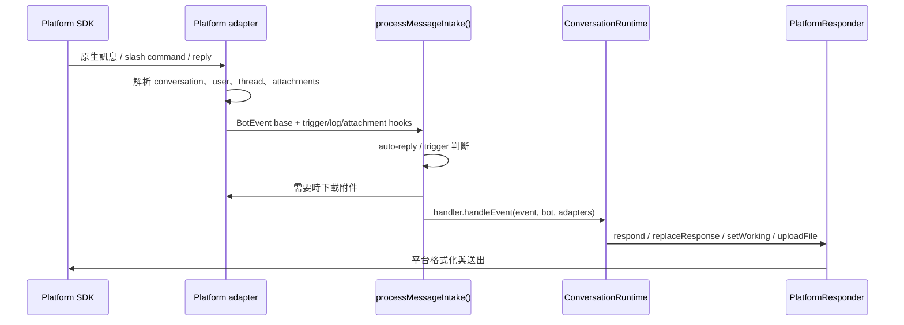

import { Aside, Card, CardGrid, LinkCard, Steps } from "@astrojs/starlight/components";

它的目標是讓 `src/runtime/*` 和 `src/agent.ts` 不需要知道每個平台的 SDK、thread 規則、訊息更新 API 或檔案下載方式。

<CardGrid>
  <Card title="事件正規化" icon="setting">
    將平台原生 message、mention、slash command 或 reply 轉成共同 `BotEvent`。
  </Card>
  <Card title="Session routing" icon="open-book">
    根據 channel、thread、reply chain 算出 `sessionKey`，讓對話進入正確工作階段。
  </Card>
  <Card title="回覆能力" icon="rocket">
    `PlatformResponder` 封裝回覆、更新、typing/working 狀態與檔案上傳。
  </Card>
</CardGrid>

## 接入層做什麼

<Steps>

1. 接收平台事件，例如訊息、mention、slash command 或 reply。
2. 判斷訊息是否應該觸發 mikan：DM、mention、thread reply、auto-reply policy。
3. 轉成共同的 `BotEvent` 與 `ChatMessage`。
4. 計算 `sessionKey`，讓不同 channel、thread、reply 可以對應到正確 session。
5. 下載附件並寫入 workspace 的 `attachments/`。
6. 建立 `PlatformResponder`，封裝回覆、更新、typing/working 狀態與檔案上傳。
7. 把事件交給 `BotHandler`，也就是 `ConversationRuntime`。

</Steps>

共同型別由 `src/adapter.ts` 匯出，實作型別放在 `src/types.ts` 與 `src/adapters/types.ts`。

## 共同流程

## 共同工具

| 檔案                        | 用途                                                                        |
| --------------------------- | --------------------------------------------------------------------------- |
| `src/adapter.ts`            | 對外匯出 `Bot`、`BotEvent`、`ChatMessage`、`PlatformResponder` 等共同介面。 |
| `src/adapters/intake.ts`    | 共用訊息入口流程：trigger、log、attachment、queue、handler 呼叫順序。       |
| `src/adapters/shared.ts`    | 共用 retry、queue、長訊息切割、log、stop target resolution。                |
| `src/adapters/streaming.ts` | 將 streaming response buffer 後再 flush，避免過度頻繁更新平台訊息。         |

## 平台差異

<LinkCard
  title="Slack"
  description="Socket Mode、channel/thread session、Block Kit、assistant status、Slack mrkdwn。"
  href="platform-adapters/slack/"
/>
<LinkCard
  title="Discord"
  description="Gateway events、guild/DM/thread channel、slash command、Discord Markdown、typing indicator。"
  href="platform-adapters/discord/"
/>
<LinkCard
  title="Telegram"
  description="Long polling、private/group chat、reply-based session、Telegram HTML mode、photo/document download。"
  href="platform-adapters/telegram/"
/>

## 與核心執行階段的邊界

<Aside type="note" title="依賴方向">
  平台 adapter 可以知道平台 SDK 與訊息格式，但不應該知道 agent 如何執行任務。
</Aside>

核心執行階段只依賴這些共同抽象：

- `BotEvent`：一次使用者或平台事件。
- `Bot`：平台 bot 能力，例如 post message、upload file。
- `BotAdapters`：一次事件附帶的 `message`、`responseCtx`、`platform` metadata。
- `PlatformResponder`：agent 回覆時使用的通道。

如果新增平台，優先實作這些抽象，不要把平台 SDK 細節帶進 `src/runtime/*` 或 `src/agent.ts`。
